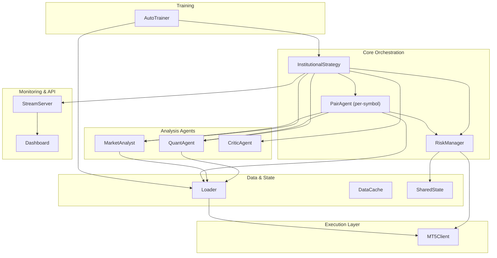
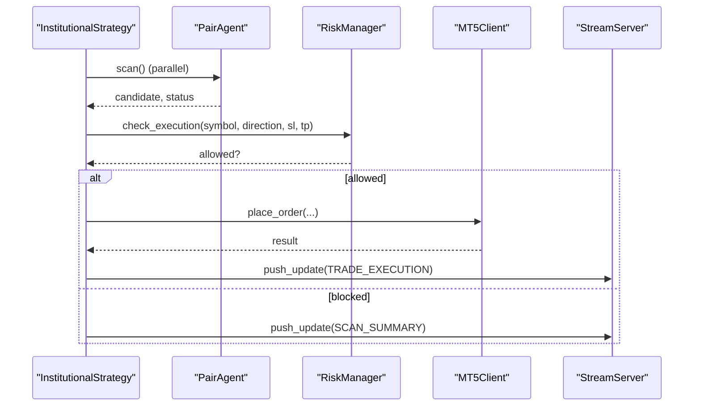
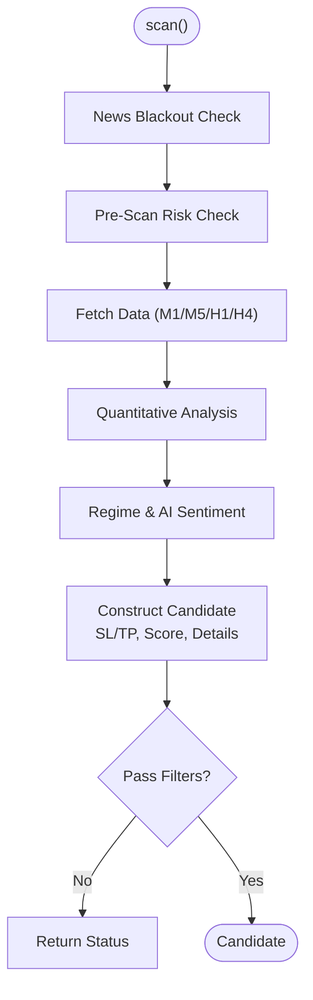
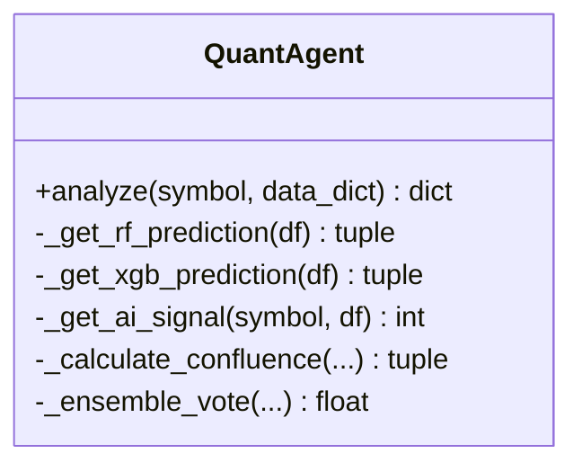
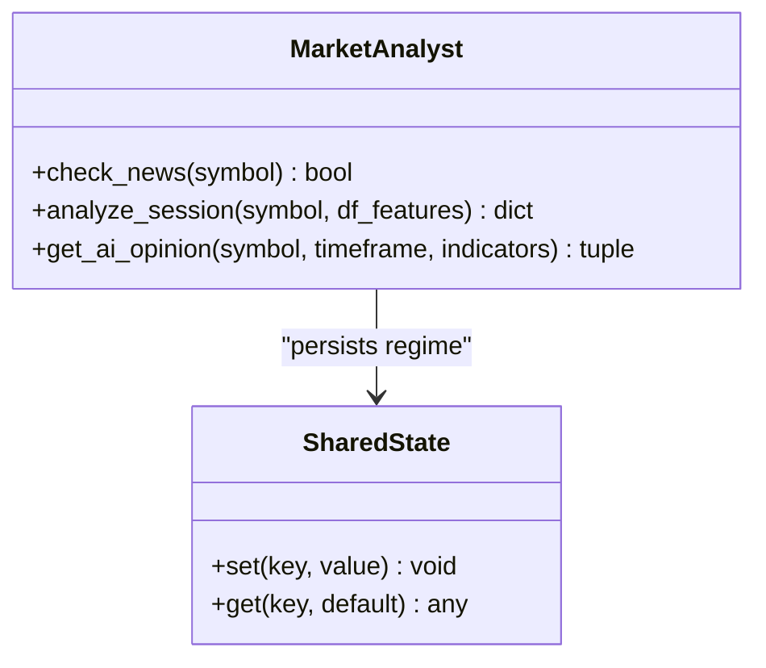
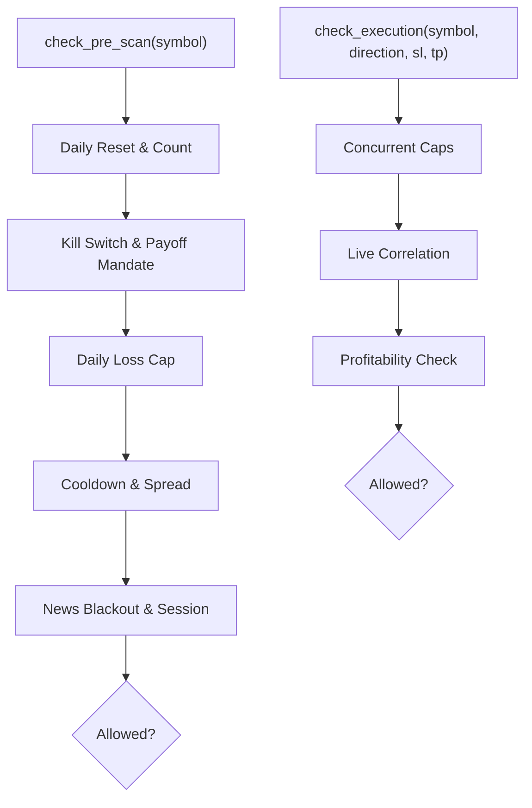
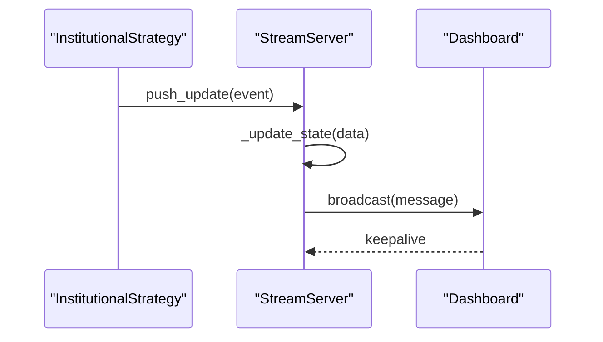
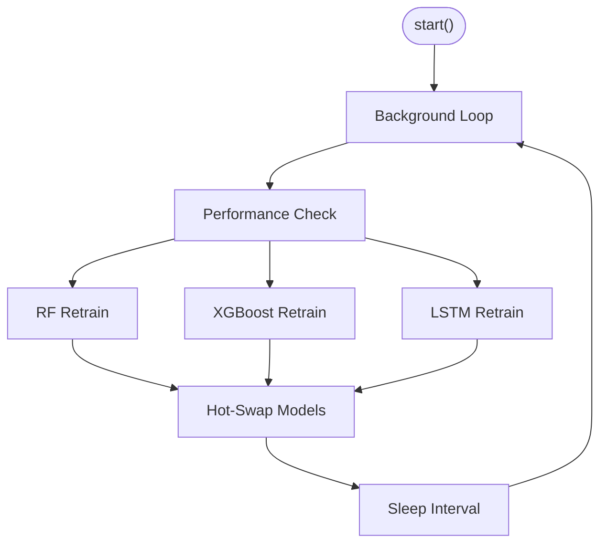
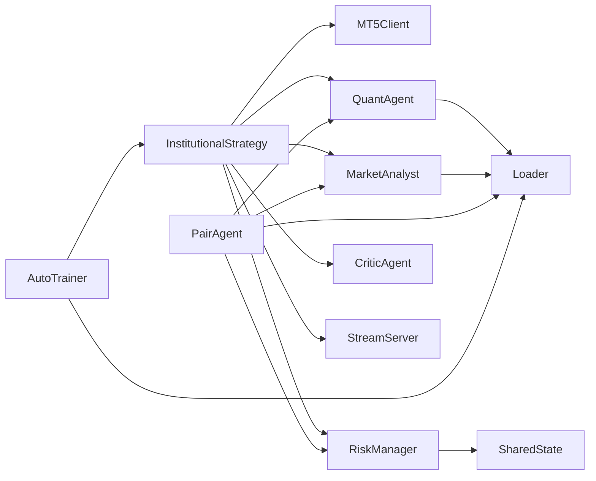
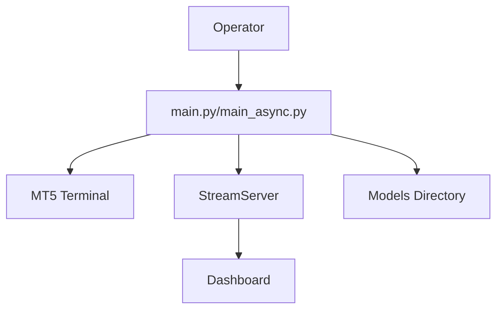

# System Architecture Overview

<cite>
**Referenced Files in This Document**
- [main.py](file://main.py)
- [main_async.py](file://main_async.py)
- [settings.py](file://config/settings.py)
- [stream_server.py](file://api/stream_server.py)
- [mt5_client.py](file://execution/mt5_client.py)
- [institutional_strategy.py](file://strategy/institutional_strategy.py)
- [pair_agent.py](file://strategy/pair_agent.py)
- [market_analyst.py](file://analysis/market_analyst.py)
- [quant_agent.py](file://analysis/quant_agent.py)
- [critic_agent.py](file://analysis/critic_agent.py)
- [risk_manager.py](file://utils/risk_manager.py)
- [shared_state.py](file://utils/shared_state.py)
- [data_cache.py](file://utils/data_cache.py)
- [loader.py](file://market_data/loader.py)
- [auto_trainer.py](file://utils/auto_trainer.py)
</cite>

## Table of Contents
1. [Introduction](#introduction)
2. [Project Structure](#project-structure)
3. [Core Components](#core-components)
4. [Architecture Overview](#architecture-overview)
5. [Detailed Component Analysis](#detailed-component-analysis)
6. [Dependency Analysis](#dependency-analysis)
7. [Performance Considerations](#performance-considerations)
8. [Troubleshooting Guide](#troubleshooting-guide)
9. [Conclusion](#conclusion)
10. [Appendices](#appendices)

## Introduction
This document describes the Institutional SureShot Scanner system architecture. It is a multi-agent, event-driven, microservices-style trading platform built around a central InstitutionalStrategy orchestrator. The system integrates MetaTrader 5 (MT5) for market data and order execution, with a dashboard for real-time monitoring and a WebSocket stream server for live updates. The architecture emphasizes parallelism, resilience, and adaptability through self-learning model retraining and distributed agent coordination.

## Project Structure
The repository is organized by functional domains:
- config: Centralized runtime settings and environment variables
- execution: MT5 client wrapper for connectivity, order placement, and position management
- strategy: Core trading orchestration, multi-agent scanning, and execution logic
- analysis: Specialized agents for quantitative analysis, market regime, and post-trade critique
- market_data: MT5 data loader and caching utilities
- utils: Cross-cutting concerns including risk management, shared state, telemetry, and auto-training
- api: WebSocket and REST endpoints for the React dashboard
- dashboard: Real-time monitoring UI (React/Vite)



**Diagram sources**
- [institutional_strategy.py](file://strategy/institutional_strategy.py#L49-L94)
- [pair_agent.py](file://strategy/pair_agent.py#L22-L54)
- [risk_manager.py](file://utils/risk_manager.py#L14-L39)
- [quant_agent.py](file://analysis/quant_agent.py#L34-L50)
- [market_analyst.py](file://analysis/market_analyst.py#L7-L20)
- [critic_agent.py](file://analysis/critic_agent.py#L10-L15)
- [mt5_client.py](file://execution/mt5_client.py#L12-L27)
- [loader.py](file://market_data/loader.py#L40-L59)
- [data_cache.py](file://utils/data_cache.py#L16-L48)
- [shared_state.py](file://utils/shared_state.py#L23-L60)
- [stream_server.py](file://api/stream_server.py#L17-L34)
- [auto_trainer.py](file://utils/auto_trainer.py#L80-L136)

**Section sources**
- [settings.py](file://config/settings.py#L1-L201)
- [main.py](file://main.py#L19-L121)
- [main_async.py](file://main_async.py#L20-L97)

## Core Components
- InstitutionalStrategy: Central coordinator that initializes shared agents, runs the scanning loop, and executes trades. It manages per-symbol PairAgent instances and coordinates with RiskManager, MarketAnalyst, QuantAgent, ResearcherAgent, and CriticAgent.
- PairAgent: Per-symbol agent responsible for fetching multi-timeframe data, performing quantitative analysis, applying regime filters, and constructing trade candidates with volatility-adjusted SL/TP targets.
- QuantAgent: Shared agent that performs technical analysis, computes ML predictions, and generates confluence scores and ensemble signals.
- MarketAnalyst: Shared agent that detects market regimes, filters news blackouts, and optionally queries AI advisors for sentiment.
- RiskManager: Centralized risk control layer enforcing daily limits, correlation filters, payoff mandates, spread thresholds, session gating, and position sizing via Kelly or confluence tiers.
- MT5Client: Thin wrapper around MetaTrader5 for initialization, symbol detection, account info, order placement, position modification, partial closes, and full closures.
- StreamServer: WebSocket + REST service broadcasting live account, positions, recent trades, and scan summaries to the React dashboard.
- AutoTrainer: Background thread that periodically retrains RF/XGBoost/LSTM models and monitors performance to trigger emergency retraining.

**Section sources**
- [institutional_strategy.py](file://strategy/institutional_strategy.py#L49-L94)
- [pair_agent.py](file://strategy/pair_agent.py#L22-L54)
- [quant_agent.py](file://analysis/quant_agent.py#L34-L50)
- [market_analyst.py](file://analysis/market_analyst.py#L7-L20)
- [risk_manager.py](file://utils/risk_manager.py#L14-L39)
- [mt5_client.py](file://execution/mt5_client.py#L12-L27)
- [stream_server.py](file://api/stream_server.py#L17-L34)
- [auto_trainer.py](file://utils/auto_trainer.py#L80-L136)

## Architecture Overview
The system follows a multi-agent architecture with event-driven communication and microservices-style separation of concerns:
- Trading Logic: InstitutionalStrategy orchestrates scanning and execution, delegating to PairAgent instances and RiskManager.
- Analysis Agents: QuantAgent and MarketAnalyst provide technical and regime insights; CriticAgent performs post-mortem reviews.
- Execution Layer: MT5Client encapsulates MT5 connectivity and order lifecycle.
- Monitoring: StreamServer publishes state snapshots and live updates to the dashboard.
- Infrastructure: Loader and DataCache minimize MT5 API calls; SharedState persists cross-agent state; AutoTrainer self-learns and adapts models.

```mermaid
graph TB
Client["MT5 Terminal"]
MT5["MT5Client"]
Loader["Loader"]
Cache["DataCache"]
IS["InstitutionalStrategy"]
PA["PairAgent (N)"]
QA["QuantAgent"]
MA["MarketAnalyst"]
RM["RiskManager"]
CA["CriticAgent"]
SS["SharedState"]
AT["AutoTrainer"]
WS["StreamServer"]
UI["Dashboard"]
Client <- --> MT5
Loader <- --> MT5
Cache --> Loader
IS --> PA
IS --> QA
IS --> MA
IS --> RM
IS --> CA
PA --> QA
PA --> MA
PA --> RM
RM --> MT5
AT --> Loader
AT --> IS
IS --> WS
WS --> UI
RM --> SS
MA --> SS
```

**Diagram sources**
- [mt5_client.py](file://execution/mt5_client.py#L12-L27)
- [loader.py](file://market_data/loader.py#L40-L59)
- [data_cache.py](file://utils/data_cache.py#L16-L48)
- [institutional_strategy.py](file://strategy/institutional_strategy.py#L49-L94)
- [pair_agent.py](file://strategy/pair_agent.py#L22-L54)
- [quant_agent.py](file://analysis/quant_agent.py#L34-L50)
- [market_analyst.py](file://analysis/market_analyst.py#L7-L20)
- [risk_manager.py](file://utils/risk_manager.py#L14-L39)
- [critic_agent.py](file://analysis/critic_agent.py#L10-L15)
- [shared_state.py](file://utils/shared_state.py#L23-L60)
- [auto_trainer.py](file://utils/auto_trainer.py#L80-L136)
- [stream_server.py](file://api/stream_server.py#L17-L34)

## Detailed Component Analysis

### InstitutionalStrategy: Multi-Agent Orchestrator
- Initializes shared agents (QuantAgent, MarketAnalyst, RiskManager, ResearcherAgent, CriticAgent) and per-symbol PairAgent instances.
- Runs a continuous async scanning loop that:
  - Manages active trades via PairAgent.manage_active_trades
  - Applies global session and daily trade limits
  - Executes parallel scans across all PairAgents
  - Applies execution risk checks and candidate selection
  - Delegates to ResearcherAgent for debate and final decision
  - Executes trades via MT5Client and records outcomes
  - Emits events for dashboard updates



**Diagram sources**
- [institutional_strategy.py](file://strategy/institutional_strategy.py#L99-L330)
- [pair_agent.py](file://strategy/pair_agent.py#L71-L105)
- [risk_manager.py](file://utils/risk_manager.py#L237-L295)
- [mt5_client.py](file://execution/mt5_client.py#L216-L292)
- [stream_server.py](file://api/stream_server.py#L177-L183)

**Section sources**
- [institutional_strategy.py](file://strategy/institutional_strategy.py#L49-L330)

### PairAgent: Per-Symbol Intelligence
- Fetches multi-timeframe data asynchronously and caches via DataCache.
- Performs quantitative analysis using QuantAgent and regime analysis via MarketAnalyst.
- Constructs candidates with volatility-adjusted SL/TP and enforces spread, session, and payoff constraints.
- Manages active positions with trailing stops, partial closes, and regime exits.



**Diagram sources**
- [pair_agent.py](file://strategy/pair_agent.py#L71-L295)

**Section sources**
- [pair_agent.py](file://strategy/pair_agent.py#L22-L295)

### QuantAgent: Technical & Ensemble Signal
- Loads RF/XGBoost and optional LSTM/Lag-Llama predictors.
- Computes trend signals across M5/H1/H4 and ML probabilities.
- Generates confluence scores and ensemble votes combining ML and AI signals.



**Diagram sources**
- [quant_agent.py](file://analysis/quant_agent.py#L34-L294)

**Section sources**
- [quant_agent.py](file://analysis/quant_agent.py#L34-L294)

### MarketAnalyst: Regime & News Filtering
- Detects market regimes and persists state to SharedState.
- Provides AI sentiment and confidence for market context.
- Integrates news blackout filtering.



**Diagram sources**
- [market_analyst.py](file://analysis/market_analyst.py#L7-L80)
- [shared_state.py](file://utils/shared_state.py#L23-L75)

**Section sources**
- [market_analyst.py](file://analysis/market_analyst.py#L7-L80)
- [shared_state.py](file://utils/shared_state.py#L23-L75)

### RiskManager: Global & Per-Symbol Controls
- Enforces daily trade limits, correlation conflicts, payoff mandates, spread caps, session gating, and profitability checks.
- Calculates position sizes using Kelly Criterion or confluence tiers with tail-risk clamps.
- Monitors and modifies active positions with trailing stops, partial closes, and break-even logic.



**Diagram sources**
- [risk_manager.py](file://utils/risk_manager.py#L51-L163)
- [risk_manager.py](file://utils/risk_manager.py#L237-L295)

**Section sources**
- [risk_manager.py](file://utils/risk_manager.py#L14-L549)

### StreamServer: Event-Driven Monitoring
- FastAPI WebSocket server broadcasting account, positions, recent trades, and scan summaries.
- REST endpoints expose live MT5 data and internal state snapshots.
- push_update batches state updates and broadcasts to connected clients.



**Diagram sources**
- [stream_server.py](file://api/stream_server.py#L177-L212)

**Section sources**
- [stream_server.py](file://api/stream_server.py#L17-L212)

### AutoTrainer: Self-Learning Models
- Background thread that retrains RF/XGBoost/LSTM models on scheduled intervals and upon performance degradation.
- Implements hot-swapping of models and tracks retrain counts and next-run timers.



**Diagram sources**
- [auto_trainer.py](file://utils/auto_trainer.py#L118-L172)
- [auto_trainer.py](file://utils/auto_trainer.py#L196-L274)
- [auto_trainer.py](file://utils/auto_trainer.py#L278-L347)
- [auto_trainer.py](file://utils/auto_trainer.py#L351-L494)

**Section sources**
- [auto_trainer.py](file://utils/auto_trainer.py#L80-L518)

## Dependency Analysis
The system exhibits strong cohesion within functional modules and loose coupling across agents and layers. Key dependencies:
- InstitutionalStrategy depends on MT5Client, RiskManager, and shared analysis agents.
- PairAgent depends on QuantAgent, MarketAnalyst, RiskManager, and Loader/DataCache.
- RiskManager depends on MT5Client, SharedState, and correlation utilities.
- StreamServer depends on push_update callbacks from the orchestrator.
- AutoTrainer depends on Loader and strategy models for retraining.



**Diagram sources**
- [institutional_strategy.py](file://strategy/institutional_strategy.py#L49-L94)
- [pair_agent.py](file://strategy/pair_agent.py#L22-L54)
- [risk_manager.py](file://utils/risk_manager.py#L14-L39)
- [shared_state.py](file://utils/shared_state.py#L23-L60)
- [stream_server.py](file://api/stream_server.py#L17-L34)
- [auto_trainer.py](file://utils/auto_trainer.py#L80-L136)

**Section sources**
- [institutional_strategy.py](file://strategy/institutional_strategy.py#L49-L330)
- [pair_agent.py](file://strategy/pair_agent.py#L22-L295)
- [risk_manager.py](file://utils/risk_manager.py#L14-L549)
- [shared_state.py](file://utils/shared_state.py#L23-L110)
- [stream_server.py](file://api/stream_server.py#L17-L212)
- [auto_trainer.py](file://utils/auto_trainer.py#L80-L518)

## Performance Considerations
- Asynchronous scanning: InstitutionalStrategy runs PairAgent scans concurrently to maximize throughput.
- Data caching: DataCache reduces MT5 API calls with TTL-based refresh policies.
- Executor-bound work: Heavy computations (feature engineering, ML inference) are offloaded to threads via run_in_executor.
- Adaptive sleep: The main loop adjusts sleep based on cycle duration to maintain target intervals.
- Position sizing: Kelly Criterion with confluence tiers balances risk and reward dynamically.
- Real-time streaming: WebSocket broadcast minimizes UI polling overhead.

[No sources needed since this section provides general guidance]

## Troubleshooting Guide
Common operational issues and mitigations:
- MT5 connectivity failures: Ensure MT5 terminal path and credentials are correct; verify initialize/login success; reconnect logic in Loader and MT5Client.
- No instruments detected: Auto-detect symbols on Exness accounts; confirm visibility and trade mode.
- High spread or off-session: RiskManager blocks entries under configured thresholds; adjust MAX_SPREAD_* or SESSION_FILTER accordingly.
- Dashboard not updating: Confirm StreamServer startup and port availability; verify push_update invocations.
- Model loading errors: Validate model paths and feature column files; check USE_XGBOOST and USE_LSTM toggles.
- Performance degradation: AutoTrainer triggers emergency retrain when win rate falls below threshold; review logs for retrain status.

**Section sources**
- [mt5_client.py](file://execution/mt5_client.py#L18-L27)
- [loader.py](file://market_data/loader.py#L24-L37)
- [risk_manager.py](file://utils/risk_manager.py#L112-L163)
- [stream_server.py](file://api/stream_server.py#L153-L173)
- [auto_trainer.py](file://utils/auto_trainer.py#L175-L193)

## Conclusion
The Institutional SureShot Scanner employs a robust multi-agent, event-driven architecture with clear separation of trading logic, analysis, execution, and monitoring. Its asynchronous design, caching, and self-learning capabilities enable responsive, adaptive, and resilient automated trading aligned with institutional risk controls and real-time dashboards.

[No sources needed since this section summarizes without analyzing specific files]

## Appendices

### System Context and Deployment Topology
- Local deployment: Run the main entry point to connect to MT5, start StreamServer, and launch the async scanning loop.
- Dashboard: React/Vite dashboard consumes WebSocket updates and REST endpoints for live monitoring.
- Infrastructure: MT5 terminal must be running and accessible; models reside under models/.



**Diagram sources**
- [main.py](file://main.py#L19-L121)
- [main_async.py](file://main_async.py#L20-L97)
- [stream_server.py](file://api/stream_server.py#L153-L173)

### Integration Patterns with MetaTrader 5
- Connection: MT5Client initializes and logs into the terminal; Loader ensures connectivity before data fetches.
- Data: Loader retrieves historical bars; DataCache reduces repeated requests.
- Execution: MT5Client places orders with ATR-based SL/TP or pip-based fallback; supports IOC fills and pending orders.
- Position Management: Modify SL/TP, partial closes, and full closures; monitor via positions_get.

**Section sources**
- [mt5_client.py](file://execution/mt5_client.py#L12-L385)
- [loader.py](file://market_data/loader.py#L40-L83)
- [data_cache.py](file://utils/data_cache.py#L16-L77)