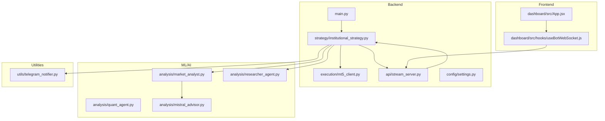
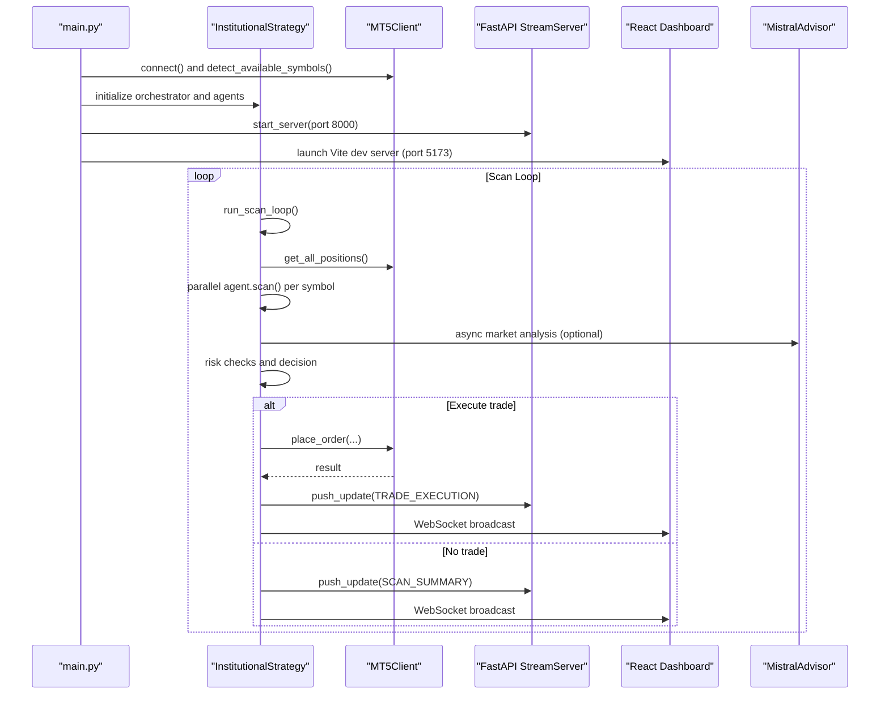
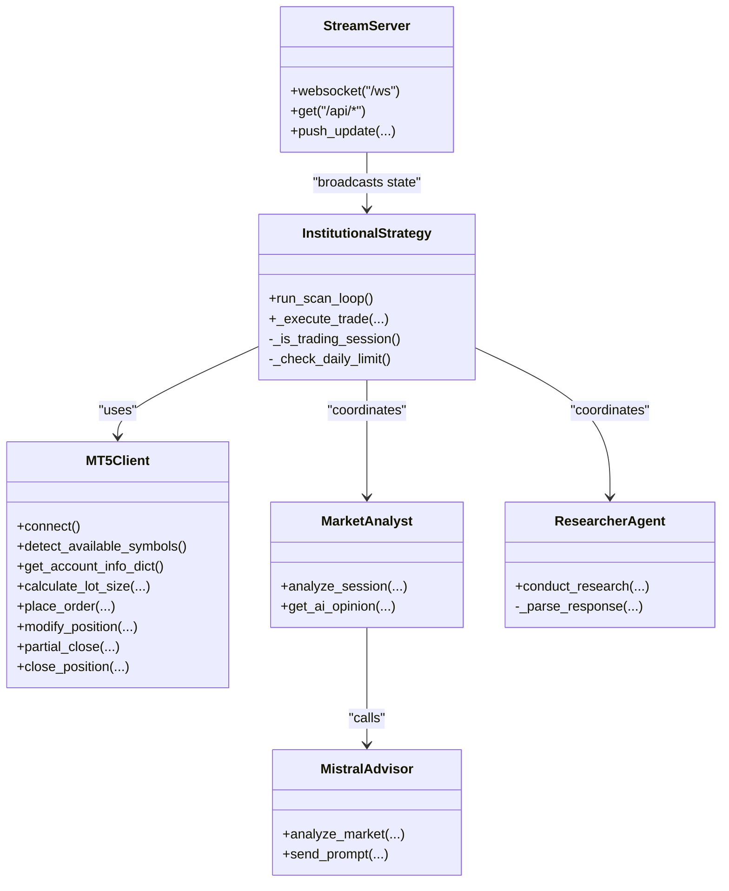
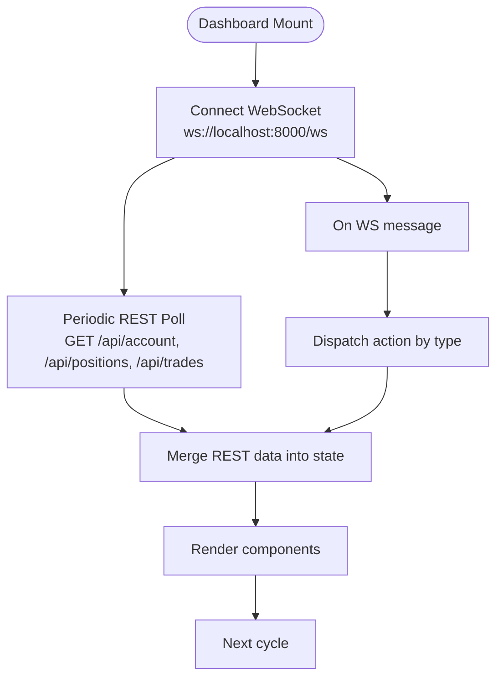
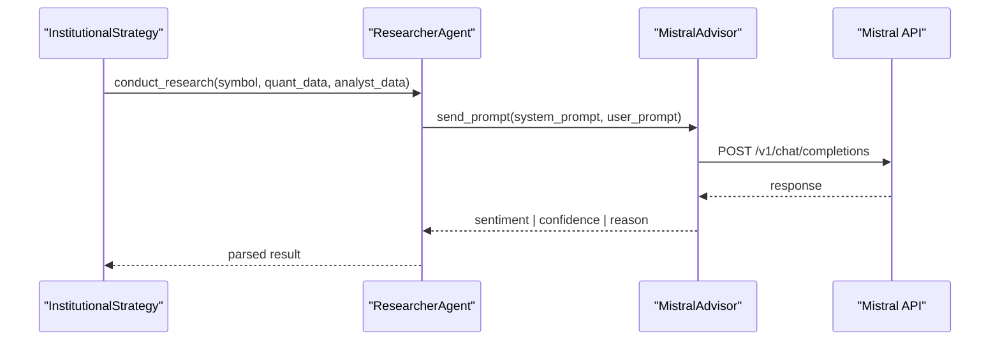
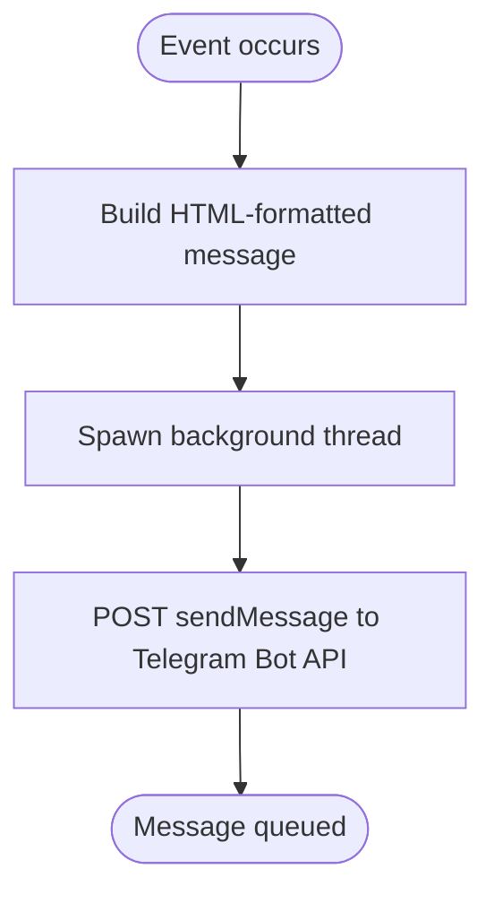
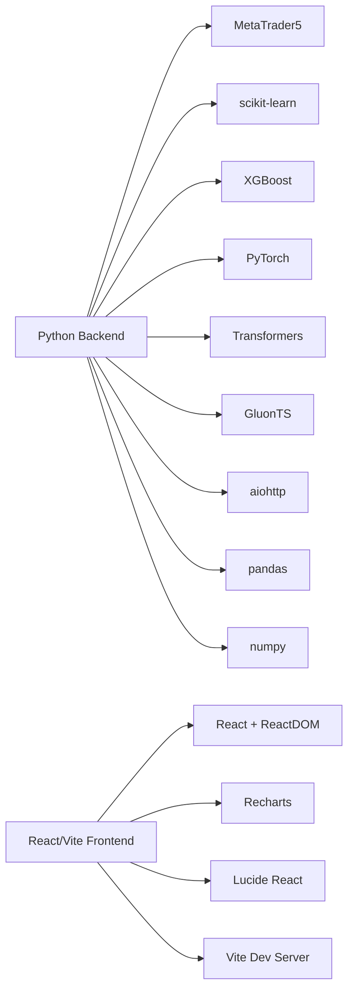

# Technology Stack

<cite>
**Referenced Files in This Document**
- [README.md](file://README.md)
- [requirements.txt](file://requirements.txt)
- [package.json](file://dashboard/package.json)
- [settings.py](file://config/settings.py)
- [main.py](file://main.py)
- [stream_server.py](file://api/stream_server.py)
- [mt5_client.py](file://execution/mt5_client.py)
- [institutional_strategy.py](file://strategy/institutional_strategy.py)
- [market_analyst.py](file://analysis/market_analyst.py)
- [researcher_agent.py](file://analysis/researcher_agent.py)
- [mistral_advisor.py](file://analysis/mistral_advisor.py)
- [useBotWebSocket.js](file://dashboard/src/hooks/useBotWebSocket.js)
- [App.jsx](file://dashboard/src/App.jsx)
- [telegram_notifier.py](file://utils/telegram_notifier.py)
</cite>

## Table of Contents
1. [Introduction](#introduction)
2. [Project Structure](#project-structure)
3. [Core Components](#core-components)
4. [Architecture Overview](#architecture-overview)
5. [Detailed Component Analysis](#detailed-component-analysis)
6. [Dependency Analysis](#dependency-analysis)
7. [Performance Considerations](#performance-considerations)
8. [Troubleshooting Guide](#troubleshooting-guide)
9. [Conclusion](#conclusion)
10. [Appendices](#appendices)

## Introduction
This document provides a comprehensive overview of the Institutional SureShot Scanner’s technology stack. It covers the Python backend (MetaTrader5 integration, machine learning frameworks, FastAPI WebSocket/REST), the React/Vite frontend, AI/LLM integration with Mistral, Telegram API integration, and supporting infrastructure. It also includes version requirements, dependency management, compatibility considerations, system requirements, performance characteristics, and deployment prerequisites.

## Project Structure
The project is organized into cohesive layers:
- Backend orchestration and trading engine
- Real-time streaming API (FastAPI + WebSocket)
- Machine learning models and agents
- Frontend dashboard (React + Vite)
- Utilities for risk, notifications, and data caching

**Diagram sources**
- [main.py](file://main.py#L19-L122)
- [institutional_strategy.py](file://strategy/institutional_strategy.py#L49-L500)
- [mt5_client.py](file://execution/mt5_client.py#L12-L385)
- [stream_server.py](file://api/stream_server.py#L1-L212)
- [market_analyst.py](file://analysis/market_analyst.py#L7-L81)
- [researcher_agent.py](file://analysis/researcher_agent.py#L5-L132)
- [mistral_advisor.py](file://analysis/mistral_advisor.py#L12-L115)
- [App.jsx](file://dashboard/src/App.jsx#L12-L104)
- [useBotWebSocket.js](file://dashboard/src/hooks/useBotWebSocket.js#L105-L156)
- [telegram_notifier.py](file://utils/telegram_notifier.py#L30-L174)

**Section sources**
- [README.md](file://README.md#L187-L235)

## Core Components
- Python backend
  - MetaTrader5 integration for order placement, symbol detection, and live account/position queries
  - FastAPI WebSocket + REST service for real-time dashboard and live data
  - Machine learning stack: scikit-learn, XGBoost, PyTorch, Transformers, GluonTS
  - Asynchronous orchestration and multi-agent strategy framework
- React/Vite frontend
  - Real-time dashboard with WebSocket and periodic REST polling
  - Component architecture for account, scanner grid, positions, trade feed, and event log
- AI/LLM integration
  - Mistral AI for market analysis and debate synthesis
  - Optional Gemini integration referenced in documentation
- Telegram API integration
  - Non-blocking notifications for trade events and diagnostics
- Database and persistence
  - SQLite-backed trade journal
  - In-memory data cache for market data

**Section sources**
- [requirements.txt](file://requirements.txt#L1-L17)
- [settings.py](file://config/settings.py#L1-L201)
- [stream_server.py](file://api/stream_server.py#L1-L212)
- [mt5_client.py](file://execution/mt5_client.py#L12-L385)
- [institutional_strategy.py](file://strategy/institutional_strategy.py#L49-L500)
- [market_analyst.py](file://analysis/market_analyst.py#L7-L81)
- [researcher_agent.py](file://analysis/researcher_agent.py#L5-L132)
- [mistral_advisor.py](file://analysis/mistral_advisor.py#L12-L115)
- [useBotWebSocket.js](file://dashboard/src/hooks/useBotWebSocket.js#L1-L156)
- [App.jsx](file://dashboard/src/App.jsx#L12-L104)
- [telegram_notifier.py](file://utils/telegram_notifier.py#L30-L174)

## Architecture Overview
The system is an asynchronous, multi-agent trading engine that:
- Initializes MetaTrader5 and auto-detects available symbols
- Runs a scanning loop across all symbols using specialized agents
- Applies shared ML and macro analysis
- Performs pre-execution risk checks and executes orders
- Publishes live state via FastAPI WebSocket and REST endpoints
- Streams real-time updates to the React dashboard
- Sends Telegram notifications for operational events

**Diagram sources**
- [main.py](file://main.py#L19-L122)
- [institutional_strategy.py](file://strategy/institutional_strategy.py#L99-L330)
- [mt5_client.py](file://execution/mt5_client.py#L214-L293)
- [stream_server.py](file://api/stream_server.py#L176-L212)
- [mistral_advisor.py](file://analysis/mistral_advisor.py#L27-L80)

## Detailed Component Analysis

### Python Backend Technologies
- MetaTrader5 API integration
  - Initialization, login, symbol detection, order placement, position management, and account queries
  - Dynamic lot sizing and trailing/ATR-based SL/TP
- Machine learning frameworks
  - scikit-learn, joblib, XGBoost, NumPy, Pandas, SciPy for modeling and feature engineering
  - PyTorch for neural networks; GluonTS for forecasting; Transformers/Accelerate/HuggingFace Hub for LLM integration
- FastAPI for WebSocket and REST
  - WebSocket endpoint for live updates and REST endpoints for live account/positions/trades/scan/state
  - Thread-safe state broadcasting and rolling event/log buffers
- Asynchronous orchestration
  - Async scanning loop, parallel agent execution, and periodic self-reflection

**Diagram sources**
- [mt5_client.py](file://execution/mt5_client.py#L12-L385)
- [institutional_strategy.py](file://strategy/institutional_strategy.py#L49-L500)
- [market_analyst.py](file://analysis/market_analyst.py#L7-L81)
- [researcher_agent.py](file://analysis/researcher_agent.py#L5-L132)
- [mistral_advisor.py](file://analysis/mistral_advisor.py#L12-L115)
- [stream_server.py](file://api/stream_server.py#L1-L212)

**Section sources**
- [mt5_client.py](file://execution/mt5_client.py#L12-L385)
- [institutional_strategy.py](file://strategy/institutional_strategy.py#L49-L500)
- [market_analyst.py](file://analysis/market_analyst.py#L7-L81)
- [researcher_agent.py](file://analysis/researcher_agent.py#L5-L132)
- [mistral_advisor.py](file://analysis/mistral_advisor.py#L12-L115)
- [stream_server.py](file://api/stream_server.py#L1-L212)

### React/Vite Frontend Stack
- Real-time dashboard built with React and Vite
- WebSocket integration for live state updates and REST polling for live account/positions/trades
- Component architecture:
  - Account overview card
  - Scanner grid (all symbols)
  - Positions table (live P&L)
  - Trade feed
  - Event log
- Responsive layout and session clocks

**Diagram sources**
- [useBotWebSocket.js](file://dashboard/src/hooks/useBotWebSocket.js#L105-L156)
- [App.jsx](file://dashboard/src/App.jsx#L12-L104)

**Section sources**
- [useBotWebSocket.js](file://dashboard/src/hooks/useBotWebSocket.js#L1-L156)
- [App.jsx](file://dashboard/src/App.jsx#L12-L104)
- [package.json](file://dashboard/package.json#L1-L24)

### AI/LLM Integration (Mistral and Gemini)
- Mistral AI advisor
  - Asynchronous chat completions for market analysis and debate synthesis
  - Parses standardized pipe-delimited responses
- Gemini integration
  - Referenced in documentation as an alternative; implementation is not present in the repository

**Diagram sources**
- [researcher_agent.py](file://analysis/researcher_agent.py#L17-L83)
- [mistral_advisor.py](file://analysis/mistral_advisor.py#L65-L115)

**Section sources**
- [researcher_agent.py](file://analysis/researcher_agent.py#L5-L132)
- [mistral_advisor.py](file://analysis/mistral_advisor.py#L12-L115)
- [README.md](file://README.md#L27-L34)

### Telegram API Integration
- Non-blocking notifications via Telegram Bot API
- Background threads for sending messages
- Formatted alerts for trade execution, scan candidates, daily summary, kill switch, and generic alerts

**Diagram sources**
- [telegram_notifier.py](file://utils/telegram_notifier.py#L30-L174)

**Section sources**
- [telegram_notifier.py](file://utils/telegram_notifier.py#L30-L174)

### Database Technologies
- SQLite-backed trade journal for persistent trade logging
- In-memory data cache for market data to reduce repeated fetches

**Section sources**
- [institutional_strategy.py](file://strategy/institutional_strategy.py#L74-L76)

## Dependency Analysis
- Python dependencies (selected)
  - MetaTrader5, pandas, numpy, scikit-learn, joblib, ta, torch, transformers, accelerate, huggingface_hub, gluonts, scipy, ujson, aiohttp, tqdm
  - Environment variables for credentials and configuration
- Frontend dependencies (selected)
  - React, React DOM, Recharts, Lucide React
  - Vite dev server and React plugin

**Diagram sources**
- [requirements.txt](file://requirements.txt#L1-L17)
- [package.json](file://dashboard/package.json#L11-L22)

**Section sources**
- [requirements.txt](file://requirements.txt#L1-L17)
- [package.json](file://dashboard/package.json#L1-L24)

## Performance Considerations
- Asynchronous scanning and parallel agent execution minimize latency and maximize throughput
- WebSocket broadcasting with rolling buffers prevents memory bloat
- REST polling (every 5 seconds) ensures fresh live data without overloading the server
- Dynamic lot sizing and trailing stops help manage risk and improve expectancy
- Optional GPU acceleration via PyTorch and Accelerate can speed up inference
- GluonTS version constraint ensures compatibility with forecasting workflows

[No sources needed since this section provides general guidance]

## Troubleshooting Guide
- MetaTrader5 connection failures
  - Verify credentials, server name, and terminal path in environment variables
  - Ensure the MT5 terminal is running and logged in
- WebSocket/REST connectivity
  - Confirm the stream server started on the expected port and is reachable
  - Check firewall and CORS settings if the dashboard cannot connect
- LLM API errors
  - Ensure the Mistral API key is configured; otherwise, the system falls back to technical signals
- Telegram notifications not delivered
  - Validate bot token and chat ID; use the provided helper to retrieve chat ID
- High-frequency polling impact
  - Adjust REST polling interval in the frontend hook if needed

**Section sources**
- [settings.py](file://config/settings.py#L8-L11)
- [stream_server.py](file://api/stream_server.py#L153-L174)
- [mistral_advisor.py](file://analysis/mistral_advisor.py#L13-L26)
- [telegram_notifier.py](file://utils/telegram_notifier.py#L154-L174)
- [useBotWebSocket.js](file://dashboard/src/hooks/useBotWebSocket.js#L87-L103)

## Conclusion
The Institutional SureShot Scanner integrates a robust Python backend with MetaTrader5, machine learning, and real-time streaming, paired with a React/Vite dashboard and Telegram notifications. The architecture emphasizes asynchronous execution, modular agents, and scalable real-time data delivery. Mistral AI provides optional qualitative insights, while Gemini is documented as an alternative. Proper configuration of environment variables, dependencies, and system prerequisites is essential for reliable operation.

[No sources needed since this section summarizes without analyzing specific files]

## Appendices

### Version Requirements and Compatibility
- Python: 3.10+ (as indicated in badges and installation notes)
- Node.js: 18+ (for the React dashboard)
- Windows OS (required for MetaTrader5 terminal)
- MetaTrader5 terminal installed and logged in
- GluonTS version constrained to avoid breaking changes

**Section sources**
- [README.md](file://README.md#L87-L92)
- [README.md](file://README.md#L107-L137)
- [requirements.txt](file://requirements.txt#L12-L12)

### Deployment Prerequisites
- Install Python dependencies: pip install -r requirements.txt
- Install dashboard dependencies: npm install (in the dashboard directory)
- Configure .env with MT5 credentials, trading parameters, AI keys, and Telegram tokens
- Train ML models (Random Forest, XGBoost, optional LSTM)
- Start the bot: python main_async.py (as documented)
- Launch the dashboard: npm run dev (Vite dev server)

**Section sources**
- [README.md](file://README.md#L85-L175)
- [requirements.txt](file://requirements.txt#L1-L17)
- [package.json](file://dashboard/package.json#L6-L10)