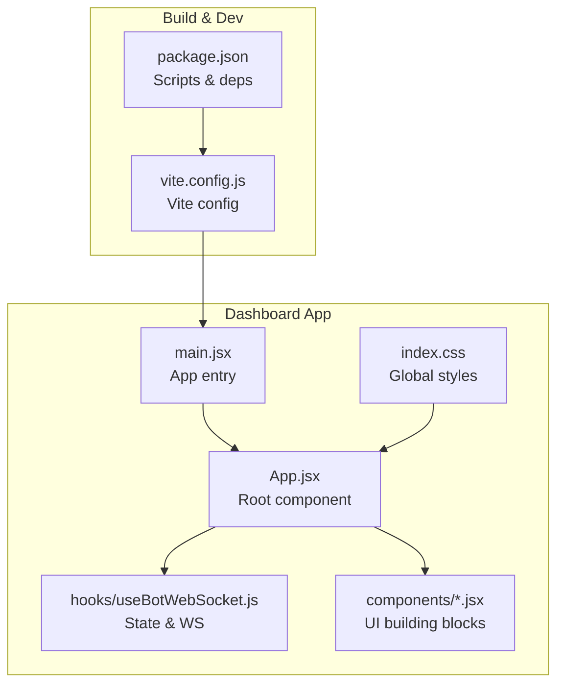
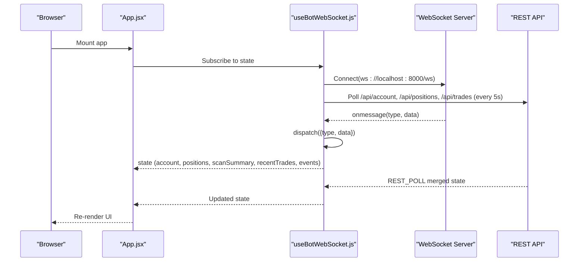
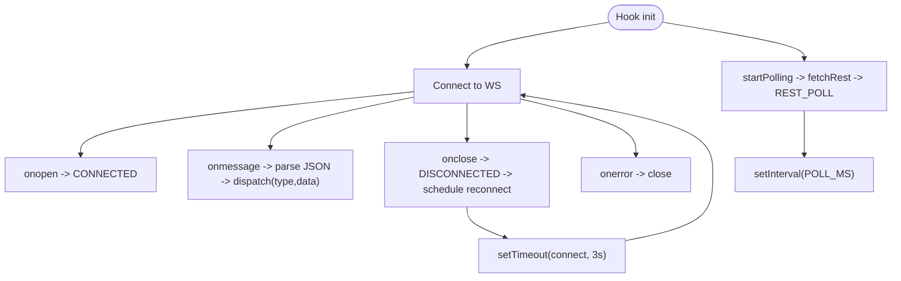
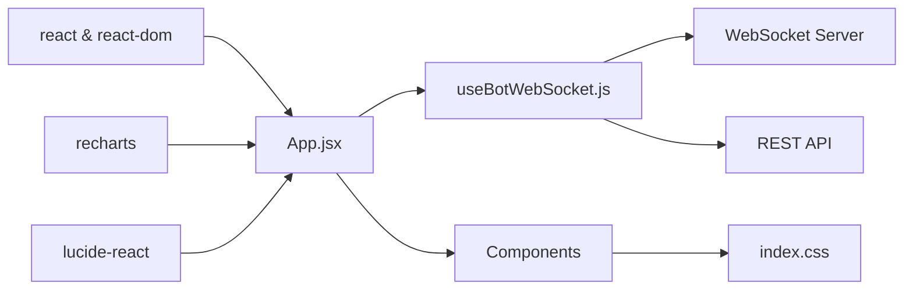

# Dashboard Architecture

<cite>
**Referenced Files in This Document**
- [main.jsx](file://dashboard/src/main.jsx)
- [App.jsx](file://dashboard/src/App.jsx)
- [vite.config.js](file://dashboard/vite.config.js)
- [package.json](file://dashboard/package.json)
- [useBotWebSocket.js](file://dashboard/src/hooks/useBotWebSocket.js)
- [AccountCard.jsx](file://dashboard/src/components/AccountCard.jsx)
- [ScannerGrid.jsx](file://dashboard/src/components/ScannerGrid.jsx)
- [PositionsTable.jsx](file://dashboard/src/components/PositionsTable.jsx)
- [TradeFeed.jsx](file://dashboard/src/components/TradeFeed.jsx)
- [EventLog.jsx](file://dashboard/src/components/EventLog.jsx)
- [ForexSessionClocks.jsx](file://dashboard/src/components/ForexSessionClocks.jsx)
- [index.css](file://dashboard/src/index.css)
</cite>

## Table of Contents
1. [Introduction](#introduction)
2. [Project Structure](#project-structure)
3. [Core Components](#core-components)
4. [Architecture Overview](#architecture-overview)
5. [Detailed Component Analysis](#detailed-component-analysis)
6. [Dependency Analysis](#dependency-analysis)
7. [Performance Considerations](#performance-considerations)
8. [Troubleshooting Guide](#troubleshooting-guide)
9. [Conclusion](#conclusion)
10. [Appendices](#appendices)

## Introduction
This document describes the React dashboard architecture and frontend implementation for the MT5 Algo Trading system. It covers the Vite build configuration, component structure, application entry points, layout and state management, WebSocket integration, and real-time updates. It also includes guidance on the build process, development workflow, deployment considerations, component lifecycle, error handling, performance optimization, styling and responsive design, and cross-browser compatibility.

## Project Structure
The dashboard is a Vite-powered React application located under the dashboard directory. The structure emphasizes a flat component hierarchy with a single hook encapsulating WebSocket and polling logic, and a global CSS module for theming and reusable styles.

**Diagram sources**
- [main.jsx](file://dashboard/src/main.jsx#L1-L11)
- [App.jsx](file://dashboard/src/App.jsx#L1-L104)
- [index.css](file://dashboard/src/index.css#L1-L191)
- [useBotWebSocket.js](file://dashboard/src/hooks/useBotWebSocket.js#L1-L156)
- [vite.config.js](file://dashboard/vite.config.js#L1-L11)
- [package.json](file://dashboard/package.json#L1-L24)

**Section sources**
- [main.jsx](file://dashboard/src/main.jsx#L1-L11)
- [vite.config.js](file://dashboard/vite.config.js#L1-L11)
- [package.json](file://dashboard/package.json#L1-L24)

## Core Components
- Application entry point initializes React and mounts the root App component.
- Root App composes the dashboard layout and renders multiple specialized components.
- A custom hook manages WebSocket connectivity, real-time updates, periodic REST polling, and state transitions.
- UI components render account metrics, scanner signals, open positions, recent trades, event logs, and Forex session clocks.

Key responsibilities:
- Entry point: [main.jsx](file://dashboard/src/main.jsx#L1-L11)
- Layout and composition: [App.jsx](file://dashboard/src/App.jsx#L1-L104)
- Real-time state and WS: [useBotWebSocket.js](file://dashboard/src/hooks/useBotWebSocket.js#L1-L156)
- Styling: [index.css](file://dashboard/src/index.css#L1-L191)

**Section sources**
- [main.jsx](file://dashboard/src/main.jsx#L1-L11)
- [App.jsx](file://dashboard/src/App.jsx#L1-L104)
- [useBotWebSocket.js](file://dashboard/src/hooks/useBotWebSocket.js#L1-L156)
- [index.css](file://dashboard/src/index.css#L1-L191)

## Architecture Overview
The dashboard follows a unidirectional data flow:
- The root App subscribes to state from useBotWebSocket.
- The hook establishes a WebSocket connection and handles messages via a reducer.
- Periodic REST polling ensures state parity when WS events are missed.
- Components receive props and render presentational UI with minimal internal state.

**Diagram sources**
- [App.jsx](file://dashboard/src/App.jsx#L1-L104)
- [useBotWebSocket.js](file://dashboard/src/hooks/useBotWebSocket.js#L1-L156)

## Detailed Component Analysis

### Application Entry Point
- Initializes React root and mounts the App component.
- Imports global CSS for consistent theming.

Implementation highlights:
- Strict mode enabled for stricter checks in development.
- Single render call mounting the root App.

**Section sources**
- [main.jsx](file://dashboard/src/main.jsx#L1-L11)

### Root Application Component (App)
- Orchestrates the dashboard grid layout using CSS Grid.
- Integrates real-time state from useBotWebSocket and renders:
  - Header with title, Forex session clocks, UTC time, connection status, and open position count.
  - Account overview card.
  - Scanner grid with symbol signals and reasons.
  - Event log panel.
  - Open positions table.
  - Recent trades feed.
- Maintains a client-side clock updating every second.

Layout characteristics:
- Responsive grid with three columns and two fixed header rows plus two data rows.
- Uses CSS variables for consistent theming and spacing.

**Section sources**
- [App.jsx](file://dashboard/src/App.jsx#L1-L104)

### WebSocket and State Management Hook
Responsibilities:
- Establishes WebSocket connection and handles open, message, close, and error events.
- Parses incoming JSON messages and dispatches actions to a reducer.
- Performs periodic REST polling to complement WS updates.
- Manages reconnection timers and cleanup on unmount.

State model:
- Fields include connection status, account, positions, scan summary, recent trades, events, and last scan timestamp.
- Reducer supports actions for snapshot merges, REST polls, account/position updates, scan lifecycle, research events, and trade executions.

Connection and polling flow:

**Diagram sources**
- [useBotWebSocket.js](file://dashboard/src/hooks/useBotWebSocket.js#L1-L156)

**Section sources**
- [useBotWebSocket.js](file://dashboard/src/hooks/useBotWebSocket.js#L1-L156)

### Account Card
- Displays live connection status, balance, equity, floating P&L, daily P&L, and drawdown percentage.
- Renders a progress bar indicating drawdown severity with dynamic coloring.

Rendering logic:
- Uses account fields passed from state.
- Calculates drawdown percentage safely against zero balance.
- Applies color-coded labels for positive/negative P&L.

**Section sources**
- [AccountCard.jsx](file://dashboard/src/components/AccountCard.jsx#L1-L67)

### Scanner Grid
- Visualizes symbol scan results with status badges and reasons.
- Sorts candidates first and highlights newly discovered symbols.
- Shows last scan time and candidate counts.

Signal classification:
- Maps reasons to status categories (candidate, off-session, low volatility, spread, news, execution block, skipped, ok).
- Uses status-specific colors and labels.

**Section sources**
- [ScannerGrid.jsx](file://dashboard/src/components/ScannerGrid.jsx#L1-L122)

### Positions Table
- Lists open positions with direction, lot size, entry price, floating P&L, SL/TP, and progress toward TP.
- Computes progress percentage based on current price versus entry/TP.
- Highlights direction and P&L with color coding.

**Section sources**
- [PositionsTable.jsx](file://dashboard/src/components/PositionsTable.jsx#L1-L79)

### Trade Feed
- Displays recent trades with directional indicators, timestamps, symbol, lot size, and price.
- Uses distinct styling for buy/sell trades and badges for direction.

**Section sources**
- [TradeFeed.jsx](file://dashboard/src/components/TradeFeed.jsx#L1-L60)

### Event Log
- Aggregates and formats events (trade executions, scans, research, position/account updates, connection status).
- Limits to a bounded history and formats human-readable summaries per event type.

**Section sources**
- [EventLog.jsx](file://dashboard/src/components/EventLog.jsx#L1-L61)

### Forex Session Clocks
- Displays four major Forex market sessions with local times, open/closed/pre-open status, countdowns, and subtle glow effects for open sessions.
- Uses UTC-based session windows to remain DST-safe and computes time until next open/close.

**Section sources**
- [ForexSessionClocks.jsx](file://dashboard/src/components/ForexSessionClocks.jsx#L1-L207)

### Global Styling and Theming
- Defines CSS variables for dark theme palette, typography, borders, radii, and shadows.
- Provides reusable utilities for cards, badges, stat values, tables, progress bars, log containers, animations, and glow accents.
- Ensures consistent spacing and responsive behavior across components.

**Section sources**
- [index.css](file://dashboard/src/index.css#L1-L191)

## Dependency Analysis
The dashboard has minimal external dependencies and a clear dependency graph:

**Diagram sources**
- [package.json](file://dashboard/package.json#L11-L22)
- [App.jsx](file://dashboard/src/App.jsx#L1-L104)
- [useBotWebSocket.js](file://dashboard/src/hooks/useBotWebSocket.js#L1-L156)
- [index.css](file://dashboard/src/index.css#L1-L191)

**Section sources**
- [package.json](file://dashboard/package.json#L1-L24)
- [App.jsx](file://dashboard/src/App.jsx#L1-L104)

## Performance Considerations
- Efficient rendering:
  - Components render only when their props change; avoid unnecessary re-renders by passing stable references where possible.
  - Memoize derived computations (e.g., scanner sorting) outside of render where beneficial.
- State updates:
  - useReducer consolidates updates; ensure action payloads are minimal to reduce re-renders.
  - Debounce or batch UI updates for frequent events (e.g., trade feed).
- Network:
  - WebSocket is the primary real-time channel; REST polling complements it with a 5-second interval to keep state synchronized.
  - Backoff strategies and reconnection timers prevent tight loops on transient failures.
- Rendering optimizations:
  - Virtualize long lists (event log, positions table) if histories grow large.
  - Limit rendered item counts (bounded histories in reducer actions).
- Styling:
  - CSS variables minimize style recalculation and enable runtime theme switching.
  - Avoid heavy animations on low-end devices; consider prefers-reduced-motion media queries.

[No sources needed since this section provides general guidance]

## Troubleshooting Guide
Common issues and resolutions:
- WebSocket connection failures:
  - Verify backend WebSocket endpoint availability at ws://localhost:8000/ws.
  - Check browser console for WS errors; ensure CORS and secure/unsecure scheme alignment.
- REST polling errors:
  - Confirm REST endpoints exist: /api/account, /api/positions, /api/trades.
  - Inspect network tab for 500/404 responses; backend may not be ready during startup.
- UI not updating:
  - Ensure reducer actions are dispatched with correct types and data shapes.
  - Validate that state snapshots merge fields without overwriting critical arrays.
- Build and dev server:
  - Use npm scripts defined in package.json for dev/build/preview.
  - Confirm Vite server host/port configuration matches your environment.

**Section sources**
- [useBotWebSocket.js](file://dashboard/src/hooks/useBotWebSocket.js#L1-L156)
- [package.json](file://dashboard/package.json#L6-L10)
- [vite.config.js](file://dashboard/vite.config.js#L4-L10)

## Conclusion
The dashboard architecture centers on a clean separation of concerns: a single hook manages real-time state via WebSocket and REST polling, while the root App composes a responsive grid layout with specialized components. The design leverages CSS variables for theming, efficient reducers for state updates, and a minimal dependency footprint. The result is a fast, maintainable, and visually coherent trading dashboard suitable for live monitoring.

[No sources needed since this section summarizes without analyzing specific files]

## Appendices

### Build Process and Development Workflow
- Development:
  - Run the dev server with hot module replacement and host binding.
  - Access the app at the configured host and port.
- Production build:
  - Generate optimized static assets for deployment.
- Preview production bundle locally before deploying.

Environment and scripts:
- Scripts: dev, build, preview.
- Dependencies: react, react-dom, recharts, lucide-react.
- Dev dependencies: @vitejs/plugin-react, vite.

**Section sources**
- [package.json](file://dashboard/package.json#L6-L10)
- [vite.config.js](file://dashboard/vite.config.js#L4-L10)

### Deployment Considerations
- Static hosting:
  - Serve the built assets from the dist folder.
  - Ensure WebSocket and REST endpoints are reachable from the client origin.
- Network:
  - Configure reverse proxy or load balancer to forward ws and http traffic.
- Security:
  - Enforce HTTPS for production to support secure WebSockets and modern browser policies.
- Observability:
  - Monitor WS connection status and REST polling intervals.

[No sources needed since this section provides general guidance]

### Cross-Browser Compatibility
- Target modern browsers with ES modules support.
- Use CSS variables and widely supported APIs; test on latest Chrome, Firefox, Safari, Edge.
- Polyfills are generally unnecessary for this app’s feature set.

[No sources needed since this section provides general guidance]