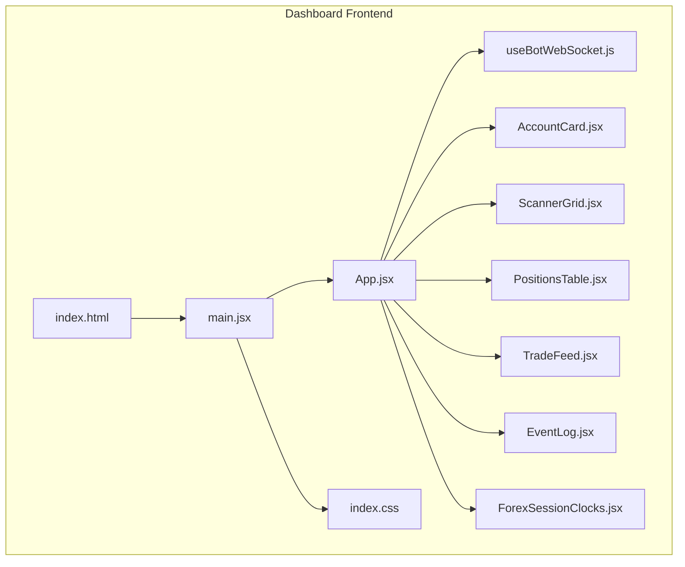
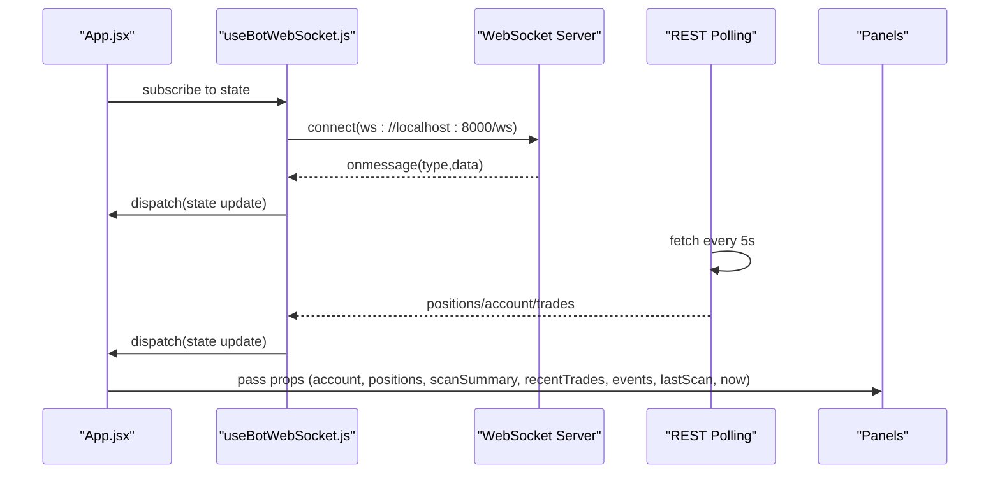
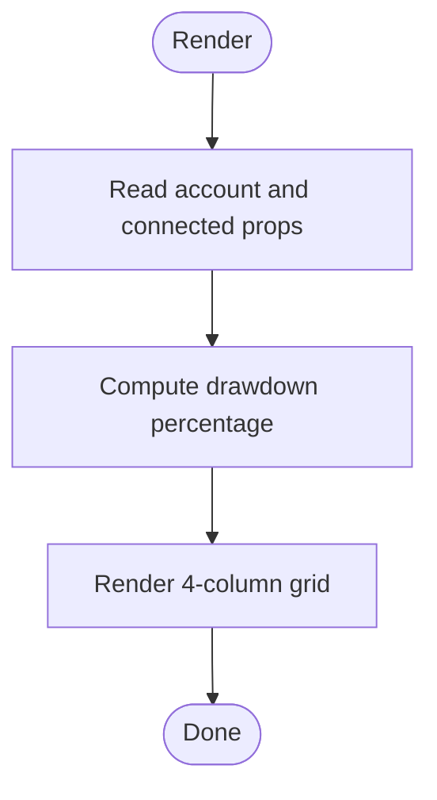
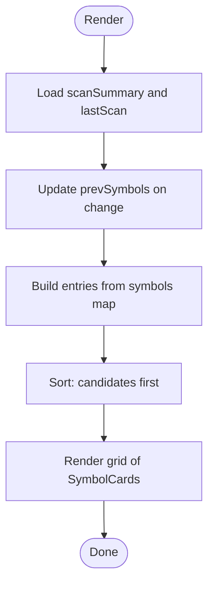
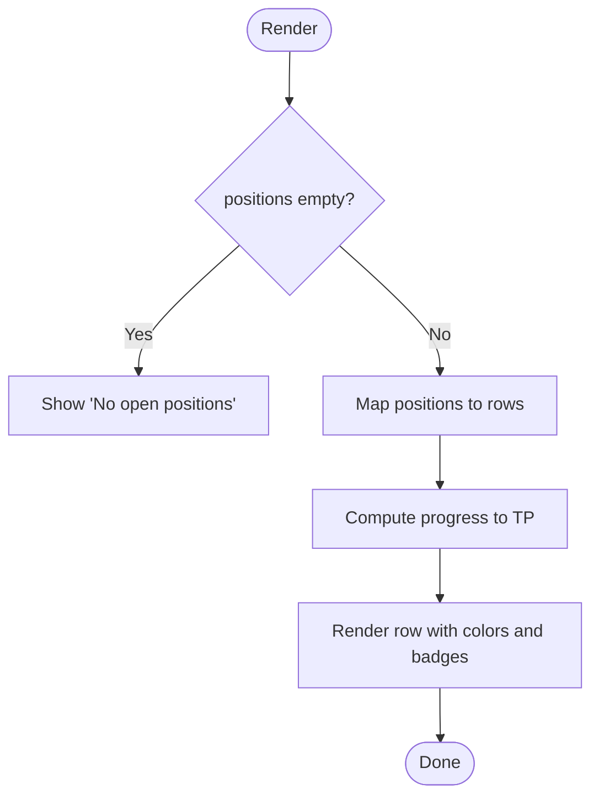
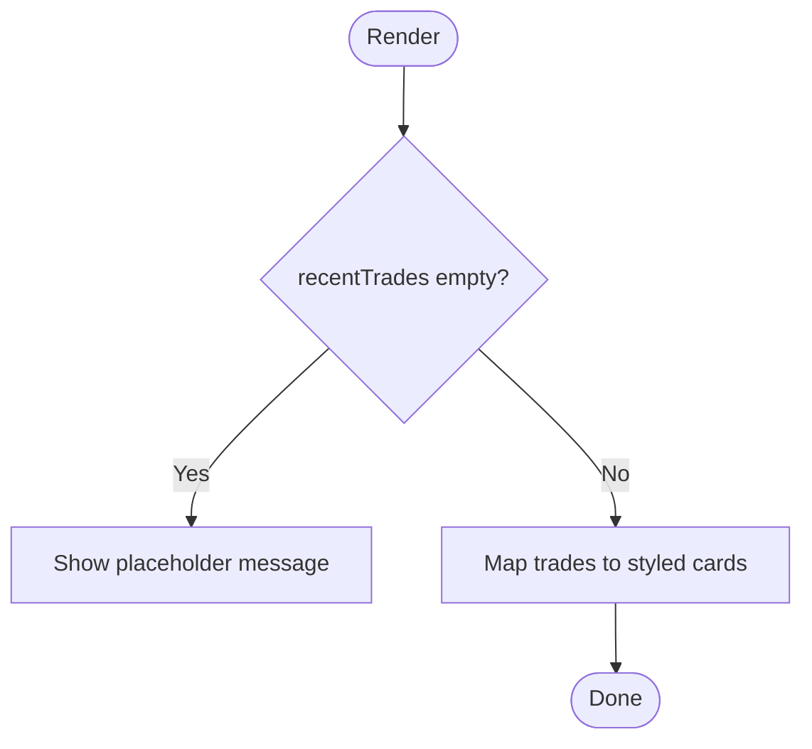
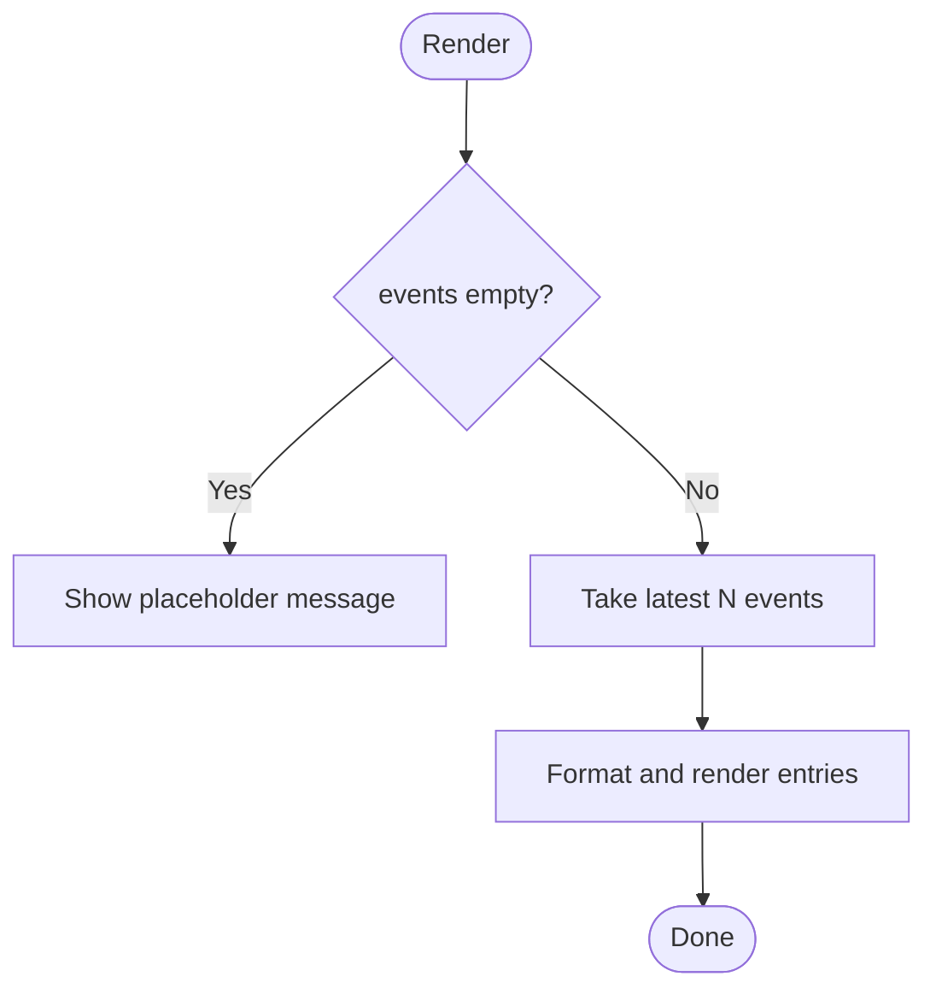
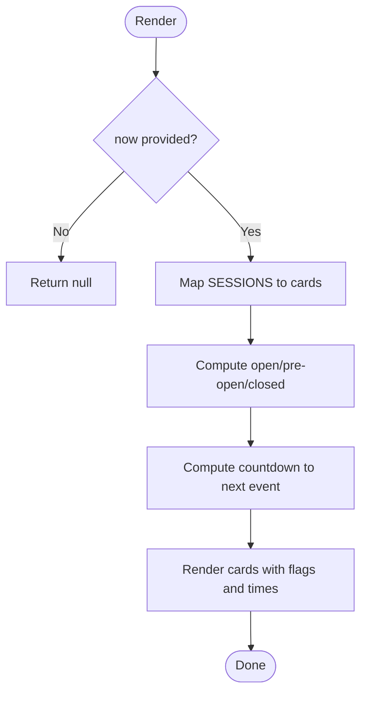
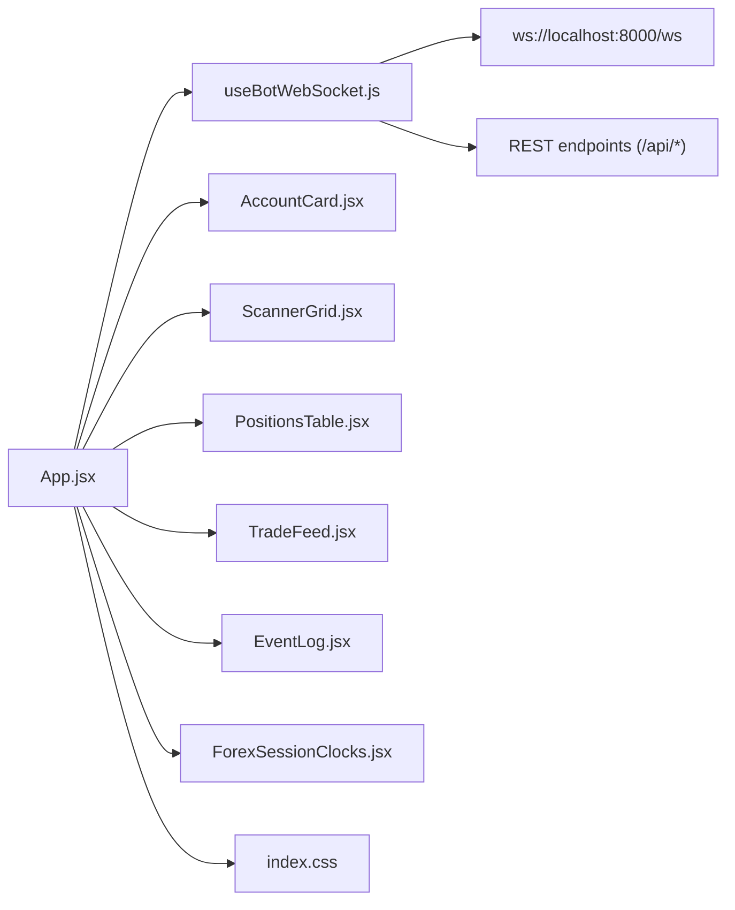

# Dashboard Components

<cite>
**Referenced Files in This Document**
- [AccountCard.jsx](file://dashboard/src/components/AccountCard.jsx)
- [ScannerGrid.jsx](file://dashboard/src/components/ScannerGrid.jsx)
- [PositionsTable.jsx](file://dashboard/src/components/PositionsTable.jsx)
- [TradeFeed.jsx](file://dashboard/src/components/TradeFeed.jsx)
- [EventLog.jsx](file://dashboard/src/components/EventLog.jsx)
- [ForexSessionClocks.jsx](file://dashboard/src/components/ForexSessionClocks.jsx)
- [useBotWebSocket.js](file://dashboard/src/hooks/useBotWebSocket.js)
- [App.jsx](file://dashboard/src/App.jsx)
- [index.css](file://dashboard/src/index.css)
- [main.jsx](file://dashboard/src/main.jsx)
- [index.html](file://dashboard/index.html)
- [package.json](file://dashboard/package.json)
- [vite.config.js](file://dashboard/vite.config.js)
- [README.md](file://README.md)
</cite>

## Table of Contents
1. [Introduction](#introduction)
2. [Project Structure](#project-structure)
3. [Core Components](#core-components)
4. [Architecture Overview](#architecture-overview)
5. [Detailed Component Analysis](#detailed-component-analysis)
6. [Dependency Analysis](#dependency-analysis)
7. [Performance Considerations](#performance-considerations)
8. [Troubleshooting Guide](#troubleshooting-guide)
9. [Conclusion](#conclusion)
10. [Appendices](#appendices)

## Introduction
This document describes the React dashboard components that visualize real-time trading data for an institutional algo-trading system. It focuses on five primary panels: AccountCard, ScannerGrid, PositionsTable, TradeFeed, EventLog, and ForexSessionClocks. It explains each component’s purpose, props, internal state, rendering logic, and how they receive and process data from the WebSocket and REST APIs. It also covers component communication patterns, styling and customization approaches, lifecycle considerations, performance characteristics, and error handling strategies.

## Project Structure
The dashboard is a Vite + React application that renders a grid-based layout. The App component orchestrates data fetching via a custom hook and composes the panels. Styles are centralized in a single CSS file using CSS variables for theme tokens.

**Diagram sources**
- [main.jsx](file://dashboard/src/main.jsx#L1-L11)
- [App.jsx](file://dashboard/src/App.jsx#L1-L104)
- [useBotWebSocket.js](file://dashboard/src/hooks/useBotWebSocket.js#L1-L156)
- [AccountCard.jsx](file://dashboard/src/components/AccountCard.jsx#L1-L67)
- [ScannerGrid.jsx](file://dashboard/src/components/ScannerGrid.jsx#L1-L122)
- [PositionsTable.jsx](file://dashboard/src/components/PositionsTable.jsx#L1-L79)
- [TradeFeed.jsx](file://dashboard/src/components/TradeFeed.jsx#L1-L60)
- [EventLog.jsx](file://dashboard/src/components/EventLog.jsx#L1-L61)
- [ForexSessionClocks.jsx](file://dashboard/src/components/ForexSessionClocks.jsx#L1-L207)
- [index.css](file://dashboard/src/index.css#L1-L191)
- [index.html](file://dashboard/index.html#L1-L16)

**Section sources**
- [main.jsx](file://dashboard/src/main.jsx#L1-L11)
- [App.jsx](file://dashboard/src/App.jsx#L1-L104)
- [index.css](file://dashboard/src/index.css#L1-L191)
- [index.html](file://dashboard/index.html#L1-L16)

## Core Components
- AccountCard: Displays live account metrics (balance, equity, floating P&L, day P&L) and connection status. Renders a progress indicator for drawdown and a live status indicator.
- ScannerGrid: Shows live scanning results across all tradable symbols with color-coded status badges and highlights newly detected candidates.
- PositionsTable: Lists open positions with directional color coding, current P&L, SL/TP, and a progress bar toward TP.
- TradeFeed: Streams recent executions with directional indicators, timestamps, and concise trade details.
- EventLog: Aggregates system events (scans, research, executions, account updates) with categorized icons and formatted messages.
- ForexSessionClocks: Displays four major Forex market sessions with live status, countdowns, and local times.

Each component receives data via props from the central state managed by the WebSocket hook and rendered by App.

**Section sources**
- [AccountCard.jsx](file://dashboard/src/components/AccountCard.jsx#L1-L67)
- [ScannerGrid.jsx](file://dashboard/src/components/ScannerGrid.jsx#L1-L122)
- [PositionsTable.jsx](file://dashboard/src/components/PositionsTable.jsx#L1-L79)
- [TradeFeed.jsx](file://dashboard/src/components/TradeFeed.jsx#L1-L60)
- [EventLog.jsx](file://dashboard/src/components/EventLog.jsx#L1-L61)
- [ForexSessionClocks.jsx](file://dashboard/src/components/ForexSessionClocks.jsx#L1-L207)

## Architecture Overview
The dashboard architecture follows a unidirectional data flow:
- App initializes state via useBotWebSocket and periodically refreshes via REST.
- WebSocket messages update state in real time.
- App passes derived props to each panel component.
- Components render presentational UI with minimal internal state.

**Diagram sources**
- [App.jsx](file://dashboard/src/App.jsx#L12-L104)
- [useBotWebSocket.js](file://dashboard/src/hooks/useBotWebSocket.js#L105-L156)

**Section sources**
- [App.jsx](file://dashboard/src/App.jsx#L12-L104)
- [useBotWebSocket.js](file://dashboard/src/hooks/useBotWebSocket.js#L1-L156)
- [README.md](file://README.md#L65-L71)

## Detailed Component Analysis

### AccountCard
- Purpose: Present live account health with a compact grid layout.
- Props:
  - account: object with equity, balance, profit, day_pl, currency.
  - connected: boolean indicating WebSocket connection status.
- Internal state: None.
- Rendering logic:
  - Computes drawdown percentage and sets bar color based on thresholds.
  - Uses CSS variables for colors and typography.
  - Shows connection status with a pulsing indicator.
- Customization:
  - Adjust grid layout and spacing via inline styles.
  - Modify color tokens in CSS variables for theme changes.
- Lifecycle:
  - Re-renders on prop changes; no effects.
- Performance:
  - Minimal computation; negligible cost.
- Error handling:
  - Gracefully handles missing or partial account data.

**Diagram sources**
- [AccountCard.jsx](file://dashboard/src/components/AccountCard.jsx#L1-L67)

**Section sources**
- [AccountCard.jsx](file://dashboard/src/components/AccountCard.jsx#L1-L67)
- [index.css](file://dashboard/src/index.css#L1-L191)

### ScannerGrid
- Purpose: Visualize live scanner outcomes across symbols with status badges.
- Props:
  - scanSummary: object containing symbols map and metadata.
  - lastScan: timestamp of the latest scan.
- Internal state:
  - prevSymbols: tracks previously seen symbols to mark new entries.
- Rendering logic:
  - Sorts entries so candidates appear first.
  - Uses a status classifier to apply color schemes and labels.
  - Highlights new symbols by presence in current but not previous set.
- Customization:
  - Extend status categories by updating status mapping and labels.
  - Adjust grid sizing and responsiveness via CSS grid properties.
- Lifecycle:
  - Updates prevSymbols when scanSummary changes.
- Performance:
  - Sorting is O(n log n); acceptable for typical symbol counts.
- Error handling:
  - Safely handles empty or missing scanSummary.

**Diagram sources**
- [ScannerGrid.jsx](file://dashboard/src/components/ScannerGrid.jsx#L70-L122)

**Section sources**
- [ScannerGrid.jsx](file://dashboard/src/components/ScannerGrid.jsx#L1-L122)
- [index.css](file://dashboard/src/index.css#L1-L191)

### PositionsTable
- Purpose: Display open positions with directional color coding and progress toward TP.
- Props:
  - positions: array of position objects.
- Internal state: None.
- Rendering logic:
  - Calculates progress percentage toward TP based on entry/price/current.
  - Applies color coding for direction and P&L.
  - Shows placeholders for missing values.
- Customization:
  - Add/remove columns by editing header and cell mapping.
  - Adjust progress bar thresholds and colors via inline styles.
- Lifecycle:
  - Re-renders on positions prop changes.
- Performance:
  - Iteration over positions; efficient for small-to-medium lists.
- Error handling:
  - Graceful fallback when positions is empty or undefined.

**Diagram sources**
- [PositionsTable.jsx](file://dashboard/src/components/PositionsTable.jsx#L1-L79)

**Section sources**
- [PositionsTable.jsx](file://dashboard/src/components/PositionsTable.jsx#L1-L79)
- [index.css](file://dashboard/src/index.css#L1-L191)

### TradeFeed
- Purpose: Stream recent executions with directional emphasis and concise details.
- Props:
  - recentTrades: array of trade execution records.
- Internal state: None.
- Rendering logic:
  - Uses directional indicators and colored backgrounds.
  - Formats timestamps and displays symbol, direction, lot size, and price.
- Customization:
  - Change badges and directional icons by adjusting inline styles and markup.
- Lifecycle:
  - Re-renders on recentTrades prop changes.
- Performance:
  - Lightweight list rendering; capped at a fixed number of items in the hook.
- Error handling:
  - Displays a placeholder when no trades are available.

**Diagram sources**
- [TradeFeed.jsx](file://dashboard/src/components/TradeFeed.jsx#L1-L60)

**Section sources**
- [TradeFeed.jsx](file://dashboard/src/components/TradeFeed.jsx#L1-L60)
- [index.css](file://dashboard/src/index.css#L1-L191)

### EventLog
- Purpose: Aggregate and display system events with categorized styling and timestamps.
- Props:
  - events: array of event objects.
- Internal state: None.
- Rendering logic:
  - Formats human-readable messages based on event type.
  - Applies category-specific icons and colors.
  - Limits display to a recent window and reverses order for natural scroll.
- Customization:
  - Add new event types by extending the formatter and style mapping.
- Lifecycle:
  - Re-renders on events prop changes.
- Performance:
  - Truncates to a bounded number of entries; efficient.
- Error handling:
  - Gracefully falls back to raw type for unknown events.

**Diagram sources**
- [EventLog.jsx](file://dashboard/src/components/EventLog.jsx#L1-L61)

**Section sources**
- [EventLog.jsx](file://dashboard/src/components/EventLog.jsx#L1-L61)
- [index.css](file://dashboard/src/index.css#L1-L191)

### ForexSessionClocks
- Purpose: Show live status and countdowns for four Forex sessions with local times.
- Props:
  - now: Date object representing current time (updated every second by App).
- Internal state: None.
- Rendering logic:
  - Determines open/pre-open/closed status per session.
  - Computes countdown to next open/close with helper functions.
  - Renders session cards with animated glow for open sessions.
- Customization:
  - Add or modify sessions by editing the SESSIONS array and thresholds.
- Lifecycle:
  - Re-renders on every second tick from App.
- Performance:
  - Stateless computations; very lightweight.
- Error handling:
  - Returns null if no time is provided.

**Diagram sources**
- [ForexSessionClocks.jsx](file://dashboard/src/components/ForexSessionClocks.jsx#L96-L207)

**Section sources**
- [ForexSessionClocks.jsx](file://dashboard/src/components/ForexSessionClocks.jsx#L1-L207)
- [index.css](file://dashboard/src/index.css#L1-L191)

## Dependency Analysis
- App depends on useBotWebSocket for state and passes derived props to child components.
- Components are leaf nodes that depend on props and CSS variables.
- WebSocket and REST sources are external to the React app; the hook encapsulates connectivity and polling.

**Diagram sources**
- [App.jsx](file://dashboard/src/App.jsx#L12-L104)
- [useBotWebSocket.js](file://dashboard/src/hooks/useBotWebSocket.js#L105-L156)
- [AccountCard.jsx](file://dashboard/src/components/AccountCard.jsx#L1-L67)
- [ScannerGrid.jsx](file://dashboard/src/components/ScannerGrid.jsx#L1-L122)
- [PositionsTable.jsx](file://dashboard/src/components/PositionsTable.jsx#L1-L79)
- [TradeFeed.jsx](file://dashboard/src/components/TradeFeed.jsx#L1-L60)
- [EventLog.jsx](file://dashboard/src/components/EventLog.jsx#L1-L61)
- [ForexSessionClocks.jsx](file://dashboard/src/components/ForexSessionClocks.jsx#L1-L207)
- [index.css](file://dashboard/src/index.css#L1-L191)

**Section sources**
- [App.jsx](file://dashboard/src/App.jsx#L12-L104)
- [useBotWebSocket.js](file://dashboard/src/hooks/useBotWebSocket.js#L1-L156)
- [README.md](file://README.md#L65-L71)

## Performance Considerations
- WebSocket batching: Incoming events are dispatched as individual actions; grouping updates could reduce re-renders if throughput increases significantly.
- Memoization: Consider memoizing derived data (e.g., sorted symbols, formatted events) if arrays grow large.
- Virtualization: For long lists (positions or event logs), implement virtualized lists to limit DOM nodes.
- Polling cadence: The 5-second REST poll is appropriate for MT5 live reads; avoid lowering it further to prevent load.
- CSS animations: Pulse and fade animations are lightweight; keep them enabled for UX without performance impact.
- Rendering frequency: ForexSessionClocks updates every second; ensure it remains efficient for many users.

[No sources needed since this section provides general guidance]

## Troubleshooting Guide
- WebSocket disconnects:
  - The hook attempts automatic reconnection; the UI reflects disconnected state with a pulsing indicator. Verify server availability and network connectivity.
- No data in panels:
  - Confirm REST endpoints are reachable and returning expected shapes. The hook polls every 5 seconds and merges results.
- Missing or truncated data:
  - RecentTrades and events are capped; confirm limits are sufficient for your volume.
- Styling anomalies:
  - Ensure CSS variables are defined and the stylesheet is loaded. Check for conflicting global styles.

**Section sources**
- [useBotWebSocket.js](file://dashboard/src/hooks/useBotWebSocket.js#L118-L142)
- [useBotWebSocket.js](file://dashboard/src/hooks/useBotWebSocket.js#L112-L115)
- [index.css](file://dashboard/src/index.css#L1-L191)

## Conclusion
The dashboard components form a cohesive, real-time monitoring interface for an algo-trading system. They rely on a clean separation of concerns: App composes state, useBotWebSocket manages transport and polling, and each panel renders a focused view. The design emphasizes clarity, performance, and maintainability through minimal internal state, CSS-driven theming, and straightforward data flows.

[No sources needed since this section summarizes without analyzing specific files]

## Appendices

### Component Props Reference
- AccountCard
  - account: equity, balance, profit, day_pl, currency
  - connected: boolean
- ScannerGrid
  - scanSummary: symbols map, timestamp, count
  - lastScan: timestamp
- PositionsTable
  - positions: array of position objects
- TradeFeed
  - recentTrades: array of trade execution objects
- EventLog
  - events: array of event objects
- ForexSessionClocks
  - now: Date

**Section sources**
- [AccountCard.jsx](file://dashboard/src/components/AccountCard.jsx#L1-L67)
- [ScannerGrid.jsx](file://dashboard/src/components/ScannerGrid.jsx#L70-L86)
- [PositionsTable.jsx](file://dashboard/src/components/PositionsTable.jsx#L1-L11)
- [TradeFeed.jsx](file://dashboard/src/components/TradeFeed.jsx#L1-L1)
- [EventLog.jsx](file://dashboard/src/components/EventLog.jsx#L35-L35)
- [ForexSessionClocks.jsx](file://dashboard/src/components/ForexSessionClocks.jsx#L96-L97)

### Styling and Theming
- Theme tokens are defined in CSS variables for consistent colors and typography.
- Components rely on shared classes (.card, .badge, .data-table, .progress-bar) and animations.
- Customization can be achieved by overriding CSS variables or adding new classes.

**Section sources**
- [index.css](file://dashboard/src/index.css#L1-L28)
- [index.css](file://dashboard/src/index.css#L48-L191)

### Build and Runtime
- Built with Vite; served locally on port 5173.
- React and React DOM are runtime dependencies.
- Fonts are loaded via CDN.

**Section sources**
- [vite.config.js](file://dashboard/vite.config.js#L1-L11)
- [package.json](file://dashboard/package.json#L1-L24)
- [index.html](file://dashboard/index.html#L1-L16)