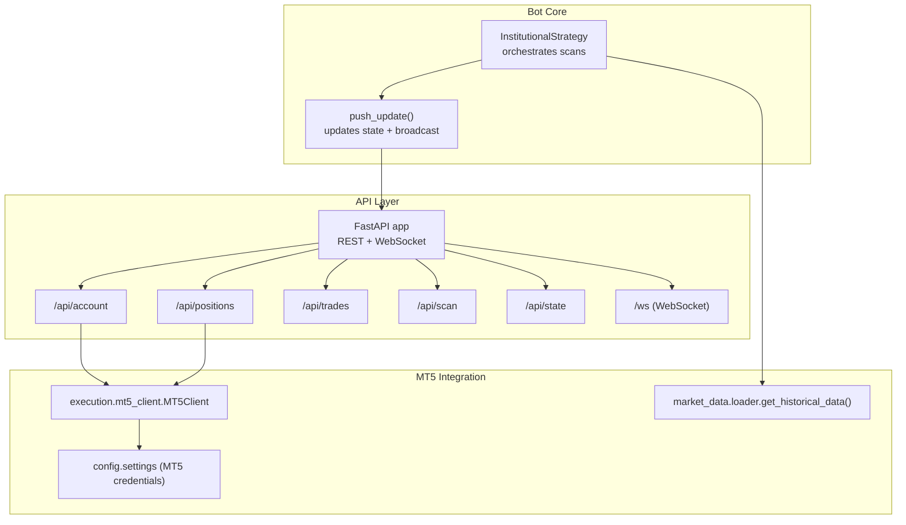
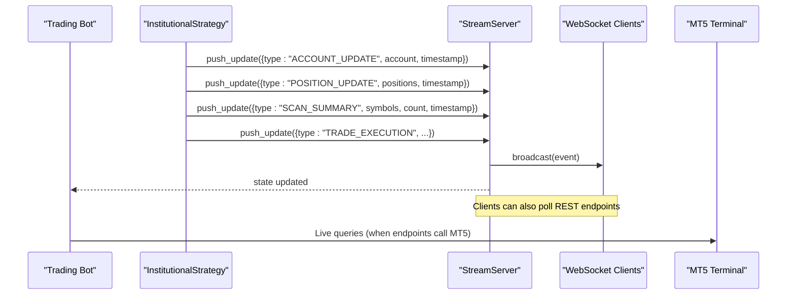
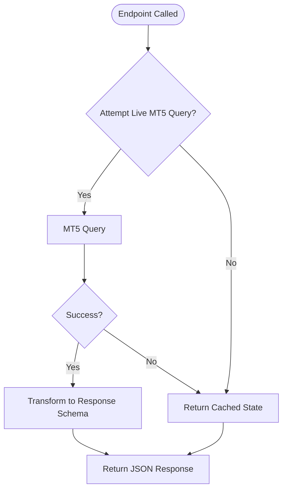
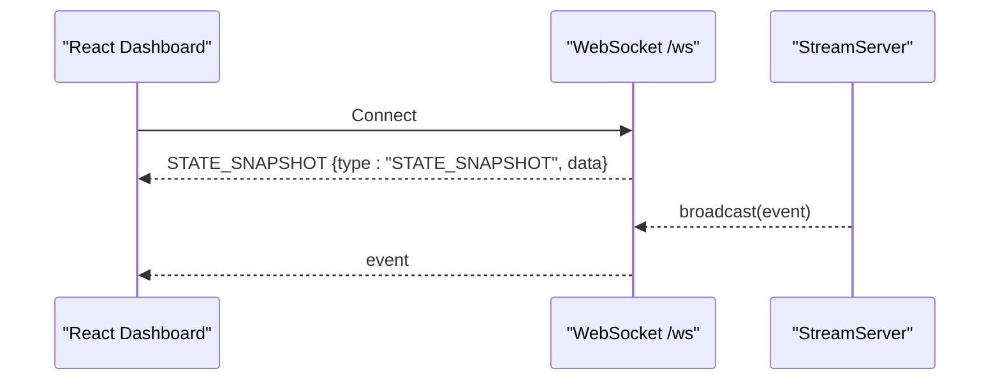
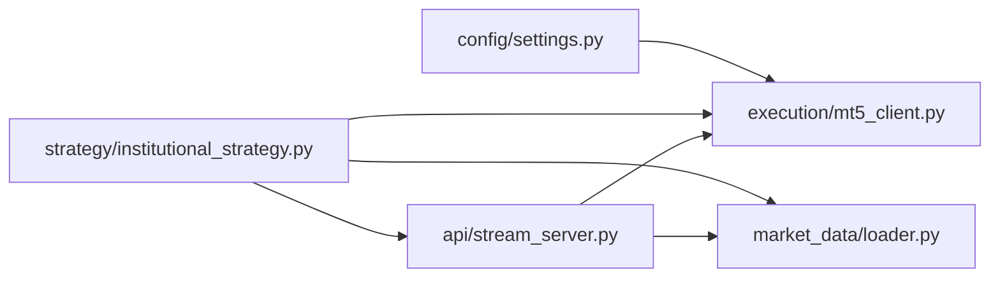

# REST API Endpoints

<cite>
**Referenced Files in This Document**
- [stream_server.py](file://api/stream_server.py)
- [mt5_client.py](file://execution/mt5_client.py)
- [loader.py](file://market_data/loader.py)
- [settings.py](file://config/settings.py)
- [main.py](file://main.py)
- [institutional_strategy.py](file://strategy/institutional_strategy.py)
- [useBotWebSocket.js](file://dashboard/src/hooks/useBotWebSocket.js)
</cite>

## Table of Contents
1. [Introduction](#introduction)
2. [Project Structure](#project-structure)
3. [Core Components](#core-components)
4. [Architecture Overview](#architecture-overview)
5. [Detailed Component Analysis](#detailed-component-analysis)
6. [Dependency Analysis](#dependency-analysis)
7. [Performance Considerations](#performance-considerations)
8. [Troubleshooting Guide](#troubleshooting-guide)
9. [Conclusion](#conclusion)
10. [Appendices](#appendices)

## Introduction
This document describes the REST API endpoints provided by the stream server that powers the React dashboard. It covers:
- Available GET endpoints for account information, open positions, recent trades, scan summaries, and complete state
- MT5 integration for live data retrieval and fallback to cached state
- Response schemas, error handling, and data transformation processes
- Practical usage examples, authentication, rate limiting considerations
- CORS configuration for React dashboard integration

## Project Structure
The stream server is implemented as a FastAPI application and exposes both REST endpoints and a WebSocket endpoint. The bot orchestrates updates via push_update, which updates in-memory state and broadcasts to connected clients.

**Diagram sources**
- [stream_server.py](file://api/stream_server.py#L17-L173)
- [institutional_strategy.py](file://strategy/institutional_strategy.py#L122-L236)
- [mt5_client.py](file://execution/mt5_client.py#L18-L27)
- [loader.py](file://market_data/loader.py#L40-L59)
- [settings.py](file://config/settings.py#L8-L11)

**Section sources**
- [stream_server.py](file://api/stream_server.py#L17-L173)
- [main.py](file://main.py#L66-L71)

## Core Components
- FastAPI application with CORS middleware configured for React development
- In-memory state (_state) holding account, positions, scan summary, recent trades, and events
- push_update to update state and broadcast to WebSocket clients
- REST endpoints backed by live MT5 data with graceful fallback to cached state

Key behaviors:
- /api/account and /api/positions attempt live MT5 retrieval; on failure, return cached state
- /api/trades and /api/scan return cached state maintained by push_update
- /api/state returns the entire in-memory state snapshot

**Section sources**
- [stream_server.py](file://api/stream_server.py#L19-L34)
- [stream_server.py](file://api/stream_server.py#L86-L140)
- [stream_server.py](file://api/stream_server.py#L176-L212)

## Architecture Overview
The stream server runs as a background service alongside the trading bot. The bot periodically emits events (account, positions, scan summary, trade executions) via push_update. The REST endpoints serve cached snapshots, while the WebSocket endpoint streams live updates.

**Diagram sources**
- [stream_server.py](file://api/stream_server.py#L176-L212)
- [institutional_strategy.py](file://strategy/institutional_strategy.py#L122-L236)

## Detailed Component Analysis

### REST Endpoints

#### GET /api/account
- Purpose: Retrieve current account information
- Live data source: MT5 account_info
- Fallback: In-memory cached account snapshot
- Response shape:
  - balance: number
  - equity: number
  - profit: number
  - currency: string
  - leverage: integer
  - day_pl: number (derived as equity - balance)
- Error handling:
  - On MT5 failure, returns cached account snapshot
- Typical usage:
  - Poll every few seconds for dashboard updates

**Section sources**
- [stream_server.py](file://api/stream_server.py#L86-L103)

#### GET /api/positions
- Purpose: Retrieve currently open positions
- Live data source: MT5 positions_get
- Fallback: In-memory cached positions array
- Response shape (array items):
  - ticket: integer
  - symbol: string
  - type: integer (0=BUY, 1=SELL)
  - direction: string ("BUY" or "SELL")
  - volume: number
  - entry_price: number
  - price_current: number
  - sl_price: number
  - tp_price: number
  - profit: number
- Error handling:
  - On MT5 failure, returns cached positions
- Typical usage:
  - Poll for live positions on the dashboard

**Section sources**
- [stream_server.py](file://api/stream_server.py#L105-L128)

#### GET /api/trades
- Purpose: Retrieve recent trade executions
- Live data source: Not directly polled; served from cached state
- Response shape: Array of recent trade execution objects (see TRADE_EXECUTION payload below)
- Error handling:
  - Always returns cached recent_trades (up to 50 most recent)
- Typical usage:
  - Display recent executions in the dashboard trade feed

**Section sources**
- [stream_server.py](file://api/stream_server.py#L130-L132)
- [stream_server.py](file://api/stream_server.py#L207-L211)

#### GET /api/scan
- Purpose: Retrieve latest scan summary
- Live data source: Not directly polled; served from cached state
- Response shape:
  - symbols: object (per-symbol status/results)
  - timestamp: ISO string
  - count: integer
- Error handling:
  - Always returns cached scan summary
- Typical usage:
  - Show scan results and candidate counts on the scanner grid

**Section sources**
- [stream_server.py](file://api/stream_server.py#L134-L136)
- [stream_server.py](file://api/stream_server.py#L200-L205)

#### GET /api/state
- Purpose: Retrieve complete in-memory state snapshot
- Live data source: Not directly polled; served from cached state
- Response shape:
  - account: object (same as /api/account)
  - positions: array (same as /api/positions)
  - scan_summary: object (same as /api/scan)
  - recent_trades: array (same as /api/trades)
  - events: array (rolling log of up to 200 events)
- Error handling:
  - Always returns cached state
- Typical usage:
  - Initial snapshot for new WebSocket clients

**Section sources**
- [stream_server.py](file://api/stream_server.py#L138-L140)
- [stream_server.py](file://api/stream_server.py#L28-L34)

### MT5 Integration and Fallback Mechanisms
- Live retrieval:
  - /api/account and /api/positions attempt live MT5 queries
  - InstitutionalStrategy emits ACCOUNT_UPDATE and POSITION_UPDATE events with live data
- Fallback:
  - On MT5 errors, endpoints return cached state
  - push_update maintains rolling caches for positions, recent trades, and events
- Data transformation:
  - Positions transformed to normalized fields (direction, entry/current prices, SL/TP, profit)
  - Account augmented with derived day_pl

**Diagram sources**
- [stream_server.py](file://api/stream_server.py#L86-L128)

**Section sources**
- [stream_server.py](file://api/stream_server.py#L86-L128)
- [stream_server.py](file://api/stream_server.py#L176-L212)
- [institutional_strategy.py](file://strategy/institutional_strategy.py#L196-L236)

### WebSocket Streaming
- Endpoint: /ws
- Behavior:
  - Accepts WebSocket connections
  - Sends a STATE_SNAPSHOT on connect
  - Broadcasts events emitted by push_update to all connected clients
- Client-side handling:
  - React dashboard consumes events and updates local state accordingly

**Diagram sources**
- [stream_server.py](file://api/stream_server.py#L69-L79)
- [stream_server.py](file://api/stream_server.py#L41-L45)
- [stream_server.py](file://api/stream_server.py#L51-L62)
- [useBotWebSocket.js](file://dashboard/src/hooks/useBotWebSocket.js#L41-L80)

**Section sources**
- [stream_server.py](file://api/stream_server.py#L69-L79)
- [stream_server.py](file://api/stream_server.py#L41-L45)
- [useBotWebSocket.js](file://dashboard/src/hooks/useBotWebSocket.js#L41-L80)

### Data Transformation and Caching
- push_update updates:
  - account: merged updates
  - positions: full replacement
  - scan_summary: normalized structure
  - recent_trades: prepend with rolling limit (50)
  - events: append with rolling limit (200)
- Events emitted by the bot:
  - ACCOUNT_UPDATE
  - POSITION_UPDATE
  - SCAN_SUMMARY
  - TRADE_EXECUTION

**Section sources**
- [stream_server.py](file://api/stream_server.py#L185-L212)
- [institutional_strategy.py](file://strategy/institutional_strategy.py#L122-L236)

## Dependency Analysis
- API depends on:
  - MT5 connectivity for live queries in two endpoints
  - push_update for maintaining cached state and broadcasting
- Bot orchestrates:
  - InstitutionalStrategy emits events that populate cached state
  - MT5Client and loader support live data retrieval for internal use

**Diagram sources**
- [stream_server.py](file://api/stream_server.py#L86-L128)
- [mt5_client.py](file://execution/mt5_client.py#L18-L27)
- [loader.py](file://market_data/loader.py#L40-L59)
- [institutional_strategy.py](file://strategy/institutional_strategy.py#L122-L236)
- [settings.py](file://config/settings.py#L8-L11)

**Section sources**
- [stream_server.py](file://api/stream_server.py#L86-L128)
- [mt5_client.py](file://execution/mt5_client.py#L18-L27)
- [loader.py](file://market_data/loader.py#L40-L59)
- [institutional_strategy.py](file://strategy/institutional_strategy.py#L122-L236)

## Performance Considerations
- Endpoint performance:
  - /api/account and /api/positions perform live MT5 queries; consider polling cadence to avoid excessive calls
  - Other endpoints serve cached state and are lightweight
- Caching:
  - In-memory rolling caches reduce repeated MT5 calls and provide immediate responses
- Recommendations:
  - Poll /api/account and /api/positions at intervals suitable for dashboard UX (e.g., every 3–10 seconds)
  - Use WebSocket for real-time updates; poll REST endpoints for initial snapshot or offline scenarios

[No sources needed since this section provides general guidance]

## Troubleshooting Guide
- MT5 connectivity issues:
  - Symptoms: Endpoints fall back to cached state
  - Causes: MT5 terminal not running, login failures, or network issues
  - Actions: Verify MT5 credentials and path in environment variables; ensure MT5 terminal is running and logged in
- WebSocket disconnections:
  - Symptoms: Dashboard stops updating
  - Actions: Reconnect; the server sends a STATE_SNAPSHOT on connect
- CORS errors in React:
  - Symptoms: Cross-origin requests blocked
  - Resolution: The server allows all origins, methods, and headers for development; ensure the React app points to the correct server URL

**Section sources**
- [stream_server.py](file://api/stream_server.py#L19-L25)
- [stream_server.py](file://api/stream_server.py#L69-L79)
- [settings.py](file://config/settings.py#L8-L11)

## Conclusion
The stream server provides a lightweight, real-time bridge between the trading bot and the React dashboard. REST endpoints offer cached snapshots for quick retrieval, while WebSocket streaming ensures live updates. MT5 integration is used for live data where endpoints require it, with robust fallback to cached state for resilience.

[No sources needed since this section summarizes without analyzing specific files]

## Appendices

### Authentication and Security
- Authentication: No authentication is enforced by the stream server; use appropriate deployment practices (e.g., local network access, reverse proxy with auth) for production environments
- CORS: All origins, methods, and headers are permitted for development; adjust CORS settings as needed for production

**Section sources**
- [stream_server.py](file://api/stream_server.py#L19-L25)

### Rate Limiting Considerations
- No built-in rate limiting exists in the stream server
- Recommended practice: Implement client-side throttling (e.g., debounce rapid polls) and use WebSocket for continuous updates
- Monitor MT5 terminal resources when polling frequently

[No sources needed since this section provides general guidance]

### Practical Usage Examples
- Start the stream server:
  - The main application starts the server automatically on an open port in the 8000–8009 range
- Example requests:
  - GET http://localhost:8000/api/account
  - GET http://localhost:8000/api/positions
  - GET http://localhost:8000/api/trades
  - GET http://localhost:8000/api/scan
  - GET http://localhost:8000/api/state
- WebSocket:
  - Connect to ws://localhost:8000/ws to receive live updates

**Section sources**
- [main.py](file://main.py#L66-L71)
- [stream_server.py](file://api/stream_server.py#L153-L173)