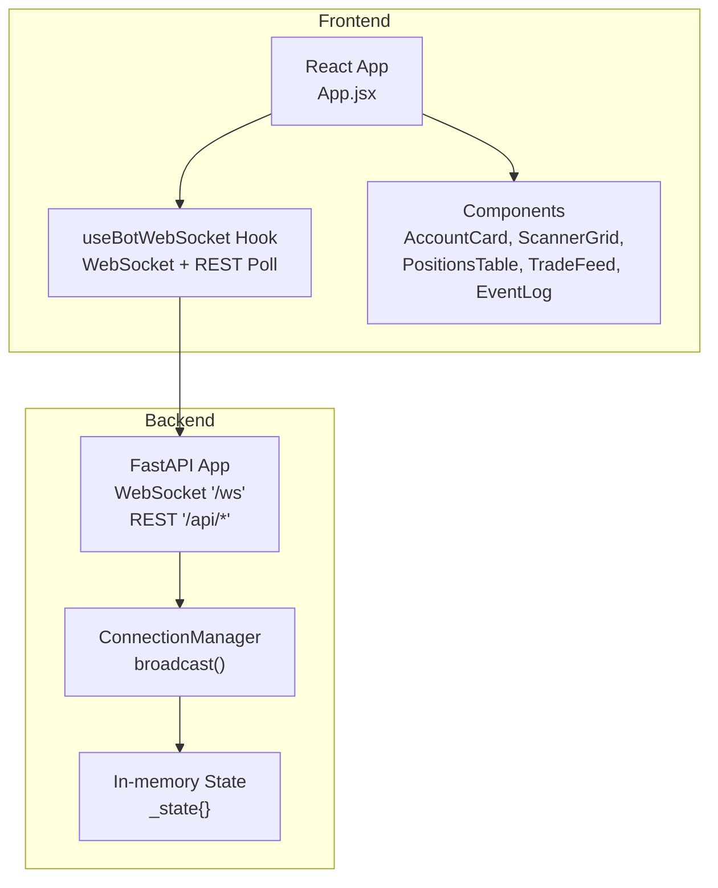
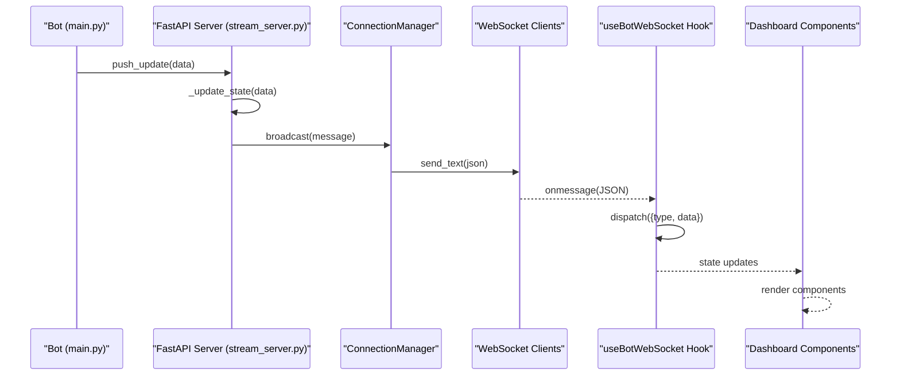
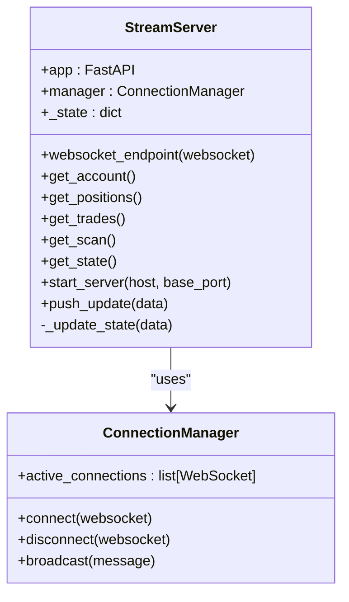
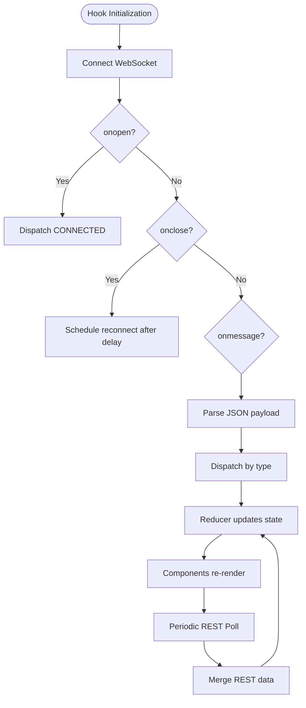
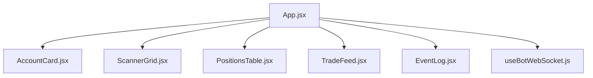
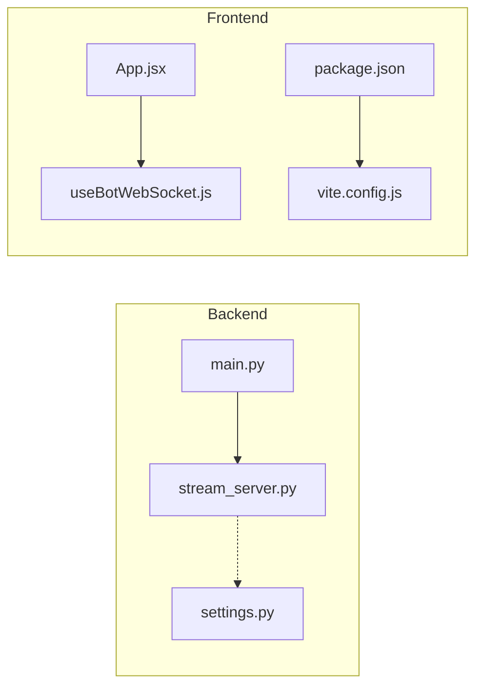

# Real-Time Monitoring

<cite>
**Referenced Files in This Document**
- [stream_server.py](file://api/stream_server.py)
- [useBotWebSocket.js](file://dashboard/src/hooks/useBotWebSocket.js)
- [AccountCard.jsx](file://dashboard/src/components/AccountCard.jsx)
- [ScannerGrid.jsx](file://dashboard/src/components/ScannerGrid.jsx)
- [PositionsTable.jsx](file://dashboard/src/components/PositionsTable.jsx)
- [TradeFeed.jsx](file://dashboard/src/components/TradeFeed.jsx)
- [EventLog.jsx](file://dashboard/src/components/EventLog.jsx)
- [App.jsx](file://dashboard/src/App.jsx)
- [main.jsx](file://dashboard/src/main.jsx)
- [package.json](file://dashboard/package.json)
- [vite.config.js](file://dashboard/vite.config.js)
- [main.py](file://main.py)
- [settings.py](file://config/settings.py)
</cite>

## Table of Contents
1. [Introduction](#introduction)
2. [Project Structure](#project-structure)
3. [Core Components](#core-components)
4. [Architecture Overview](#architecture-overview)
5. [Detailed Component Analysis](#detailed-component-analysis)
6. [Dependency Analysis](#dependency-analysis)
7. [Performance Considerations](#performance-considerations)
8. [Troubleshooting Guide](#troubleshooting-guide)
9. [Conclusion](#conclusion)
10. [Appendices](#appendices)

## Introduction
This document describes the real-time monitoring system for the MT5 Algo Trading Bot. It covers the FastAPI WebSocket server that streams live trading data and REST endpoints, and the React dashboard that consumes this data via a WebSocket client and periodic REST polling. It documents the event types, message formats, and data synchronization between backend and frontend. It also explains the dashboard architecture and components, monitoring configuration, alert systems, and troubleshooting real-time communication issues.

## Project Structure
The real-time monitoring system spans two primary areas:
- Backend: FastAPI WebSocket server and REST endpoints that expose live trading data and maintain an in-memory state snapshot.
- Frontend: A React dashboard that connects to the WebSocket server and polls REST endpoints periodically to keep the UI synchronized.

**Diagram sources**
- [stream_server.py](file://api/stream_server.py#L17-L80)
- [useBotWebSocket.js](file://dashboard/src/hooks/useBotWebSocket.js#L105-L155)
- [App.jsx](file://dashboard/src/App.jsx#L12-L104)

**Section sources**
- [stream_server.py](file://api/stream_server.py#L1-L212)
- [useBotWebSocket.js](file://dashboard/src/hooks/useBotWebSocket.js#L1-L156)
- [App.jsx](file://dashboard/src/App.jsx#L1-L104)

## Core Components
- FastAPI WebSocket server and REST endpoints:
  - WebSocket endpoint for live updates.
  - REST endpoints for account, positions, recent trades, and scan summary.
  - In-memory state maintained and rolled for events and recent trades.
  - Thread-safe push mechanism to update state and broadcast to clients.
- React dashboard:
  - WebSocket hook that manages connection lifecycle, reconnection, and state updates.
  - Periodic REST polling to complement WebSocket updates.
  - Dashboard components rendering account metrics, scanner signals, open positions, recent trades, and event log.

Key implementation references:
- WebSocket server and state management: [stream_server.py](file://api/stream_server.py#L17-L212)
- WebSocket client and REST polling: [useBotWebSocket.js](file://dashboard/src/hooks/useBotWebSocket.js#L1-L156)
- Dashboard layout and component wiring: [App.jsx](file://dashboard/src/App.jsx#L1-L104)

**Section sources**
- [stream_server.py](file://api/stream_server.py#L17-L212)
- [useBotWebSocket.js](file://dashboard/src/hooks/useBotWebSocket.js#L1-L156)
- [App.jsx](file://dashboard/src/App.jsx#L1-L104)

## Architecture Overview
The backend exposes:
- WebSocket endpoint for real-time updates.
- REST endpoints for account info, open positions, recent trades, and scan summary.
- A startup routine that starts the server on an available port and prints the URLs.

The frontend:
- Establishes a WebSocket connection and listens for messages.
- Applies reducers to update local state for each event type.
- Performs periodic REST polling to refresh account and positions data.
- Renders components that reflect live state.

**Diagram sources**
- [stream_server.py](file://api/stream_server.py#L176-L212)
- [useBotWebSocket.js](file://dashboard/src/hooks/useBotWebSocket.js#L118-L155)
- [App.jsx](file://dashboard/src/App.jsx#L12-L104)

## Detailed Component Analysis

### FastAPI WebSocket Server
- WebSocket endpoint:
  - Accepts connections and sends a STATE_SNAPSHOT upon connect.
  - Keeps the connection alive by receiving text frames.
  - Disconnects gracefully on exceptions.
- ConnectionManager:
  - Tracks active connections.
  - Broadcasts messages to all clients, removing dead connections.
- REST endpoints:
  - GET /api/account: returns live account info or falls back to cached state.
  - GET /api/positions: returns live open positions or falls back to cached state.
  - GET /api/trades: returns recent trades (last 50).
  - GET /api/scan: returns scan summary.
  - GET /api/state: returns full in-memory state.
- Startup and server binding:
  - Starts Uvicorn in a background thread.
  - Auto-selects an open port in a predefined range.
- Push update mechanism:
  - Thread-safe update of in-memory state.
  - Async broadcast to all WebSocket clients.

**Diagram sources**
- [stream_server.py](file://api/stream_server.py#L37-L80)
- [stream_server.py](file://api/stream_server.py#L81-L174)
- [stream_server.py](file://api/stream_server.py#L176-L212)

**Section sources**
- [stream_server.py](file://api/stream_server.py#L37-L80)
- [stream_server.py](file://api/stream_server.py#L81-L174)
- [stream_server.py](file://api/stream_server.py#L176-L212)

### React WebSocket Client Hook
- WebSocket lifecycle:
  - Creates a WebSocket connection to the configured URL.
  - Handles onopen, onmessage, onclose, onerror.
  - Reconnects automatically with exponential backoff-like delay.
- REST polling:
  - Periodically fetches positions, account, and recent trades.
  - Merges REST data without clobbering WebSocket events.
- State management:
  - Reducer handles CONNECTED/DISCONNECTED and various event types.
  - Maintains rolling logs for events and recent trades.

**Diagram sources**
- [useBotWebSocket.js](file://dashboard/src/hooks/useBotWebSocket.js#L118-L155)
- [useBotWebSocket.js](file://dashboard/src/hooks/useBotWebSocket.js#L87-L103)

**Section sources**
- [useBotWebSocket.js](file://dashboard/src/hooks/useBotWebSocket.js#L1-L156)

### Dashboard Components
- AccountCard:
  - Displays live connection status, balance, equity, floating P/L, and day P/L.
  - Shows drawdown percentage and progress bars.
- ScannerGrid:
  - Renders scanner results as symbol cards with status indicators.
  - Highlights candidates and shows last scan time.
- PositionsTable:
  - Lists open positions with direction, lot size, entry/exit prices, P/L, SL/TP, and progress.
- TradeFeed:
  - Shows recent trades with directional indicators and timestamps.
- EventLog:
  - Displays a rolling log of events with icons and formatted messages.

**Diagram sources**
- [App.jsx](file://dashboard/src/App.jsx#L12-L104)
- [AccountCard.jsx](file://dashboard/src/components/AccountCard.jsx#L1-L67)
- [ScannerGrid.jsx](file://dashboard/src/components/ScannerGrid.jsx#L1-L122)
- [PositionsTable.jsx](file://dashboard/src/components/PositionsTable.jsx#L1-L79)
- [TradeFeed.jsx](file://dashboard/src/components/TradeFeed.jsx#L1-L60)
- [EventLog.jsx](file://dashboard/src/components/EventLog.jsx#L1-L61)

**Section sources**
- [App.jsx](file://dashboard/src/App.jsx#L1-L104)
- [AccountCard.jsx](file://dashboard/src/components/AccountCard.jsx#L1-L67)
- [ScannerGrid.jsx](file://dashboard/src/components/ScannerGrid.jsx#L1-L122)
- [PositionsTable.jsx](file://dashboard/src/components/PositionsTable.jsx#L1-L79)
- [TradeFeed.jsx](file://dashboard/src/components/TradeFeed.jsx#L1-L60)
- [EventLog.jsx](file://dashboard/src/components/EventLog.jsx#L1-L61)

### Event Types, Message Formats, and Data Synchronization
- Event types and payloads:
  - ACCOUNT_UPDATE: carries an account dictionary.
  - POSITION_UPDATE: carries a positions array.
  - SCAN_SUMMARY: carries symbols dictionary, timestamp, and count.
  - TRADE_EXECUTION: carries trade details (symbol, direction, lot, price, timestamp).
  - STATE_SNAPSHOT: initial snapshot containing account, positions, scan_summary, recent_trades, events.
  - CONNECTED/DISCONNECTED: connection state notifications.
  - SCAN_START, RESEARCH_START, RESEARCH_RESULT: research/scanner lifecycle events.
- Data synchronization:
  - WebSocket provides real-time updates; REST polling ensures eventual consistency for account and positions.
  - Reducer merges REST data without overwriting WebSocket events.
  - Rolling buffers enforce memory bounds for events and recent trades.

References:
- Backend event handling and state updates: [stream_server.py](file://api/stream_server.py#L185-L212)
- Frontend reducer actions and merging: [useBotWebSocket.js](file://dashboard/src/hooks/useBotWebSocket.js#L17-L85)

**Section sources**
- [stream_server.py](file://api/stream_server.py#L185-L212)
- [useBotWebSocket.js](file://dashboard/src/hooks/useBotWebSocket.js#L17-L85)

### Monitoring Configuration and Alert Systems
- Configuration:
  - Backend server host/port selection and CORS settings.
  - Frontend WebSocket and REST URLs, polling interval.
- Alerts:
  - Connection status indicator in the header and AccountCard.
  - Scanner highlights candidates and session/off-session conditions.
  - EventLog categorizes and displays trade and research events.

References:
- Server startup and port selection: [stream_server.py](file://api/stream_server.py#L153-L173)
- Frontend polling and connection status: [useBotWebSocket.js](file://dashboard/src/hooks/useBotWebSocket.js#L3-L5), [useBotWebSocket.js](file://dashboard/src/hooks/useBotWebSocket.js#L118-L155)
- Scanner status mapping: [ScannerGrid.jsx](file://dashboard/src/components/ScannerGrid.jsx#L3-L25)

**Section sources**
- [stream_server.py](file://api/stream_server.py#L153-L173)
- [useBotWebSocket.js](file://dashboard/src/hooks/useBotWebSocket.js#L3-L5)
- [useBotWebSocket.js](file://dashboard/src/hooks/useBotWebSocket.js#L118-L155)
- [ScannerGrid.jsx](file://dashboard/src/components/ScannerGrid.jsx#L3-L25)

## Dependency Analysis
- Backend dependencies:
  - FastAPI app, WebSocket handling, asyncio, threading, uvicorn.
  - MetaTrader5 for live account and positions data (fallback to cached state).
- Frontend dependencies:
  - React, React DOM, Vite for development and build.
  - Dashboard components depend on the WebSocket hook for state.

**Diagram sources**
- [main.py](file://main.py#L16-L68)
- [stream_server.py](file://api/stream_server.py#L17-L25)
- [settings.py](file://config/settings.py#L1-L201)
- [useBotWebSocket.js](file://dashboard/src/hooks/useBotWebSocket.js#L1-L156)
- [App.jsx](file://dashboard/src/App.jsx#L1-L104)
- [package.json](file://dashboard/package.json#L1-L24)
- [vite.config.js](file://dashboard/vite.config.js#L1-L11)

**Section sources**
- [main.py](file://main.py#L16-L68)
- [stream_server.py](file://api/stream_server.py#L17-L25)
- [settings.py](file://config/settings.py#L1-L201)
- [useBotWebSocket.js](file://dashboard/src/hooks/useBotWebSocket.js#L1-L156)
- [App.jsx](file://dashboard/src/App.jsx#L1-L104)
- [package.json](file://dashboard/package.json#L1-L24)
- [vite.config.js](file://dashboard/vite.config.js#L1-L11)

## Performance Considerations
- WebSocket throughput:
  - Broadcast loops through active connections; ensure minimal payload sizes.
  - Dead connections are pruned to avoid unnecessary overhead.
- Memory management:
  - Events capped at 200; recent trades capped at 50.
  - Snapshot sent on connect to reduce initial churn.
- REST polling:
  - 5-second intervals balance freshness and server load.
- Rendering:
  - Components use efficient lists and slicing to limit rendered items.

[No sources needed since this section provides general guidance]

## Troubleshooting Guide
Common issues and remedies:
- WebSocket not connecting:
  - Verify backend server is running and listening on the expected port.
  - Confirm frontend WebSocket URL matches backend address and port.
  - Check browser console for connection errors.
- Frequent reconnections:
  - Inspect onclose/onerror handlers and reconnect timers.
  - Ensure backend does not abruptly terminate connections.
- Out-of-sync data:
  - Confirm REST polling is active and merging logic is applied.
  - Validate reducer actions for each event type.
- High latency or dropped messages:
  - Reduce payload size and frequency of broadcasts.
  - Monitor backend broadcast loop and dead connection pruning.

**Section sources**
- [useBotWebSocket.js](file://dashboard/src/hooks/useBotWebSocket.js#L118-L155)
- [stream_server.py](file://api/stream_server.py#L51-L63)

## Conclusion
The real-time monitoring system combines a FastAPI WebSocket server with a React dashboard to deliver live trading insights. The backend maintains an in-memory state and broadcasts updates efficiently, while the frontend uses a WebSocket client plus REST polling to keep the UI responsive and accurate. The modular component architecture and explicit event types enable clear data synchronization and straightforward troubleshooting.

[No sources needed since this section summarizes without analyzing specific files]

## Appendices

### API Endpoints Summary
- GET /
  - Returns service health and metadata.
- GET /api/account
  - Returns live account info or cached state.
- GET /api/positions
  - Returns live open positions or cached state.
- GET /api/trades
  - Returns recent trades (last 50).
- GET /api/scan
  - Returns scan summary.
- GET /api/state
  - Returns full in-memory state.

**Section sources**
- [stream_server.py](file://api/stream_server.py#L82-L141)

### WebSocket Message Types
- STATE_SNAPSHOT
- ACCOUNT_UPDATE
- POSITION_UPDATE
- SCAN_SUMMARY
- TRADE_EXECUTION
- SCAN_START
- RESEARCH_START
- RESEARCH_RESULT
- CONNECTED
- DISCONNECTED

**Section sources**
- [stream_server.py](file://api/stream_server.py#L44-L45)
- [useBotWebSocket.js](file://dashboard/src/hooks/useBotWebSocket.js#L17-L85)

### Frontend Build and Dev Server
- Development server runs on port 5173 with Vite.
- Dependencies include React, React DOM, and Vite plugin for React.

**Section sources**
- [vite.config.js](file://dashboard/vite.config.js#L1-L11)
- [package.json](file://dashboard/package.json#L1-L24)