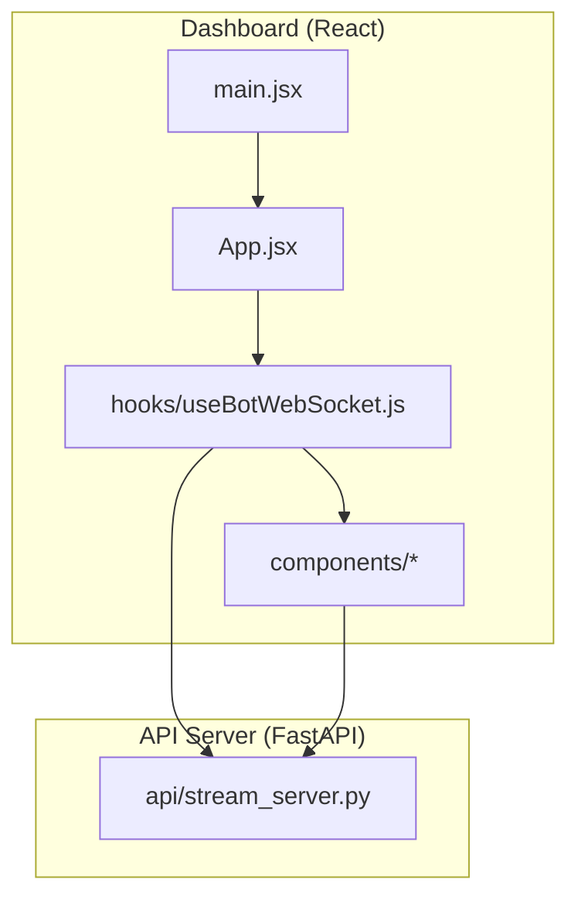
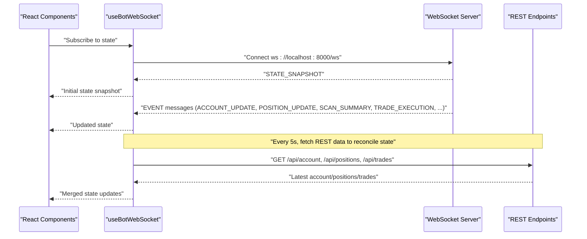
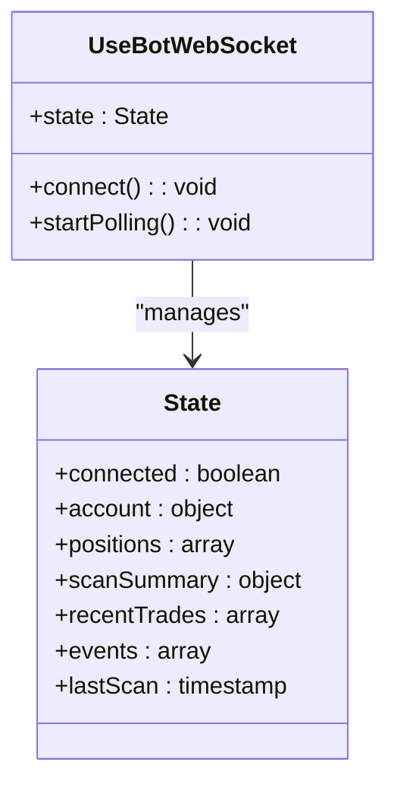
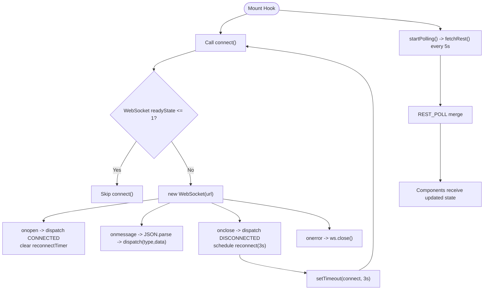
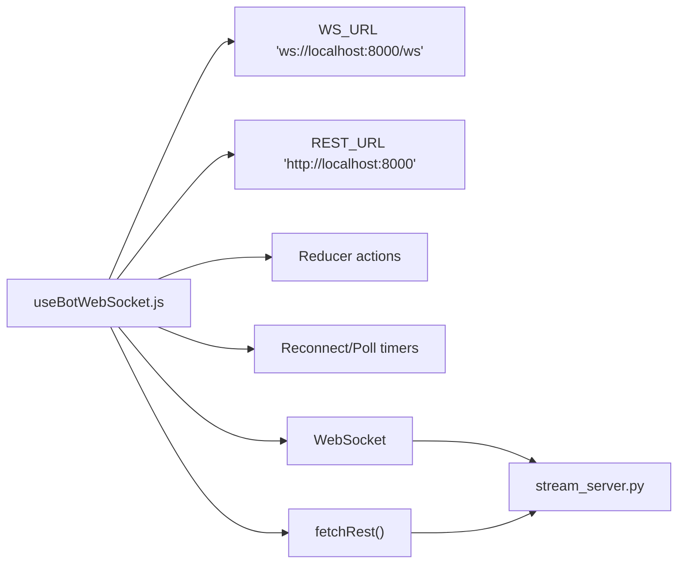

# WebSocket Client Integration

<cite>
**Referenced Files in This Document**
- [useBotWebSocket.js](file://dashboard/src/hooks/useBotWebSocket.js)
- [App.jsx](file://dashboard/src/App.jsx)
- [PositionsTable.jsx](file://dashboard/src/components/PositionsTable.jsx)
- [TradeFeed.jsx](file://dashboard/src/components/TradeFeed.jsx)
- [EventLog.jsx](file://dashboard/src/components/EventLog.jsx)
- [ScannerGrid.jsx](file://dashboard/src/components/ScannerGrid.jsx)
- [AccountCard.jsx](file://dashboard/src/components/AccountCard.jsx)
- [ForexSessionClocks.jsx](file://dashboard/src/components/ForexSessionClocks.jsx)
- [stream_server.py](file://api/stream_server.py)
- [main.jsx](file://dashboard/src/main.jsx)
- [index.css](file://dashboard/src/index.css)
- [package.json](file://dashboard/package.json)
</cite>

## Table of Contents
1. [Introduction](#introduction)
2. [Project Structure](#project-structure)
3. [Core Components](#core-components)
4. [Architecture Overview](#architecture-overview)
5. [Detailed Component Analysis](#detailed-component-analysis)
6. [Dependency Analysis](#dependency-analysis)
7. [Performance Considerations](#performance-considerations)
8. [Troubleshooting Guide](#troubleshooting-guide)
9. [Conclusion](#conclusion)
10. [Appendices](#appendices)

## Introduction
This document explains the WebSocket client integration built around the custom React hook useBotWebSocket. It covers the connection lifecycle, automatic reconnection, error recovery, state synchronization, and real-time data consumption patterns. It also documents how components integrate with the hook’s state to render live financial dashboards and how to implement graceful degradation and debugging techniques.

## Project Structure
The WebSocket integration spans the React dashboard and the FastAPI backend:
- React dashboard: a Vite app with hooks and components that subscribe to real-time updates.
- Backend: a FastAPI WebSocket server broadcasting state snapshots and event streams to connected clients.

**Diagram sources**
- [main.jsx](file://dashboard/src/main.jsx#L1-L11)
- [App.jsx](file://dashboard/src/App.jsx#L1-L104)
- [useBotWebSocket.js](file://dashboard/src/hooks/useBotWebSocket.js#L1-L156)
- [stream_server.py](file://api/stream_server.py#L1-L212)

**Section sources**
- [main.jsx](file://dashboard/src/main.jsx#L1-L11)
- [package.json](file://dashboard/package.json#L1-L24)

## Core Components
- useBotWebSocket: A custom hook that manages a WebSocket connection, periodic REST polling, and a reducer-based state machine for real-time data.
- App: The root component that consumes the hook’s state and renders the dashboard layout.
- Components: PositionsTable, TradeFeed, EventLog, ScannerGrid, AccountCard, and ForexSessionClocks consume the hook’s state to render live views.

Key responsibilities:
- Establish and maintain a WebSocket connection to the backend.
- Periodically poll REST endpoints to keep state consistent when WebSocket messages are delayed.
- Normalize and merge incoming events into a unified state model.
- Provide a stable interface for components to subscribe to live updates.

**Section sources**
- [useBotWebSocket.js](file://dashboard/src/hooks/useBotWebSocket.js#L1-L156)
- [App.jsx](file://dashboard/src/App.jsx#L1-L104)

## Architecture Overview
The system uses a hybrid real-time strategy:
- WebSocket: instant, bidirectional updates for live events and snapshots.
- REST polling: periodic fallback to refresh account, positions, and recent trades.

**Diagram sources**
- [useBotWebSocket.js](file://dashboard/src/hooks/useBotWebSocket.js#L105-L156)
- [stream_server.py](file://api/stream_server.py#L68-L141)

## Detailed Component Analysis

### useBotWebSocket Hook
The hook encapsulates:
- WebSocket lifecycle: connect, handle open/close/error, parse JSON messages, and schedule reconnection.
- REST polling: fetch account, positions, and recent trades every 5 seconds.
- State reducer: merges incoming events into a normalized state with bounded history.

State fields:
- connected: boolean indicating WebSocket connection status.
- account: latest account snapshot.
- positions: array of open positions.
- scanSummary: latest scanner summary with symbols and counts.
- recentTrades: bounded list of recent executions.
- events: bounded log of raw events.
- lastScan: timestamp of the last scan.

Message handling:
- CONNECTED/DISCONNECTED: connection status updates.
- STATE_SNAPSHOT: initial snapshot sent on connect.
- ACCOUNT_UPDATE: partial account updates merged into state.
- POSITION_UPDATE: replace positions array.
- SCAN_START/SCAN_SUMMARY: update lastScan and append to events.
- RESEARCH_START/RESEARCH_RESULT: append to events.
- TRADE_EXECUTION: prepend to recentTrades and events.

REST polling:
- fetchRest performs a Promise.all of three endpoints and dispatches REST_POLL to merge results without overwriting WebSocket events.

Reconnection:
- On close, schedules a reconnect after a fixed delay.
- On open, clears any pending reconnect timer.

Memory management:
- Events and recentTrades are capped to bounded lengths to prevent unbounded growth.

Graceful degradation:
- REST polling continues even if WebSocket is down.
- Silent failures in REST polling avoid crashing the UI.

**Section sources**
- [useBotWebSocket.js](file://dashboard/src/hooks/useBotWebSocket.js#L1-L156)

#### Hook Class Diagram

**Diagram sources**
- [useBotWebSocket.js](file://dashboard/src/hooks/useBotWebSocket.js#L7-L15)

#### Connection Lifecycle Flow

**Diagram sources**
- [useBotWebSocket.js](file://dashboard/src/hooks/useBotWebSocket.js#L105-L156)

### App Integration
App consumes the hook’s state and:
- Displays connection status and open position count.
- Renders AccountCard, ScannerGrid, PositionsTable, TradeFeed, and EventLog.
- Uses a clock to show UTC time and Forex session clocks.

Connection indicator:
- Shows “Connected” or “Reconnecting…” based on state.connected.

**Section sources**
- [App.jsx](file://dashboard/src/App.jsx#L1-L104)

### Component Integration Patterns
- PositionsTable: renders live positions with computed P&L and progress bars.
- TradeFeed: shows recent executions with directional badges and timestamps.
- EventLog: displays categorized events with icons and formatted messages.
- ScannerGrid: shows live scan results with symbol cards and status indicators.
- AccountCard: displays equity, balance, floating P&L, and drawdown percentage.
- ForexSessionClocks: shows live session status and countdowns.

Each component receives props from the hook’s state and re-renders reactively as state updates.

**Section sources**
- [PositionsTable.jsx](file://dashboard/src/components/PositionsTable.jsx#L1-L79)
- [TradeFeed.jsx](file://dashboard/src/components/TradeFeed.jsx#L1-L60)
- [EventLog.jsx](file://dashboard/src/components/EventLog.jsx#L1-L61)
- [ScannerGrid.jsx](file://dashboard/src/components/ScannerGrid.jsx#L1-L122)
- [AccountCard.jsx](file://dashboard/src/components/AccountCard.jsx#L1-L67)
- [ForexSessionClocks.jsx](file://dashboard/src/components/ForexSessionClocks.jsx#L1-L207)

### Backend Protocol and Broadcasting
The backend:
- Accepts WebSocket connections and sends a STATE_SNAPSHOT immediately upon connect.
- Broadcasts events to all active connections.
- Provides REST endpoints for account, positions, recent trades, scan summary, and full state.
- Maintains an in-memory state and enforces bounded histories for events and recent trades.

Message types:
- ACCOUNT_UPDATE, POSITION_UPDATE, SCAN_SUMMARY, TRADE_EXECUTION, SCAN_START, RESEARCH_START, RESEARCH_RESULT, STATE_SNAPSHOT, CONNECTED, DISCONNECTED.

**Section sources**
- [stream_server.py](file://api/stream_server.py#L1-L212)

## Dependency Analysis
- Frontend depends on:
  - WebSocket URL and REST endpoints defined in the hook.
  - React components that rely on the hook’s state shape.
- Backend depends on:
  - WebSocket broadcast manager and in-memory state.
  - REST endpoints returning live data from MT5.

**Diagram sources**
- [useBotWebSocket.js](file://dashboard/src/hooks/useBotWebSocket.js#L3-L156)
- [stream_server.py](file://api/stream_server.py#L1-L212)

**Section sources**
- [useBotWebSocket.js](file://dashboard/src/hooks/useBotWebSocket.js#L1-L156)
- [stream_server.py](file://api/stream_server.py#L1-L212)

## Performance Considerations
- Bounded histories:
  - Events capped to 200 items.
  - Recent trades capped to 50 items.
  - Positions replaced atomically to avoid large intermediate arrays.
- Efficient merging:
  - REST_POLL merges only provided fields to avoid overwriting WebSocket updates.
- Minimal re-renders:
  - Components should memoize derived computations (e.g., ScannerGrid sorting and status classification).
- Network efficiency:
  - WebSocket keeps-alive via receive_text loop.
  - REST polling interval tuned to 5s to balance freshness and load.
- Memory hygiene:
  - Timers cleared on unmount.
  - WebSocket closed on unmount.

[No sources needed since this section provides general guidance]

## Troubleshooting Guide
Common issues and remedies:
- WebSocket not connecting:
  - Verify backend is running and listening on the expected host/port.
  - Check browser console for network errors.
  - Confirm CORS settings allow the React origin.
- Frequent reconnections:
  - Inspect onclose/onerror handlers and reconnect timing.
  - Ensure backend does not abruptly drop connections.
- Stale data:
  - Confirm REST polling is active and endpoints return fresh data.
  - Verify reducer merges are not clobbering WebSocket updates unintentionally.
- Out-of-memory warnings:
  - Confirm bounded histories are enforced.
  - Monitor component rendering frequency and consider memoization.

Debugging techniques:
- Add logging around WebSocket open/message/close/error handlers.
- Temporarily disable REST polling to isolate WebSocket-only behavior.
- Use browser DevTools Network tab to inspect WS frames and REST responses.
- Validate backend logs for broadcast errors and dead connections.

**Section sources**
- [useBotWebSocket.js](file://dashboard/src/hooks/useBotWebSocket.js#L105-L156)
- [stream_server.py](file://api/stream_server.py#L37-L80)

## Conclusion
The useBotWebSocket hook provides a robust, resilient real-time integration for the React dashboard. By combining WebSocket broadcasts with REST polling, it ensures timely updates while gracefully degrading when connectivity is intermittent. Components consume a normalized state model, enabling clean separation of concerns and predictable rendering. With bounded histories, careful timer management, and clear error handling, the system balances responsiveness with stability.

[No sources needed since this section summarizes without analyzing specific files]

## Appendices

### Hook API Reference
- Inputs: none (no external dependencies required).
- Outputs: state object with fields:
  - connected: boolean
  - account: object
  - positions: array
  - scanSummary: object
  - recentTrades: array
  - events: array
  - lastScan: timestamp

Integration pattern:
- Import the hook in a component.
- Destructure state fields and pass them to child components.
- Rely on React re-rendering when state updates.

**Section sources**
- [useBotWebSocket.js](file://dashboard/src/hooks/useBotWebSocket.js#L105-L156)

### Real-time Data Subscription Patterns
- Subscribe to live events:
  - Use the hook’s state.events to render an event log.
  - Use state.recentTrades for a live trade feed.
- Track scanner activity:
  - Use state.scanSummary.symbols and lastScan to render the scanner grid.
- Monitor account health:
  - Use state.account for equity, balance, and floating P&L.
- Observe live positions:
  - Use state.positions to compute P&L and progress bars.

**Section sources**
- [EventLog.jsx](file://dashboard/src/components/EventLog.jsx#L1-L61)
- [TradeFeed.jsx](file://dashboard/src/components/TradeFeed.jsx#L1-L60)
- [ScannerGrid.jsx](file://dashboard/src/components/ScannerGrid.jsx#L1-L122)
- [AccountCard.jsx](file://dashboard/src/components/AccountCard.jsx#L1-L67)
- [PositionsTable.jsx](file://dashboard/src/components/PositionsTable.jsx#L1-L79)

### Graceful Degradation Strategies
- If WebSocket fails:
  - REST polling maintains near-real-time state.
  - UI remains interactive; connection status is clearly indicated.
- If REST endpoints fail:
  - Previous state remains usable; no crash occurs.
- If backend restarts:
  - WebSocket reconnects automatically.
  - Initial STATE_SNAPSHOT restores baseline state.

**Section sources**
- [useBotWebSocket.js](file://dashboard/src/hooks/useBotWebSocket.js#L87-L103)
- [App.jsx](file://dashboard/src/App.jsx#L63-L74)

### Styling and Theming Notes
- The dashboard uses a dark theme with accent colors for statuses and progress bars.
- Components rely on CSS classes and variables defined in the stylesheet.

**Section sources**
- [index.css](file://dashboard/src/index.css#L1-L191)