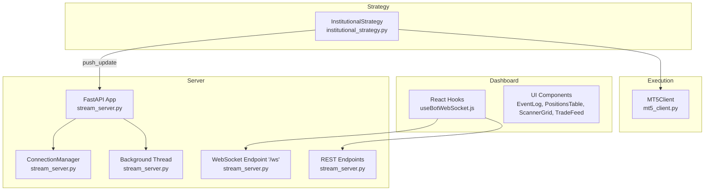
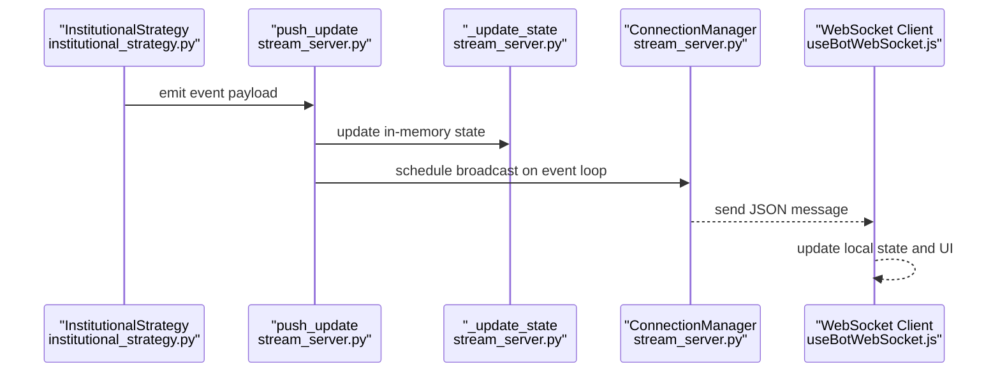
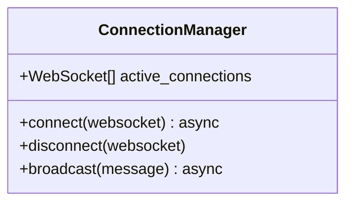
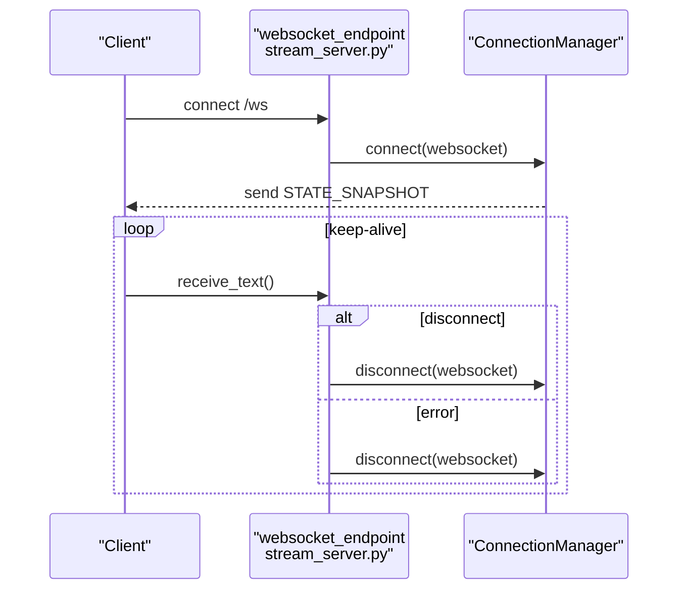
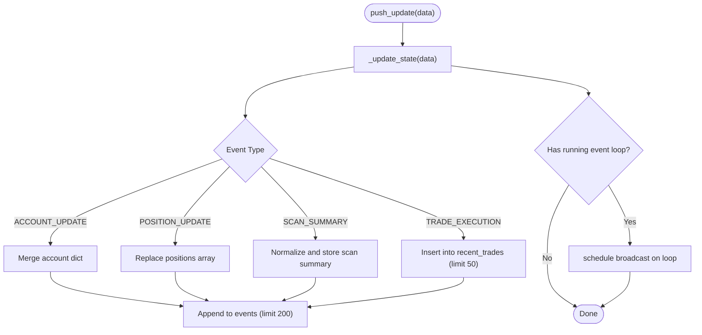
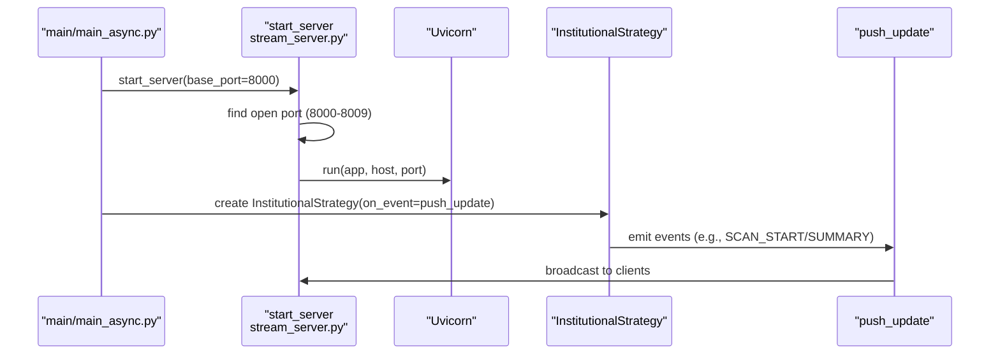
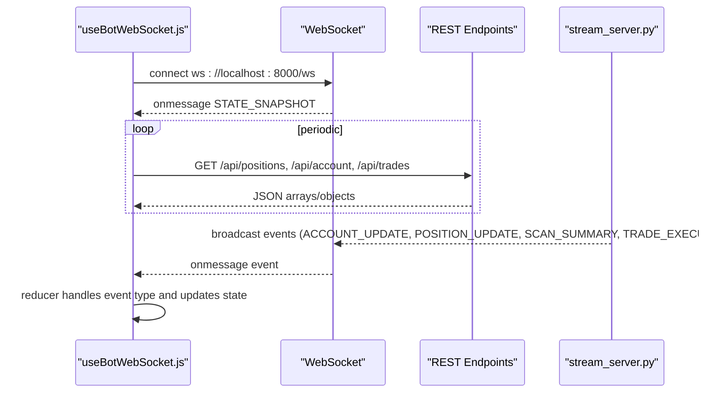
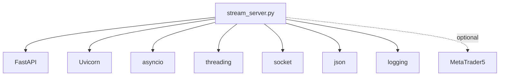

# WebSocket Server Implementation

<cite>
**Referenced Files in This Document**
- [stream_server.py](file://api/stream_server.py)
- [useBotWebSocket.js](file://dashboard/src/hooks/useBotWebSocket.js)
- [main.py](file://main.py)
- [main_async.py](file://main_async.py)
- [institutional_strategy.py](file://strategy/institutional_strategy.py)
- [mt5_client.py](file://execution/mt5_client.py)
- [settings.py](file://config/settings.py)
- [requirements.txt](file://requirements.txt)
</cite>

## Table of Contents
1. [Introduction](#introduction)
2. [Project Structure](#project-structure)
3. [Core Components](#core-components)
4. [Architecture Overview](#architecture-overview)
5. [Detailed Component Analysis](#detailed-component-analysis)
6. [Dependency Analysis](#dependency-analysis)
7. [Performance Considerations](#performance-considerations)
8. [Troubleshooting Guide](#troubleshooting-guide)
9. [Conclusion](#conclusion)
10. [Appendices](#appendices)

## Introduction
This document describes the WebSocket server implementation built with FastAPI that powers the real-time dashboard for the MT5 trading bot. It covers the ConnectionManager architecture, WebSocket endpoint handling, thread-safe state updates via push_update, in-memory state management with rolling logs, and the client-server communication patterns used by the React dashboard. It also documents startup and background thread management, port allocation, error recovery strategies, and performance optimization techniques.

## Project Structure
The WebSocket server is implemented as a FastAPI application with:
- A WebSocket endpoint for live updates
- REST endpoints for account, positions, trades, scan summary, and full state
- A background Uvicorn server launched in a separate thread
- A thread-safe push_update mechanism to update in-memory state and broadcast to clients
- A React dashboard that connects via WebSocket and polls REST endpoints periodically

**Diagram sources**
- [stream_server.py](file://api/stream_server.py#L1-L212)
- [useBotWebSocket.js](file://dashboard/src/hooks/useBotWebSocket.js#L1-L156)
- [institutional_strategy.py](file://strategy/institutional_strategy.py#L1-L200)
- [mt5_client.py](file://execution/mt5_client.py#L1-L200)

**Section sources**
- [stream_server.py](file://api/stream_server.py#L1-L212)
- [useBotWebSocket.js](file://dashboard/src/hooks/useBotWebSocket.js#L1-L156)
- [main.py](file://main.py#L1-L122)
- [main_async.py](file://main_async.py#L1-L103)

## Core Components
- FastAPI Application and Middleware: Configured with CORS for the React dev server and basic logging.
- ConnectionManager: Manages active WebSocket connections, accepts new connections, and broadcasts messages to all clients.
- WebSocket Endpoint: Handles client connections, maintains a keep-alive loop, and gracefully disconnects on errors.
- REST Endpoints: Provide live account info, positions, recent trades, scan summary, and full state snapshot.
- Background Server: Starts Uvicorn in a background thread, auto-selects an open port in the 8000–8009 range.
- push_update: Thread-safe function that updates in-memory state and schedules broadcast on the running event loop.
- In-Memory State: Maintains account info, positions, scan summary, recent trades, and rolling event logs.

**Section sources**
- [stream_server.py](file://api/stream_server.py#L1-L212)

## Architecture Overview
The system uses a publish-subscribe pattern:
- Strategy emits events via push_update
- Server updates in-memory state and broadcasts JSON messages to all connected clients
- Clients receive real-time updates and optionally poll REST endpoints for fresh data

**Diagram sources**
- [institutional_strategy.py](file://strategy/institutional_strategy.py#L185-L211)
- [stream_server.py](file://api/stream_server.py#L176-L212)
- [useBotWebSocket.js](file://dashboard/src/hooks/useBotWebSocket.js#L105-L156)

## Detailed Component Analysis

### ConnectionManager
Responsibilities:
- Track active WebSocket connections
- Accept new connections and send a STATE_SNAPSHOT
- Broadcast messages to all clients, removing dead connections

Key behaviors:
- On connect: append to active_connections and send current state snapshot
- On disconnect: remove from active_connections
- On broadcast: iterate over connections, send JSON, collect dead sockets, and remove them

**Diagram sources**
- [stream_server.py](file://api/stream_server.py#L37-L65)

**Section sources**
- [stream_server.py](file://api/stream_server.py#L37-L65)

### WebSocket Endpoint Handling
- Endpoint: GET /ws
- Accepts WebSocket connections
- Sends a STATE_SNAPSHOT immediately upon connect
- Runs a keep-alive loop receiving text frames
- Catches WebSocketDisconnect and generic exceptions to ensure cleanup

**Diagram sources**
- [stream_server.py](file://api/stream_server.py#L68-L79)

**Section sources**
- [stream_server.py](file://api/stream_server.py#L68-L79)

### REST Endpoints
- GET /: service health/status
- GET /api/account: live account info from MT5 or cached state
- GET /api/positions: live positions from MT5 or cached state
- GET /api/trades: cached recent trades
- GET /api/scan: cached scan summary
- GET /api/state: full in-memory state snapshot

Notes:
- MT5 calls are wrapped in try/catch; on failure, cached state is returned
- Positions endpoint transforms MT5 records into normalized dictionaries

**Section sources**
- [stream_server.py](file://api/stream_server.py#L81-L141)

### Thread-Safe push_update and State Updates
- push_update(data): thread-safe entry point
  - Updates in-memory state
  - Schedules manager.broadcast on the running event loop using asyncio.run_coroutine_threadsafe
- _update_state(data): updates in-memory state based on event type
  - ACCOUNT_UPDATE: merges account dict
  - POSITION_UPDATE: replaces positions array
  - SCAN_SUMMARY: normalizes and stores scan summary
  - TRADE_EXECUTION: inserts into recent_trades (rolling to 50 items)
  - All events appended to rolling events log (max 200)

**Diagram sources**
- [stream_server.py](file://api/stream_server.py#L176-L212)

**Section sources**
- [stream_server.py](file://api/stream_server.py#L176-L212)

### In-Memory State Management
Structure:
- account: dict (live or cached)
- positions: array of dicts (normalized from MT5)
- scan_summary: dict with symbols map, timestamp, and counts
- recent_trades: array of trade execution dicts (rolling to 50)
- events: array of raw event dicts (rolling to 200)

Behavior:
- Rolling windows ensure bounded memory growth
- Normalization ensures consistent client-side rendering

**Section sources**
- [stream_server.py](file://api/stream_server.py#L27-L34)
- [stream_server.py](file://api/stream_server.py#L185-L212)

### Startup Process and Background Thread Management
- startup event handler captures the running asyncio loop reference
- start_server(host, base_port):
  - Scans ports 8000–8009 to find an open port
  - Starts Uvicorn in a daemon thread
  - Prints server URL and WebSocket URL
- main/main_async initialize MT5, start AutoTrainer, and start the stream server
- Strategy passes push_update as on_event callback so it receives live events

**Diagram sources**
- [main.py](file://main.py#L66-L73)
- [main_async.py](file://main_async.py#L35-L70)
- [stream_server.py](file://api/stream_server.py#L146-L173)
- [institutional_strategy.py](file://strategy/institutional_strategy.py#L185-L194)

**Section sources**
- [main.py](file://main.py#L66-L73)
- [main_async.py](file://main_async.py#L35-L70)
- [stream_server.py](file://api/stream_server.py#L146-L173)

### Client-Server Communication Patterns
- WebSocket URL: ws://localhost:8000/ws
- Initial state: STATE_SNAPSHOT sent on connect
- Keep-alive: endpoint receives text frames indefinitely
- Client polling: REST endpoints polled every 5 seconds for positions, account, and recent trades
- Client reducers handle event types and update local state accordingly

**Diagram sources**
- [useBotWebSocket.js](file://dashboard/src/hooks/useBotWebSocket.js#L3-L156)
- [stream_server.py](file://api/stream_server.py#L68-L79)
- [stream_server.py](file://api/stream_server.py#L81-L141)

**Section sources**
- [useBotWebSocket.js](file://dashboard/src/hooks/useBotWebSocket.js#L1-L156)
- [stream_server.py](file://api/stream_server.py#L68-L79)
- [stream_server.py](file://api/stream_server.py#L81-L141)

## Dependency Analysis
External dependencies relevant to the WebSocket server:
- FastAPI and Uvicorn for the ASGI server
- Python standard libraries: asyncio, threading, socket, json, logging
- Optional MT5 client library for live data in REST endpoints

**Diagram sources**
- [stream_server.py](file://api/stream_server.py#L5-L12)
- [requirements.txt](file://requirements.txt#L1-L17)

**Section sources**
- [stream_server.py](file://api/stream_server.py#L5-L12)
- [requirements.txt](file://requirements.txt#L1-L17)

## Performance Considerations
- Broadcasting efficiency: The broadcast loop iterates over active connections and removes dead sockets in a single pass. Consider batching or rate limiting if many clients are added later.
- Rolling buffers: Events and recent trades are capped to 200 and 50 respectively, preventing unbounded memory growth.
- REST fallback: The dashboard polls REST endpoints every 5 seconds to ensure eventual consistency if WebSocket delivery is interrupted.
- Port selection: The server scans a small range (8000–8009) to avoid conflicts; this is lightweight and safe for development.
- Event loop scheduling: Using asyncio.run_coroutine_threadsafe ensures non-blocking broadcasts from background threads.

[No sources needed since this section provides general guidance]

## Troubleshooting Guide
Common issues and remedies:
- WebSocket disconnects: The endpoint catches WebSocketDisconnect and generic exceptions, ensuring cleanup. Clients automatically reconnect after a delay.
- Dead connections: The broadcast routine detects failures and removes dead sockets from active_connections.
- REST failures: REST endpoints wrap MT5 calls in try/catch and fall back to cached state if MT5 is unavailable.
- Port conflicts: If ports 8000–8009 are busy, the server selects the first available port in that range.
- CORS issues: The server allows all origins for development; adjust origins in production deployments.

**Section sources**
- [stream_server.py](file://api/stream_server.py#L75-L78)
- [stream_server.py](file://api/stream_server.py#L51-L62)
- [stream_server.py](file://api/stream_server.py#L89-L103)
- [stream_server.py](file://api/stream_server.py#L157-L164)

## Conclusion
The WebSocket server provides a robust, real-time bridge between the trading strategy and the React dashboard. Its thread-safe push_update mechanism, efficient ConnectionManager, and bounded in-memory state ensure responsive updates with minimal overhead. The combination of WebSocket streaming and REST polling delivers resilience and a smooth user experience.

[No sources needed since this section summarizes without analyzing specific files]

## Appendices

### Example Message Formats and Event Types
- STATE_SNAPSHOT: Initial snapshot containing account, positions, scan_summary, recent_trades, and events
- ACCOUNT_UPDATE: Merges account fields into the cached state
- POSITION_UPDATE: Replaces positions array
- SCAN_SUMMARY: Normalized with symbols map, timestamp, and counts
- TRADE_EXECUTION: Includes trade details; inserted at the head of recent_trades (rolling window)
- Additional events: Appended to the rolling events log (e.g., SCAN_START, RESEARCH_START/RESULT)

**Section sources**
- [stream_server.py](file://api/stream_server.py#L44-L45)
- [stream_server.py](file://api/stream_server.py#L194-L211)
- [useBotWebSocket.js](file://dashboard/src/hooks/useBotWebSocket.js#L24-L84)