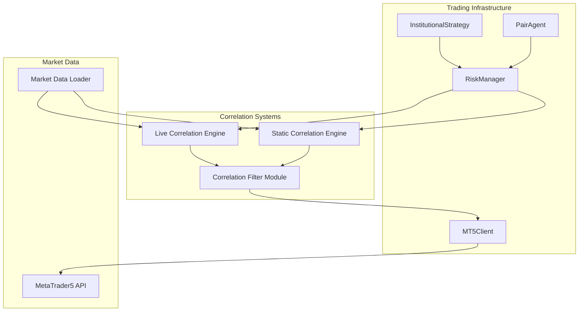
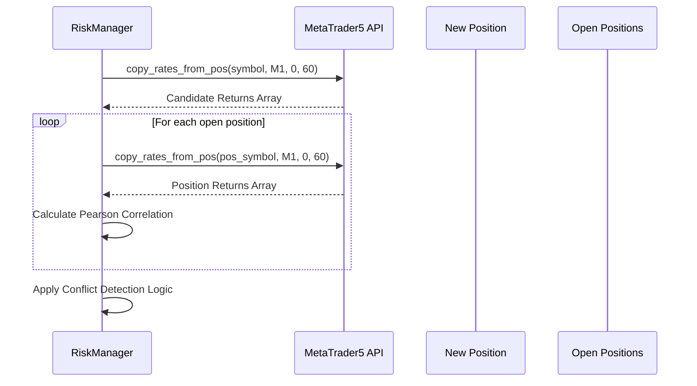
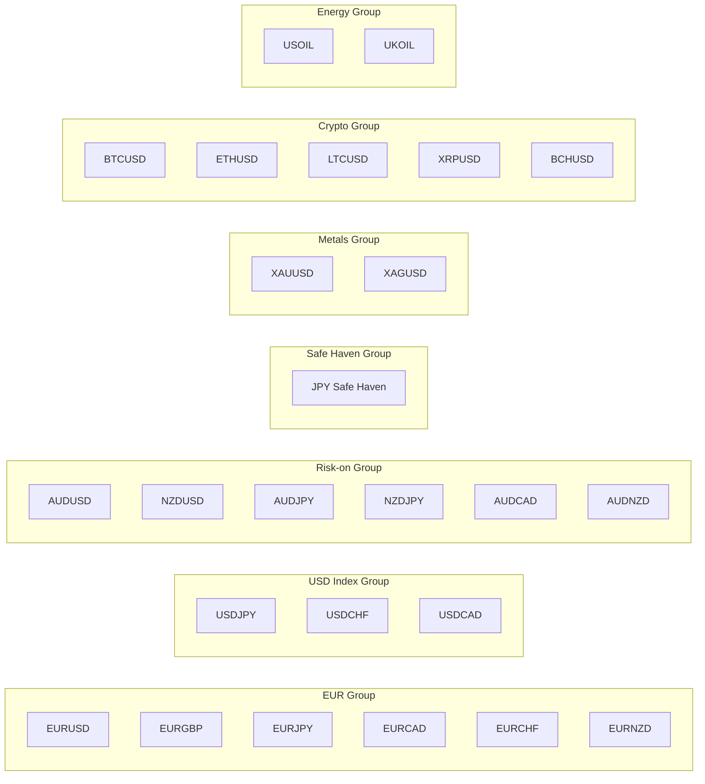
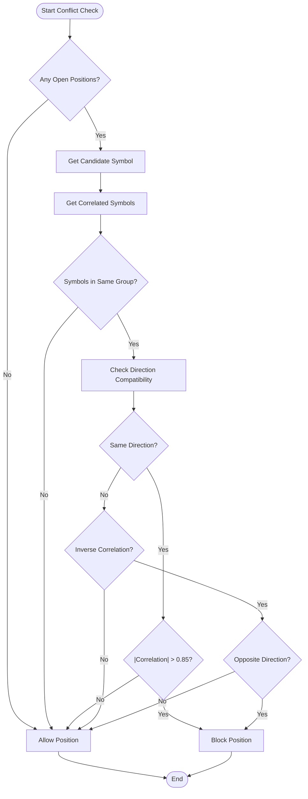
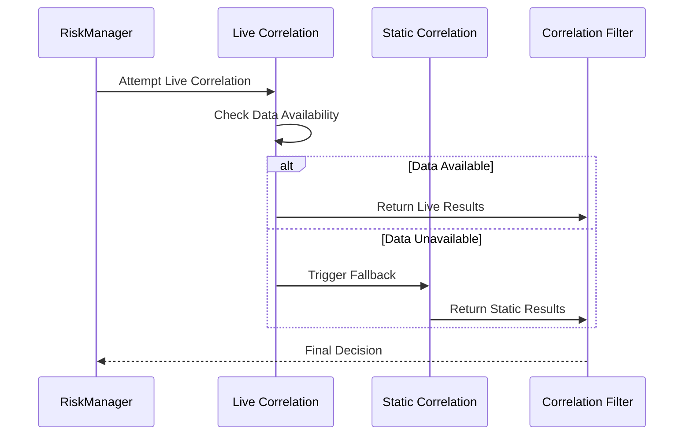

# Correlation Filtering System

<cite>
**Referenced Files in This Document**
- [correlation_filter.py](file://utils/correlation_filter.py)
- [risk_manager.py](file://utils/risk_manager.py)
- [institutional_strategy.py](file://strategy/institutional_strategy.py)
- [settings.py](file://config/settings.py)
- [loader.py](file://market_data/loader.py)
- [mt5_client.py](file://execution/mt5_client.py)
</cite>

## Table of Contents
1. [Introduction](#introduction)
2. [System Architecture](#system-architecture)
3. [Core Components](#core-components)
4. [Live Correlation Checking Mechanism](#live-correlation-checking-mechanism)
5. [Static Correlation Groups](#static-correlation-groups)
6. [Conflict Detection Logic](#conflict-detection-logic)
7. [Fallback Mechanisms](#fallback-mechanisms)
8. [Configuration and Thresholds](#configuration-and-thresholds)
9. [Performance Analysis](#performance-analysis)
10. [Examples and Use Cases](#examples-and-use-cases)
11. [Troubleshooting Guide](#troubleshooting-guide)
12. [Conclusion](#conclusion)

## Introduction

The correlation filtering system is a sophisticated risk management mechanism designed to prevent excessive correlation exposure in automated trading systems. This system operates on two complementary approaches: live correlation analysis using real-time market data and static correlation grouping based on predefined symbol relationships.

The system prevents traders from opening positions on highly correlated instruments in the same direction, thereby reducing portfolio concentration risk and potential correlated losses. It implements a dual-layer approach where live correlation coefficients are calculated from recent market returns, with intelligent fallback to static correlation groups when real-time data is unavailable.

## System Architecture

The correlation filtering system integrates seamlessly with the broader trading infrastructure through a well-defined architecture:



**Diagram sources**
- [institutional_strategy.py](file://strategy/institutional_strategy.py#L170-L176)
- [risk_manager.py](file://utils/risk_manager.py#L247-L250)
- [correlation_filter.py](file://utils/correlation_filter.py#L77-L116)

The architecture ensures that correlation checks are performed at the optimal integration point within the risk management layer, providing comprehensive protection against correlated trading exposures.

## Core Components

### Live Correlation Engine

The live correlation engine performs real-time correlation analysis using 60-bar M1 returns to calculate Pearson correlation coefficients between candidate symbols and existing open positions.

### Static Correlation Engine

The static correlation engine utilizes predefined correlation groups that categorize symbols based on their historical correlation characteristics and relationship types.

### Integration Layer

The RiskManager serves as the central coordinator, orchestrating both correlation checking mechanisms and providing fallback logic when live data is unavailable.

**Section sources**
- [risk_manager.py](file://utils/risk_manager.py#L303-L339)
- [correlation_filter.py](file://utils/correlation_filter.py#L16-L45)

## Live Correlation Checking Mechanism

The live correlation checking mechanism represents the most sophisticated aspect of the system, utilizing real-time market data to make informed correlation decisions.

### Data Collection Process

The system collects 60 consecutive bars of M1 data for both the candidate symbol and each existing position:



**Diagram sources**
- [risk_manager.py](file://utils/risk_manager.py#L311-L328)

### Pearson Correlation Coefficient Calculation

The system calculates the Pearson correlation coefficient using the returns from the last 60 bars:

- **Time Window**: 60 consecutive M1 bars
- **Calculation Method**: Pearson correlation coefficient between return series
- **Threshold**: 0.85 absolute correlation threshold
- **Confidence Level**: Statistical significance determined by overlapping data points

### Return Series Generation

The system generates return series from closing prices using the natural logarithm difference method:

```
return_t = ln(close_t) - ln(close_{t-1})
```

This approach provides several advantages:
- Stationarity in return series
- Symmetric treatment of gains and losses
- Mathematical properties suitable for correlation analysis

**Section sources**
- [risk_manager.py](file://utils/risk_manager.py#L311-L328)

## Static Correlation Groups

When live correlation data is unavailable or insufficient, the system falls back to predefined static correlation groups. These groups categorize symbols based on their historical correlation characteristics and relationship types.

### Major Correlation Groups

The system maintains seven primary correlation groups:



**Diagram sources**
- [correlation_filter.py](file://utils/correlation_filter.py#L16-L45)

### Inverse Relationship Handling

Some correlation groups include inverse relationships that require special handling:

- **Inverse Correlations**: USDCHF/USDCAD vs EURUSD (hedging relationships)
- **Safe Haven Effects**: JPY-denominated instruments during market stress
- **Commodity Correlations**: Energy products with risk-on currencies

**Section sources**
- [correlation_filter.py](file://utils/correlation_filter.py#L18-L35)

## Conflict Detection Logic

The conflict detection system implements sophisticated logic to determine when trading conflicts exist between new positions and existing open positions.

### Same-Direction Exposure Protection

The system prevents opening positions in the same direction as existing correlated positions:

```
If |Correlation| > 0.85 AND Direction Conflicts:
    Block New Position
```

### Opposite-Direction Protection

For inversely correlated positions, the system blocks positions in the opposite direction:

```
If Correlation < 0 AND Directions Oppose:
    Block New Position
```

### Implementation Details

The conflict detection algorithm considers multiple factors:



**Diagram sources**
- [correlation_filter.py](file://utils/correlation_filter.py#L77-L116)

**Section sources**
- [correlation_filter.py](file://utils/correlation_filter.py#L77-L116)

## Fallback Mechanisms

The system implements intelligent fallback mechanisms to ensure continuous operation even when live correlation data is unavailable.

### Live Data Unavailability Fallback

When live correlation data fails or is insufficient, the system automatically falls back to static correlation analysis:



**Diagram sources**
- [risk_manager.py](file://utils/risk_manager.py#L314-L315)

### Fallback Conditions

The fallback mechanism activates under the following conditions:

- **Insufficient Data**: Less than 10 bars available for correlation calculation
- **API Failure**: MT5 API returns null or error responses
- **Calculation Errors**: Numerical instability or mathematical errors
- **Timeout Issues**: Excessive processing time for correlation calculations

### Static Analysis Behavior

During fallback, the system uses predefined correlation group membership rather than real-time correlation coefficients:

- **Group Membership**: Determined by predefined symbol lists
- **Direction Handling**: Uses inverse correlation flags for proper conflict detection
- **Performance**: Minimal computational overhead compared to live calculations

**Section sources**
- [risk_manager.py](file://utils/risk_manager.py#L314-L315)

## Configuration and Thresholds

The correlation filtering system operates with carefully tuned thresholds and configuration parameters designed to balance risk mitigation with trading opportunities.

### Primary Threshold Configuration

| Parameter | Value | Purpose |
|-----------|--------|---------|
| Correlation Threshold | 0.85 | Maximum acceptable correlation for same-direction exposure |
| Time Window | 60 bars | Duration of correlation analysis period |
| Minimum Bars | 10 | Minimum data points for reliable correlation |
| Overlap Requirement | 5 bars | Minimum overlapping data for correlation |

### Symbol Suffix Handling

The system includes intelligent symbol suffix handling for Exness accounts:

- **Suffix Detection**: Automatic detection of 'm' (Standard) and 'c' (Cent) suffixes
- **Base Symbol Extraction**: Removal of suffixes for proper correlation matching
- **Compatibility**: Ensures correlation analysis works across different account types

### Configuration Examples

The correlation system integrates with broader risk management settings:

```python
# Example configuration parameters
CORRELATION_THRESHOLD = 0.85
CORRELATION_WINDOW = 60
MIN_DATA_POINTS = 10
OVERLAP_THRESHOLD = 5
```

**Section sources**
- [risk_manager.py](file://utils/risk_manager.py#L311-L328)
- [correlation_filter.py](file://utils/correlation_filter.py#L48-L56)

## Performance Analysis

The correlation filtering system is designed for minimal performance impact while providing robust risk protection.

### Computational Complexity

**Live Correlation Analysis**:
- **Time Complexity**: O(n) where n is the number of bars (typically 60)
- **Space Complexity**: O(n) for storing return series
- **Processing Time**: Typically < 10ms per symbol pair comparison

**Static Correlation Analysis**:
- **Time Complexity**: O(g) where g is the number of correlation groups
- **Space Complexity**: O(s) where s is the total number of symbols in groups
- **Processing Time**: Nearly instantaneous (< 1ms)

### Memory Usage

The system maintains minimal memory footprint:
- **Live Data**: Temporary storage of 60 bars per symbol being analyzed
- **Static Data**: Predefined correlation group dictionaries
- **Cache**: No persistent caching to avoid stale correlation data

### Optimization Strategies

Several optimization techniques reduce computational overhead:

1. **Early Termination**: Stop analysis when sufficient correlation evidence is found
2. **Data Validation**: Quick rejection of insufficient data samples
3. **Parallel Processing**: Concurrent analysis of multiple symbol pairs
4. **Minimal Dependencies**: Limited external library requirements

## Examples and Use Cases

### Example 1: EURUSD and EURGBP Correlation

Consider a trader who holds an existing EURUSD long position and wants to open EURGBP:

```
Existing Position: EURUSD BUY
Candidate Position: EURGBP BUY
Correlation: 0.87 (High Positive)
Decision: BLOCK (Same Direction, High Correlation)
```

This prevents doubling down on the same directional exposure within the EUR group.

### Example 2: EURUSD and USDCHF Inverse Correlation

```
Existing Position: EURUSD BUY  
Candidate Position: USDCHF BUY
Correlation: -0.65 (Negative)
Decision: ALLOW (Opposite Direction, Hedge Purpose)
```

This allows proper hedging relationships between correlated instruments.

### Example 3: Crypto Portfolio Management

```
Existing Position: BTCUSD BUY
Candidate Position: ETHUSD BUY  
Correlation: 0.92 (Extremely High)
Decision: BLOCK (Same Direction, Extremely High Correlation)
```

Prevents excessive exposure to correlated cryptocurrency assets.

### Example 4: Safe Haven Rotation

```
Existing Position: EURUSD BUY
Candidate Position: USDJPY BUY
Correlation: -0.45 (Moderate Negative)
Decision: ALLOW (Opposite Direction, Safe Haven Effect)
```

Allows appropriate safe haven positioning during market stress.

## Troubleshooting Guide

### Common Issues and Solutions

**Issue**: Live correlation calculations failing frequently
- **Cause**: Insufficient market data availability
- **Solution**: Verify MT5 connectivity and symbol availability
- **Prevention**: Implement proper fallback to static correlation analysis

**Issue**: False positives in correlation blocking
- **Cause**: Short-term correlation spikes during news events
- **Solution**: Adjust correlation threshold or implement volatility filters
- **Monitoring**: Track correlation stability during volatile periods

**Issue**: Performance degradation during correlation analysis
- **Cause**: Large number of concurrent symbols being analyzed
- **Solution**: Optimize symbol selection or implement batch processing
- **Scaling**: Consider symbol clustering for large universes

### Debugging Techniques

**Enable Debug Logging**: Monitor correlation calculation results and fallback triggers
**Data Validation**: Verify return series generation and correlation coefficient calculations
**Performance Metrics**: Track processing time and memory usage for correlation analysis

**Section sources**
- [risk_manager.py](file://utils/risk_manager.py#L336-L338)

## Conclusion

The correlation filtering system represents a sophisticated approach to managing correlated trading risks in automated trading environments. By combining live correlation analysis with intelligent fallback mechanisms, the system provides robust protection against excessive correlation exposure while maintaining operational flexibility.

The dual-layer architecture ensures continuous operation even under adverse market conditions, while the carefully tuned thresholds balance risk mitigation with trading opportunity preservation. The system's integration with the broader trading infrastructure demonstrates thoughtful engineering that prioritizes both safety and performance.

Key strengths of the system include:
- **Dual-Mode Operation**: Live correlation with static fallback
- **Intelligent Thresholds**: Carefully calibrated correlation limits
- **Performance Optimization**: Minimal computational overhead
- **Comprehensive Coverage**: Multi-asset class support
- **Robust Fallback**: Graceful degradation under adverse conditions

This system serves as an excellent foundation for institutional trading operations requiring sophisticated risk management capabilities while maintaining the flexibility to adapt to evolving market conditions and trading requirements.