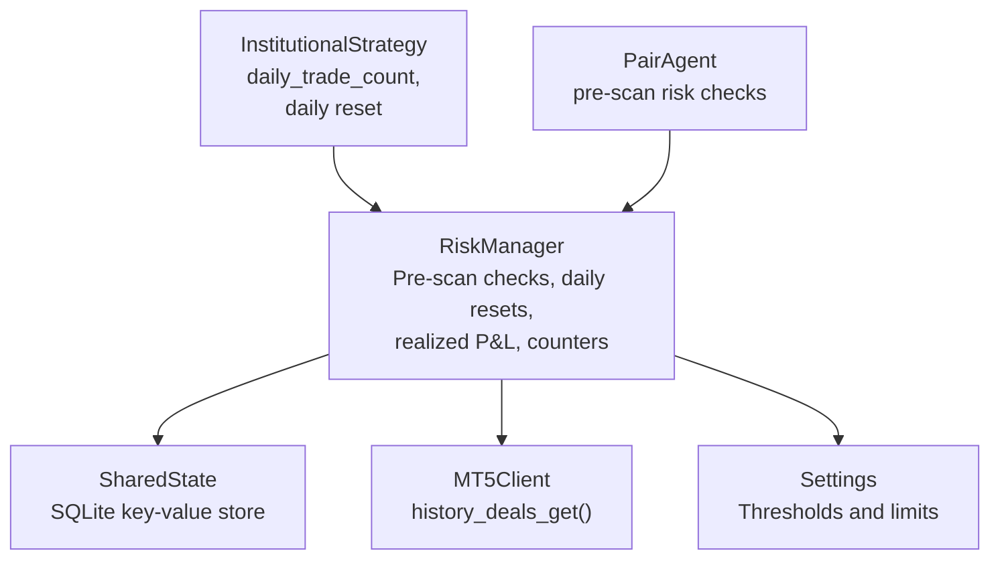
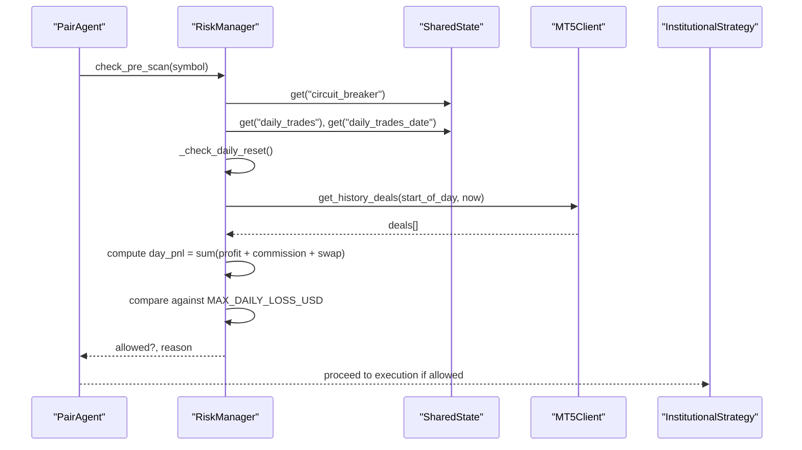
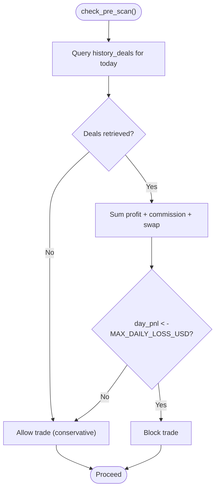
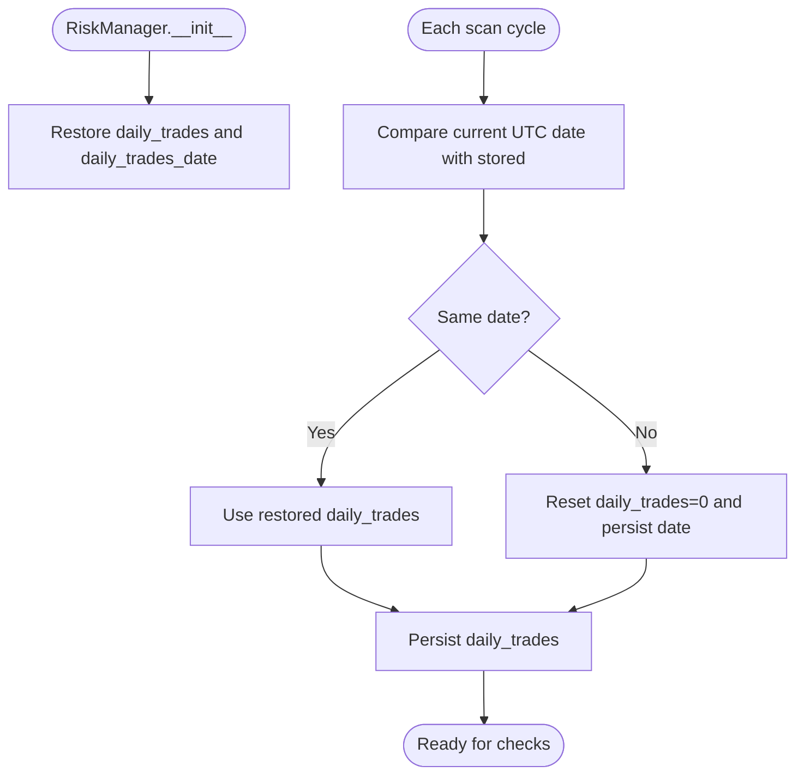
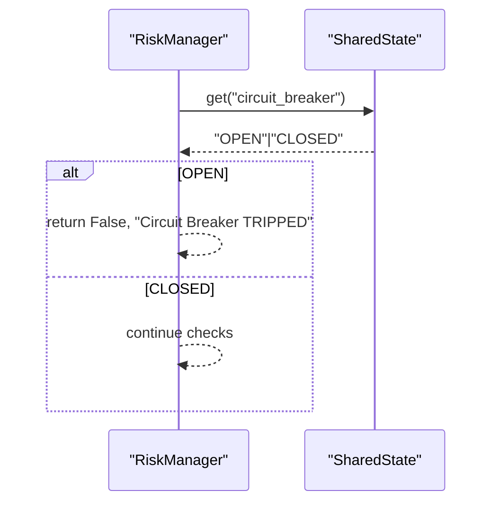
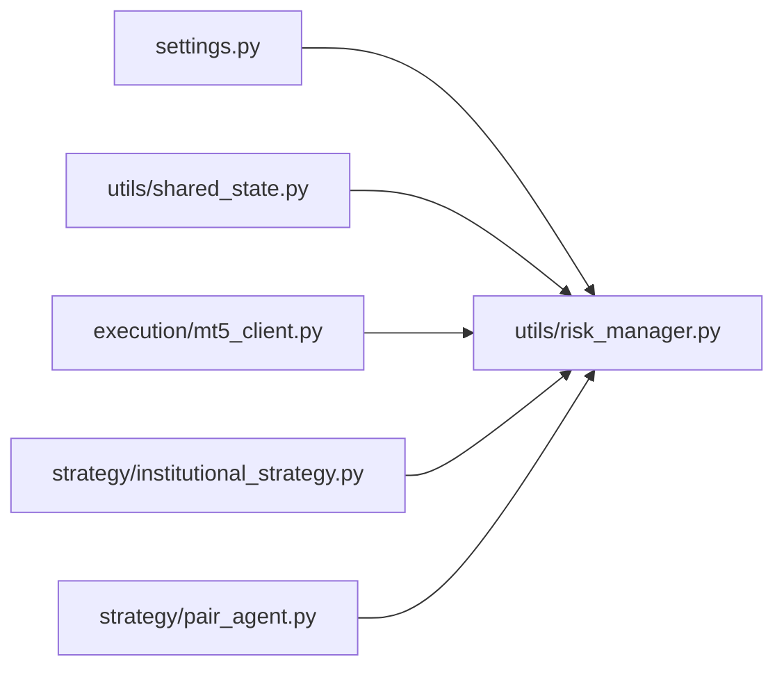

# Daily Loss Controls

<cite>
**Referenced Files in This Document**
- [risk_manager.py](file://utils/risk_manager.py)
- [shared_state.py](file://utils/shared_state.py)
- [settings.py](file://config/settings.py)
- [mt5_client.py](file://execution/mt5_client.py)
- [institutional_strategy.py](file://strategy/institutional_strategy.py)
- [pair_agent.py](file://strategy/pair_agent.py)
- [debug_shared_memory.py](file://debug_shared_memory.py)
</cite>

## Table of Contents
1. [Introduction](#introduction)
2. [Project Structure](#project-structure)
3. [Core Components](#core-components)
4. [Architecture Overview](#architecture-overview)
5. [Detailed Component Analysis](#detailed-component-analysis)
6. [Dependency Analysis](#dependency-analysis)
7. [Performance Considerations](#performance-considerations)
8. [Troubleshooting Guide](#troubleshooting-guide)
9. [Conclusion](#conclusion)

## Introduction
This document explains the daily loss control mechanisms implemented in the system, focusing on:
- MAX_DAILY_LOSS_USD enforcement via realized P&L queries
- UTC-based daily reset for daily trade counting
- History deals query for realized P&L calculation
- Commission and swap inclusion in daily loss tracking
- MAX_DAILY_TRADES limitation and automatic reset
- Circuit breaker system for emergency shutdown
- Shared state persistence for cross-process continuity
- Examples of daily loss scenarios, circuit breaker activation, and the relationship between realized P&L and trading permissions
- Exception handling for MT5 API failures with a conservative allowance for trades when P&L queries fail

## Project Structure
The daily loss controls span several modules:
- Risk management orchestrates pre-scan checks, daily resets, and P&L enforcement
- Shared state persists counters and emergency flags across restarts
- Settings define thresholds and limits
- MT5 client provides historical deals for realized P&L computation
- Strategy and agents integrate checks into scanning and execution

**Diagram sources**
- [risk_manager.py](file://utils/risk_manager.py#L14-L549)
- [shared_state.py](file://utils/shared_state.py#L23-L110)
- [settings.py](file://config/settings.py#L92-L102)
- [mt5_client.py](file://execution/mt5_client.py#L137-L142)
- [institutional_strategy.py](file://strategy/institutional_strategy.py#L462-L468)
- [pair_agent.py](file://strategy/pair_agent.py#L71-L105)

**Section sources**
- [risk_manager.py](file://utils/risk_manager.py#L14-L549)
- [shared_state.py](file://utils/shared_state.py#L23-L110)
- [settings.py](file://config/settings.py#L92-L102)
- [mt5_client.py](file://execution/mt5_client.py#L137-L142)
- [institutional_strategy.py](file://strategy/institutional_strategy.py#L462-L468)
- [pair_agent.py](file://strategy/pair_agent.py#L71-L105)

## Core Components
- RiskManager: Central pre-trade risk checks, daily trade counter, daily reset logic, realized P&L enforcement, kill switch, payoff mandate, and optional stats refresh
- SharedState: Persistent key-value store for counters and emergency flags
- Settings: Defines MAX_DAILY_LOSS_USD, MAX_DAILY_TRADES, and related thresholds
- MT5Client: Provides history_deals_get for realized P&L computation
- InstitutionalStrategy: Maintains a separate daily trade counter synchronized with RiskManager’s persisted counter
- PairAgent: Executes pre-scan risk checks before scanning for candidates

**Section sources**
- [risk_manager.py](file://utils/risk_manager.py#L14-L549)
- [shared_state.py](file://utils/shared_state.py#L23-L110)
- [settings.py](file://config/settings.py#L92-L102)
- [mt5_client.py](file://execution/mt5_client.py#L137-L142)
- [institutional_strategy.py](file://strategy/institutional_strategy.py#L462-L468)
- [pair_agent.py](file://strategy/pair_agent.py#L71-L105)

## Architecture Overview
The daily loss control pipeline integrates pre-scan checks, UTC-based resets, and realized P&L enforcement. It also supports a circuit breaker and shared state persistence.

**Diagram sources**
- [pair_agent.py](file://strategy/pair_agent.py#L90-L92)
- [risk_manager.py](file://utils/risk_manager.py#L56-L106)
- [shared_state.py](file://utils/shared_state.py#L61-L75)
- [mt5_client.py](file://execution/mt5_client.py#L137-L142)
- [settings.py](file://config/settings.py#L96-L97)

## Detailed Component Analysis

### Daily Loss Enforcement (MAX_DAILY_LOSS_USD)
- Realized P&L calculation: The system queries MT5 history deals for the current UTC day and sums profit, commission, and swap for each deal.
- Threshold comparison: If realized P&L is worse than -MAX_DAILY_LOSS_USD, trading is blocked for the remainder of the day.
- Conservative behavior: On MT5 API failure, the system logs and continues to allow trading rather than blocking.

**Diagram sources**
- [risk_manager.py](file://utils/risk_manager.py#L86-L105)
- [mt5_client.py](file://execution/mt5_client.py#L137-L142)
- [settings.py](file://config/settings.py#L96-L97)

**Section sources**
- [risk_manager.py](file://utils/risk_manager.py#L86-L105)
- [mt5_client.py](file://execution/mt5_client.py#L137-L142)
- [settings.py](file://config/settings.py#L96-L97)

### UTC-Based Daily Reset and Daily Trade Counter
- Two counters exist:
  - RiskManager’s in-memory daily_trades with persistence via SharedState keys "daily_trades" and "daily_trades_date"
  - InstitutionalStrategy’s daily_trade_count synchronized to the same persisted state
- Reset logic:
  - On initialization, RiskManager restores the persisted daily_trades and date
  - Each cycle, RiskManager checks if the UTC date changed and resets counters accordingly
  - InstitutionalStrategy mirrors this reset behavior
- Automatic reset occurs at the start of each new UTC day

**Diagram sources**
- [risk_manager.py](file://utils/risk_manager.py#L19-L50)
- [shared_state.py](file://utils/shared_state.py#L42-L59)
- [institutional_strategy.py](file://strategy/institutional_strategy.py#L462-L468)

**Section sources**
- [risk_manager.py](file://utils/risk_manager.py#L19-L50)
- [shared_state.py](file://utils/shared_state.py#L42-L59)
- [institutional_strategy.py](file://strategy/institutional_strategy.py#L462-L468)

### MAX_DAILY_TRADES Limitation
- Both RiskManager and InstitutionalStrategy enforce MAX_DAILY_TRADES:
  - RiskManager increments and persists daily_trades after a successful trade
  - InstitutionalStrategy enforces its own daily_trade_count synchronized with RiskManager’s persisted counter
- When either reaches the limit, further trades are blocked until the next UTC day

**Section sources**
- [risk_manager.py](file://utils/risk_manager.py#L297-L301)
- [institutional_strategy.py](file://strategy/institutional_strategy.py#L462-L468)
- [settings.py](file://config/settings.py#L96-L97)

### Circuit Breaker System
- Emergency shutdown mechanism controlled via SharedState key "circuit_breaker"
- RiskManager reads this flag before any pre-scan and blocks trading immediately if OPEN
- The debug harness demonstrates setting and reading the circuit breaker across process restarts

**Diagram sources**
- [risk_manager.py](file://utils/risk_manager.py#L56-L59)
- [shared_state.py](file://utils/shared_state.py#L61-L75)
- [debug_shared_memory.py](file://debug_shared_memory.py#L13-L27)

**Section sources**
- [risk_manager.py](file://utils/risk_manager.py#L56-L59)
- [shared_state.py](file://utils/shared_state.py#L61-L75)
- [debug_shared_memory.py](file://debug_shared_memory.py#L13-L27)

### Shared State Persistence Mechanism
- SharedState provides a SQLite-backed key-value store with JSON serialization and timestamps
- Keys used by daily loss controls:
  - "daily_trades": integer count
  - "daily_trades_date": ISO date string
  - "circuit_breaker": "OPEN"|"CLOSED"
- The debug harness validates persistence across restarts

**Section sources**
- [shared_state.py](file://utils/shared_state.py#L23-L110)
- [debug_shared_memory.py](file://debug_shared_memory.py#L8-L50)

### Commission and Swap Inclusion in Daily Loss Tracking
- Realized P&L includes profit, commission, and swap from each deal returned by MT5 history_deals_get
- This ensures that costs are factored into the daily loss calculation

**Section sources**
- [risk_manager.py](file://utils/risk_manager.py#L96-L98)
- [mt5_client.py](file://execution/mt5_client.py#L137-L142)

### Relationship Between Realized P&L and Trading Permissions
- If realized P&L for the day falls below -MAX_DAILY_LOSS_USD, trading is blocked for the rest of the day
- This acts as a hard stop to prevent further drawdown beyond the configured threshold

**Section sources**
- [risk_manager.py](file://utils/risk_manager.py#L96-L105)
- [settings.py](file://config/settings.py#L96-L97)

### Exception Handling for MT5 API Failures
- The realized P&L query is wrapped in a try-except
- On failure, the system logs and proceeds without blocking trades (conservative approach)
- This prevents operational halts due to transient MT5 connectivity issues

**Section sources**
- [risk_manager.py](file://utils/risk_manager.py#L103-L105)

## Dependency Analysis
- RiskManager depends on SharedState for persistence and MT5Client for realized P&L queries
- InstitutionalStrategy coordinates daily trade counts with RiskManager’s persisted state
- PairAgent invokes RiskManager’s pre-scan checks before candidate generation

**Diagram sources**
- [settings.py](file://config/settings.py#L92-L102)
- [risk_manager.py](file://utils/risk_manager.py#L14-L549)
- [shared_state.py](file://utils/shared_state.py#L23-L110)
- [mt5_client.py](file://execution/mt5_client.py#L137-L142)
- [institutional_strategy.py](file://strategy/institutional_strategy.py#L462-L468)
- [pair_agent.py](file://strategy/pair_agent.py#L71-L105)

**Section sources**
- [settings.py](file://config/settings.py#L92-L102)
- [risk_manager.py](file://utils/risk_manager.py#L14-L549)
- [shared_state.py](file://utils/shared_state.py#L23-L110)
- [mt5_client.py](file://execution/mt5_client.py#L137-L142)
- [institutional_strategy.py](file://strategy/institutional_strategy.py#L462-L468)
- [pair_agent.py](file://strategy/pair_agent.py#L71-L105)

## Performance Considerations
- Realized P&L queries use a single-day time window to minimize API overhead
- Stats refresh is throttled via last_update timestamps to avoid frequent MT5 calls
- SharedState operations are lightweight and scoped to essential keys

## Troubleshooting Guide
- Circuit breaker not resetting:
  - Verify "circuit_breaker" is set to "CLOSED" in SharedState
  - Confirm RiskManager reads the key before pre-scan checks
- Daily trades not resetting:
  - Ensure UTC date transitions occur and "daily_trades_date" is updated
  - Confirm SharedState persistence is intact
- Realized P&L blocking trades unexpectedly:
  - Check that history_deals_get returns deals for the current day
  - Validate that commission and swap are included in the sum
  - Confirm MAX_DAILY_LOSS_USD is set appropriately

**Section sources**
- [risk_manager.py](file://utils/risk_manager.py#L56-L105)
- [shared_state.py](file://utils/shared_state.py#L42-L59)
- [settings.py](file://config/settings.py#L96-L97)

## Conclusion
The system enforces robust daily loss controls through:
- UTC-based daily resets for both realized P&L and trade counts
- Realized P&L calculations that include commission and swap
- MAX_DAILY_LOSS_USD and MAX_DAILY_TRADES safeguards
- A circuit breaker for emergency shutdown
- Shared state persistence ensuring continuity across restarts
- Conservative exception handling that allows trading when P&L queries fail