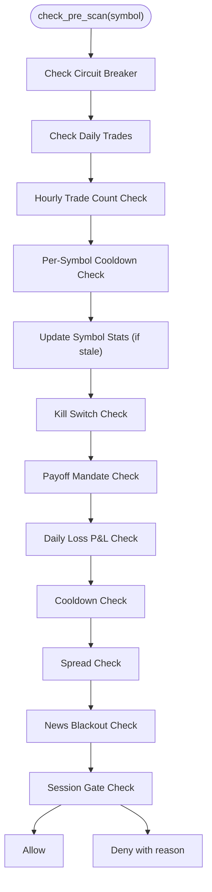

# Enhanced Hourly Trade Counting Mechanism

## Overview
The Enhanced Hourly Trade Counting Mechanism implements hourly trade counting to limit commission costs by restricting the number of trades per hour. This feature helps prevent excessive trading frequency that could erode profits through commission costs.

## Implementation Details

### Core Logic
- **Purpose**: Implements hourly trade counting to limit commission costs by restricting the number of trades per hour
- **Implementation**: Queries MT5 history for deals within the last hour and counts unique entry deals
- **Configuration**: Controlled by `MAX_TRADES_PER_HOUR` setting with default value of 8 trades per hour
- **Location**: Implemented in [risk_manager.py](file://utils/risk_manager.py) in the `_count_trades_last_hour` method

### Technical Implementation
The hourly limit check occurs in the `check_pre_scan` method of the RiskManager:

```python
# 1b. Hourly Trade Limit (to reduce commission costs)
trades_last_hour = self._count_trades_last_hour()
max_trades_per_hour = getattr(settings, 'MAX_TRADES_PER_HOUR', 8)
if trades_last_hour >= max_trads_per_hour:
    return False, f"Hourly Limit ({trades_last_hour}/{max_trades_per_hour})"
```

The `_count_trades_last_hour` method:
- Gets deals from MT5 history within the last hour
- Counts unique entry deals (not exits)
- Returns the count of trades executed in the last hour

### Configuration
- **Setting**: `MAX_TRADES_PER_HOUR` in [config/settings.py](file://config/settings.py)
- **Default Value**: 8 trades per hour
- **Environment Variable**: `MAX_TRADES_PER_HOUR` (can be overridden in `.env` file)
- **Fallback Value**: 8 (used if setting is not defined)

## Flow Diagram


## Benefits
- **Commission Cost Control**: Prevents excessive trading that could erode profits through commission fees
- **Trading Frequency Management**: Maintains reasonable trading cadence
- **Configurable Limits**: Allows adjustment based on account size and strategy requirements
- **Safe Access**: Uses `getattr` with fallback to prevent configuration errors

## Troubleshooting

### Hourly Limit Reached Error
If you encounter the error `Risk Block: Hourly Limit (X/X): N symbols`, you have several options:

1. **Wait for Natural Reset**: The counter resets automatically as trades fall outside the 1-hour window
2. **Increase the Limit**: Edit your `.env` file to increase `MAX_TRADES_PER_HOUR` to a higher value
3. **Temporary Override**: Adjust the setting in [config/settings.py](file://config/settings.py) directly

### Adjusting the Limit
To modify the hourly trade limit:
1. Edit `.env` file: `MAX_TRADES_PER_HOUR=10` (or desired value)
2. Restart the bot for changes to take effect

## Integration Points
- **Risk Manager**: Integrated into the pre-scan validation flow
- **MT5 Client**: Uses MT5 history to count actual trades
- **Settings**: Configurable via environment variables
- **Shared State**: Part of the broader risk management ecosystem