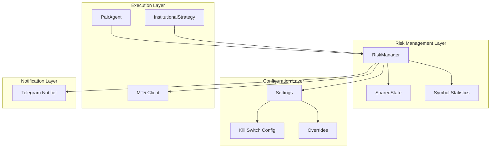
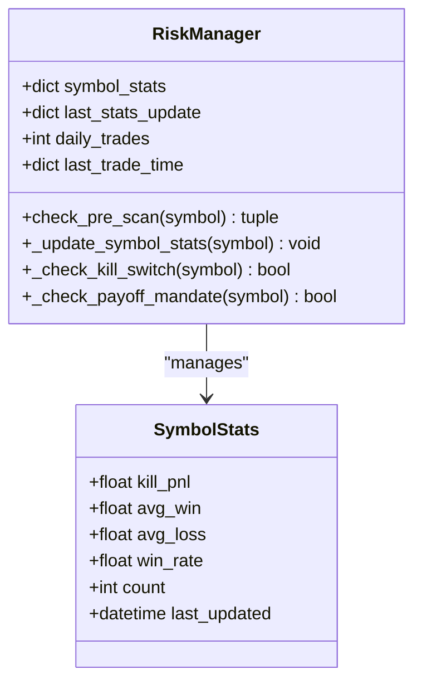
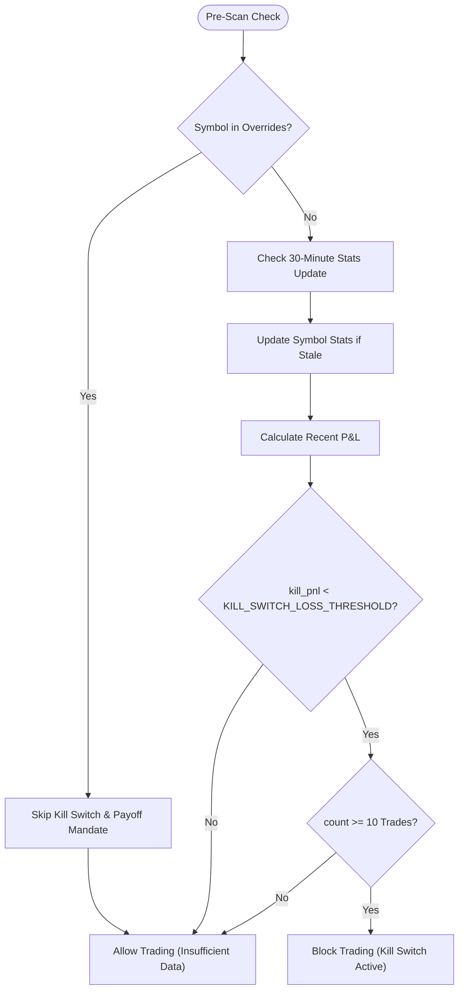
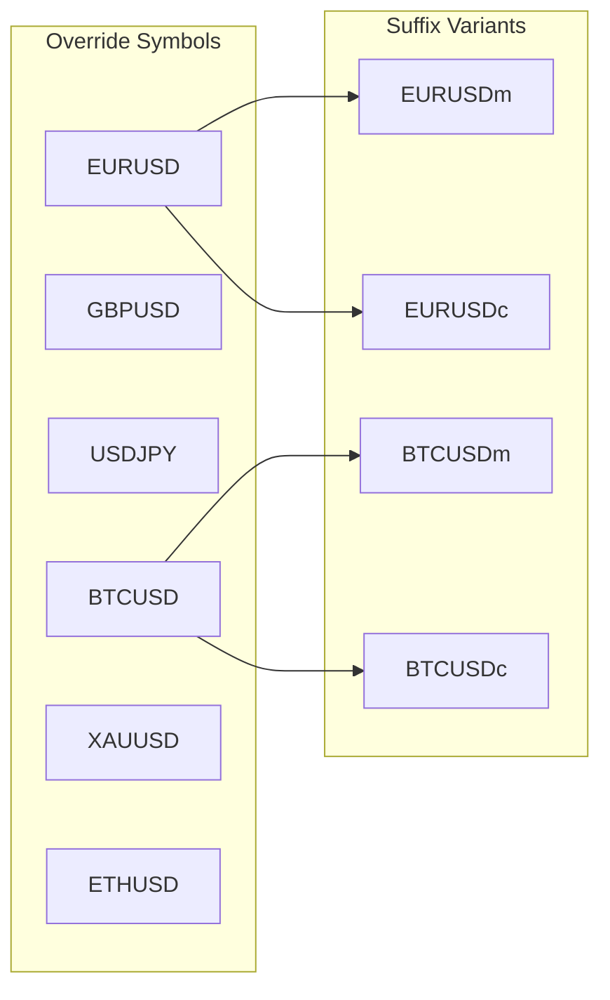
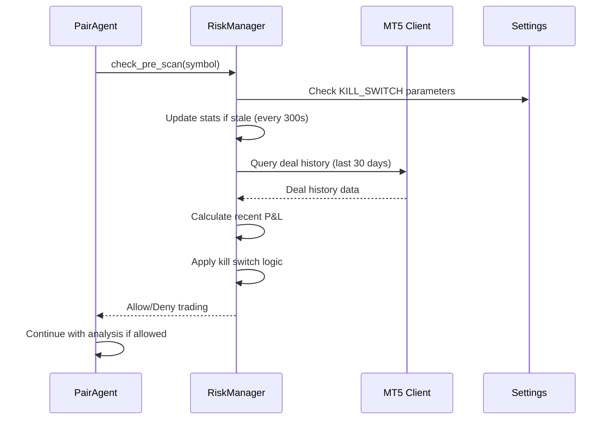
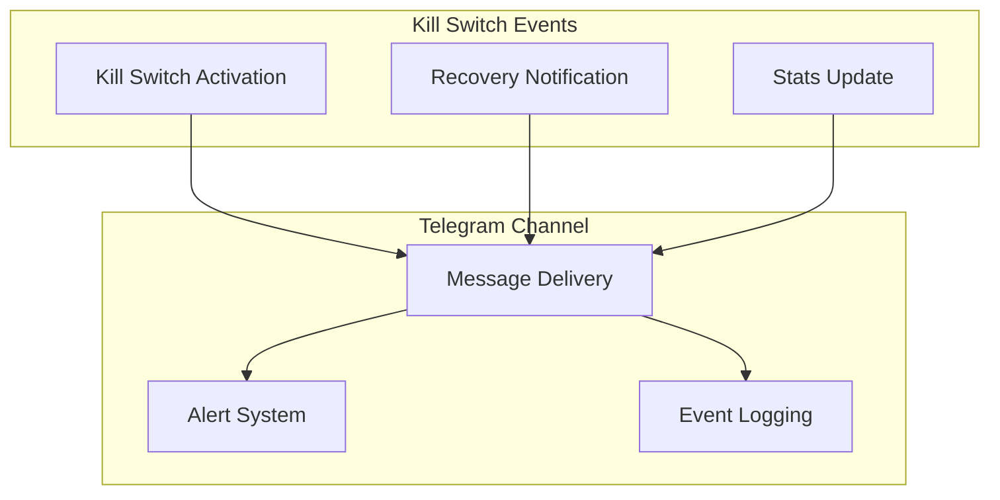

# Kill Switch System

<cite>
**Referenced Files in This Document**
- [risk_manager.py](file://utils/risk_manager.py)
- [settings.py](file://config/settings.py)
- [telegram_notifier.py](file://utils/telegram_notifier.py)
- [pair_agent.py](file://strategy/pair_agent.py)
- [institutional_strategy.py](file://strategy/institutional_strategy.py)
- [README.md](file://README.md)
</cite>

## Table of Contents
1. [Introduction](#introduction)
2. [System Architecture](#system-architecture)
3. [Core Components](#core-components)
4. [Kill Switch Logic](#kill-switch-logic)
5. [Configuration Parameters](#configuration-parameters)
6. [Symbol-Specific Overrides](#symbol-specific-overrides)
7. [Integration Points](#integration-points)
8. [Activation Scenarios](#activation-scenarios)
9. [Monitoring and Notifications](#monitoring-and-notifications)
10. [Troubleshooting Guide](#troubleshooting-guide)
11. [Performance Considerations](#performance-considerations)
12. [Conclusion](#conclusion)

## Introduction

The Kill Switch System is a critical risk management feature within the RiskManager that automatically disables trading for specific symbols when predefined loss thresholds are exceeded. This system serves as a protective mechanism to prevent further losses by temporarily pausing trading activity for symbols that demonstrate poor recent performance characteristics.

The system operates on a symbol-specific basis, maintaining separate risk statistics for each tradable instrument and applying configurable thresholds to determine when trading should be suspended. This approach allows the trading system to adapt dynamically to changing market conditions while maintaining overall portfolio safety.

## System Architecture

The Kill Switch System is integrated into the broader Risk Management framework and operates through several key architectural components:

**Diagram sources**
- [risk_manager.py](file://utils/risk_manager.py#L14-L40)
- [settings.py](file://config/settings.py#L123-L137)
- [pair_agent.py](file://strategy/pair_agent.py#L90-L92)

The architecture follows a layered approach where the RiskManager serves as the central coordinator, interfacing with configuration settings, shared state management, and external systems like MT5 and Telegram notifications.

## Core Components

### RiskManager Class

The RiskManager class serves as the central orchestrator for the Kill Switch System, implementing comprehensive risk controls including the kill switch functionality. The class maintains several key data structures:

- **symbol_stats**: Dictionary storing per-symbol risk statistics including recent P&L, average win/loss amounts, and win rates
- **last_stats_update**: Timestamp tracking when symbol statistics were last refreshed
- **daily_trades**: Counter for daily trade volume management
- **last_trade_time**: Dictionary tracking individual symbol trade cooldowns

### Symbol Statistics Management

Each symbol maintains a comprehensive set of statistics that drive the kill switch decision-making process:

**Diagram sources**
- [risk_manager.py](file://utils/risk_manager.py#L37-L40)
- [risk_manager.py](file://utils/risk_manager.py#L195-L201)

**Section sources**
- [risk_manager.py](file://utils/risk_manager.py#L14-L40)

## Kill Switch Logic

### Core Algorithm Flow

The kill switch decision process follows a systematic evaluation approach:

**Diagram sources**
- [risk_manager.py](file://utils/risk_manager.py#L66-L81)
- [risk_manager.py](file://utils/risk_manager.py#L165-L205)
- [risk_manager.py](file://utils/risk_manager.py#L207-L216)

### Statistical Calculation Methodology

The system calculates recent performance over a configurable lookback period using the following approach:

1. **Lookback Window**: Historical data from the last 30 days is retrieved from MT5 deal history
2. **Symbol Filtering**: Only deals for the specific symbol are considered
3. **Entry Type Filtering**: Only exit deals (DEAL_ENTRY_OUT) are included in the calculation
4. **Recent Sample Selection**: The most recent N trades are selected based on KILL_SWITCH_LOOKBACK_TRADES
5. **P&L Aggregation**: Net profit/loss is calculated by summing profit, commission, and swap components

### Threshold Validation Process

The kill switch activation requires meeting multiple criteria simultaneously:

1. **Loss Threshold Comparison**: The aggregated P&L for the recent lookback period must be less than the configured KILL_SWITCH_LOSS_THRESHOLD
2. **Minimum Trade Requirement**: At least 10 trades must be available in the lookback window to ensure statistical validity
3. **Symbol-Specific Application**: Each symbol maintains independent statistics and kill switch status

**Section sources**
- [risk_manager.py](file://utils/risk_manager.py#L165-L205)
- [risk_manager.py](file://utils/risk_manager.py#L207-L216)

## Configuration Parameters

### Kill Switch Parameters

The kill switch system is governed by several configurable parameters defined in the settings module:

| Parameter | Default Value | Description | Impact |
|-----------|---------------|-------------|---------|
| KILL_SWITCH_LOOKBACK_TRADES | 15 | Number of recent trades to evaluate | Higher values increase sensitivity but require more historical data |
| KILL_SWITCH_LOSS_THRESHOLD | -60.0 | Maximum allowable loss in recent period (USD) | More negative values are more restrictive, less negative values are more permissive |

### Additional Risk Parameters

The system also integrates with broader risk management configurations:

| Parameter | Default Value | Description | Relationship to Kill Switch |
|-----------|---------------|-------------|----------------------------|
| MAX_DAILY_LOSS_USD | 50.0 | Daily loss limit (USD) | Independent from kill switch, provides additional protection |
| RISK_OVERRIDE_SYMBOLS | EURUSD, GBPUSD, BTCUSD, etc. | Symbols exempt from kill switch | Provides selective bypass for approved instruments |
| AVG_LOSS_RATIO_THRESHOLD | 2.0 | Maximum acceptable loss/win ratio | Complements kill switch with payoff mandate |

**Section sources**
- [settings.py](file://config/settings.py#L123-L137)

## Symbol-Specific Overrides

### Override Mechanism

The kill switch system includes a sophisticated override mechanism that allows specific symbols to bypass kill switch restrictions:

**Diagram sources**
- [settings.py](file://config/settings.py#L129-L132)

### Override Implementation

The override system operates through automatic suffix expansion:

1. **Base Symbols**: Core currency pairs and major assets
2. **Suffix Variants**: Automatic generation of m, c, and z suffix variants
3. **Runtime Detection**: All variant combinations are recognized as overrides

This design ensures comprehensive coverage while maintaining simplicity in configuration management.

**Section sources**
- [settings.py](file://config/settings.py#L127-L132)

## Integration Points

### PairAgent Integration

The kill switch system is seamlessly integrated into the trading workflow through the PairAgent:

**Diagram sources**
- [pair_agent.py](file://strategy/pair_agent.py#L90-L92)
- [risk_manager.py](file://utils/risk_manager.py#L51-L81)

### InstitutionalStrategy Coordination

The InstitutionalStrategy coordinates multiple PairAgents while managing global risk constraints:

1. **Parallel Processing**: Each PairAgent operates independently with its own kill switch state
2. **Global Limits**: InstitutionalStrategy enforces additional constraints like daily trade limits
3. **Resource Sharing**: Shared RiskManager instance coordinates symbol-specific risk management

**Section sources**
- [institutional_strategy.py](file://strategy/institutional_strategy.py#L99-L181)
- [pair_agent.py](file://strategy/pair_agent.py#L90-L92)

## Activation Scenarios

### Typical Kill Switch Activation

The kill switch activates under the following conditions:

1. **Sustained Loss Period**: Recent trading history shows cumulative losses exceeding the threshold
2. **Statistical Validity**: Minimum trade count requirement (≥10 trades) is met
3. **Independent Symbol State**: Each symbol maintains separate kill switch status
4. **Temporary Suspension**: Trading remains suspended until conditions improve

### Example Scenarios

| Scenario | Conditions Met | Outcome | Recovery Time |
|----------|----------------|---------|---------------|
| Minor Drawdown | Loss threshold exceeded but <10 trades | No activation | Immediate (data insufficient) |
| Significant Losses | Loss threshold exceeded with ≥10 trades | Kill switch active | Until performance improves |
| Market Volatility | High volatility causing temporary losses | No activation | Statistically valid periods |
| Override Symbol | Symbol in override list | No kill switch | Always allowed |

### Recovery Process

The kill switch automatically deactivates when:

1. **Performance Improves**: Recent P&L becomes positive or approaches zero
2. **Statistical Window Updates**: New trades refresh the 30-day lookback period
3. **Manual Intervention**: System administrator can override the restriction
4. **Market Conditions Change**: Broader market improvements affect symbol performance

## Monitoring and Notifications

### Telegram Integration

The system provides comprehensive monitoring through Telegram notifications:

**Diagram sources**
- [telegram_notifier.py](file://utils/telegram_notifier.py#L121-L128)

### Notification Content

The Telegram notifier provides detailed information about kill switch events:

- **Symbol Identification**: Clear indication of affected trading pair
- **Loss Amount**: Specific dollar amount of recent losses
- **Activation Status**: Confirmation that trading has been suspended
- **Recovery Indication**: Notification when kill switch is lifted

### Real-Time Monitoring

The system supports continuous monitoring through:

1. **Dashboard Integration**: Live display of kill switch status
2. **Log Analysis**: Historical tracking of activation events
3. **Performance Metrics**: Tracking of recovery times and success rates
4. **Alert Configuration**: Customizable notification preferences

**Section sources**
- [telegram_notifier.py](file://utils/telegram_notifier.py#L121-L128)

## Troubleshooting Guide

### Common Issues and Solutions

#### Kill Switch Not Activating

**Symptoms**: Expected losses not triggering kill switch suspension
**Possible Causes**:
- Insufficient trade history (<10 trades in lookback window)
- Configuration parameter values too lenient
- Symbol not properly detected in MT5 history

**Solutions**:
1. Verify minimum trade requirement is met
2. Review KILL_SWITCH_LOSS_THRESHOLD settings
3. Confirm MT5 deal history accessibility
4. Check symbol filtering logic

#### Kill Switch False Positives

**Symptoms**: Kill switch activating during normal market conditions
**Possible Causes**:
- Overly restrictive threshold settings
- High-frequency trading causing volatility spikes
- Market regime changes affecting symbol performance

**Solutions**:
1. Adjust KILL_SWITCH_LOSS_THRESHOLD to appropriate level
2. Increase KILL_SWITCH_LOOKBACK_TRADES for stability
3. Implement manual override for exceptional circumstances
4. Monitor market conditions before trading decisions

#### Recovery Delays

**Symptoms**: Kill switch remaining active despite improved performance
**Possible Causes**:
- Insufficient recent trades to update statistics
- MT5 connectivity issues preventing data updates
- Configuration caching preventing immediate changes

**Solutions**:
1. Ensure sufficient recent trades occur
2. Verify MT5 connection stability
3. Restart system to clear cached statistics
4. Manually reset kill switch status if necessary

### Diagnostic Procedures

#### System Health Check

1. **Connection Verification**: Confirm MT5 client connectivity
2. **Data Access Test**: Verify deal history retrieval
3. **Parameter Validation**: Check configuration values
4. **Statistics Validation**: Review symbol statistics accuracy

#### Performance Monitoring

1. **Activation Frequency**: Track kill switch activation rates
2. **Recovery Time**: Measure time to recover from activations
3. **False Positive Rate**: Monitor incorrect activations
4. **System Impact**: Assess effect on overall trading performance

**Section sources**
- [risk_manager.py](file://utils/risk_manager.py#L204-L205)

## Performance Considerations

### Computational Efficiency

The kill switch system is designed for minimal computational overhead:

- **Lazy Evaluation**: Statistics are updated only when stale (every 300 seconds)
- **Selective Processing**: Only affected symbols are processed during updates
- **Efficient Data Structures**: Optimized dictionary lookups for symbol states
- **Minimal Memory Footprint**: Compact storage of per-symbol statistics

### Scalability Factors

The system scales effectively with increasing symbol counts:

- **Linear Complexity**: Processing time grows linearly with number of symbols
- **Independent Operations**: Each symbol's kill switch state is computed independently
- **Batch Updates**: Multiple symbols can be processed simultaneously
- **Memory Management**: Efficient cleanup of outdated statistics

### Resource Optimization

Key optimization strategies include:

1. **Caching Mechanisms**: Recent statistics are cached to avoid redundant calculations
2. **Conditional Updates**: Statistics are only refreshed when thresholds warrant it
3. **Efficient Data Retrieval**: MT5 queries are optimized for minimal latency
4. **Background Processing**: Heavy computations are performed asynchronously

## Conclusion

The Kill Switch System represents a sophisticated risk management solution that provides dynamic protection against sustained trading losses. Through its symbol-specific approach, configurable thresholds, and automated recovery mechanisms, the system maintains trading discipline while preserving flexibility for exceptional market conditions.

The integration with the broader RiskManager framework ensures comprehensive protection alongside other risk controls like daily loss limits, payoff mandates, and position sizing constraints. The system's design emphasizes both effectiveness and efficiency, providing robust protection without compromising trading performance.

Key benefits of the Kill Switch System include:

- **Automatic Protection**: Proactive risk management without manual intervention
- **Symbol-Specific Control**: Tailored risk management for individual trading instruments
- **Configurable Sensitivity**: Adjustable parameters to match trading strategies and market conditions
- **Transparent Operation**: Clear notifications and monitoring capabilities
- **Seamless Integration**: Smooth incorporation into existing trading workflows

The system's success depends on proper configuration and ongoing monitoring, ensuring that risk parameters align with trading objectives while maintaining appropriate protection levels for the overall portfolio.