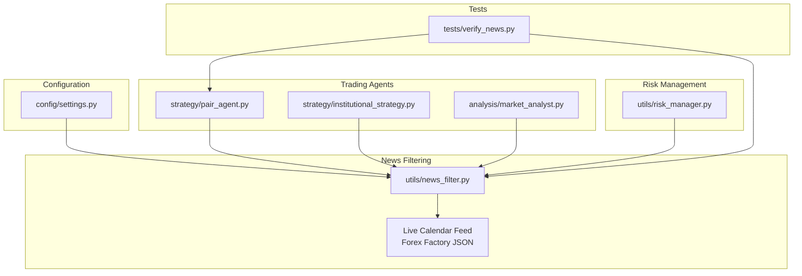
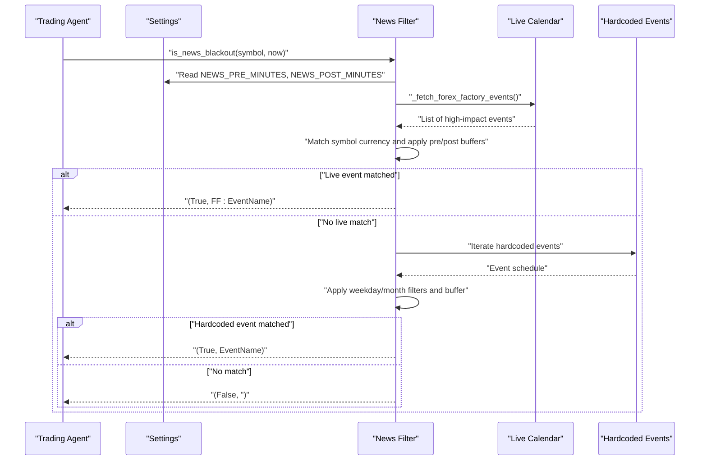
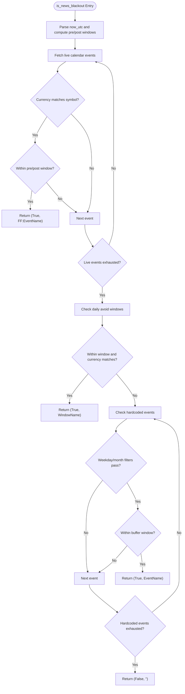
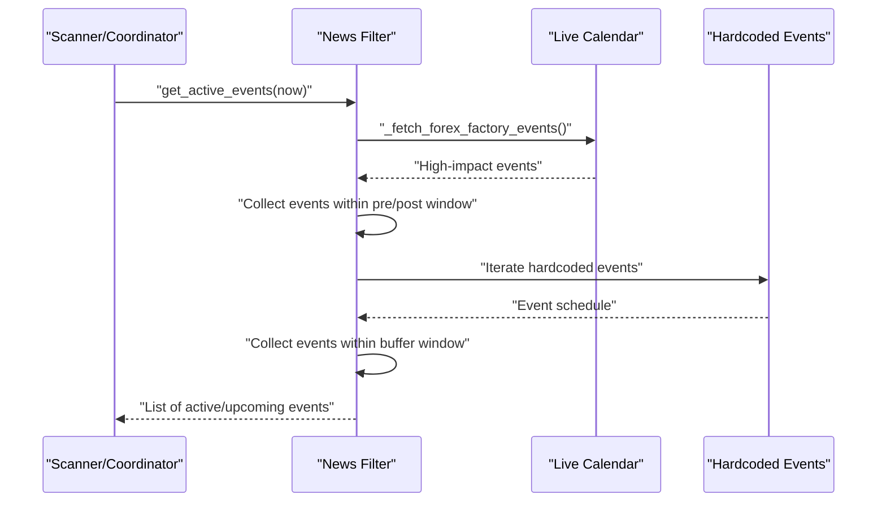
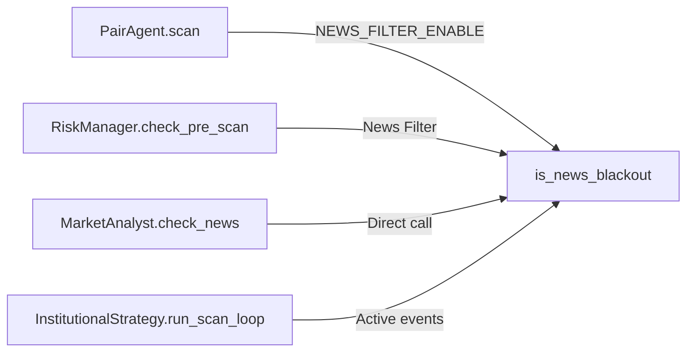
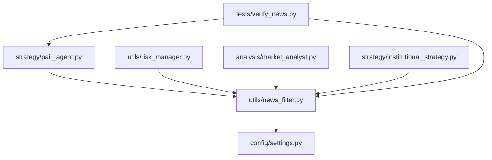

# News Blackout Filters

<cite>
**Referenced Files in This Document**
- [news_filter.py](file://utils/news_filter.py)
- [settings.py](file://config/settings.py)
- [pair_agent.py](file://strategy/pair_agent.py)
- [risk_manager.py](file://utils/risk_manager.py)
- [market_analyst.py](file://analysis/market_analyst.py)
- [institutional_strategy.py](file://strategy/institutional_strategy.py)
- [verify_news.py](file://tests/verify_news.py)
</cite>

## Table of Contents
1. [Introduction](#introduction)
2. [Project Structure](#project-structure)
3. [Core Components](#core-components)
4. [Architecture Overview](#architecture-overview)
5. [Detailed Component Analysis](#detailed-component-analysis)
6. [Dependency Analysis](#dependency-analysis)
7. [Performance Considerations](#performance-considerations)
8. [Troubleshooting Guide](#troubleshooting-guide)
9. [Conclusion](#conclusion)

## Introduction
This document explains the news blackout filtering system designed to protect trading systems from high-impact economic event volatility. The system prevents trading during scheduled and live-announced high-impact events, manages blackout durations, and coordinates with broader risk controls and trading schedules. It covers the detection mechanisms, active event tracking, symbol-specific enforcement, and integration points with pre-scan risk checks and trading schedules.

## Project Structure
The news blackout system spans several modules:
- Configuration defines calendar URLs, caching, and blackout timing parameters
- The news filter module implements detection and active event enumeration
- Trading agents integrate the filter into scanning and risk checks
- Risk manager centralizes pre-execution checks including news blackout enforcement
- Market analyst provides a lightweight news check for analysis workflows
- Tests validate blackout behavior under known scenarios

**Diagram sources**
- [news_filter.py](file://utils/news_filter.py#L1-L239)
- [settings.py](file://config/settings.py#L155-L160)
- [pair_agent.py](file://strategy/pair_agent.py#L79-L83)
- [risk_manager.py](file://utils/risk_manager.py#L140-L143)
- [market_analyst.py](file://analysis/market_analyst.py#L21-L45)
- [institutional_strategy.py](file://strategy/institutional_strategy.py#L118-L119)
- [verify_news.py](file://tests/verify_news.py#L29-L52)

**Section sources**
- [news_filter.py](file://utils/news_filter.py#L1-L239)
- [settings.py](file://config/settings.py#L155-L160)

## Core Components
- News blackout detection: Determines whether trading should be avoided for a given symbol based on live calendar and hardcoded schedules
- Active event tracking: Enumerates currently active or upcoming high-impact events
- Symbol-specific enforcement: Applies currency-based matching to ensure only affected symbols are blocked
- Integration with pre-scan risk checks: News blackout is one of several pre-execution gates
- Coordination with trading schedules: Works alongside session filters and daily limits

**Section sources**
- [news_filter.py](file://utils/news_filter.py#L159-L205)
- [news_filter.py](file://utils/news_filter.py#L208-L238)
- [pair_agent.py](file://strategy/pair_agent.py#L79-L83)
- [risk_manager.py](file://utils/risk_manager.py#L140-L143)

## Architecture Overview
The system operates in two stages:
1. Live calendar feed: Fetches high-impact events from a JSON calendar service and caches them to reduce network overhead
2. Hardcoded schedule fallback: Uses known recurring events when live data is unavailable or filtered

Detection prioritizes live events and applies configurable pre/post buffers. Active event enumeration aggregates both live and hardcoded sources.

**Diagram sources**
- [news_filter.py](file://utils/news_filter.py#L159-L205)
- [news_filter.py](file://utils/news_filter.py#L111-L156)
- [settings.py](file://config/settings.py#L158-L159)

## Detailed Component Analysis

### News Filter Module
The news filter module provides:
- Live calendar integration with caching and timezone normalization
- Hardcoded recurring events with configurable buffers
- Symbol-to-currency matching for symbol-specific enforcement
- Functions for single-event blocking and active event enumeration

Key elements:
- Live calendar feed: Fetches weekly high-impact events, caches results, and filters to high-impact items
- Hardcoded schedule: Known recurring events with weekday and week-of-month constraints
- Symbol matching: Strips suffixes and checks currency presence in symbol names
- Buffering: Pre/post blackout windows configurable via settings

**Diagram sources**
- [news_filter.py](file://utils/news_filter.py#L159-L205)
- [news_filter.py](file://utils/news_filter.py#L180-L203)

**Section sources**
- [news_filter.py](file://utils/news_filter.py#L111-L156)
- [news_filter.py](file://utils/news_filter.py#L180-L203)
- [news_filter.py](file://utils/news_filter.py#L208-L238)

### get_active_events Function
Enumerates currently active or upcoming high-impact events by combining live calendar and hardcoded schedules. It applies the same pre/post buffering logic as the blocking function.

**Diagram sources**
- [news_filter.py](file://utils/news_filter.py#L208-L238)
- [news_filter.py](file://utils/news_filter.py#L111-L156)

**Section sources**
- [news_filter.py](file://utils/news_filter.py#L208-L238)

### Symbol-Specific Blackout Enforcement
The system enforces blackouts per symbol by:
- Stripping Exness suffixes (e.g., m, c) to normalize symbol names
- Checking currency presence in the base symbol
- Matching affected currencies to the event’s currency designation

This ensures only symbols exposed to the relevant currency are blocked.

**Section sources**
- [news_filter.py](file://utils/news_filter.py#L92-L105)

### Event Importance Filtering
The live calendar feed filters events to high-impact items only, using the impact field. This ensures the system focuses on events that historically cause significant volatility.

**Section sources**
- [news_filter.py](file://utils/news_filter.py#L134-L137)

### Blackout Duration Calculation
Blackout windows are calculated as:
- Pre-buffer: Minutes before the event time
- Post-buffer: Minutes after the event time
- Event buffer: Additional buffer minutes configured per event

These are configurable via settings and applied consistently across live and hardcoded events.

**Section sources**
- [news_filter.py](file://utils/news_filter.py#L171-L172)
- [news_filter.py](file://utils/news_filter.py#L201)
- [settings.py](file://config/settings.py#L158-L159)

### Integration with Pre-Scan Risk Checks
The news filter is integrated into:
- Pair agent scanning: Blocks scans during blackouts
- Risk manager pre-scan checks: Blocks trades before execution
- Market analyst: Provides a quick news check for analysis workflows

**Diagram sources**
- [pair_agent.py](file://strategy/pair_agent.py#L79-L83)
- [risk_manager.py](file://utils/risk_manager.py#L140-L143)
- [market_analyst.py](file://analysis/market_analyst.py#L21-L23)
- [institutional_strategy.py](file://strategy/institutional_strategy.py#L118-L119)

**Section sources**
- [pair_agent.py](file://strategy/pair_agent.py#L79-L83)
- [risk_manager.py](file://utils/risk_manager.py#L140-L143)
- [market_analyst.py](file://analysis/market_analyst.py#L21-L23)
- [institutional_strategy.py](file://strategy/institutional_strategy.py#L118-L119)

### Coordination Between News Filters and Trading Schedules
The system coordinates with session filters and daily limits:
- Session awareness: Restricts trading to London and NY open windows when enabled
- Daily limits: Tracks daily trade counts and resets at day boundary
- News blackout: Adds an additional gating factor before pre-scan checks

**Section sources**
- [risk_manager.py](file://utils/risk_manager.py#L147-L161)
- [settings.py](file://config/settings.py#L112-L116)
- [settings.py](file://config/settings.py#L94-L98)

### Examples of News Blackout Scenarios
- FOMC rate decision: Blocks trading during the event and configurable pre/post windows
- NFP release: Blocks trading for the first Friday of each month around 13:30 UTC with extended buffer
- US CPI release: Blocks mid-month around 13:30 UTC
- ECB/BOE rate decisions: Blocks trading around their respective release times with buffers

**Section sources**
- [news_filter.py](file://utils/news_filter.py#L27-L73)

## Dependency Analysis
The news filter module depends on configuration settings for calendar URL, caching, and blackout timing. It is consumed by trading agents, risk manager, and market analyst. Tests validate integration with pair agent scanning.

**Diagram sources**
- [news_filter.py](file://utils/news_filter.py#L1-L239)
- [settings.py](file://config/settings.py#L155-L160)
- [pair_agent.py](file://strategy/pair_agent.py#L79-L83)
- [risk_manager.py](file://utils/risk_manager.py#L140-L143)
- [market_analyst.py](file://analysis/market_analyst.py#L21-L23)
- [institutional_strategy.py](file://strategy/institutional_strategy.py#L118-L119)
- [verify_news.py](file://tests/verify_news.py#L29-L52)

**Section sources**
- [news_filter.py](file://utils/news_filter.py#L1-L239)
- [settings.py](file://config/settings.py#L155-L160)
- [pair_agent.py](file://strategy/pair_agent.py#L79-L83)
- [risk_manager.py](file://utils/risk_manager.py#L140-L143)
- [market_analyst.py](file://analysis/market_analyst.py#L21-L23)
- [institutional_strategy.py](file://strategy/institutional_strategy.py#L118-L119)
- [verify_news.py](file://tests/verify_news.py#L29-L52)

## Performance Considerations
- Live calendar caching: Reduces repeated network requests by caching events for a configurable duration
- Minimal computation: Symbol matching and time window checks are O(n_events) with small constant factors
- Early exits: Short-circuits when live events match, avoiding unnecessary hardcoded checks
- Configurable buffers: Tuning pre/post windows balances safety vs. trading opportunities

[No sources needed since this section provides general guidance]

## Troubleshooting Guide
Common issues and resolutions:
- Live calendar failures: The system gracefully falls back to hardcoded schedules
- Incorrect symbol matching: Ensure symbols are normalized (suffix stripping) and currency presence is correct
- Buffer misconfiguration: Adjust pre/post and event buffer settings to align with expected volatility windows
- Integration testing: Use the provided test suite to validate blackout behavior under known scenarios

**Section sources**
- [news_filter.py](file://utils/news_filter.py#L155-L156)
- [verify_news.py](file://tests/verify_news.py#L29-L52)

## Conclusion
The news blackout filtering system provides robust protection against high-impact event volatility by combining live calendar feeds with hardcoded schedules, enforcing symbol-specific blackouts, and integrating seamlessly with pre-scan risk checks and trading schedules. Its modular design allows configuration tuning while maintaining strong defaults for safety and performance.