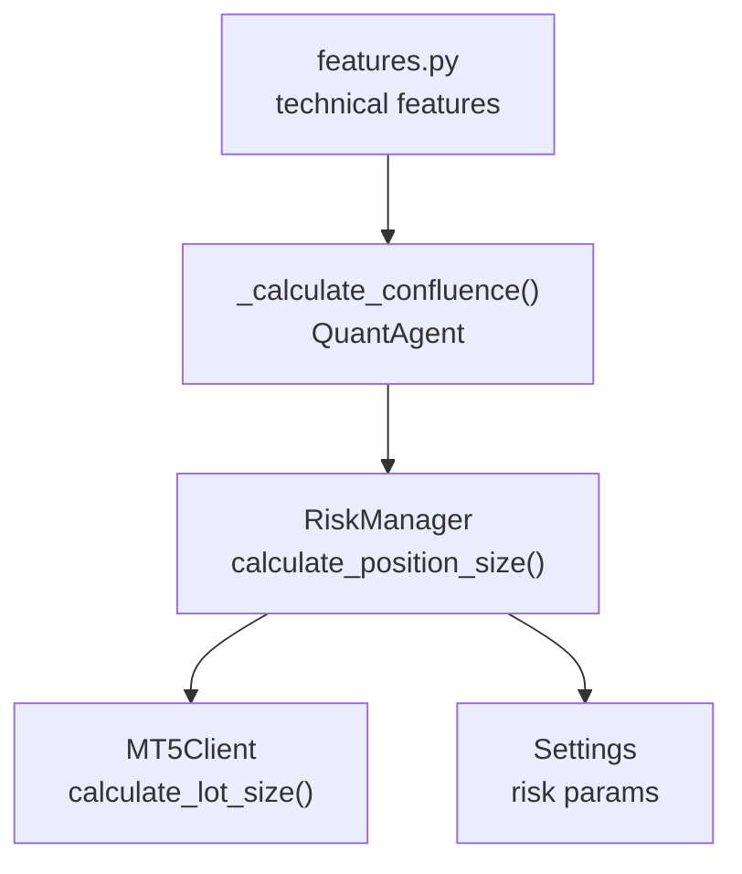
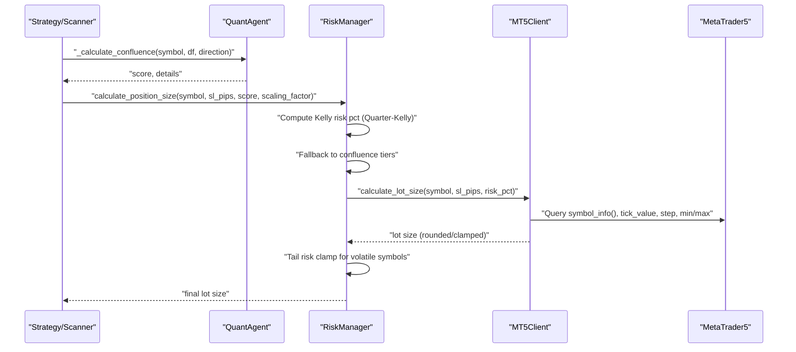
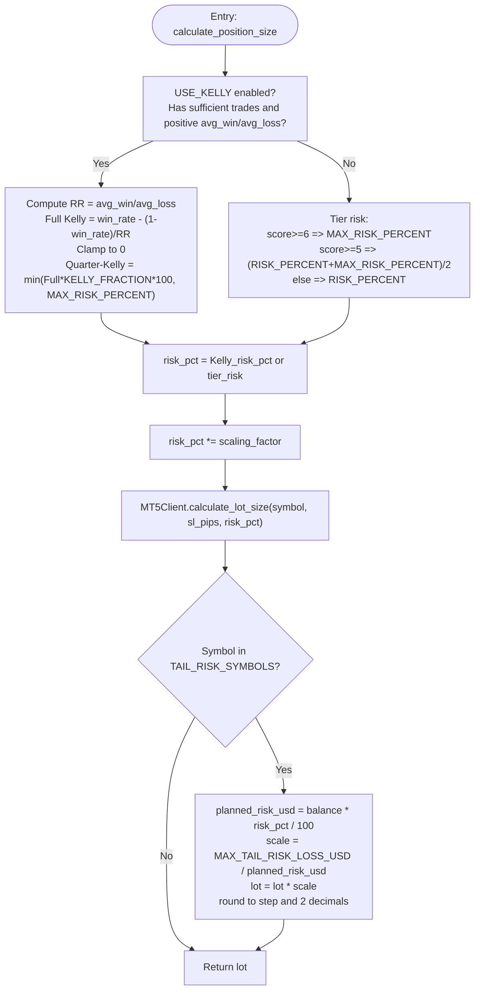
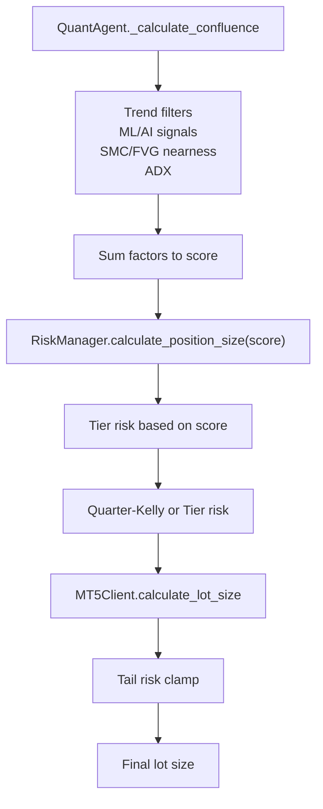
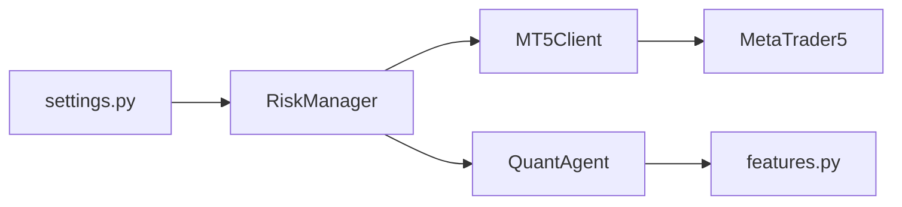

# Position Sizing Algorithms

<cite>
**Referenced Files in This Document**
- [risk_manager.py](file://utils/risk_manager.py)
- [mt5_client.py](file://execution/mt5_client.py)
- [settings.py](file://config/settings.py)
- [quant_agent.py](file://analysis/quant_agent.py)
- [features.py](file://strategy/features.py)
</cite>

## Table of Contents
1. [Introduction](#introduction)
2. [Project Structure](#project-structure)
3. [Core Components](#core-components)
4. [Architecture Overview](#architecture-overview)
5. [Detailed Component Analysis](#detailed-component-analysis)
6. [Dependency Analysis](#dependency-analysis)
7. [Performance Considerations](#performance-considerations)
8. [Troubleshooting Guide](#troubleshooting-guide)
9. [Conclusion](#conclusion)
10. [Appendices](#appendices)

## Introduction
This document explains the position sizing algorithms used by the RiskManager, focusing on the dual approach that combines the Kelly Criterion with a confluence-based tiering system. It details the Quarter-Kelly calculation, including how win rate, average win, average loss, and reward-to-risk ratio are computed, and how these feed into dynamic risk percentages. It also documents the confluence tier fallback system with risk percentage tiers (base, medium, max risk), the tail risk clamping mechanism for volatile symbols, and the complete lot size calculation pipeline including symbol volume step rounding and scaling factor application. Finally, it provides practical examples, parameter tuning guidance, and the relationship between confluence scores and position sizes.

## Project Structure
The position sizing logic spans three modules:
- RiskManager orchestrates pre-trade checks and computes the final lot size.
- MT5Client performs the actual lot size calculation using broker-provided symbol metadata and applies rounding/clamping.
- Settings centralizes configurable parameters for risk, Kelly Criterion, confluence gating, and tail risk controls.

**Diagram sources**
- [risk_manager.py](file://utils/risk_manager.py#L341-L396)
- [mt5_client.py](file://execution/mt5_client.py#L146-L195)
- [settings.py](file://config/settings.py#L70-L90)
- [quant_agent.py](file://analysis/quant_agent.py#L230-L292)
- [features.py](file://strategy/features.py#L1-L200)

**Section sources**
- [risk_manager.py](file://utils/risk_manager.py#L1-L549)
- [mt5_client.py](file://execution/mt5_client.py#L1-L385)
- [settings.py](file://config/settings.py#L1-L201)

## Core Components
- RiskManager.calculate_position_size: Computes dynamic lot size using Quarter-Kelly when sufficient historical statistics are available; otherwise falls back to confluence-tier risk percentages. Applies tail risk clamping for volatile symbols and rounds to broker volume steps.
- MT5Client.calculate_lot_size: Implements the institutional formula to compute lot size from account balance, risk percent, stop-loss distance in price, and symbol tick characteristics, then clamps and rounds to broker limits.
- Settings: Provides tunable parameters for risk percent tiers, Kelly Criterion fractions, confluence thresholds, and tail risk caps.

Key responsibilities:
- RiskManager: Historical stats aggregation, Kelly fraction computation, confluence tier selection, scaling factor application, tail risk clamp, and delegation to MT5Client.
- MT5Client: Broker-level lot size calculation, rounding to step size, and clamping to min/max volumes.
- Settings: Centralized configuration for risk parameters and gating thresholds.

**Section sources**
- [risk_manager.py](file://utils/risk_manager.py#L341-L396)
- [mt5_client.py](file://execution/mt5_client.py#L146-L195)
- [settings.py](file://config/settings.py#L70-L90)

## Architecture Overview
The position sizing pipeline integrates pre-trade risk checks with dynamic sizing:

**Diagram sources**
- [risk_manager.py](file://utils/risk_manager.py#L341-L396)
- [mt5_client.py](file://execution/mt5_client.py#L146-L195)
- [quant_agent.py](file://analysis/quant_agent.py#L230-L292)

## Detailed Component Analysis

### Dual Position Sizing: Kelly Criterion + Confluence Tiering
The RiskManager’s calculate_position_size method implements a dual approach:
- Quarter-Kelly: When historical stats are sufficient, compute a risk percentage using the Kelly fraction and cap it by the maximum risk percent.
- Confluence Tier Fallback: When Kelly stats are unavailable, select a risk percentage tier based on the confluence score.

Quarter-Kelly computation:
- Inputs from symbol_stats: win_rate, avg_win, avg_loss, count.
- Compute reward-to-risk ratio as avg_win / avg_loss.
- Compute full Kelly fraction as win_rate - (1 - win_rate) / rr.
- Clamp to zero and multiply by the Kelly fraction (Quarter-Kelly).
- Cap by MAX_RISK_PERCENT.

Confluence tier fallback:
- Base risk: RISK_PERCENT.
- Max risk: MAX_RISK_PERCENT.
- Tiers:
  - Score ≥ 6: max risk.
  - Score ≥ 5: midpoint between base and max risk.
  - Else: base risk.

Scaling factor:
- Multiply the selected risk percentage by a scaling factor (e.g., higher for stronger setups) before delegating to MT5Client.

Tail risk clamp:
- For symbols in TAIL_RISK_SYMBOLS, if planned risk USD exceeds MAX_TAIL_RISK_LOSS_USD, scale down the lot and re-round to symbol volume step.

Lot size calculation and rounding:
- MT5Client.calculate_lot_size converts risk percent to a dollar amount, divides by (stop-loss ticks × tick value), clamps to broker min/max, rounds to step size, and cleans floating point.

**Diagram sources**
- [risk_manager.py](file://utils/risk_manager.py#L341-L396)
- [mt5_client.py](file://execution/mt5_client.py#L146-L195)
- [settings.py](file://config/settings.py#L70-L90)
- [settings.py](file://config/settings.py#L119-L121)

**Section sources**
- [risk_manager.py](file://utils/risk_manager.py#L341-L396)
- [mt5_client.py](file://execution/mt5_client.py#L146-L195)
- [settings.py](file://config/settings.py#L70-L90)
- [settings.py](file://config/settings.py#L119-L121)

### Confluence Scoring and Position Size Relationship
Confluence scoring is computed by the QuantAgent and passed to RiskManager.calculate_position_size. The higher the score, the higher the risk percentage tier applied, increasing position size.

Scoring factors (examples):
- Trend alignment across multiple timeframes (M5/H1/H4).
- Machine learning probability thresholds.
- Signal match with AI indicator.
- Near-order-block or fair-value-gap proximity.
- ADX strength.

These factors increment the score; RiskManager maps the score to a risk tier, which becomes the base for Quarter-Kelly or fallback risk percent.

**Diagram sources**
- [quant_agent.py](file://analysis/quant_agent.py#L230-L292)
- [risk_manager.py](file://utils/risk_manager.py#L341-L396)

**Section sources**
- [quant_agent.py](file://analysis/quant_agent.py#L230-L292)
- [risk_manager.py](file://utils/risk_manager.py#L341-L396)

### Quarter-Kelly Calculation Details
Inputs:
- win_rate: number of winning trades / total trades.
- avg_win: average profit per winning trade.
- avg_loss: average absolute loss per losing trade.
- count: total number of trades used for stats.

Computation:
- RR = avg_win / avg_loss.
- Full Kelly = win_rate - (1 - win_rate) / RR.
- Clamp to zero to avoid negative fractions.
- Quarter-Kelly = min(Full Kelly × KELLY_FRACTION × 100, MAX_RISK_PERCENT).
- Only active if count ≥ KELLY_MIN_TRADES and both avg_win and avg_loss are positive.

Parameters:
- USE_KELLY, KELLY_FRACTION, KELLY_MIN_TRADES, MAX_RISK_PERCENT.

**Section sources**
- [risk_manager.py](file://utils/risk_manager.py#L341-L396)
- [settings.py](file://config/settings.py#L83-L86)

### Confluence Tier Fallback System
Risk percentage tiers:
- Base risk: RISK_PERCENT.
- Max risk: MAX_RISK_PERCENT.
- Tiers:
  - Score ≥ 6: max risk.
  - Score ≥ 5: midpoint between base and max risk.
  - Else: base risk.

Scaling factor:
- risk_pct is multiplied by a scaling factor (e.g., higher for stronger setups) before lot calculation.

Parameters:
- RISK_PERCENT, MAX_RISK_PERCENT, MIN_CONFLUENCE_SCORE, SURESHOT_MIN_SCORE.

**Section sources**
- [risk_manager.py](file://utils/risk_manager.py#L364-L375)
- [settings.py](file://config/settings.py#L70-L71)
- [settings.py](file://config/settings.py#L77-L81)

### Tail Risk Clamping Mechanism
Purpose:
- Protect against excessive planned risk on highly volatile symbols.

Logic:
- If symbol is in TAIL_RISK_SYMBOLS and planned_risk_usd > MAX_TAIL_RISK_LOSS_USD, scale down lot proportionally and re-round to symbol volume step.

Parameters:
- TAIL_RISK_SYMBOLS, MAX_TAIL_RISK_LOSS_USD.

**Section sources**
- [risk_manager.py](file://utils/risk_manager.py#L381-L394)
- [settings.py](file://config/settings.py#L119-L121)

### Lot Size Calculation Process and Symbol Volume Step Rounding
MT5Client.calculate_lot_size:
- Inputs: symbol, sl_distance_price (SL in price units), risk_percent.
- Steps:
  - risk_amount = balance × risk_percent / 100.
  - Convert SL distance to ticks: sl_ticks = sl_distance_price / tick_size.
  - lot_size = risk_amount / (sl_ticks × tick_value).
  - Clamp to broker limits: min_lot ≤ lot_size ≤ max_lot.
  - Round to step size and clean to two decimals.

Volume step rounding:
- After initial lot calculation, round to the nearest symbol volume_step and keep two decimal places.

**Section sources**
- [mt5_client.py](file://execution/mt5_client.py#L146-L195)

### Scaling Factor Application
- The selected risk percentage is multiplied by a scaling factor (e.g., higher for stronger setups) before delegating to MT5Client.
- This allows dynamic leverage adjustments without changing global risk tiers.

**Section sources**
- [risk_manager.py](file://utils/risk_manager.py#L375-L375)

## Dependency Analysis
- RiskManager depends on:
  - Settings for risk parameters and gating thresholds.
  - MT5Client for the final lot size calculation and rounding.
  - QuantAgent for confluence scores.
- MT5Client depends on MetaTrader5 symbol metadata for tick value, tick size, min/max volumes, and step size.
- Confluence scoring depends on technical features generated by features.py and trend filters computed elsewhere.

**Diagram sources**
- [risk_manager.py](file://utils/risk_manager.py#L1-L549)
- [mt5_client.py](file://execution/mt5_client.py#L1-L385)
- [settings.py](file://config/settings.py#L1-L201)
- [quant_agent.py](file://analysis/quant_agent.py#L230-L292)
- [features.py](file://strategy/features.py#L1-L200)

**Section sources**
- [risk_manager.py](file://utils/risk_manager.py#L1-L549)
- [mt5_client.py](file://execution/mt5_client.py#L1-L385)
- [settings.py](file://config/settings.py#L1-L201)
- [quant_agent.py](file://analysis/quant_agent.py#L230-L292)
- [features.py](file://strategy/features.py#L1-L200)

## Performance Considerations
- RiskManager.update_symbol_stats uses a rolling window and sorts deals by time; ensure periodic updates are balanced against performance.
- Confluence scoring uses multiple timeframes and ML/AI predictions; cache or reuse computations where possible.
- MT5Client.calculate_lot_size performs broker queries and arithmetic; avoid repeated calls by batching or caching symbol info.
- Tail risk clamp adds an extra conditional branch; it is lightweight but still worth noting in hot paths.

[No sources needed since this section provides general guidance]

## Troubleshooting Guide
Common issues and resolutions:
- Insufficient historical trades for Kelly: Ensure KELLY_MIN_TRADES is met; otherwise, fallback to confluence tiers.
- Negative or zero Kelly fraction: The algorithm clamps to zero; verify win_rate and RR are computed correctly.
- High planned risk on volatile symbols: Confirm TAIL_RISK_SYMBOLS and MAX_TAIL_RISK_LOSS_USD are configured appropriately.
- Lot size not matching expectations: Verify symbol volume_step and min/max limits; ensure rounding is applied after scaling.
- Confluence score not affecting position size: Check MIN_CONFLUENCE_SCORE and SURESHOT_MIN_SCORE; confirm the score is passed correctly.

**Section sources**
- [risk_manager.py](file://utils/risk_manager.py#L341-L396)
- [settings.py](file://config/settings.py#L70-L90)
- [settings.py](file://config/settings.py#L119-L121)

## Conclusion
The position sizing system blends statistical discipline with contextual confidence. Quarter-Kelly dynamically adjusts risk based on historical performance, while confluence tiers provide a robust fallback grounded in multi-factor alignment. Tail risk clamping safeguards against excessive planned risk for volatile instruments, and MT5Client ensures precise, broker-compliant lot sizing with step rounding. Together, these mechanisms deliver adaptive, conservative, and scalable position sizing aligned with the broader risk framework.

[No sources needed since this section summarizes without analyzing specific files]

## Appendices

### Example Scenarios and Parameter Tuning Guidance
- Scenario A: Strong historical stats (high win_rate, moderate avg_win/avg_loss, sufficient trades).
  - Outcome: Kelly risk pct dominates; position size reflects dynamic sizing.
  - Tuning: Increase KELLY_FRACTION cautiously; raise MAX_RISK_PERCENT for higher confidence setups.
- Scenario B: Weak stats (low count or near-zero avg_win).
  - Outcome: Falls back to confluence tiers; position size constrained by base risk.
  - Tuning: Raise MIN_CONFLUENCE_SCORE to require stronger setups; improve ML/AI thresholds.
- Scenario C: High volatility symbol with elevated planned risk.
  - Outcome: Tail risk clamp reduces lot; ensure MAX_TAIL_RISK_LOSS_USD is calibrated.
  - Tuning: Adjust MAX_TAIL_RISK_LOSS_USD per account risk capacity; review TAIL_RISK_SYMBOLS list.

[No sources needed since this section provides general guidance]