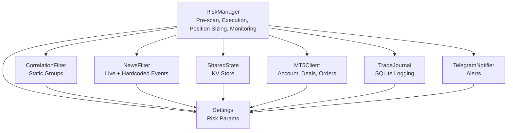
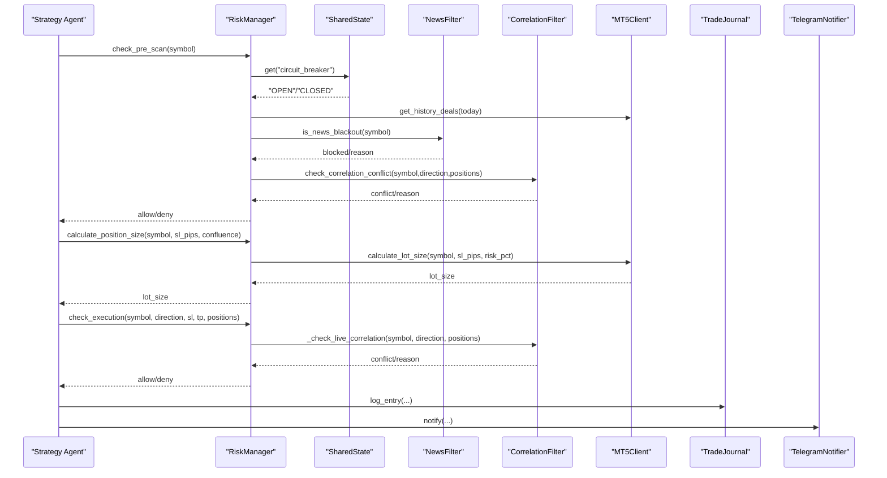
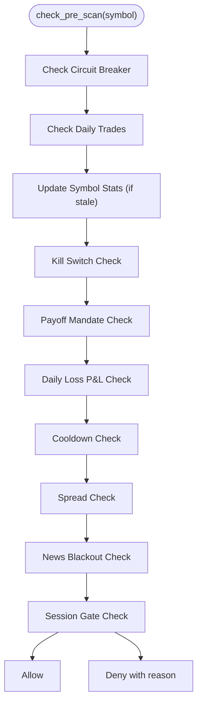
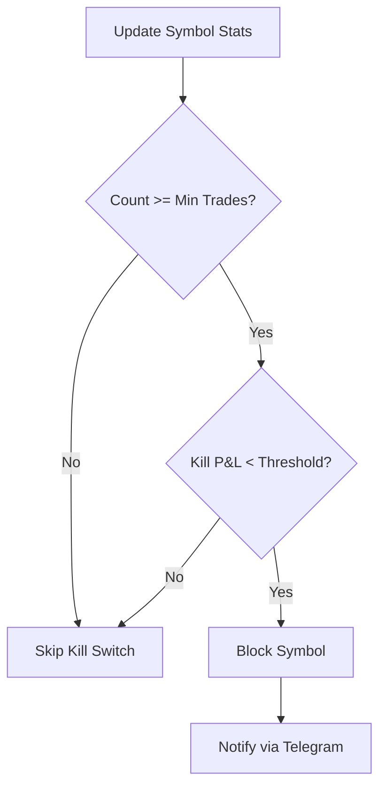
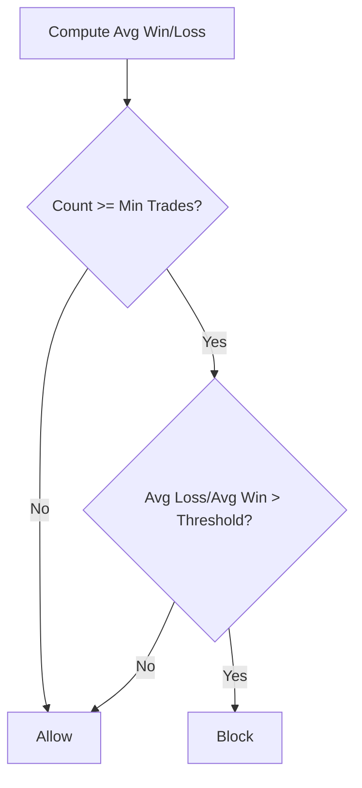
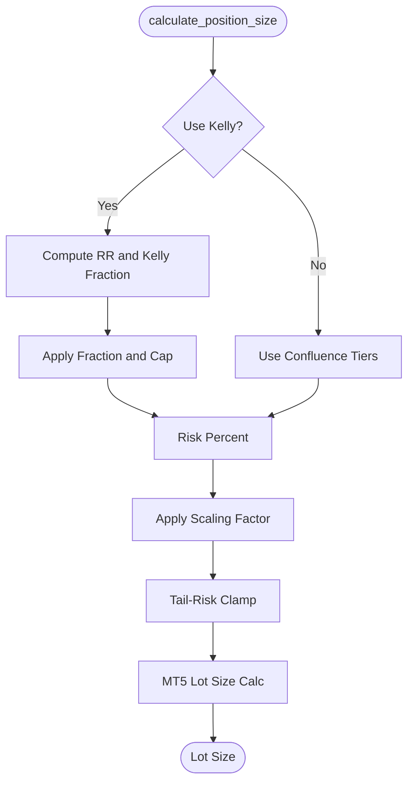
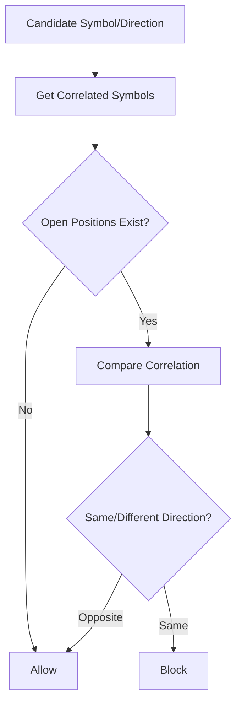
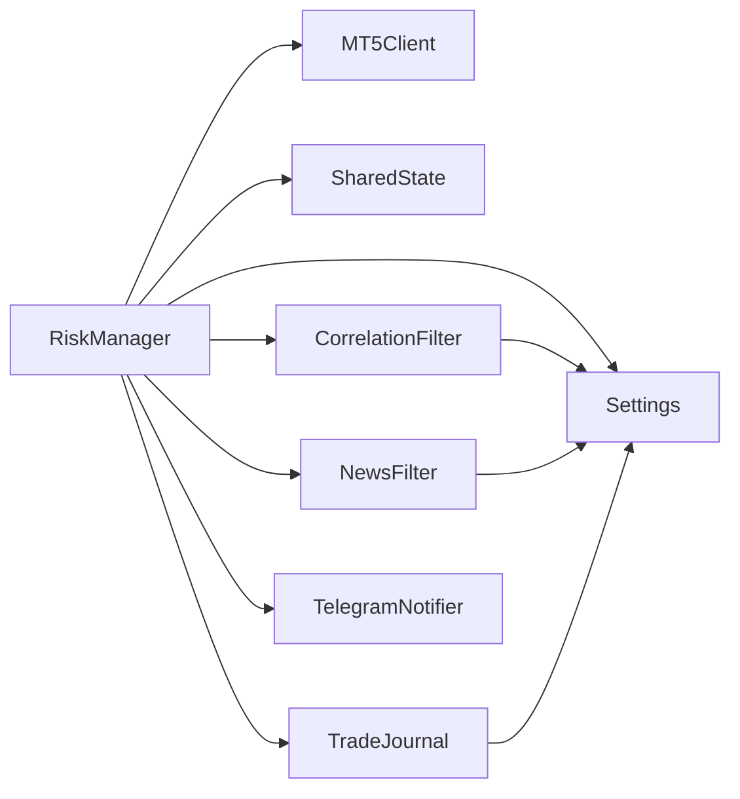

# Risk Management System

<cite>
**Referenced Files in This Document**
- [risk_manager.py](file://utils/risk_manager.py)
- [settings.py](file://config/settings.py)
- [correlation_filter.py](file://utils/correlation_filter.py)
- [news_filter.py](file://utils/news_filter.py)
- [shared_state.py](file://utils/shared_state.py)
- [mt5_client.py](file://execution/mt5_client.py)
- [trade_journal.py](file://utils/trade_journal.py)
- [analyze_pnl.py](file://utils/analyze_pnl.py)
- [telegram_notifier.py](file://utils/telegram_notifier.py)
- [verify_news.py](file://tests/verify_news.py)
- [verify_retail_filters.py](file://tests/verify_retail_filters.py)
</cite>

## Table of Contents
1. [Introduction](#introduction)
2. [Project Structure](#project-structure)
3. [Core Components](#core-components)
4. [Architecture Overview](#architecture-overview)
5. [Detailed Component Analysis](#detailed-component-analysis)
6. [Dependency Analysis](#dependency-analysis)
7. [Performance Considerations](#performance-considerations)
8. [Troubleshooting Guide](#troubleshooting-guide)
9. [Conclusion](#conclusion)
10. [Appendices](#appendices)

## Introduction
This document describes the comprehensive risk management system implemented in the trading bot. It covers pre-scan and execution risk controls, kill switch mechanisms, payoff mandate enforcement, position sizing using a Kelly-derived approach, daily loss controls, correlation filtering for diversification, news blackout filters for high-impact events, spread gating, and the trade journal system for performance tracking and historical data management. It also documents parameter configuration, concrete risk control scenarios, impact assessment, and operational procedures for bypass mechanisms, emergency procedures, and performance monitoring.

## Project Structure
The risk management system spans several modules:
- RiskManager orchestrates pre-trade checks, position sizing, and position monitoring.
- Settings centralizes all risk-related configuration parameters.
- CorrelationFilter prevents correlated exposures.
- NewsFilter enforces blackout windows around high-impact events.
- SharedState persists shared risk signals across agents.
- MT5Client provides account and market data access for risk calculations.
- TradeJournal logs and analyzes trades for performance tracking.
- TelegramNotifier sends alerts for critical risk events.
- Tests verify news blackout and retail filters.

**Diagram sources**
- [risk_manager.py](file://utils/risk_manager.py#L14-L549)
- [correlation_filter.py](file://utils/correlation_filter.py#L1-L117)
- [news_filter.py](file://utils/news_filter.py#L1-L239)
- [shared_state.py](file://utils/shared_state.py#L23-L110)
- [mt5_client.py](file://execution/mt5_client.py#L12-L385)
- [trade_journal.py](file://utils/trade_journal.py#L23-L274)
- [telegram_notifier.py](file://utils/telegram_notifier.py#L30-L174)
- [settings.py](file://config/settings.py#L1-L201)

**Section sources**
- [risk_manager.py](file://utils/risk_manager.py#L14-L549)
- [settings.py](file://config/settings.py#L1-L201)

## Core Components
- RiskManager: Central pre-trade and execution risk controller with kill switch, payoff mandate, daily loss guard, spread gating, correlation filtering, profitability checks, position sizing, and position monitoring.
- CorrelationFilter: Static correlation groups and conflict detection for diversification.
- NewsFilter: Live and hardcoded schedules for high-impact event blackouts.
- SharedState: Persistent key-value store for shared risk signals (e.g., circuit breaker).
- MT5Client: Account info, history deals, symbol info, and order placement for risk computations.
- TradeJournal: SQLite-backed trade logging and performance analytics.
- TelegramNotifier: Real-time alerts for kill switches and trade events.
- Settings: Environment-driven configuration for all risk parameters.

**Section sources**
- [risk_manager.py](file://utils/risk_manager.py#L14-L549)
- [correlation_filter.py](file://utils/correlation_filter.py#L14-L117)
- [news_filter.py](file://utils/news_filter.py#L21-L239)
- [shared_state.py](file://utils/shared_state.py#L23-L110)
- [mt5_client.py](file://execution/mt5_client.py#L12-L385)
- [trade_journal.py](file://utils/trade_journal.py#L23-L274)
- [telegram_notifier.py](file://utils/telegram_notifier.py#L30-L174)
- [settings.py](file://config/settings.py#L69-L167)

## Architecture Overview
The RiskManager integrates with external systems to enforce risk controls and compute position sizes dynamically. It queries MT5 for account and market data, consults SharedState for shared signals, and uses correlation and news filters to gate entries. It logs outcomes via TradeJournal and notifies operators via TelegramNotifier.

**Diagram sources**
- [risk_manager.py](file://utils/risk_manager.py#L51-L163)
- [risk_manager.py](file://utils/risk_manager.py#L237-L295)
- [risk_manager.py](file://utils/risk_manager.py#L341-L396)
- [news_filter.py](file://utils/news_filter.py#L159-L205)
- [correlation_filter.py](file://utils/correlation_filter.py#L77-L116)
- [mt5_client.py](file://execution/mt5_client.py#L137-L195)
- [trade_journal.py](file://utils/trade_journal.py#L103-L131)
- [telegram_notifier.py](file://utils/telegram_notifier.py#L66-L94)

## Detailed Component Analysis

### RiskManager: Pre-Scan and Execution Controls
- Daily reset and counters: Tracks daily trades and resets on UTC day boundary using SharedState persistence.
- Kill Switch: Enforces symbol-level loss caps over a lookback window; bypassed for whitelisted symbols.
- Payoff Mandate: Blocks symbols with excessive average loss vs. average win ratios unless sufficient trade history exists.
- Daily Loss Control: Queries MT5 history for realized P&L today and compares against configured maximum.
- Cooldown: Per-symbol cooldown to prevent rapid-fire entries.
- Spread Gating: Dynamically computes spread in pips and compares against asset-class thresholds.
- News Blackout: Uses live calendar feed and hardcoded schedules to avoid high-impact events.
- Session Gate: Optional strict London/NY session windows for scalping.
- Correlation Filtering: Live correlation check using recent returns; falls back to static groups.
- Profitability Check: Estimates net pips considering spread and commission to ensure minimum profitability.
- Position Sizing: Combines Kelly-derived risk percent with confluence tiers and tail-risk clamps.
- Position Monitoring: Implements break-even moves, partial profit taking, and trailing stops (ATR-based or fixed %).

**Diagram sources**
- [risk_manager.py](file://utils/risk_manager.py#L51-L163)

**Section sources**
- [risk_manager.py](file://utils/risk_manager.py#L14-L549)
- [shared_state.py](file://utils/shared_state.py#L23-L110)
- [mt5_client.py](file://execution/mt5_client.py#L137-L142)

### Kill Switch Mechanisms
- Purpose: Automatically disable symbols that incur significant recent losses.
- Trigger: Net loss over a configurable lookback period exceeds a threshold.
- Bypass: Whitelist of symbols that skip kill switch checks.
- Notification: TelegramNotifier emits alerts when activated.

**Diagram sources**
- [risk_manager.py](file://utils/risk_manager.py#L207-L216)
- [settings.py](file://config/settings.py#L123-L125)
- [telegram_notifier.py](file://utils/telegram_notifier.py#L121-L128)

**Section sources**
- [risk_manager.py](file://utils/risk_manager.py#L207-L216)
- [settings.py](file://config/settings.py#L123-L125)
- [telegram_notifier.py](file://utils/telegram_notifier.py#L121-L128)

### Payoff Mandate Enforcement
- Purpose: Prevent trading symbols with persistently poor risk-reward profiles.
- Trigger: Ratio of average loss to average win exceeds threshold when sufficient trade history exists.
- Bypass: Whitelisted symbols are excluded from mandate enforcement.

**Diagram sources**
- [risk_manager.py](file://utils/risk_manager.py#L218-L235)
- [settings.py](file://config/settings.py#L134-L137)

**Section sources**
- [risk_manager.py](file://utils/risk_manager.py#L218-L235)
- [settings.py](file://config/settings.py#L134-L137)

### Position Sizing Algorithms (Kelly Criterion and Confluence Tiers)
- Kelly-derived sizing: Computes reward-to-risk ratio and applies a fractional Kelly with a hard cap.
- Confluence tiers: Risk percent increases with higher confluence scores.
- Tail-risk clamp: Caps planned risk for volatile symbols to protect capital.
- MT5 integration: Uses account balance and symbol tick value to compute lot size respecting broker constraints.

**Diagram sources**
- [risk_manager.py](file://utils/risk_manager.py#L341-L396)
- [mt5_client.py](file://execution/mt5_client.py#L146-L195)
- [settings.py](file://config/settings.py#L83-L86)

**Section sources**
- [risk_manager.py](file://utils/risk_manager.py#L341-L396)
- [mt5_client.py](file://execution/mt5_client.py#L146-L195)
- [settings.py](file://config/settings.py#L83-L86)

### Daily Loss Controls
- Purpose: Prevent drawdown accumulation by limiting daily realized losses.
- Implementation: Queries MT5 history for today’s deals and sums profit, commission, and swap; blocks further entries if threshold exceeded.

**Section sources**
- [risk_manager.py](file://utils/risk_manager.py#L82-L105)
- [mt5_client.py](file://execution/mt5_client.py#L137-L142)

### Correlation Filtering System
- Static groups: EUR/USD, GBP/USD, risk-on clusters, JPY safe haven, metals, crypto, energy.
- Conflict detection: Blocks entries that increase directional correlation exposure with open positions; supports inverse correlations.

**Diagram sources**
- [correlation_filter.py](file://utils/correlation_filter.py#L77-L116)

**Section sources**
- [correlation_filter.py](file://utils/correlation_filter.py#L14-L117)
- [risk_manager.py](file://utils/risk_manager.py#L303-L339)

### News Blackout Filters
- Live calendar: Weekly high-impact events from a JSON feed with caching.
- Hardcoded schedule: Recurring events and daily windows.
- Blocking logic: Returns true within configurable pre/post buffers around event times.

**Section sources**
- [news_filter.py](file://utils/news_filter.py#L21-L239)
- [risk_manager.py](file://utils/risk_manager.py#L140-L144)

### Spread Gating Mechanisms
- Dynamic spread calculation: Converts tick spread to pips using symbol point/tick size.
- Asset-class thresholds: Separate caps for forex, crypto, and commodities.
- Enforcement: Blocks entries when spread exceeds thresholds.

**Section sources**
- [risk_manager.py](file://utils/risk_manager.py#L112-L139)
- [settings.py](file://config/settings.py#L99-L102)

### Trade Journal System
- Persistence: SQLite database with trades and daily summary tables.
- Logging: Captures entry/exit details, confluence, R:R, durations, outcomes.
- Analytics: Daily stats, confluence win rates, recent trades, and summary printing.
- Historical data management: Backfills missing columns for research phases.

**Section sources**
- [trade_journal.py](file://utils/trade_journal.py#L23-L274)
- [analyze_pnl.py](file://utils/analyze_pnl.py#L12-L81)

### Position Monitoring and Trade Management
- Break-even: Moves stop to near entry to lock in fees once profitability reaches a threshold.
- Partial profit taking: Closes a fraction of the position when approaching targets.
- Trailing stops: ATR-based activation and step; fallback to fixed percentage.
- Threshold optimization: Ignores minor adjustments below pip thresholds.

**Section sources**
- [risk_manager.py](file://utils/risk_manager.py#L399-L548)
- [mt5_client.py](file://execution/mt5_client.py#L296-L352)

## Dependency Analysis
- RiskManager depends on:
  - Settings for configuration.
  - MT5Client for account data, symbol info, and history.
  - SharedState for shared signals (e.g., circuit breaker).
  - CorrelationFilter and NewsFilter for diversification and event gating.
  - TradeJournal for logging outcomes.
  - TelegramNotifier for alerts.
- CorrelationFilter and NewsFilter depend on Settings for thresholds and schedules.
- TradeJournal and analyze_pnl rely on SQLite database files.

**Diagram sources**
- [risk_manager.py](file://utils/risk_manager.py#L14-L549)
- [settings.py](file://config/settings.py#L1-L201)
- [correlation_filter.py](file://utils/correlation_filter.py#L1-L117)
- [news_filter.py](file://utils/news_filter.py#L1-L239)
- [shared_state.py](file://utils/shared_state.py#L1-L110)
- [trade_journal.py](file://utils/trade_journal.py#L1-L274)
- [telegram_notifier.py](file://utils/telegram_notifier.py#L1-L174)

**Section sources**
- [risk_manager.py](file://utils/risk_manager.py#L14-L549)
- [settings.py](file://config/settings.py#L1-L201)

## Performance Considerations
- Risk stats refresh: Updates symbol metrics periodically to balance responsiveness and overhead.
- Live correlation fallback: Uses static groups if live data is unavailable.
- MT5 queries: History deals and symbol info calls are lightweight but should be minimized.
- Position sizing: Ensures rounding to broker steps and caps to protect from fractional slippage.
- Notifications: Non-blocking threads reduce latency.

[No sources needed since this section provides general guidance]

## Troubleshooting Guide
- Kill Switch Activated: Verify recent losses exceed threshold and symbol is not whitelisted.
- Payoff Mandate Blocked: Increase trade history or improve symbol selection; confirm average loss/average win ratio.
- Daily Loss Limit Hit: Review today’s realized P&L; consider reducing position sizes or pausing trading.
- Correlation Conflict: Close or hedge conflicting positions; adjust confluence scoring.
- News Blackout: Wait until blackout window ends; verify calendar feed availability.
- Spread Too High: Trade during better liquidity sessions or select symbols with tighter spreads.
- Position Monitoring Not Triggering: Confirm ATR values and thresholds; ensure thresholds exceed pip thresholds.

**Section sources**
- [risk_manager.py](file://utils/risk_manager.py#L207-L235)
- [risk_manager.py](file://utils/risk_manager.py#L82-L105)
- [risk_manager.py](file://utils/risk_manager.py#L303-L339)
- [news_filter.py](file://utils/news_filter.py#L159-L205)
- [correlation_filter.py](file://utils/correlation_filter.py#L77-L116)

## Conclusion
The risk management system provides robust, layered controls across pre-entry, execution, and post-entry stages. It combines quantitative measures (Kelly-derived sizing, correlation diversification), qualitative safeguards (news blackouts, session gating), and operational tools (journaling, alerts) to manage risk while preserving trading flexibility. Proper configuration and monitoring are essential to align risk controls with trading performance and regulatory expectations.

[No sources needed since this section summarizes without analyzing specific files]

## Appendices

### Parameter Configuration Reference
- Risk Percent and Caps: Base and maximum risk percent per trade.
- Kelly Criterion: Enable flag, fraction, and minimum trades.
- Cost Awareness: Commission per lot and minimum net profit ratio.
- Daily Controls: Maximum daily trades and daily loss cap.
- Spread Caps: Asset-class thresholds for forex, crypto, and commodities.
- Kill Switch: Lookback trades and loss threshold.
- Payoff Mandate: Minimum R:R enforcement and ratio threshold.
- Trailing Stops: ATR-based activation and step; fixed % fallback.
- Partial Profit Taking: Fraction and breakeven R:R.
- Session Filters: Strict London/NY windows and general session awareness.
- News Calendar: URL, cache interval, and blackout buffers.

**Section sources**
- [settings.py](file://config/settings.py#L69-L167)

### Risk Control Scenarios and Examples
- Scenario A: Kill Switch triggers for a symbol with repeated losses over the lookback window; operator receives Telegram alert and temporarily disables the symbol.
- Scenario B: Payoff Mandate blocks a symbol with high average losses relative to average wins despite strong win rate; adjust strategy or confluence scoring.
- Scenario C: Daily Loss Limit halts new entries when realized P&L approaches the daily cap; reduce position sizes or pause trading.
- Scenario D: Correlation conflict prevents entering the same direction as an open correlated position; hedge or wait for de-correlation.
- Scenario E: News blackout blocks entries near high-impact event times; resume after buffer ends.
- Scenario F: Spread too high for the symbol’s volatility; wait for tighter spreads or switch to liquid sessions.

**Section sources**
- [risk_manager.py](file://utils/risk_manager.py#L51-L163)
- [risk_manager.py](file://utils/risk_manager.py#L207-L235)
- [risk_manager.py](file://utils/risk_manager.py#L303-L339)
- [news_filter.py](file://utils/news_filter.py#L159-L205)

### Impact Assessment
- Position Sizing: Kelly-derived sizing adapts to symbol performance; confluence tiers provide stability when history is insufficient; tail-risk clamps protect capital for volatile instruments.
- Correlation Filtering: Reduces systemic risk by avoiding simultaneous directional exposure across correlated assets.
- News Blackouts: Mitigates volatility spikes and adverse price jumps around macro events.
- Daily Loss Controls: Prevents compounding drawdowns and supports disciplined capital preservation.
- Trade Journal: Enables post-hoc analysis of confluence factors and outcomes to refine risk controls.

**Section sources**
- [risk_manager.py](file://utils/risk_manager.py#L341-L396)
- [correlation_filter.py](file://utils/correlation_filter.py#L14-L117)
- [news_filter.py](file://utils/news_filter.py#L21-L239)
- [trade_journal.py](file://utils/trade_journal.py#L197-L246)

### Regulatory Considerations and Risk Tolerance Management
- Risk tolerance: Configured via risk percent and caps; adjustable per symbol and asset class.
- Automated controls: Kill switch and payoff mandate act as internal compliance gates.
- Record keeping: TradeJournal maintains audit trails for performance and compliance reporting.
- Operator oversight: TelegramNotifier ensures timely intervention; SharedState enables centralized risk signals.

**Section sources**
- [settings.py](file://config/settings.py#L69-L167)
- [trade_journal.py](file://utils/trade_journal.py#L23-L101)
- [telegram_notifier.py](file://utils/telegram_notifier.py#L30-L174)
- [shared_state.py](file://utils/shared_state.py#L23-L110)

### Risk Control Bypass Mechanisms and Emergency Procedures
- Risk Override Symbols: Whitelist symbols that bypass kill switch and payoff mandate checks.
- Circuit Breaker: SharedState flag to globally pause trading; reset manually or via operator command.
- Emergency Pauses: Reduce daily caps, increase spread thresholds, or temporarily disable correlation filtering.
- Post-Mortem Analysis: Use TradeJournal and analyze_pnl to assess control effectiveness and adjust parameters.

**Section sources**
- [settings.py](file://config/settings.py#L127-L132)
- [shared_state.py](file://utils/shared_state.py#L23-L110)
- [analyze_pnl.py](file://utils/analyze_pnl.py#L12-L81)

### Performance Monitoring
- Daily Summary: TradeJournal prints daily stats; TelegramNotifier sends daily summaries.
- Confluence Analysis: Identifies which confluence factors correlate with winning trades.
- PnL Analytics: Script reads journal to compute overall and symbol-wise performance metrics.

**Section sources**
- [trade_journal.py](file://utils/trade_journal.py#L166-L246)
- [telegram_notifier.py](file://utils/telegram_notifier.py#L108-L119)
- [analyze_pnl.py](file://utils/analyze_pnl.py#L12-L81)

### Validation and Testing
- News blackout tests: Verify blocking during high-impact events and agent-level gating.
- Retail filters: Validate spread ratio and hunting hours logic for retail viability.

**Section sources**
- [verify_news.py](file://tests/verify_news.py#L15-L56)
- [verify_retail_filters.py](file://tests/verify_retail_filters.py#L13-L64)