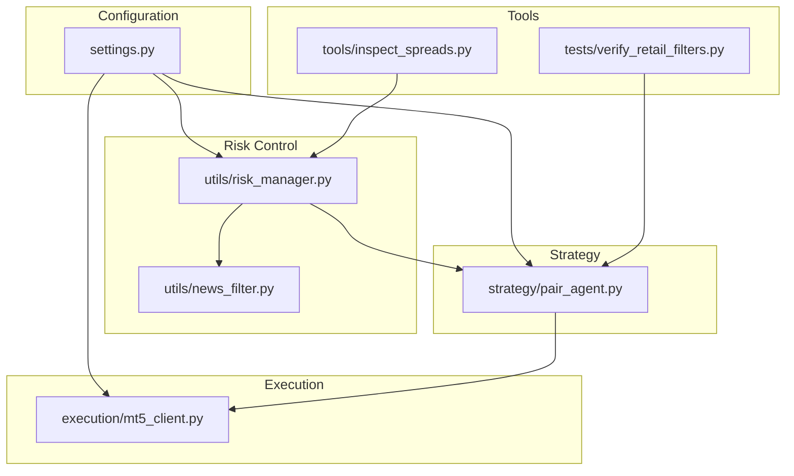
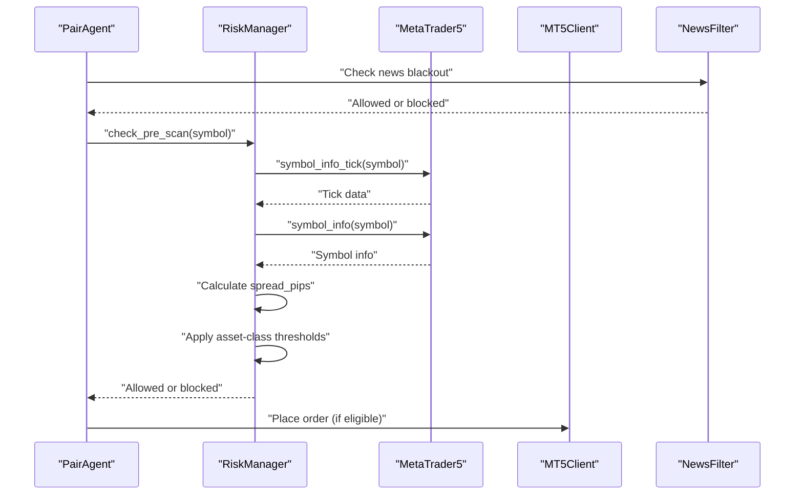
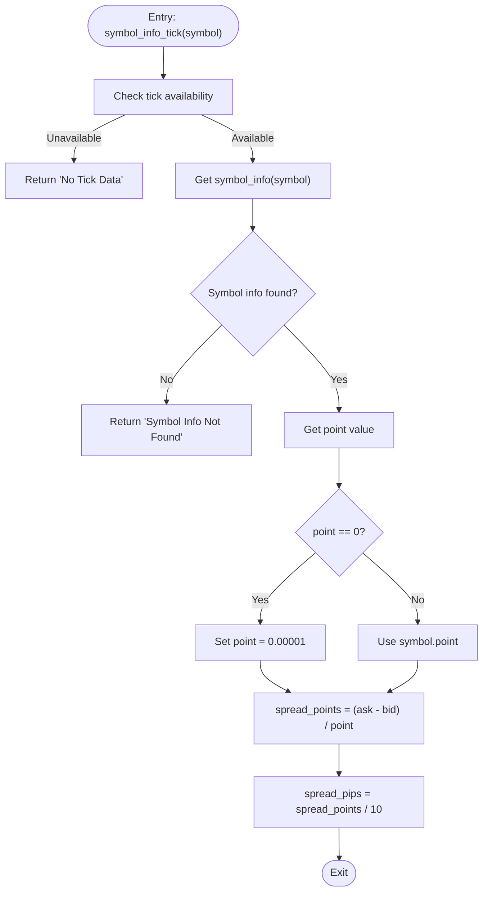
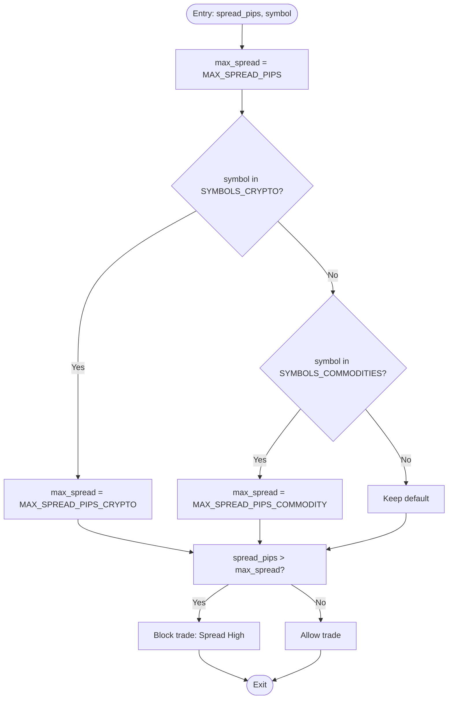
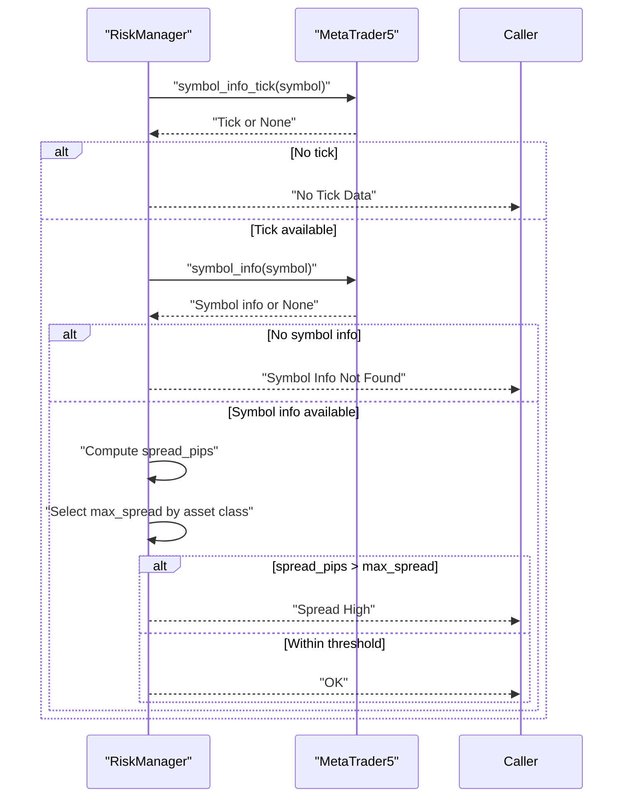
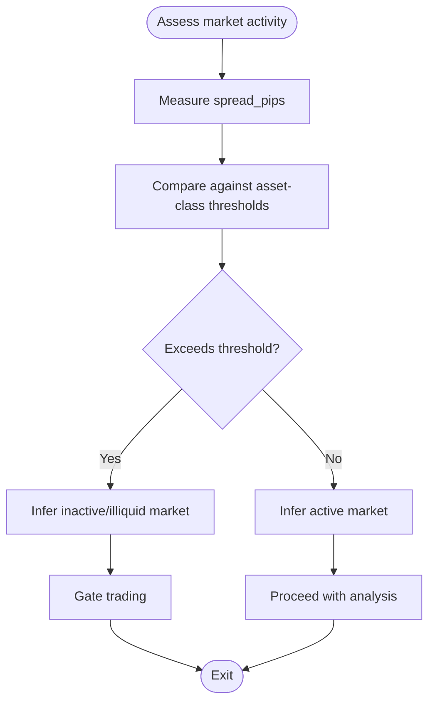
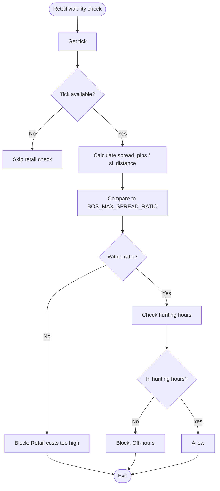
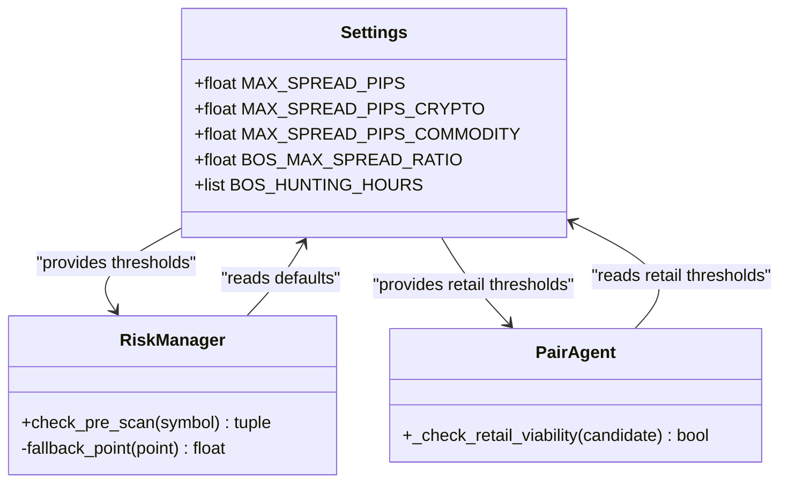
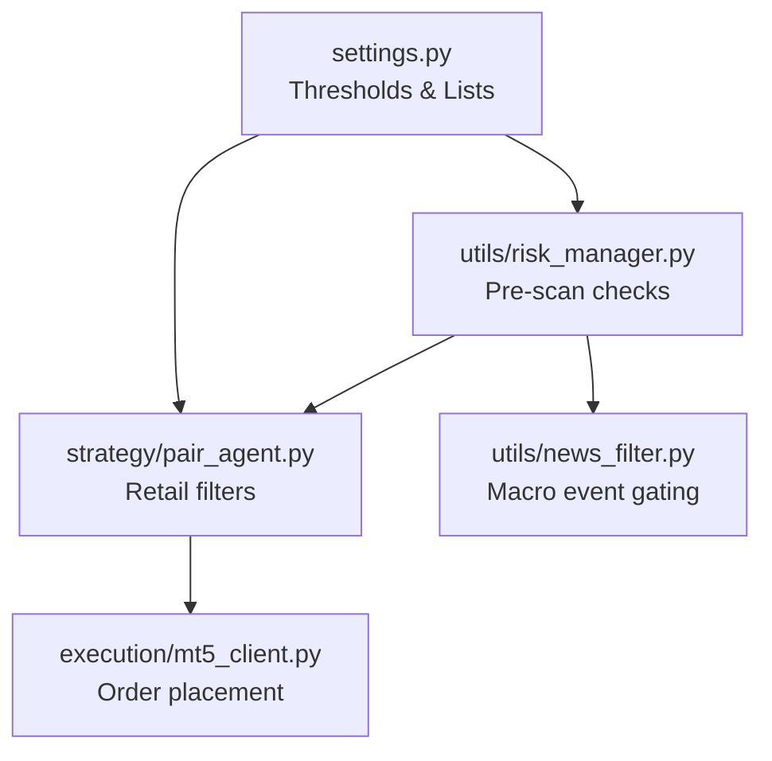

# Spread Gating Mechanisms

<cite>
**Referenced Files in This Document**
- [settings.py](file://config/settings.py)
- [risk_manager.py](file://utils/risk_manager.py)
- [pair_agent.py](file://strategy/pair_agent.py)
- [mt5_client.py](file://execution/mt5_client.py)
- [news_filter.py](file://utils/news_filter.py)
- [inspect_spreads.py](file://tools/inspect_spreads.py)
- [verify_retail_filters.py](file://tests/verify_retail_filters.py)
</cite>

## Table of Contents
1. [Introduction](#introduction)
2. [Project Structure](#project-structure)
3. [Core Components](#core-components)
4. [Architecture Overview](#architecture-overview)
5. [Detailed Component Analysis](#detailed-component-analysis)
6. [Dependency Analysis](#dependency-analysis)
7. [Performance Considerations](#performance-considerations)
8. [Troubleshooting Guide](#troubleshooting-guide)
9. [Conclusion](#conclusion)

## Introduction
This document explains the spread gating system that prevents trading during unfavorable market conditions. It covers dynamic spread calculation using bid-ask spreads converted to pips, asset class-specific spread thresholds (crypto, commodities, forex), and the point-based calculation methodology. It documents the spread check implementation including symbol info validation, fallback point values, and the MAX_SPREAD_PIPS configuration. It also details market activity validation through spread-based market open detection and the impact of high spreads on liquidity assessment. The document includes examples of spread gating scenarios, asset class differences, and the relationship between spread levels and trading eligibility, along with threshold tuning guidance and fallback mechanisms when tick data is unavailable.

## Project Structure
The spread gating system spans several modules:
- Configuration defines global thresholds and asset class lists
- Risk manager performs pre-trade spread checks and enforces gates
- Strategy agents apply retail-specific spread filters
- Execution client places orders with validated spreads
- News filter complements spread gating with macro event avoidance
- Tools assist in validating and inspecting spreads

**Diagram sources**
- [settings.py](file://config/settings.py#L1-L201)
- [risk_manager.py](file://utils/risk_manager.py#L1-L549)
- [pair_agent.py](file://strategy/pair_agent.py#L1-L432)
- [mt5_client.py](file://execution/mt5_client.py#L1-L385)
- [news_filter.py](file://utils/news_filter.py#L1-L239)
- [inspect_spreads.py](file://tools/inspect_spreads.py#L1-L49)
- [verify_retail_filters.py](file://tests/verify_retail_filters.py#L1-L63)

**Section sources**
- [settings.py](file://config/settings.py#L1-L201)
- [risk_manager.py](file://utils/risk_manager.py#L1-L549)
- [pair_agent.py](file://strategy/pair_agent.py#L1-L432)
- [mt5_client.py](file://execution/mt5_client.py#L1-L385)
- [news_filter.py](file://utils/news_filter.py#L1-L239)
- [inspect_spreads.py](file://tools/inspect_spreads.py#L1-L49)
- [verify_retail_filters.py](file://tests/verify_retail_filters.py#L1-L63)

## Core Components
- Spread calculation pipeline converts raw bid-ask spreads to pips using symbol point values and standardizes to 1 pip = 10 points
- Asset-class-aware thresholds dynamically adjust maximum allowable spread based on symbol classification
- Pre-scan risk checks validate tick availability, symbol info, and enforce spread gates before heavy analysis
- Retail-specific spread filters complement institutional checks with spread-to-SL ratios and session windows
- Market activity detection uses spread levels to infer market openness and liquidity conditions

**Section sources**
- [risk_manager.py](file://utils/risk_manager.py#L112-L163)
- [pair_agent.py](file://strategy/pair_agent.py#L400-L428)
- [settings.py](file://config/settings.py#L100-L108)

## Architecture Overview
The spread gating architecture integrates configuration-driven thresholds with runtime checks across risk control, strategy, and execution layers.

**Diagram sources**
- [pair_agent.py](file://strategy/pair_agent.py#L85-L92)
- [risk_manager.py](file://utils/risk_manager.py#L112-L163)
- [mt5_client.py](file://execution/mt5_client.py#L216-L292)
- [news_filter.py](file://utils/news_filter.py#L159-L205)

## Detailed Component Analysis

### Spread Calculation and Point-Based Methodology
- Bid-ask spread is converted to points using symbol.point, then standardized to pips by dividing by 10
- Fallback point value is used when symbol.point equals zero
- The calculation ensures consistent pip measurement across different symbols and decimal places

**Diagram sources**
- [risk_manager.py](file://utils/risk_manager.py#L114-L127)

**Section sources**
- [risk_manager.py](file://utils/risk_manager.py#L114-L127)

### Asset-Class-Specific Spread Thresholds
- Default maximum spread for forex is configured via MAX_SPREAD_PIPS
- Crypto symbols use MAX_SPREAD_PIPS_CRYPTO to accommodate wider spreads
- Commodities use MAX_SPREAD_PIPS_COMMODITY to reflect higher nominal spread costs
- Threshold selection is based on symbol membership in predefined lists

**Diagram sources**
- [risk_manager.py](file://utils/risk_manager.py#L129-L138)
- [settings.py](file://config/settings.py#L100-L102)

**Section sources**
- [risk_manager.py](file://utils/risk_manager.py#L129-L138)
- [settings.py](file://config/settings.py#L100-L102)

### Pre-Scan Risk Check Implementation
- Validates tick availability and symbol info before proceeding
- Applies dynamic spread calculation and asset-class thresholds
- Integrates with news blackout filtering and optional session gating
- Returns explicit reasons for blocking to support monitoring and diagnostics

**Diagram sources**
- [risk_manager.py](file://utils/risk_manager.py#L112-L163)

**Section sources**
- [risk_manager.py](file://utils/risk_manager.py#L112-L163)

### Market Activity Validation via Spread-Based Detection
- High spreads indicate potential illiquidity or market closure
- The system uses spread thresholds to infer whether the market is actively quoting
- This gating mechanism helps avoid trading when liquidity is poor or spreads inflate due to sparse quoting

**Diagram sources**
- [risk_manager.py](file://utils/risk_manager.py#L136-L138)

**Section sources**
- [risk_manager.py](file://utils/risk_manager.py#L136-L138)

### Retail-Specific Spread Filters
- PairAgent applies additional retail filters using spread-to-SL ratio checks
- Enforces maximum spread-to-SL ratio thresholds and hunting hours windows
- Provides explicit logging for retail viability decisions

**Diagram sources**
- [pair_agent.py](file://strategy/pair_agent.py#L400-L428)
- [verify_retail_filters.py](file://tests/verify_retail_filters.py#L31-L45)

**Section sources**
- [pair_agent.py](file://strategy/pair_agent.py#L400-L428)
- [verify_retail_filters.py](file://tests/verify_retail_filters.py#L31-L45)

### Spread Threshold Tuning and Fallback Mechanisms
- Environment variables configure default and asset-class thresholds
- Fallback point values prevent division by zero errors
- Tests demonstrate expected behavior under various spread and SL configurations

**Diagram sources**
- [settings.py](file://config/settings.py#L100-L102)
- [settings.py](file://config/settings.py#L182-L183)
- [risk_manager.py](file://utils/risk_manager.py#L123-L124)
- [pair_agent.py](file://strategy/pair_agent.py#L400-L428)

**Section sources**
- [settings.py](file://config/settings.py#L100-L102)
- [settings.py](file://config/settings.py#L182-L183)
- [risk_manager.py](file://utils/risk_manager.py#L123-L124)
- [pair_agent.py](file://strategy/pair_agent.py#L400-L428)

## Dependency Analysis
Spread gating depends on configuration values, symbol metadata, and runtime tick data. The following diagram shows key dependencies:

**Diagram sources**
- [settings.py](file://config/settings.py#L1-L201)
- [risk_manager.py](file://utils/risk_manager.py#L1-L549)
- [pair_agent.py](file://strategy/pair_agent.py#L1-L432)
- [mt5_client.py](file://execution/mt5_client.py#L1-L385)
- [news_filter.py](file://utils/news_filter.py#L1-L239)

**Section sources**
- [settings.py](file://config/settings.py#L1-L201)
- [risk_manager.py](file://utils/risk_manager.py#L1-L549)
- [pair_agent.py](file://strategy/pair_agent.py#L1-L432)
- [mt5_client.py](file://execution/mt5_client.py#L1-L385)
- [news_filter.py](file://utils/news_filter.py#L1-L239)

## Performance Considerations
- Spread calculations are lightweight and performed on-demand during pre-scan
- Asset-class threshold selection adds minimal overhead via simple membership checks
- Fallback point values prevent costly retries or exceptions
- Combining spread gating with news blackout reduces unnecessary computation during macro events

## Troubleshooting Guide
Common issues and resolutions:
- No Tick Data: Occurs when symbols are not in MarketWatch or markets are closed; the system returns a clear reason and avoids blocking logic
- Symbol Info Not Found: Indicates missing symbol metadata; the system returns a descriptive reason
- Spread High: Indicates excessive spreads relative to asset-class thresholds; consider adjusting thresholds or avoiding the symbol
- Retail Costs High: Indicates spread-to-SL ratio exceeds acceptable levels; review SL distances and spread conditions
- Off-hours: Retail filters may block trading outside designated hunting hours; align strategies with session windows

**Section sources**
- [risk_manager.py](file://utils/risk_manager.py#L114-L138)
- [pair_agent.py](file://strategy/pair_agent.py#L400-L428)

## Conclusion
The spread gating system provides robust protection against trading during unfavorable market conditions by dynamically converting bid-ask spreads to pips, applying asset-class-specific thresholds, and validating market activity through spread levels. It integrates seamlessly with pre-scan risk checks, retail filters, and macro event avoidance to ensure trades occur only when spreads and liquidity conditions are favorable. Configuration-driven thresholds enable tuning for different market regimes, while fallback mechanisms ensure resilience when tick data is unavailable.