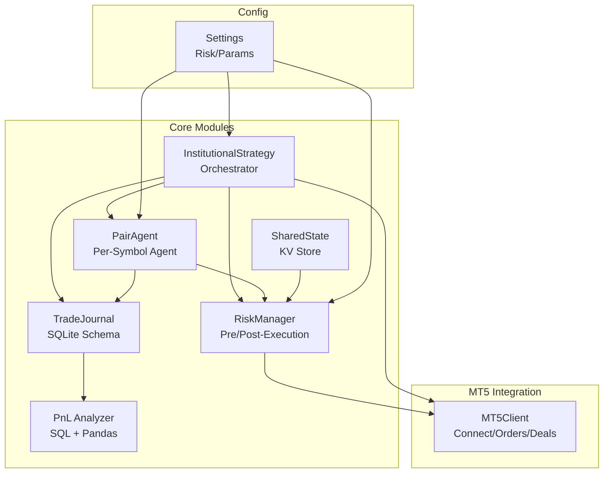
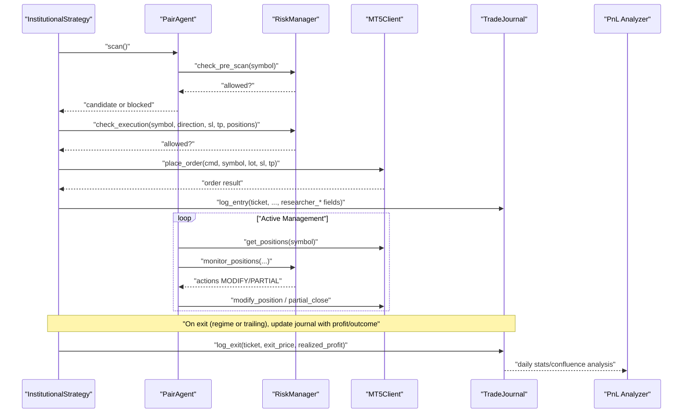
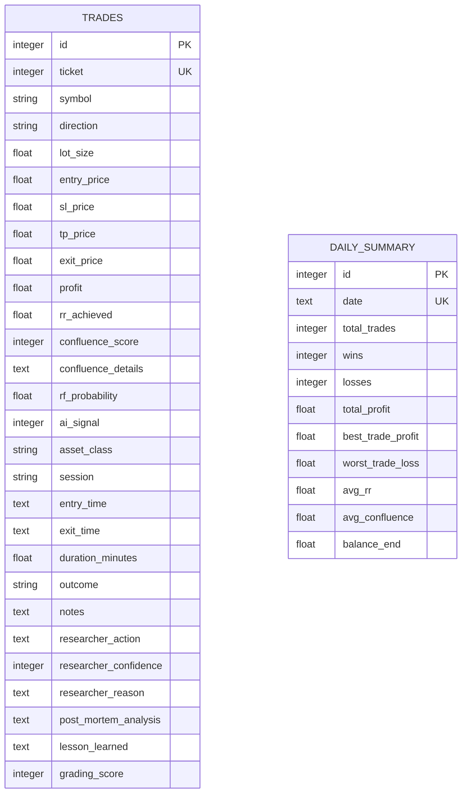
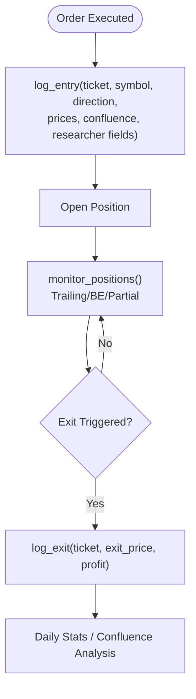
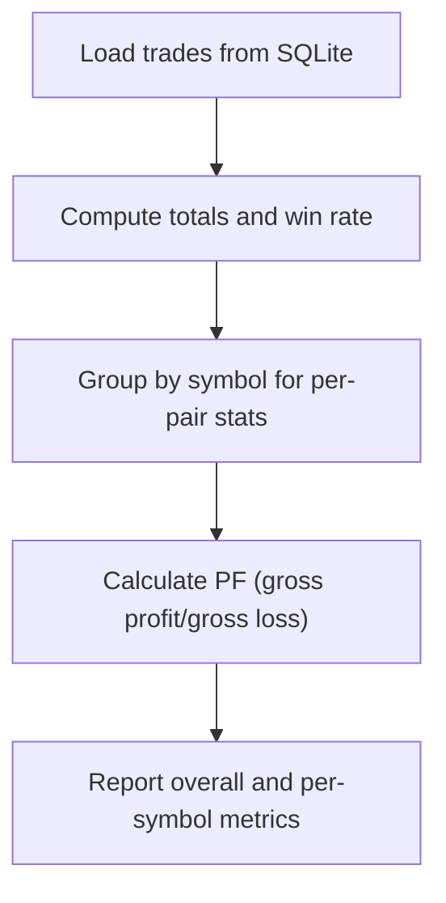
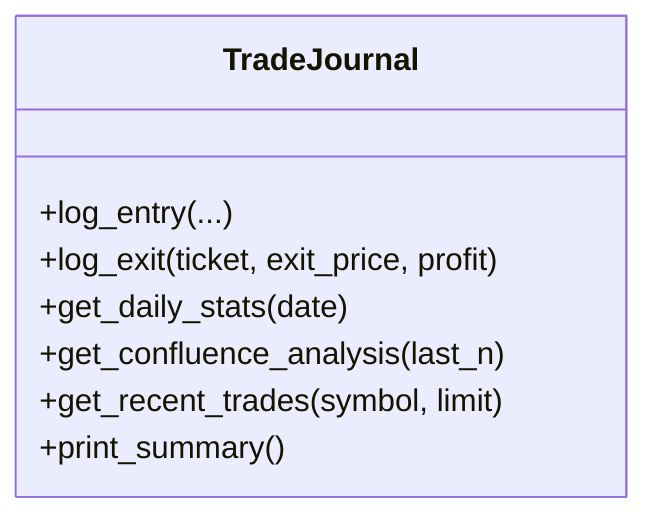
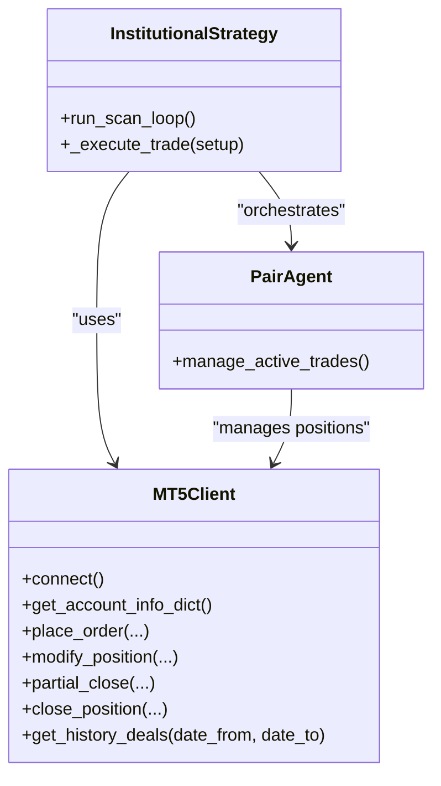
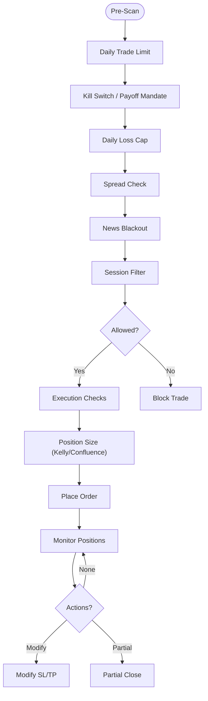
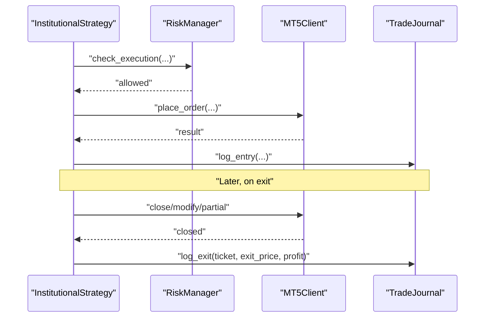
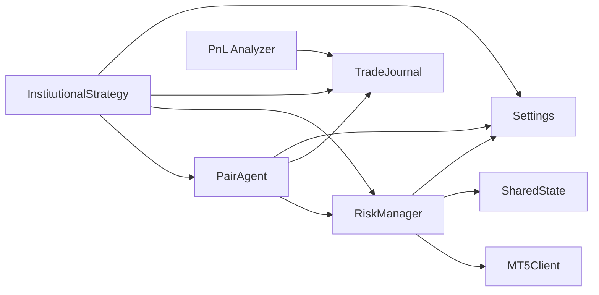

# Trade Journal and Analytics

<cite>
**Referenced Files in This Document**
- [trade_journal.py](file://utils/trade_journal.py)
- [analyze_pnl.py](file://utils/analyze_pnl.py)
- [mt5_client.py](file://execution/mt5_client.py)
- [risk_manager.py](file://utils/risk_manager.py)
- [settings.py](file://config/settings.py)
- [institutional_strategy.py](file://strategy/institutional_strategy.py)
- [pair_agent.py](file://strategy/pair_agent.py)
- [shared_state.py](file://utils/shared_state.py)
- [main.py](file://main.py)
</cite>

## Table of Contents
1. [Introduction](#introduction)
2. [Project Structure](#project-structure)
3. [Core Components](#core-components)
4. [Architecture Overview](#architecture-overview)
5. [Detailed Component Analysis](#detailed-component-analysis)
6. [Dependency Analysis](#dependency-analysis)
7. [Performance Considerations](#performance-considerations)
8. [Troubleshooting Guide](#troubleshooting-guide)
9. [Conclusion](#conclusion)
10. [Appendices](#appendices)

## Introduction
This document explains the trade journal system and performance analytics used in the automated trading framework. It covers the SQLite-based trade recording system, the trade journal schema, persistent storage of trade history, PnL analysis functions, trade journal queries, performance metrics extraction, and historical data management. It also documents the integration with MetaTrader 5 deal history, trade recording triggers, and the relationship between executed trades and recorded journal entries. Practical examples of trade journal queries, performance reporting, and analytical insights are included, along with maintenance, data retention considerations, and risk management integration.

## Project Structure
The trade journal and analytics functionality spans several modules:
- Trade journal persistence and queries
- PnL analysis and reporting
- MT5 integration for live execution and historical data
- Risk management and position sizing
- Strategy orchestration and agent coordination
- Shared state for cross-module persistence

**Diagram sources**
- [trade_journal.py](file://utils/trade_journal.py#L23-L101)
- [analyze_pnl.py](file://utils/analyze_pnl.py#L10-L28)
- [risk_manager.py](file://utils/risk_manager.py#L14-L50)
- [institutional_strategy.py](file://strategy/institutional_strategy.py#L49-L94)
- [pair_agent.py](file://strategy/pair_agent.py#L22-L54)
- [shared_state.py](file://utils/shared_state.py#L23-L40)
- [mt5_client.py](file://execution/mt5_client.py#L12-L27)
- [settings.py](file://config/settings.py#L1-L201)

**Section sources**
- [main.py](file://main.py#L19-L74)
- [settings.py](file://config/settings.py#L1-L201)

## Core Components
- TradeJournal: SQLite-backed trade logging and daily summaries, with entry/exit recording and confluence analysis.
- PnL Analyzer: SQL-based and pandas-based performance reporting across all trades and by symbol.
- MT5Client: Connection, order placement, position management, and historical deal retrieval.
- RiskManager: Pre-scan gating, execution checks, position sizing (including Kelly), trailing stops, partial closes, and kill switches.
- InstitutionalStrategy: Coordinates agents, manages scans, executes orders, and records journal entries.
- PairAgent: Per-symbol intelligence, active trade management, and circuit breaker logic.
- SharedState: Persistent key-value store for cross-module state sharing.

**Section sources**
- [trade_journal.py](file://utils/trade_journal.py#L23-L101)
- [analyze_pnl.py](file://utils/analyze_pnl.py#L12-L80)
- [mt5_client.py](file://execution/mt5_client.py#L12-L385)
- [risk_manager.py](file://utils/risk_manager.py#L14-L549)
- [institutional_strategy.py](file://strategy/institutional_strategy.py#L49-L436)
- [pair_agent.py](file://strategy/pair_agent.py#L22-L432)
- [shared_state.py](file://utils/shared_state.py#L23-L110)

## Architecture Overview
The system integrates live MT5 execution with a persistent trade journal. Orders placed by the strategy trigger a journal entry. When positions close (either by trailing/BE/partial or regime exit), the journal is updated with realized profit/loss and outcome. RiskManager enforces constraints and computes position sizes, while PnL analysis reads from the journal for reporting.

**Diagram sources**
- [institutional_strategy.py](file://strategy/institutional_strategy.py#L331-L436)
- [pair_agent.py](file://strategy/pair_agent.py#L297-L376)
- [risk_manager.py](file://utils/risk_manager.py#L237-L549)
- [mt5_client.py](file://execution/mt5_client.py#L214-L385)
- [trade_journal.py](file://utils/trade_journal.py#L103-L164)

## Detailed Component Analysis

### Trade Journal Schema and Storage
The trade journal persists trades and daily summaries in SQLite. Key tables:
- trades: Records each trade’s entry/exit, outcomes, durations, and researcher annotations.
- daily_summary: Stores daily aggregates for quick dashboards.

Key fields include ticket, symbol, direction, lot_size, entry/exit prices, profit, RR achieved, confluence score/details, researcher action/confidence/reason, outcome, and timestamps.

**Diagram sources**
- [trade_journal.py](file://utils/trade_journal.py#L37-L98)

**Section sources**
- [trade_journal.py](file://utils/trade_journal.py#L20-L101)

### Trade Recording Triggers and Lifecycle
- Entry: After a successful order placement, the strategy logs an entry with ticket, symbol, direction, prices, confluence score/detials, researcher fields, and sets outcome to OPEN.
- Exit: On position closure (via trailing/BE/partial or regime exit), the journal updates with exit_price, realized profit, RR achieved, outcome, and duration.

**Diagram sources**
- [institutional_strategy.py](file://strategy/institutional_strategy.py#L331-L436)
- [pair_agent.py](file://strategy/pair_agent.py#L297-L376)
- [trade_journal.py](file://utils/trade_journal.py#L103-L164)

**Section sources**
- [institutional_strategy.py](file://strategy/institutional_strategy.py#L331-L436)
- [pair_agent.py](file://strategy/pair_agent.py#L297-L376)
- [trade_journal.py](file://utils/trade_journal.py#L103-L164)

### PnL Analysis Functions
- SQL-based daily stats: Computes total trades, wins/losses, total profit, average RR, and average confluence for a given date.
- Confluence analysis: Parses stored JSON confluence details and computes win rates per factor for the latest N trades.
- Pandas-based analyzer: Loads all trades, computes overall PnL, win rate, average win/loss, and per-symbol performance with profit factor.

**Diagram sources**
- [analyze_pnl.py](file://utils/analyze_pnl.py#L12-L78)
- [trade_journal.py](file://utils/trade_journal.py#L166-L195)
- [trade_journal.py](file://utils/trade_journal.py#L197-L246)

**Section sources**
- [analyze_pnl.py](file://utils/analyze_pnl.py#L12-L80)
- [trade_journal.py](file://utils/trade_journal.py#L166-L246)

### Trade Journal Queries and Performance Metrics Extraction
- Daily stats: Aggregates counts, wins/losses, total profit, average RR, and average confluence for a given date.
- Confluence analysis: Parses confluence_details JSON and computes factor-wise win rates for the last N trades.
- Recent trades: Retrieves last N outcomes/profits/time for a symbol to support agent self-correction and circuit breakers.
- Summary printing: Prints a compact daily summary to console.

**Diagram sources**
- [trade_journal.py](file://utils/trade_journal.py#L23-L274)

**Section sources**
- [trade_journal.py](file://utils/trade_journal.py#L166-L274)

### Historical Data Management and MT5 Integration
- MT5Client provides:
  - Connection and account info retrieval
  - Order placement (market and pending)
  - Position modification (SL/TP)
  - Partial closing and full closing
  - Historical deals retrieval for daily PnL checks
- InstitutionalStrategy coordinates scanning, execution, and journal logging.
- PairAgent manages active positions, applies trailing stops/BE/partial, and exits on regime shifts.

**Diagram sources**
- [mt5_client.py](file://execution/mt5_client.py#L12-L385)
- [institutional_strategy.py](file://strategy/institutional_strategy.py#L99-L330)
- [pair_agent.py](file://strategy/pair_agent.py#L297-L376)

**Section sources**
- [mt5_client.py](file://execution/mt5_client.py#L12-L385)
- [institutional_strategy.py](file://strategy/institutional_strategy.py#L99-L330)
- [pair_agent.py](file://strategy/pair_agent.py#L297-L376)

### Risk Management and Position Sizing
- Pre-scan checks: Daily trade limit, kill switch, payoff mandate, daily loss cap, spread thresholds, news blackout, session filters.
- Execution checks: Max concurrent trades, live correlation conflicts, profitability buffer.
- Position sizing: Kelly Criterion fallback to confluence tiers; tail risk clamping for high-volatility symbols.
- Active management: Trailing stops (ATR-based or fixed%), break-even moves, partial profit taking.

**Diagram sources**
- [risk_manager.py](file://utils/risk_manager.py#L51-L396)
- [mt5_client.py](file://execution/mt5_client.py#L214-L385)

**Section sources**
- [risk_manager.py](file://utils/risk_manager.py#L51-L396)
- [mt5_client.py](file://execution/mt5_client.py#L137-L385)

### Relationship Between Executed Trades and Journal Entries
- Execution path: Strategy scans, validates via RiskManager, places order, logs entry immediately after order success.
- Exit path: PairAgent monitors positions; on exit (trailing/BE/partial/regime), MT5Client executes closure; Strategy updates journal with realized profit/outcome.

**Diagram sources**
- [institutional_strategy.py](file://strategy/institutional_strategy.py#L331-L436)
- [mt5_client.py](file://execution/mt5_client.py#L214-L385)
- [trade_journal.py](file://utils/trade_journal.py#L103-L164)

**Section sources**
- [institutional_strategy.py](file://strategy/institutional_strategy.py#L331-L436)
- [trade_journal.py](file://utils/trade_journal.py#L103-L164)

### Examples of Trade Journal Queries and Reporting
- Daily summary query: Aggregates counts, wins/losses, total profit, average RR, and average confluence for a given date.
- Confluence factor analysis: Parses JSON confluence details and computes factor-wise win rates for the last N trades.
- Recent trades: Retrieves last N outcomes/profits/time for a symbol to inform agent behavior.
- PnL report: Overall PnL, total trades, win rate, average win/loss, and per-symbol PnL with profit factor.

These are implemented via SQL queries in the TradeJournal and via pandas groupby aggregations in the PnL analyzer.

**Section sources**
- [trade_journal.py](file://utils/trade_journal.py#L166-L246)
- [analyze_pnl.py](file://utils/analyze_pnl.py#L12-L78)

### Analytical Insights and Maintenance
- Confluence factor analysis helps identify which factors correlate with winning trades, enabling adaptive gating.
- Daily summaries enable quick dashboards and session-based performance monitoring.
- Circuit breakers and kill switches protect against prolonged losing streaks.
- SharedState enables cross-module persistence for global risk controls and whiteboard-style coordination.

**Section sources**
- [trade_journal.py](file://utils/trade_journal.py#L197-L246)
- [pair_agent.py](file://strategy/pair_agent.py#L377-L398)
- [shared_state.py](file://utils/shared_state.py#L23-L110)

## Dependency Analysis
The modules depend on each other as follows:
- InstitutionalStrategy depends on PairAgent, RiskManager, MT5Client, and TradeJournal.
- PairAgent depends on RiskManager, MT5Client, and TradeJournal.
- RiskManager depends on MT5Client and settings.
- PnL Analyzer depends on TradeJournal.
- SharedState is used by RiskManager for persistent counters.

**Diagram sources**
- [institutional_strategy.py](file://strategy/institutional_strategy.py#L49-L94)
- [pair_agent.py](file://strategy/pair_agent.py#L22-L54)
- [risk_manager.py](file://utils/risk_manager.py#L14-L50)
- [mt5_client.py](file://execution/mt5_client.py#L12-L27)
- [analyze_pnl.py](file://utils/analyze_pnl.py#L10-L10)
- [shared_state.py](file://utils/shared_state.py#L23-L40)
- [settings.py](file://config/settings.py#L1-L201)

**Section sources**
- [institutional_strategy.py](file://strategy/institutional_strategy.py#L49-L94)
- [pair_agent.py](file://strategy/pair_agent.py#L22-L54)
- [risk_manager.py](file://utils/risk_manager.py#L14-L50)
- [mt5_client.py](file://execution/mt5_client.py#L12-L27)
- [analyze_pnl.py](file://utils/analyze_pnl.py#L10-L10)
- [shared_state.py](file://utils/shared_state.py#L23-L40)
- [settings.py](file://config/settings.py#L1-L201)

## Performance Considerations
- SQLite I/O: Journal writes occur on entry/exit; batch reads for daily stats and confluence analysis are efficient due to indexed fields and date filtering.
- Pandas aggregation: Loading all trades into memory is acceptable for moderate histories; consider chunking for very large datasets.
- MT5 polling: Frequent position checks and ATR computations are optimized with caching and minimal bar fetches.
- Risk checks: Pre-scan and execution checks prevent unnecessary order attempts, reducing latency and slippage risk.

[No sources needed since this section provides general guidance]

## Troubleshooting Guide
- Database connectivity: Ensure the SQLite database path is writable and accessible.
- Journal errors: Exceptions during log_entry/log_exit are caught and logged; verify ticket uniqueness and JSON serialization of confluence details.
- MT5 connection: Confirm credentials and server path; verify symbol visibility and trade mode.
- Risk blocking: Review pre-scan and execution reasons; adjust thresholds or overrides in settings.
- PnL analyzer: If no trades are found, confirm the database exists and contains entries.

**Section sources**
- [trade_journal.py](file://utils/trade_journal.py#L111-L130)
- [trade_journal.py](file://utils/trade_journal.py#L137-L164)
- [mt5_client.py](file://execution/mt5_client.py#L18-L27)
- [risk_manager.py](file://utils/risk_manager.py#L51-L163)
- [analyze_pnl.py](file://utils/analyze_pnl.py#L13-L32)

## Conclusion
The trade journal system provides a robust foundation for persistent trade recording, daily performance monitoring, and confluence-driven insights. Combined with MT5 integration and risk management, it enables disciplined execution, adaptive sizing, and continuous self-reflection. The PnL analyzer offers quick, actionable reports, while SharedState supports cross-module coordination. Together, these components form a cohesive pipeline from signal generation to execution, monitoring, and analytics.

[No sources needed since this section summarizes without analyzing specific files]

## Appendices

### Appendix A: Trade Journal Schema Reference
- trades: Unique ticket, symbol, direction, prices, lot size, confluence score/details, researcher annotations, outcome, timestamps, profit/RR/duration.
- daily_summary: Unique date, counts, PnL, best/worst trade, averages.

**Section sources**
- [trade_journal.py](file://utils/trade_journal.py#L37-L98)

### Appendix B: Risk and Position Sizing Parameters
- Daily trade limits, kill switches, payoff mandates, spread caps, session filters, trailing stops, partial close fractions, and Kelly parameters are configurable in settings.

**Section sources**
- [settings.py](file://config/settings.py#L69-L149)
- [risk_manager.py](file://utils/risk_manager.py#L341-L396)