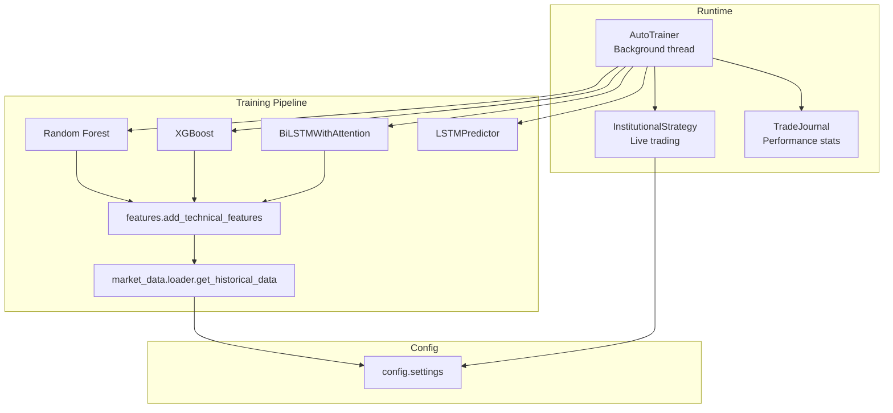
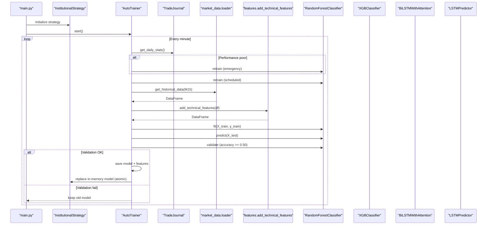
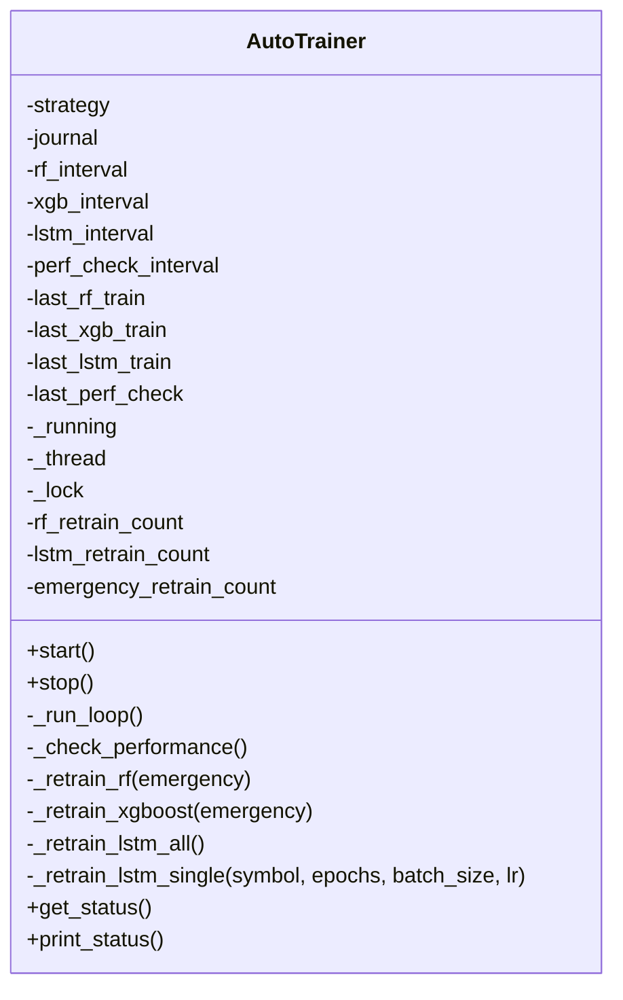
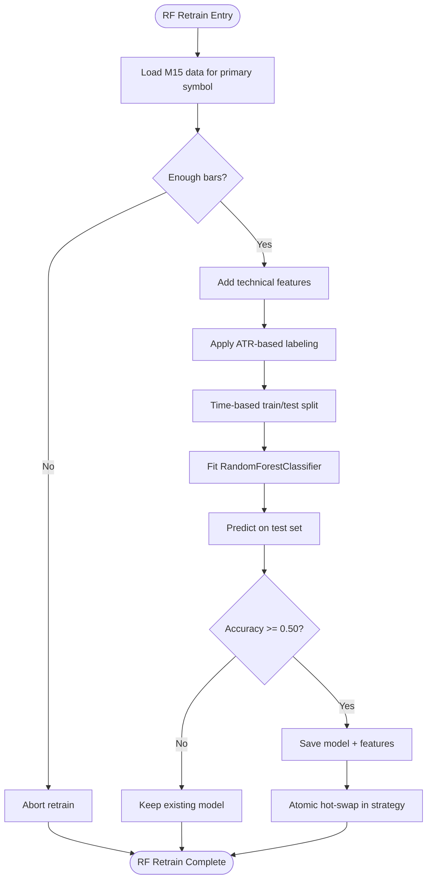
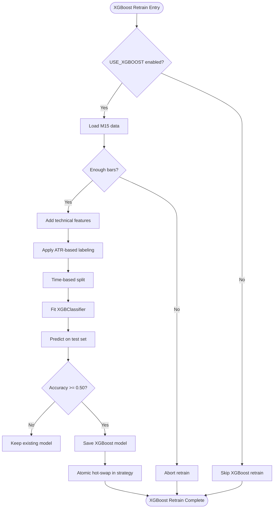
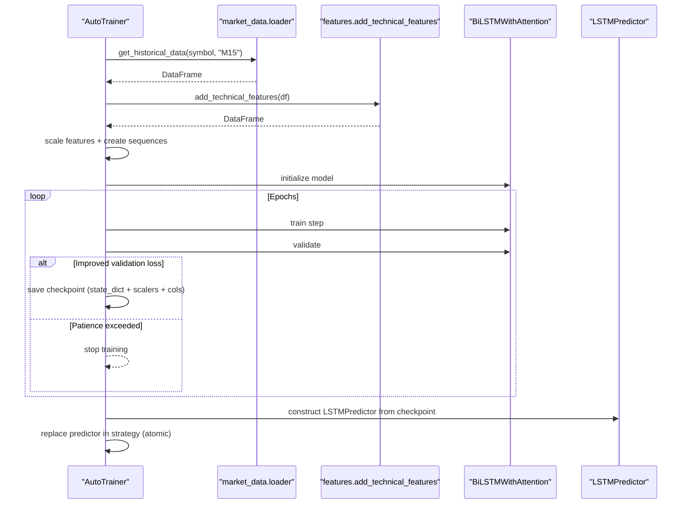
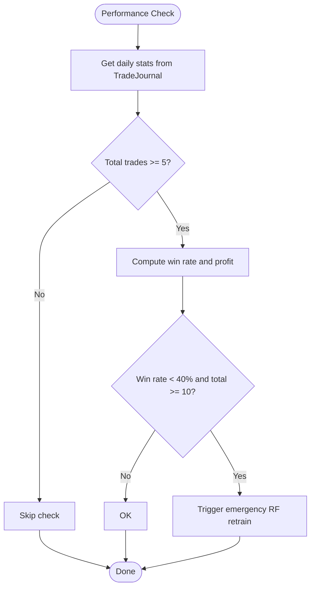
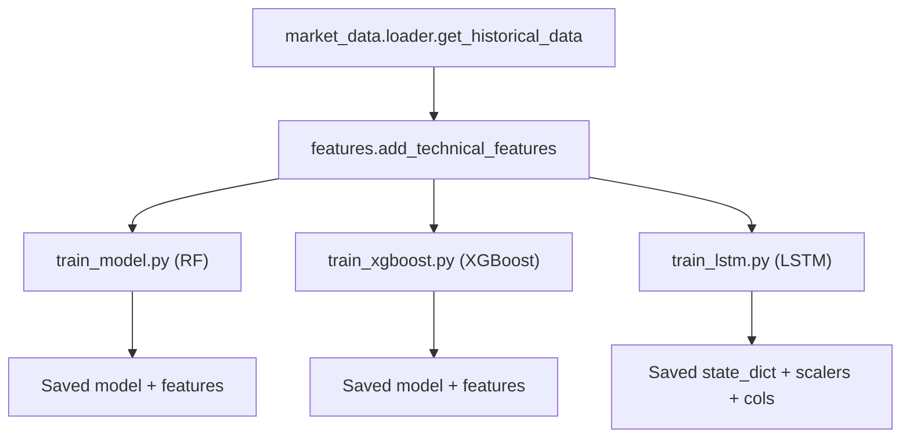
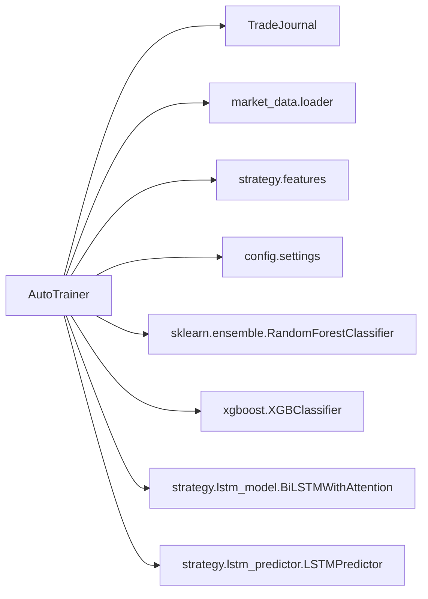

# Automated Model Retraining

<cite>
**Referenced Files in This Document**
- [auto_trainer.py](file://utils/auto_trainer.py)
- [lstm_model.py](file://strategy/lstm_model.py)
- [lstm_predictor.py](file://strategy/lstm_predictor.py)
- [features.py](file://strategy/features.py)
- [settings.py](file://config/settings.py)
- [loader.py](file://market_data/loader.py)
- [train_model.py](file://train_model.py)
- [train_xgboost.py](file://train_xgboost.py)
- [train_lstm.py](file://train_lstm.py)
- [main.py](file://main.py)
- [institutional_strategy.py](file://strategy/institutional_strategy.py)
</cite>

## Table of Contents
1. [Introduction](#introduction)
2. [Project Structure](#project-structure)
3. [Core Components](#core-components)
4. [Architecture Overview](#architecture-overview)
5. [Detailed Component Analysis](#detailed-component-analysis)
6. [Dependency Analysis](#dependency-analysis)
7. [Performance Considerations](#performance-considerations)
8. [Troubleshooting Guide](#troubleshooting-guide)
9. [Conclusion](#conclusion)
10. [Appendices](#appendices)

## Introduction
This document describes the automated model retraining system that continuously improves trading models during live operation. It covers the AutoTrainer class that orchestrates scheduled retraining of Random Forest, XGBoost, and LSTM models, the hot-swap mechanism for atomic model replacement, performance validation thresholds, and emergency retraining triggers. It also documents the training pipeline architecture, data preparation, feature engineering, and operational specifications such as retraining intervals, validation criteria, and resource requirements. Practical guidance is included for configuring schedules, monitoring progress, handling deployment failures, ensuring thread safety, and robust error handling.

## Project Structure
The automated retraining system spans several modules:
- AutoTrainer runs in a background thread and coordinates periodic retraining and performance checks.
- Feature engineering is centralized in the features module.
- Data loading uses the market_data loader with MT5 connectivity.
- Model-specific training scripts exist for offline training and validation.
- LSTM architecture and predictor are defined under strategy.
- Configuration constants and paths are defined in settings.

**Diagram sources**
- [auto_trainer.py](file://utils/auto_trainer.py#L80-L136)
- [features.py](file://strategy/features.py#L6-L98)
- [loader.py](file://market_data/loader.py#L40-L59)
- [settings.py](file://config/settings.py#L169-L196)
- [lstm_model.py](file://strategy/lstm_model.py#L27-L69)
- [lstm_predictor.py](file://strategy/lstm_predictor.py#L9-L36)

**Section sources**
- [auto_trainer.py](file://utils/auto_trainer.py#L1-L136)
- [features.py](file://strategy/features.py#L1-L98)
- [loader.py](file://market_data/loader.py#L1-L59)
- [settings.py](file://config/settings.py#L169-L196)

## Core Components
- AutoTrainer: Background thread that schedules and executes retraining for Random Forest, XGBoost, and LSTM models. It performs performance checks and triggers emergency retraining when win rate falls below threshold. It uses a lock for thread-safe hot-swapping of models.
- Feature Engineering: Comprehensive TA indicators and structured market features (order blocks, fair value gaps, liquidity levels) applied consistently across training and inference.
- Data Loader: MT5 historical data retrieval with automatic connection and multi-timeframe support.
- LSTM Architecture and Predictor: Bidirectional LSTM with attention for sequence modeling and a predictor wrapper for inference.
- Configuration: Centralized settings for model paths, intervals, ATR thresholds, and LSTM parameters.

**Section sources**
- [auto_trainer.py](file://utils/auto_trainer.py#L80-L136)
- [features.py](file://strategy/features.py#L6-L98)
- [loader.py](file://market_data/loader.py#L40-L59)
- [lstm_model.py](file://strategy/lstm_model.py#L27-L69)
- [lstm_predictor.py](file://strategy/lstm_predictor.py#L9-L36)
- [settings.py](file://config/settings.py#L169-L196)

## Architecture Overview
The AutoTrainer operates as a daemon thread inside the live trading process. It periodically:
- Evaluates recent performance via TradeJournal.
- Retrains Random Forest and XGBoost classifiers using M15 data.
- Retrains LSTM models for key symbols using M15 data with sequence modeling.
- Validates new models against baselines and hot-swaps them atomically.

**Diagram sources**
- [main.py](file://main.py#L57-L63)
- [auto_trainer.py](file://utils/auto_trainer.py#L137-L172)
- [auto_trainer.py](file://utils/auto_trainer.py#L175-L193)
- [auto_trainer.py](file://utils/auto_trainer.py#L196-L275)
- [auto_trainer.py](file://utils/auto_trainer.py#L278-L347)
- [auto_trainer.py](file://utils/auto_trainer.py#L351-L494)
- [loader.py](file://market_data/loader.py#L40-L59)
- [features.py](file://strategy/features.py#L6-L98)

## Detailed Component Analysis

### AutoTrainer Class
- Responsibilities:
  - Periodic retraining scheduling for RF, XGBoost, and LSTM.
  - Performance monitoring and emergency retraining trigger.
  - Atomic hot-swap of models with thread safety.
  - Status reporting and runtime statistics.
- Scheduling:
  - RF: every rf_interval_hours hours.
  - XGBoost: every xgb_interval_hours hours.
  - LSTM: every lstm_interval_hours hours.
  - Performance check: every perf_check_minutes minutes.
- Validation thresholds:
  - RF/XGBoost: minimum 0.50 accuracy on held-out test set.
  - LSTM: early stopping with patience; best validation loss checkpoint saved.
- Hot-swap mechanism:
  - Uses a threading lock to serialize model replacement.
  - Saves artifacts to disk and updates in-memory references atomically.
- Emergency retraining:
  - Triggered when win rate < 40% over last 20 trades and sufficient samples.

**Diagram sources**
- [auto_trainer.py](file://utils/auto_trainer.py#L80-L136)
- [auto_trainer.py](file://utils/auto_trainer.py#L137-L172)
- [auto_trainer.py](file://utils/auto_trainer.py#L175-L193)
- [auto_trainer.py](file://utils/auto_trainer.py#L196-L275)
- [auto_trainer.py](file://utils/auto_trainer.py#L278-L347)
- [auto_trainer.py](file://utils/auto_trainer.py#L351-L494)

**Section sources**
- [auto_trainer.py](file://utils/auto_trainer.py#L80-L136)
- [auto_trainer.py](file://utils/auto_trainer.py#L137-L172)
- [auto_trainer.py](file://utils/auto_trainer.py#L175-L193)
- [auto_trainer.py](file://utils/auto_trainer.py#L196-L275)
- [auto_trainer.py](file://utils/auto_trainer.py#L278-L347)
- [auto_trainer.py](file://utils/auto_trainer.py#L351-L494)

### Random Forest Retraining
- Data: M15 bars for the primary symbol.
- Features: TA indicators and structured features generated by add_technical_features.
- Labeling: ATR-based barriers aligning with live trading logic.
- Validation: Accuracy on time-based split must exceed 0.50.
- Hot-swap: Saves model and feature columns, then replaces in-memory model atomically.

**Diagram sources**
- [auto_trainer.py](file://utils/auto_trainer.py#L196-L275)
- [features.py](file://strategy/features.py#L6-L98)
- [loader.py](file://market_data/loader.py#L40-L59)
- [settings.py](file://config/settings.py#L169-L176)

**Section sources**
- [auto_trainer.py](file://utils/auto_trainer.py#L196-L275)
- [features.py](file://strategy/features.py#L6-L98)
- [loader.py](file://market_data/loader.py#L40-L59)
- [settings.py](file://config/settings.py#L169-L176)

### XGBoost Retraining
- Conditional: Enabled by USE_XGBOOST setting.
- Data and features: Same pipeline as RF.
- Labeling: ATR-based labeling.
- Validation: Accuracy threshold 0.50.
- Hot-swap: Saves XGBoost model and replaces in-memory reference atomically.

**Diagram sources**
- [auto_trainer.py](file://utils/auto_trainer.py#L278-L347)
- [settings.py](file://config/settings.py#L176-L176)

**Section sources**
- [auto_trainer.py](file://utils/auto_trainer.py#L278-L347)
- [settings.py](file://config/settings.py#L176-L176)

### LSTM Retraining
- Scope: Retrains separate models for key symbols (EURUSD, XAUUSD, BTCUSD, GBPUSD).
- Data: M15 bars with feature scaling and sequence creation.
- Model: BiLSTMWithAttention with attention mechanism.
- Training: Early stopping with patience; best validation loss checkpoint saved.
- Hot-swap: Creates a new LSTMPredictor and replaces the symbol’s predictor atomically.

**Diagram sources**
- [auto_trainer.py](file://utils/auto_trainer.py#L351-L494)
- [lstm_model.py](file://strategy/lstm_model.py#L27-L69)
- [lstm_predictor.py](file://strategy/lstm_predictor.py#L9-L36)
- [loader.py](file://market_data/loader.py#L40-L59)
- [features.py](file://strategy/features.py#L6-L98)
- [settings.py](file://config/settings.py#L192-L196)

**Section sources**
- [auto_trainer.py](file://utils/auto_trainer.py#L351-L494)
- [lstm_model.py](file://strategy/lstm_model.py#L27-L69)
- [lstm_predictor.py](file://strategy/lstm_predictor.py#L9-L36)
- [loader.py](file://market_data/loader.py#L40-L59)
- [features.py](file://strategy/features.py#L6-L98)
- [settings.py](file://config/settings.py#L192-L196)

### Performance Monitoring and Emergency Retraining
- Frequency: Every perf_check_minutes minutes.
- Metrics: Win rate and total profit from TradeJournal daily stats.
- Trigger: Win rate < 40% over last 20 trades (with sufficient sample size).
- Action: Emergency RF retrain with hot-swap.

**Diagram sources**
- [auto_trainer.py](file://utils/auto_trainer.py#L175-L193)

**Section sources**
- [auto_trainer.py](file://utils/auto_trainer.py#L175-L193)

### Training Pipeline Architecture
- Data Preparation:
  - Historical data retrieval via MT5.
  - Feature engineering with TA and structured levels.
  - Labeling using ATR-based barriers.
- Model Training:
  - Random Forest and XGBoost: tabular classification with time-based splits.
  - LSTM: sequence modeling with attention and early stopping.
- Offline Scripts:
  - train_model.py: M1 scalping model training.
  - train_xgboost.py: institutional ensemble training.
  - train_lstm.py: multi-symbol LSTM training.

**Diagram sources**
- [loader.py](file://market_data/loader.py#L40-L59)
- [features.py](file://strategy/features.py#L6-L98)
- [train_model.py](file://train_model.py#L108-L231)
- [train_xgboost.py](file://train_xgboost.py#L74-L210)
- [train_lstm.py](file://train_lstm.py#L51-L186)

**Section sources**
- [loader.py](file://market_data/loader.py#L40-L59)
- [features.py](file://strategy/features.py#L6-L98)
- [train_model.py](file://train_model.py#L108-L231)
- [train_xgboost.py](file://train_xgboost.py#L74-L210)
- [train_lstm.py](file://train_lstm.py#L51-L186)

## Dependency Analysis
- AutoTrainer depends on:
  - TradeJournal for performance metrics.
  - market_data.loader for MT5 historical data.
  - strategy.features for feature engineering.
  - config.settings for paths and thresholds.
  - strategy.lstm_model and strategy.lstm_predictor for LSTM components.
- Thread safety:
  - Uses a threading lock around hot-swap operations to prevent race conditions.
- External libraries:
  - scikit-learn for RF and XGBoost.
  - torch for LSTM training and inference.
  - pandas/numpy for data manipulation.

**Diagram sources**
- [auto_trainer.py](file://utils/auto_trainer.py#L34-L44)
- [settings.py](file://config/settings.py#L169-L196)

**Section sources**
- [auto_trainer.py](file://utils/auto_trainer.py#L34-L44)
- [settings.py](file://config/settings.py#L169-L196)

## Performance Considerations
- Retraining Intervals:
  - RF: default 4 hours.
  - XGBoost: default 6 hours.
  - LSTM: default 8 hours.
  - Performance check: default 30 minutes.
- Validation Criteria:
  - RF/XGBoost: minimum 0.50 accuracy.
  - LSTM: best validation loss checkpoint saved with early stopping.
- Resource Requirements:
  - CPU: sufficient cores for scikit-learn training.
  - GPU: optional for LSTM training/inference; fallback to CPU supported.
  - Disk: model artifacts and checkpoints stored under models/.
- Data Volume:
  - HISTORY_BARS determines the amount of historical data fetched per cycle.

[No sources needed since this section provides general guidance]

## Troubleshooting Guide
- Data Issues:
  - Insufficient bars: retraining aborts gracefully if less than minimum required.
  - MT5 connectivity: loader handles re-initialization; ensure credentials and path in settings.
- Model Validation Failures:
  - If validation threshold not met, the system keeps the old model and logs the event.
- Hot-Swap Failures:
  - Lock prevents concurrent writes; ensure no external writes to model paths.
  - For LSTM, predictor construction errors are caught and logged; model artifacts remain intact.
- Monitoring:
  - Use trainer.get_status() and trainer.print_status() to observe next retrain timers and counts.
- Emergency Retraining:
  - Triggered automatically when win rate drops below threshold; verify performance metrics.

**Section sources**
- [auto_trainer.py](file://utils/auto_trainer.py#L196-L275)
- [auto_trainer.py](file://utils/auto_trainer.py#L278-L347)
- [auto_trainer.py](file://utils/auto_trainer.py#L351-L494)
- [loader.py](file://market_data/loader.py#L24-L37)

## Conclusion
The automated model retraining system provides a robust, thread-safe framework for continuous model improvement during live trading. Scheduled retraining of RF, XGBoost, and LSTM models, combined with performance monitoring and emergency triggers, ensures adaptability to evolving market conditions. The hot-swap mechanism guarantees atomic model replacement, minimizing downtime and risk. With clear validation thresholds and comprehensive monitoring, the system balances reliability with adaptive learning.

[No sources needed since this section summarizes without analyzing specific files]

## Appendices

### Implementation Examples

- Configure Training Schedules
  - Adjust intervals via AutoTrainer constructor parameters (rf_interval_hours, xgb_interval_hours, lstm_interval_hours, perf_check_minutes).
  - Example path: [AutoTrainer.__init__](file://utils/auto_trainer.py#L93-L103)

- Monitor Retraining Progress
  - Retrieve status dictionary: [AutoTrainer.get_status](file://utils/auto_trainer.py#L498-L509)
  - Print compact status: [AutoTrainer.print_status](file://utils/auto_trainer.py#L511-L517)
  - Observe printed logs during training cycles.

- Handle Deployment Failures
  - RF/XGBoost: If accuracy below threshold, old model is retained; review features and labeling.
    - Reference: [RF validation and hot-swap](file://utils/auto_trainer.py#L249-L271)
    - Reference: [XGBoost validation and hot-swap](file://utils/auto_trainer.py#L329-L344)
  - LSTM: If predictor construction fails, artifacts are preserved; investigate checkpoint files.
    - Reference: [LSTM hot-swap and predictor creation](file://utils/auto_trainer.py#L477-L487)

- Thread Safety and Locking
  - Hot-swaps are guarded by a threading lock to prevent race conditions.
    - Reference: [Lock usage in RF hot-swap](file://utils/auto_trainer.py#L259-L267)
    - Reference: [Lock usage in XGB hot-swap](file://utils/auto_trainer.py#L339-L342)
    - Reference: [Lock usage in LSTM hot-swap](file://utils/auto_trainer.py#L477-L487)

- Error Handling Strategies
  - Exceptions in training loops are caught, logged, and the loop continues after a delay.
    - Reference: [Main loop exception handling](file://utils/auto_trainer.py#L169-L171)
  - Data loading and feature engineering errors are handled with graceful skips.
    - Reference: [RF/XGBoost data checks](file://utils/auto_trainer.py#L208-L210)
    - Reference: [LSTM data checks](file://utils/auto_trainer.py#L376-L379)

- Technical Specifications
  - Retraining Intervals:
    - RF: [AutoTrainer.__init__](file://utils/auto_trainer.py#L94-L102)
    - XGBoost: [AutoTrainer.__init__](file://utils/auto_trainer.py#L95-L102)
    - LSTM: [AutoTrainer.__init__](file://utils/auto_trainer.py#L96-L102)
    - Performance check: [AutoTrainer.__init__](file://utils/auto_trainer.py#L103-L103)
  - Validation Criteria:
    - RF/XGBoost: >= 0.50 accuracy threshold.
      - Reference: [RF validation](file://utils/auto_trainer.py#L249-L256)
      - Reference: [XGBoost validation](file://utils/auto_trainer.py#L334-L336)
    - LSTM: best validation loss checkpoint saved with early stopping.
      - Reference: [LSTM training loop](file://utils/auto_trainer.py#L436-L474)
  - Computational Resources:
    - CPU for RF/XGBoost; GPU optional for LSTM.
      - Reference: [LSTM device selection](file://utils/auto_trainer.py#L423-L423)
    - Disk storage for models and predictors.
      - Reference: [Model paths](file://config/settings.py#L174-L176)
      - Reference: [LSTM paths](file://config/settings.py#L194-L196)

- Data Preparation and Feature Engineering
  - Data loader and multi-timeframe support.
    - Reference: [Loader functions](file://market_data/loader.py#L40-L82)
  - Feature engineering pipeline.
    - Reference: [Feature functions](file://strategy/features.py#L6-L98)

- Offline Training Scripts
  - Random Forest (M1 scalping): [train_model.py](file://train_model.py#L108-L231)
  - XGBoost (institutional): [train_xgboost.py](file://train_xgboost.py#L74-L210)
  - LSTM (multi-symbol): [train_lstm.py](file://train_lstm.py#L51-L186)

**Section sources**
- [auto_trainer.py](file://utils/auto_trainer.py#L93-L103)
- [auto_trainer.py](file://utils/auto_trainer.py#L169-L171)
- [auto_trainer.py](file://utils/auto_trainer.py#L249-L271)
- [auto_trainer.py](file://utils/auto_trainer.py#L334-L344)
- [auto_trainer.py](file://utils/auto_trainer.py#L436-L474)
- [settings.py](file://config/settings.py#L174-L196)
- [loader.py](file://market_data/loader.py#L40-L82)
- [features.py](file://strategy/features.py#L6-L98)
- [train_model.py](file://train_model.py#L108-L231)
- [train_xgboost.py](file://train_xgboost.py#L74-L210)
- [train_lstm.py](file://train_lstm.py#L51-L186)