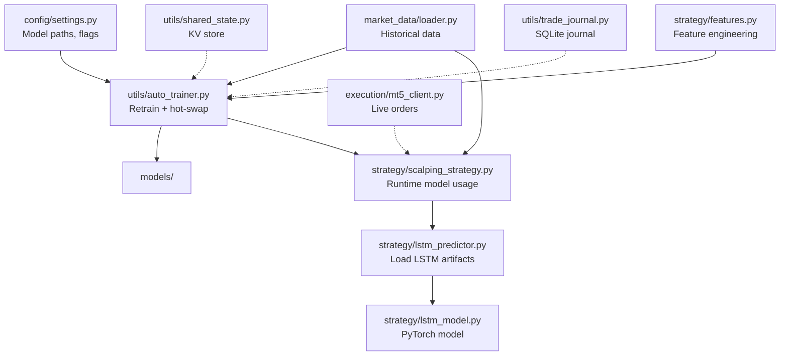
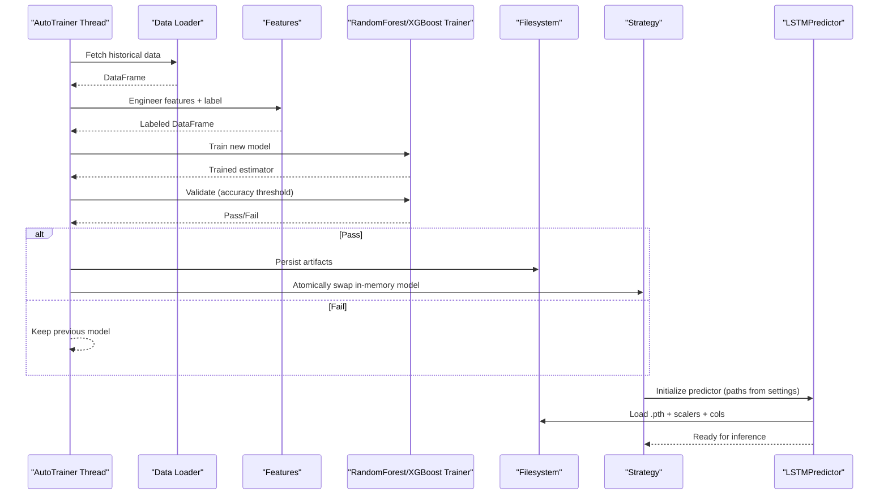
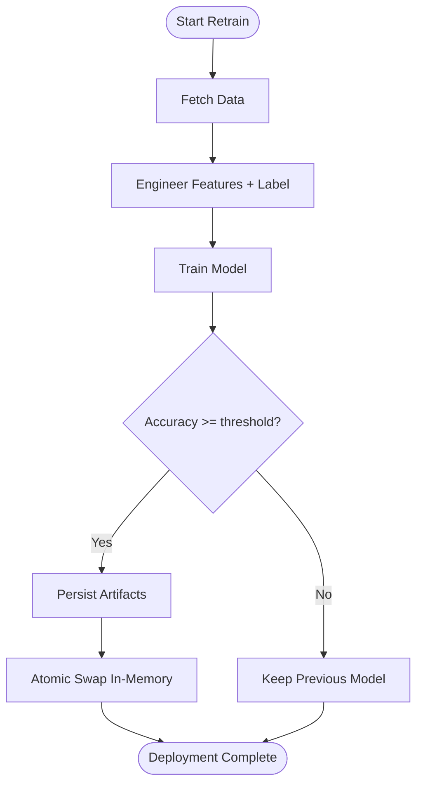
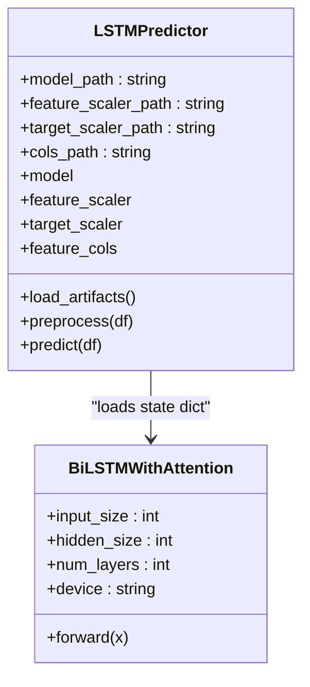
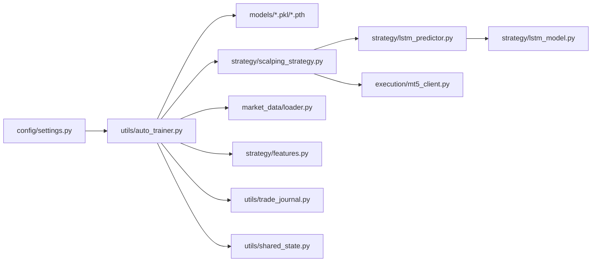

# Model Deployment and Management

<cite>
**Referenced Files in This Document**
- [settings.py](file://config/settings.py)
- [auto_trainer.py](file://utils/auto_trainer.py)
- [lstm_model.py](file://strategy/lstm_model.py)
- [lstm_predictor.py](file://strategy/lstm_predictor.py)
- [scalping_strategy.py](file://strategy/scalping_strategy.py)
- [loader.py](file://market_data/loader.py)
- [shared_state.py](file://utils/shared_state.py)
- [trade_journal.py](file://utils/trade_journal.py)
- [mt5_client.py](file://execution/mt5_client.py)
- [features.py](file://strategy/features.py)
- [main.py](file://main.py)
</cite>

## Table of Contents
1. [Introduction](#introduction)
2. [Project Structure](#project-structure)
3. [Core Components](#core-components)
4. [Architecture Overview](#architecture-overview)
5. [Detailed Component Analysis](#detailed-component-analysis)
6. [Dependency Analysis](#dependency-analysis)
7. [Performance Considerations](#performance-considerations)
8. [Troubleshooting Guide](#troubleshooting-guide)
9. [Conclusion](#conclusion)
10. [Appendices](#appendices)

## Introduction
This document describes the model deployment and management system within the self-learning framework. It covers model persistence, file formats, storage organization, hot-swap deployment, validation, rollback, versioning, compatibility, and dependency management. It also documents serialization formats, feature column preservation, scaler consistency, custom model loader patterns, deployment verification, automated rollback, lifecycle management, storage optimization, and integration with live trading operations.

## Project Structure
The model management system spans configuration, training, persistence, and runtime loading. Key areas:
- Configuration defines model paths and flags for enabling models.
- Auto-trainer performs scheduled and emergency retraining with atomic hot-swap.
- LSTM predictor loads PyTorch models and associated scalers and feature columns.
- Strategy integrates models into live trading decisions.
- Market data loader supplies training/inference data.
- Shared state and trade journal support operational observability and diagnostics.

**Diagram sources**
- [settings.py](file://config/settings.py#L173-L196)
- [auto_trainer.py](file://utils/auto_trainer.py#L80-L136)
- [lstm_model.py](file://strategy/lstm_model.py#L27-L70)
- [lstm_predictor.py](file://strategy/lstm_predictor.py#L9-L36)
- [scalping_strategy.py](file://strategy/scalping_strategy.py#L49-L106)
- [loader.py](file://market_data/loader.py#L40-L59)
- [shared_state.py](file://utils/shared_state.py#L23-L41)
- [trade_journal.py](file://utils/trade_journal.py#L23-L33)
- [mt5_client.py](file://execution/mt5_client.py#L12-L28)
- [features.py](file://strategy/features.py#L6-L98)

**Section sources**
- [settings.py](file://config/settings.py#L173-L196)
- [auto_trainer.py](file://utils/auto_trainer.py#L80-L136)
- [lstm_model.py](file://strategy/lstm_model.py#L27-L70)
- [lstm_predictor.py](file://strategy/lstm_predictor.py#L9-L36)
- [scalping_strategy.py](file://strategy/scalping_strategy.py#L49-L106)
- [loader.py](file://market_data/loader.py#L40-L59)
- [shared_state.py](file://utils/shared_state.py#L23-L41)
- [trade_journal.py](file://utils/trade_journal.py#L23-L33)
- [mt5_client.py](file://execution/mt5_client.py#L12-L28)
- [features.py](file://strategy/features.py#L6-L98)

## Core Components
- Configuration-driven model paths and flags:
  - Random Forest/XGBoost model paths and feature metadata.
  - LSTM model and scaler paths keyed by symbol.
  - Flags to enable/disable models.
- Auto-trainer orchestrates:
  - Scheduled retraining of Random Forest and XGBoost classifiers.
  - Periodic retraining of LSTM models per symbol.
  - Performance monitoring and emergency retraining.
  - Atomic hot-swap of models with validation.
- LSTM predictor:
  - Loads PyTorch state dicts and associated scalers and feature columns.
  - Applies preprocessing and inference with attention-aware sequences.
- Strategy integration:
  - Loads static models and optional AI predictors (Lag-Llama/Chronos, LSTM).
  - Combines signals with filters and executes orders via MT5 client.
- Data and feature pipeline:
  - Historical data retrieval from MT5.
  - Feature engineering aligned with training labels.
- Observability:
  - Shared state KV store for cross-agent state.
  - Trade journal for performance tracking and diagnostics.

**Section sources**
- [settings.py](file://config/settings.py#L173-L196)
- [auto_trainer.py](file://utils/auto_trainer.py#L80-L136)
- [lstm_predictor.py](file://strategy/lstm_predictor.py#L9-L36)
- [scalping_strategy.py](file://strategy/scalping_strategy.py#L49-L106)
- [loader.py](file://market_data/loader.py#L40-L59)
- [features.py](file://strategy/features.py#L6-L98)
- [shared_state.py](file://utils/shared_state.py#L23-L41)
- [trade_journal.py](file://utils/trade_journal.py#L23-L33)

## Architecture Overview
The system follows a self-learning architecture:
- Training runs in a background thread, periodically fetching data, engineering features, labeling, training, validating, and persisting models.
- Persistence uses joblib for tree models and PyTorch save/load for LSTM.
- Runtime loading uses predictor classes that encapsulate artifact discovery and validation.
- Hot-swap ensures zero downtime by replacing in-memory references atomically under a lock.
- Validation thresholds prevent regressions from entering production.
- Optional rollback is implicit: keep older artifacts on disk; hot-swap failure prevents activation.

**Diagram sources**
- [auto_trainer.py](file://utils/auto_trainer.py#L137-L172)
- [loader.py](file://market_data/loader.py#L40-L59)
- [features.py](file://strategy/features.py#L6-L98)
- [auto_trainer.py](file://utils/auto_trainer.py#L196-L275)
- [auto_trainer.py](file://utils/auto_trainer.py#L351-L495)
- [scalping_strategy.py](file://strategy/scalping_strategy.py#L79-L94)
- [lstm_predictor.py](file://strategy/lstm_predictor.py#L37-L78)

## Detailed Component Analysis

### Model Persistence and Storage Organization
- Random Forest/XGBoost:
  - Saved via joblib with model pickle and feature columns metadata.
  - Paths configured in settings; feature metadata stored alongside the model.
- LSTM:
  - Saved as PyTorch state dicts (.pth).
  - Feature scaler, target scaler, and feature columns saved as joblib pickles.
  - Files organized per symbol with consistent naming conventions.
- Storage layout:
  - Centralized under models/ with clear suffixes for artifacts.

Key paths and flags:
- Random Forest/XGBoost model paths and feature metadata.
- LSTM model and scaler paths keyed by symbol.

**Section sources**
- [settings.py](file://config/settings.py#L173-L196)
- [auto_trainer.py](file://utils/auto_trainer.py#L260-L267)
- [auto_trainer.py](file://utils/auto_trainer.py#L338-L344)
- [auto_trainer.py](file://utils/auto_trainer.py#L462-L470)
- [lstm_predictor.py](file://strategy/lstm_predictor.py#L25-L28)

### Serialization Formats and Artifact Contracts
- Tree-based models (Random Forest/XGBoost):
  - Format: joblib-pickled estimator plus feature columns metadata.
  - Contract: model file plus _features.pkl metadata.
- LSTM:
  - Format: PyTorch state dict plus scalers and feature columns.
  - Contract: .pth model file plus _scaler.pkl and _target_scaler.pkl and _cols.pkl.

Validation and compatibility:
- Feature columns are preserved and enforced during preprocessing.
- Scaler shapes validated implicitly by transformer usage; mismatches raise errors early.

**Section sources**
- [auto_trainer.py](file://utils/auto_trainer.py#L260-L267)
- [auto_trainer.py](file://utils/auto_trainer.py#L338-L344)
- [auto_trainer.py](file://utils/auto_trainer.py#L462-L470)
- [lstm_predictor.py](file://strategy/lstm_predictor.py#L58-L78)
- [lstm_predictor.py](file://strategy/lstm_predictor.py#L87-L100)

### Hot-Swap Deployment Process
- Random Forest/XGBoost:
  - Train new model, compute accuracy on held-out test set.
  - If accuracy meets threshold, persist artifacts and atomically replace in-memory model under a lock.
- LSTM:
  - Train on recent data, track best validation loss, persist checkpoint.
  - Construct new predictor from persisted artifacts and replace in strategy’s predictor map under a lock.

**Diagram sources**
- [auto_trainer.py](file://utils/auto_trainer.py#L196-L275)
- [auto_trainer.py](file://utils/auto_trainer.py#L278-L347)
- [auto_trainer.py](file://utils/auto_trainer.py#L476-L495)

**Section sources**
- [auto_trainer.py](file://utils/auto_trainer.py#L196-L275)
- [auto_trainer.py](file://utils/auto_trainer.py#L278-L347)
- [auto_trainer.py](file://utils/auto_trainer.py#L476-L495)

### Model Validation Procedures
- Accuracy threshold:
  - Random Forest/XGBoost: validation accuracy must exceed a minimum threshold before hot-swap.
- Loss threshold:
  - LSTM: early stopping based on validation loss; only the best checkpoint is persisted and swapped.
- Error handling:
  - Exceptions during training or validation lead to graceful failure and retention of prior model.

**Section sources**
- [auto_trainer.py](file://utils/auto_trainer.py#L249-L257)
- [auto_trainer.py](file://utils/auto_trainer.py#L329-L337)
- [auto_trainer.py](file://utils/auto_trainer.py#L458-L475)

### Rollback Mechanisms for Failed Deployments
- Automatic rollback:
  - If validation fails or exceptions occur, the system keeps the previous model and logs the event.
- Manual rollback:
  - Retain older artifacts on disk; hot-swap can be repeated with a known-good checkpoint.
- Strategy-level fallback:
  - If AI predictors fail to initialize, the strategy continues with available models (e.g., Random Forest alone).

**Section sources**
- [auto_trainer.py](file://utils/auto_trainer.py#L254-L257)
- [auto_trainer.py](file://utils/auto_trainer.py#L334-L337)
- [auto_trainer.py](file://utils/auto_trainer.py#L493-L495)
- [scalping_strategy.py](file://strategy/scalping_strategy.py#L60-L94)

### Model Versioning System and Compatibility Checking
- Versioning:
  - Files are named with semantic identifiers (e.g., scalper_v1.pkl, xgboost_v1.pkl, lstm_<symbol>_v1.pth).
  - Version increments are explicit in filenames; no automatic migration is implemented.
- Compatibility:
  - Feature columns are persisted and enforced during preprocessing; missing or mismatched columns cause explicit errors.
  - Scaler consistency is maintained by saving and loading the exact same scalers used during training.

**Section sources**
- [settings.py](file://config/settings.py#L173-L176)
- [auto_trainer.py](file://utils/auto_trainer.py#L262-L263)
- [auto_trainer.py](file://utils/auto_trainer.py#L465-L466)
- [lstm_predictor.py](file://strategy/lstm_predictor.py#L87-L100)
- [lstm_predictor.py](file://strategy/lstm_predictor.py#L40-L56)

### Dependency Management
- Python dependencies:
  - joblib for model persistence.
  - torch and torch.nn for LSTM.
  - scikit-learn for preprocessing and metrics.
  - pandas, numpy for data manipulation.
- External integrations:
  - MetaTrader5 for live data and order execution.
  - Optional HF predictors (Lag-Llama/Chronos) gated by settings.

**Section sources**
- [auto_trainer.py](file://utils/auto_trainer.py#L18-L29)
- [lstm_predictor.py](file://strategy/lstm_predictor.py#L1-L7)
- [mt5_client.py](file://execution/mt5_client.py#L1-L10)

### Implementation Examples

#### Custom Model Loader Pattern
- Encapsulate artifact discovery and validation in a dedicated class:
  - Load model, scalers, and feature columns.
  - Validate presence and compatibility.
  - Provide preprocessing and inference methods.

**Diagram sources**
- [lstm_predictor.py](file://strategy/lstm_predictor.py#L9-L36)
- [lstm_model.py](file://strategy/lstm_model.py#L27-L70)

**Section sources**
- [lstm_predictor.py](file://strategy/lstm_predictor.py#L37-L142)
- [lstm_model.py](file://strategy/lstm_model.py#L27-L70)

#### Deployment Verification Process
- Post-retrain validation:
  - Compute accuracy on a held-out test split.
  - Persist artifacts only if threshold met.
- Runtime verification:
  - Strategy initializes predictors and logs readiness.
  - Fallback behavior if predictors are unavailable.

**Section sources**
- [auto_trainer.py](file://utils/auto_trainer.py#L249-L271)
- [auto_trainer.py](file://utils/auto_trainer.py#L329-L344)
- [scalping_strategy.py](file://strategy/scalping_strategy.py#L79-L94)

#### Automated Rollback Procedure
- Failure handling:
  - On exception or failing validation, retain previous model.
  - Log error and continue with current model.
- Strategy resilience:
  - If AI predictors fail, continue with Random Forest alone.

**Section sources**
- [auto_trainer.py](file://utils/auto_trainer.py#L273-L275)
- [auto_trainer.py](file://utils/auto_trainer.py#L346-L348)
- [auto_trainer.py](file://utils/auto_trainer.py#L493-L495)
- [scalping_strategy.py](file://strategy/scalping_strategy.py#L60-L94)

### Model Lifecycle Management
- Retraining schedule:
  - Random Forest and XGBoost: periodic intervals.
  - LSTM: per-symbol retraining on recent data.
- Performance monitoring:
  - Trade journal provides daily stats; emergency retrain triggered by poor win rate.
- Observability:
  - Shared state for cross-agent coordination.
  - Journal for post-mortem analysis.

**Section sources**
- [auto_trainer.py](file://utils/auto_trainer.py#L137-L172)
- [trade_journal.py](file://utils/trade_journal.py#L166-L195)
- [shared_state.py](file://utils/shared_state.py#L23-L41)

### Storage Optimization
- Minimal artifacts:
  - Persist only the essential model and scalers.
  - Use joblib for efficient serialization.
- Efficient I/O:
  - Predictors resolve related files from base paths, reducing duplication.
- Cleanup:
  - Maintain a clean naming convention to simplify pruning older versions.

**Section sources**
- [lstm_predictor.py](file://strategy/lstm_predictor.py#L25-L28)
- [auto_trainer.py](file://utils/auto_trainer.py#L462-L470)

### Handling Model Corruption or Invalidations
- Detection:
  - Exceptions during load or inference surface immediately.
  - Missing feature columns or insufficient data raise explicit errors.
- Mitigation:
  - Continue with previous model.
  - Retry initialization or fallback to simpler models.

**Section sources**
- [lstm_predictor.py](file://strategy/lstm_predictor.py#L76-L78)
- [lstm_predictor.py](file://strategy/lstm_predictor.py#L87-L110)
- [lstm_predictor.py](file://strategy/lstm_predictor.py#L139-L141)

### Integration with Live Trading Operations
- Data ingestion:
  - Historical data fetched from MT5 for training and inference.
- Decision pipeline:
  - Strategy computes features, queries models, applies filters, and places orders.
- Execution:
  - Orders sent via MT5 client with ATR-based risk controls.

**Section sources**
- [loader.py](file://market_data/loader.py#L40-L59)
- [features.py](file://strategy/features.py#L6-L98)
- [scalping_strategy.py](file://strategy/scalping_strategy.py#L151-L291)
- [mt5_client.py](file://execution/mt5_client.py#L214-L292)

## Dependency Analysis
The following diagram highlights key dependencies among components involved in model deployment and management.

**Diagram sources**
- [settings.py](file://config/settings.py#L173-L196)
- [auto_trainer.py](file://utils/auto_trainer.py#L80-L136)
- [scalping_strategy.py](file://strategy/scalping_strategy.py#L49-L106)
- [lstm_predictor.py](file://strategy/lstm_predictor.py#L9-L36)
- [lstm_model.py](file://strategy/lstm_model.py#L27-L70)
- [mt5_client.py](file://execution/mt5_client.py#L12-L28)
- [loader.py](file://market_data/loader.py#L40-L59)
- [features.py](file://strategy/features.py#L6-L98)
- [trade_journal.py](file://utils/trade_journal.py#L23-L33)
- [shared_state.py](file://utils/shared_state.py#L23-L41)

**Section sources**
- [settings.py](file://config/settings.py#L173-L196)
- [auto_trainer.py](file://utils/auto_trainer.py#L80-L136)
- [scalping_strategy.py](file://strategy/scalping_strategy.py#L49-L106)
- [lstm_predictor.py](file://strategy/lstm_predictor.py#L9-L36)
- [lstm_model.py](file://strategy/lstm_model.py#L27-L70)
- [mt5_client.py](file://execution/mt5_client.py#L12-L28)
- [loader.py](file://market_data/loader.py#L40-L59)
- [features.py](file://strategy/features.py#L6-L98)
- [trade_journal.py](file://utils/trade_journal.py#L23-L33)
- [shared_state.py](file://utils/shared_state.py#L23-L41)

## Performance Considerations
- Inference latency:
  - LSTM inference uses GPU when available; ensure CUDA availability and device mapping.
- Data preparation:
  - Feature engineering aligns with training labels; mismatches trigger errors early.
- Retraining cadence:
  - Balances adaptation speed with stability; adjust intervals based on market regime.
- Storage I/O:
  - Joblib and PyTorch persistence are efficient; maintain artifact naming for fast discovery.

[No sources needed since this section provides general guidance]

## Troubleshooting Guide
Common issues and resolutions:
- Missing artifacts:
  - Verify model paths and that all related files (.pth, _scaler.pkl, _cols.pkl) exist.
- Feature mismatch:
  - Ensure feature columns match training; missing columns cause explicit errors.
- Insufficient data:
  - Retrain requires sufficient bars; otherwise, skip and retry later.
- Validation failures:
  - If accuracy or loss thresholds are not met, deployment is aborted; review training parameters.
- Predictor initialization errors:
  - Strategy falls back to available models; check logs for details.

**Section sources**
- [lstm_predictor.py](file://strategy/lstm_predictor.py#L40-L56)
- [lstm_predictor.py](file://strategy/lstm_predictor.py#L87-L110)
- [auto_trainer.py](file://utils/auto_trainer.py#L206-L210)
- [auto_trainer.py](file://utils/auto_trainer.py#L376-L379)
- [scalping_strategy.py](file://strategy/scalping_strategy.py#L60-L94)

## Conclusion
The model deployment and management system combines scheduled retraining, robust validation, atomic hot-swap, and resilient fallbacks. Artifacts are persisted in a structured manner, with clear contracts for feature columns and scalers. The system integrates tightly with live trading via MT5, supports observability through journals and shared state, and provides mechanisms to handle failures gracefully.

[No sources needed since this section summarizes without analyzing specific files]

## Appendices
- Example paths for artifacts:
  - Random Forest/XGBoost: scalper_v1.pkl, xgboost_v1.pkl, and corresponding _features.pkl.
  - LSTM: lstm_<symbol>.pth, lstm_<symbol>_scaler.pkl, lstm_<symbol>_target_scaler.pkl, lstm_<symbol>_cols.pkl.

**Section sources**
- [settings.py](file://config/settings.py#L173-L196)
- [auto_trainer.py](file://utils/auto_trainer.py#L262-L263)
- [auto_trainer.py](file://utils/auto_trainer.py#L465-L466)
- [auto_trainer.py](file://utils/auto_trainer.py#L469-L470)