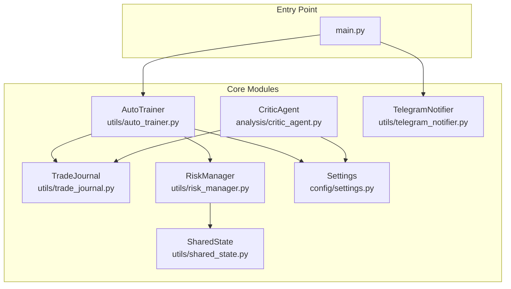
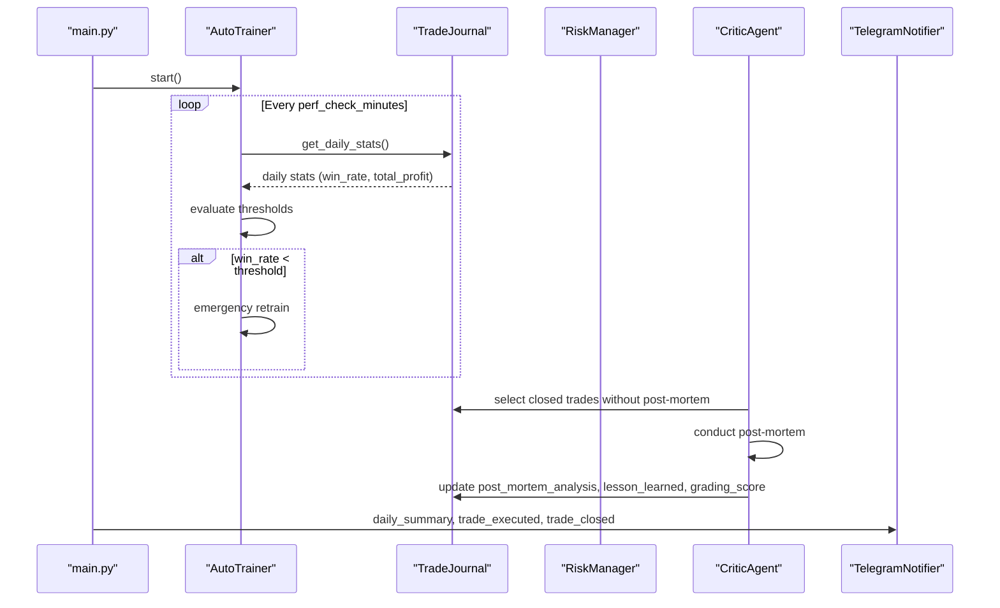
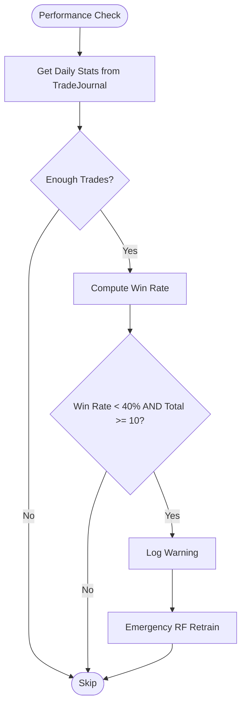
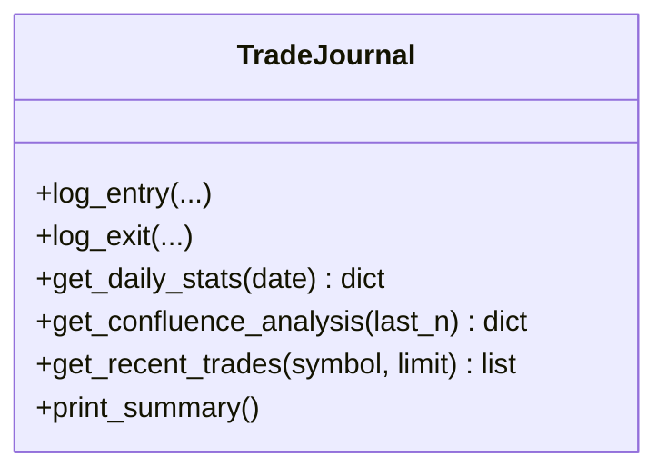
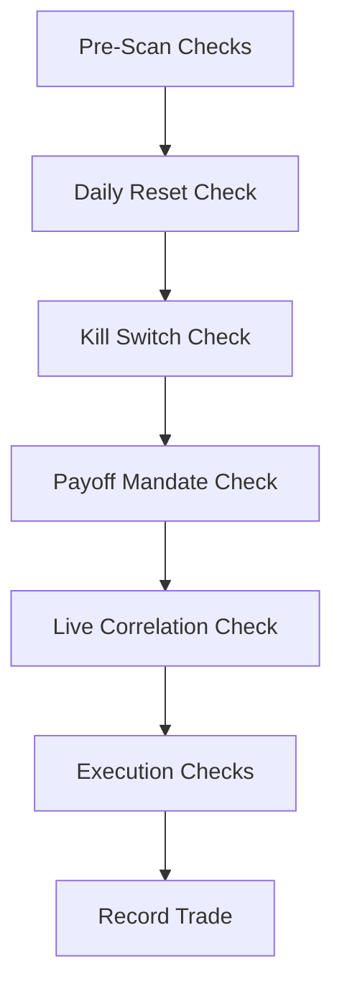
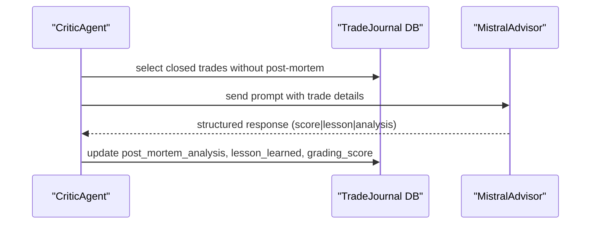
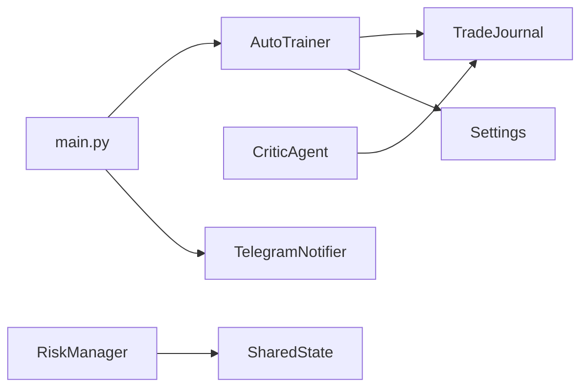

# Performance Monitoring and Evaluation

<cite>
**Referenced Files in This Document**
- [main.py](file://main.py)
- [auto_trainer.py](file://utils/auto_trainer.py)
- [trade_journal.py](file://utils/trade_journal.py)
- [analyze_pnl.py](file://utils/analyze_pnl.py)
- [risk_manager.py](file://utils/risk_manager.py)
- [critic_agent.py](file://analysis/critic_agent.py)
- [settings.py](file://config/settings.py)
- [shared_state.py](file://utils/shared_state.py)
- [telegram_notifier.py](file://utils/telegram_notifier.py)
</cite>

## Table of Contents
1. [Introduction](#introduction)
2. [Project Structure](#project-structure)
3. [Core Components](#core-components)
4. [Architecture Overview](#architecture-overview)
5. [Detailed Component Analysis](#detailed-component-analysis)
6. [Dependency Analysis](#dependency-analysis)
7. [Performance Considerations](#performance-considerations)
8. [Troubleshooting Guide](#troubleshooting-guide)
9. [Conclusion](#conclusion)
10. [Appendices](#appendices)

## Introduction
This document describes the performance monitoring and evaluation system that tracks trading performance, triggers self-learning actions, and integrates with trade journal data. It explains how performance metrics are collected, how daily statistics are tracked, how win rate is calculated, and how alert thresholds trigger emergency retraining. It also covers integration with trade journal data, profit and loss analysis, and statistical performance reporting. Guidance is provided for customizing performance thresholds, adding new metrics, extending monitoring capabilities, real-time performance tracking, historical performance analysis, and trend detection algorithms. Finally, it offers practical advice for interpreting performance signals, identifying degradation patterns, and correlating metrics with trading outcomes.

## Project Structure
The performance monitoring system spans several modules:
- Auto-trainer orchestrates background self-learning and performance checks
- Trade journal persists and aggregates trade metadata and outcomes
- Risk manager enforces daily and symbol-level risk controls and computes symbol stats
- Critic agent performs post-mortem reviews and grades closed trades
- Settings define thresholds and operational parameters
- Shared state persists cross-agent state
- Telegram notifier sends real-time alerts

**Diagram sources**
- [main.py](file://main.py#L19-L122)
- [auto_trainer.py](file://utils/auto_trainer.py#L80-L195)
- [trade_journal.py](file://utils/trade_journal.py#L23-L195)
- [risk_manager.py](file://utils/risk_manager.py#L14-L235)
- [critic_agent.py](file://analysis/critic_agent.py#L10-L52)
- [settings.py](file://config/settings.py#L1-L201)
- [shared_state.py](file://utils/shared_state.py#L23-L94)
- [telegram_notifier.py](file://utils/telegram_notifier.py#L30-L137)

**Section sources**
- [main.py](file://main.py#L19-L122)

## Core Components
- AutoTrainer: Runs in a background thread, periodically checks performance, and triggers emergency retraining when win rate falls below a threshold. It also schedules periodic retraining for Random Forest, XGBoost, and LSTM models.
- TradeJournal: Provides daily statistics, logs entries/exits, and exposes analytics such as confluence factor win rates.
- RiskManager: Enforces daily and symbol-level risk controls, computes symbol stats (including win rate and payoff), and monitors positions.
- CriticAgent: Reviews closed trades and writes post-mortem analysis and grading scores into the trade journal.
- Settings: Centralized configuration for thresholds, intervals, and operational parameters.
- SharedState: Persistent key-value store enabling cross-agent coordination.
- TelegramNotifier: Sends real-time alerts for trades, daily summaries, and critical events.

**Section sources**
- [auto_trainer.py](file://utils/auto_trainer.py#L80-L195)
- [trade_journal.py](file://utils/trade_journal.py#L23-L195)
- [risk_manager.py](file://utils/risk_manager.py#L14-L235)
- [critic_agent.py](file://analysis/critic_agent.py#L10-L52)
- [settings.py](file://config/settings.py#L1-L201)
- [shared_state.py](file://utils/shared_state.py#L23-L94)
- [telegram_notifier.py](file://utils/telegram_notifier.py#L30-L137)

## Architecture Overview
The system integrates real-time trading with continuous performance monitoring and adaptive model retraining. The AutoTrainer periodically queries daily statistics from the TradeJournal, evaluates thresholds, and triggers emergency retraining when performance degrades. RiskManager ensures daily and symbol-level risk controls remain active and maintains symbol-level stats used by position sizing and correlation filtering. CriticAgent enriches the trade journal with post-mortem insights. Alerts are broadcast via TelegramNotifier.

**Diagram sources**
- [main.py](file://main.py#L62-L101)
- [auto_trainer.py](file://utils/auto_trainer.py#L175-L193)
- [trade_journal.py](file://utils/trade_journal.py#L166-L195)
- [critic_agent.py](file://analysis/critic_agent.py#L17-L52)
- [telegram_notifier.py](file://utils/telegram_notifier.py#L108-L137)

## Detailed Component Analysis

### AutoTrainer: Performance Monitoring and Emergency Retraining
- Purpose: Background self-learning system that monitors performance and triggers emergency retraining when win rate degrades below a defined threshold.
- Performance check interval: Configurable minutes; defaults to 30 minutes.
- Threshold: Win rate below 40% over the last 20 trades; requires at least 10 trades to evaluate.
- Actions: Emits a warning and triggers an emergency Random Forest retrain when thresholds are met.
- Scheduling: Periodic retraining for Random Forest (every 4 hours), XGBoost (every 6 hours), and LSTM (every 8 hours) models.

**Diagram sources**
- [auto_trainer.py](file://utils/auto_trainer.py#L175-L193)
- [trade_journal.py](file://utils/trade_journal.py#L166-L195)

**Section sources**
- [auto_trainer.py](file://utils/auto_trainer.py#L80-L195)
- [trade_journal.py](file://utils/trade_journal.py#L166-L195)

### TradeJournal: Daily Statistics and Metrics Collection
- Daily statistics: Aggregates total trades, wins, losses, total profit, average R:R achieved, and average confluence score for the current day.
- Win rate calculation: Wins divided by total trades.
- Confluence analysis: Computes win rate per confluence factor across recent trades.
- Recent trades: Retrieves last N trades for a given symbol.
- Integration: Used by AutoTrainer for performance checks and by CriticAgent for post-mortem reviews.

**Diagram sources**
- [trade_journal.py](file://utils/trade_journal.py#L23-L195)

**Section sources**
- [trade_journal.py](file://utils/trade_journal.py#L23-L195)

### RiskManager: Symbol-Level Stats and Risk Controls
- Daily reset: Tracks daily trades and resets at UTC midnight.
- Symbol stats: Maintains rolling metrics (net P&L, average win/loss, win rate) for each symbol over a 30-day window.
- Kill switch: Disables trading for a symbol if recent P&L losses exceed a threshold.
- Payoff mandate: Blocks trades when average loss exceeds a configured multiple of average win.
- Position sizing: Uses Kelly Criterion when sufficient history is available; otherwise falls back to confluence tiers.
- Position management: Implements trailing stops, partial profit taking, and break-even moves.

**Diagram sources**
- [risk_manager.py](file://utils/risk_manager.py#L51-L235)

**Section sources**
- [risk_manager.py](file://utils/risk_manager.py#L14-L235)

### CriticAgent: Post-Mortem Reviews and Journal Enrichment
- Purpose: Reviews closed trades without post-mortem analysis, generates a grading score, lesson learned, and analysis, and updates the trade journal.
- Integration: Reads from the trade journal, calls an advisor to produce structured output, and writes back to the journal.

**Diagram sources**
- [critic_agent.py](file://analysis/critic_agent.py#L17-L52)
- [trade_journal.py](file://utils/trade_journal.py#L129-L140)

**Section sources**
- [critic_agent.py](file://analysis/critic_agent.py#L10-L141)
- [trade_journal.py](file://utils/trade_journal.py#L129-L140)

### Settings: Thresholds and Operational Parameters
- Performance thresholds: Win rate threshold for emergency retraining (40%).
- Intervals: Performance check interval (minutes), RF/XGBoost/LSTM retrain intervals (hours).
- Risk controls: Daily trade caps, daily loss limits, spread thresholds, session filters, correlation groups, and payoff mandates.
- Position sizing: Kelly Criterion parameters, confluence tiers, and tail risk clamps.
- Notifications: Telegram bot token and chat ID.

**Section sources**
- [settings.py](file://config/settings.py#L1-L201)

### SharedState: Cross-Agent Coordination
- Purpose: Persistent key-value store enabling agents to coordinate (e.g., circuit breaker state).
- Operations: set, get, delete, get_all, get_last_update.

**Section sources**
- [shared_state.py](file://utils/shared_state.py#L23-L110)

### TelegramNotifier: Real-Time Alerts
- Features: Trade executed, trade closed, scan candidates, daily summary, kill switch activation, generic alerts.
- Implementation: Non-blocking HTTP requests to Telegram Bot API.

**Section sources**
- [telegram_notifier.py](file://utils/telegram_notifier.py#L30-L137)

## Dependency Analysis
- AutoTrainer depends on TradeJournal for daily stats and on settings for thresholds and intervals.
- RiskManager depends on settings for thresholds and uses SharedState for persistence.
- CriticAgent depends on TradeJournal and an advisor for post-mortem generation.
- main.py orchestrates AutoTrainer startup and periodically prints status.

**Diagram sources**
- [main.py](file://main.py#L62-L101)
- [auto_trainer.py](file://utils/auto_trainer.py#L93-L103)
- [trade_journal.py](file://utils/trade_journal.py#L23-L26)
- [critic_agent.py](file://analysis/critic_agent.py#L11-L14)
- [risk_manager.py](file://utils/risk_manager.py#L17-L18)
- [shared_state.py](file://utils/shared_state.py#L23-L26)
- [telegram_notifier.py](file://utils/telegram_notifier.py#L33-L36)

**Section sources**
- [main.py](file://main.py#L62-L101)
- [auto_trainer.py](file://utils/auto_trainer.py#L93-L103)
- [trade_journal.py](file://utils/trade_journal.py#L23-L26)
- [critic_agent.py](file://analysis/critic_agent.py#L11-L14)
- [risk_manager.py](file://utils/risk_manager.py#L17-L18)
- [shared_state.py](file://utils/shared_state.py#L23-L26)
- [telegram_notifier.py](file://utils/telegram_notifier.py#L33-L36)

## Performance Considerations
- Real-time vs. historical: AutoTrainer evaluates daily statistics; RiskManager computes symbol stats over a 30-day window for payoff mandates and kill switches.
- Alert thresholds: Emergency retraining is triggered when win rate falls below 40% over the last 20 trades, requiring at least 10 trades to evaluate.
- Model retraining cadence: RF/XGBoost/LSTM retraining is scheduled independently of performance checks to ensure adaptability without blocking.
- Position sizing: Kelly Criterion is used when sufficient trade history is available; otherwise confluence tiers provide a fallback.
- Correlation filtering: Live correlation checks prevent correlated exposures in the same direction, reducing systemic risk.

[No sources needed since this section provides general guidance]

## Troubleshooting Guide
- No trades found: If the trade journal database is missing or empty, performance reports will indicate no trades.
- Low trade volume: Performance checks require a minimum number of trades; AutoTrainer skips evaluations when insufficient trades are available.
- Emergency retraining not triggered: Verify that the win rate threshold and minimum trade count are met and that AutoTrainer is running.
- Telegram notifications disabled: Ensure bot token and chat ID are configured; otherwise notifications are disabled.
- Kill switch activation: If symbol-level recent P&L losses exceed the threshold, trading is paused for that symbol until stats improve.

**Section sources**
- [analyze_pnl.py](file://utils/analyze_pnl.py#L13-L32)
- [auto_trainer.py](file://utils/auto_trainer.py#L177-L193)
- [telegram_notifier.py](file://utils/telegram_notifier.py#L37-L38)
- [risk_manager.py](file://utils/risk_manager.py#L207-L216)

## Conclusion
The performance monitoring and evaluation system combines real-time daily statistics, symbol-level risk controls, and adaptive model retraining to maintain robust trading performance. AutoTrainer continuously evaluates win rate and triggers emergency retraining when thresholds are breached, while TradeJournal provides the foundation for performance reporting and post-mortem enrichment. RiskManager enforces daily and symbol-level controls, and CriticAgent augments the journal with structured post-mortem insights. Settings centralize thresholds and intervals, and SharedState enables cross-agent coordination. TelegramNotifier delivers timely alerts to keep operators informed.

[No sources needed since this section summarizes without analyzing specific files]

## Appendices

### Implementation Examples

- Customizing Performance Thresholds
  - Adjust the win rate threshold and minimum trade count in AutoTrainer’s performance check.
  - Modify the performance check interval to increase or decrease evaluation frequency.
  - Reference: [auto_trainer.py](file://utils/auto_trainer.py#L93-L103), [auto_trainer.py](file://utils/auto_trainer.py#L175-L193)

- Adding New Metrics
  - Extend TradeJournal to compute additional metrics (e.g., Sharpe ratio, drawdown) and expose them via daily stats.
  - Reference: [trade_journal.py](file://utils/trade_journal.py#L166-L195)

- Extending Monitoring Capabilities
  - Integrate additional post-mortem analysis by enhancing CriticAgent’s prompts and parsing logic.
  - Reference: [critic_agent.py](file://analysis/critic_agent.py#L71-L128)

- Real-Time Performance Tracking
  - Use RiskManager’s symbol stats to track rolling win rates and payoff ratios for dynamic position sizing.
  - Reference: [risk_manager.py](file://utils/risk_manager.py#L165-L202)

- Historical Performance Analysis
  - Use analyze_pnl to compute overall P&L, win rate, and symbol-wise performance with profit factor.
  - Reference: [analyze_pnl.py](file://utils/analyze_pnl.py#L12-L78)

- Trend Detection Algorithms
  - Apply trend filters (M5/H1/H4) and ensemble voting to align entries with higher timeframe trends.
  - Reference: [settings.py](file://config/settings.py#L150-L154)

### Interpreting Performance Signals
- Win rate below 40% over last 20 trades: Indicates potential degradation; consider reviewing entry rules, confluence factors, and market regime.
- Negative daily P&L with elevated losses: Investigate payoff mandates and symbol stats; consider tightening stop-losses or reducing position sizes.
- Post-mortem lessons: Use CriticAgent’s lessons to refine entry criteria and risk controls.
- Correlation conflicts: Avoid opening positions on highly correlated symbols in the same direction.

[No sources needed since this section provides general guidance]