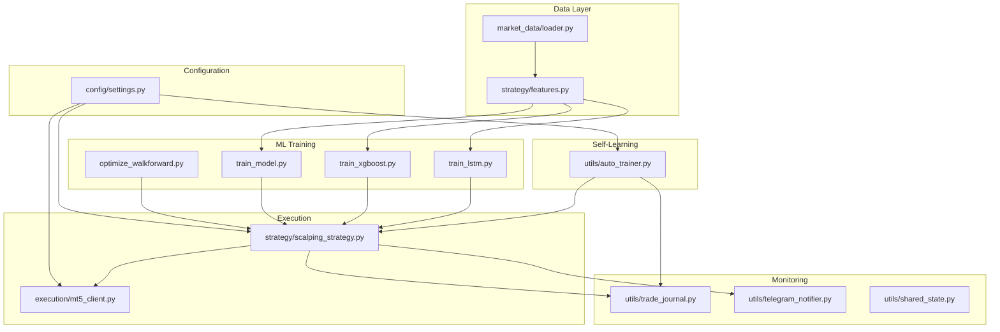
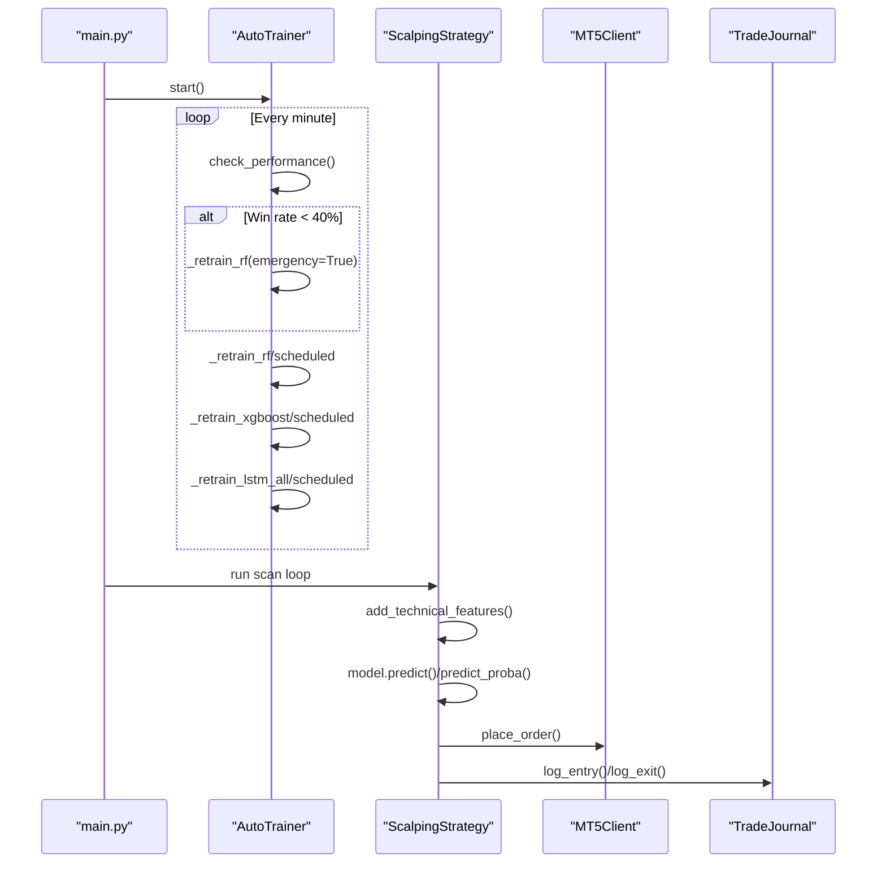
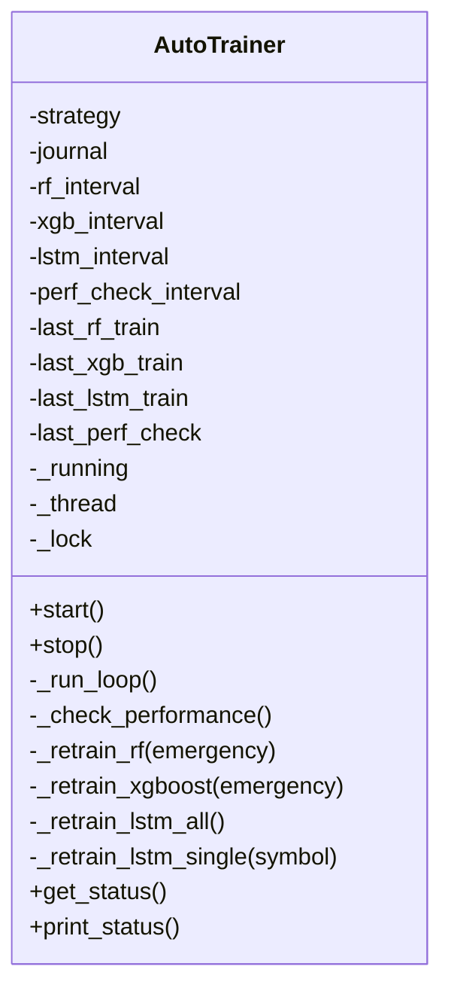
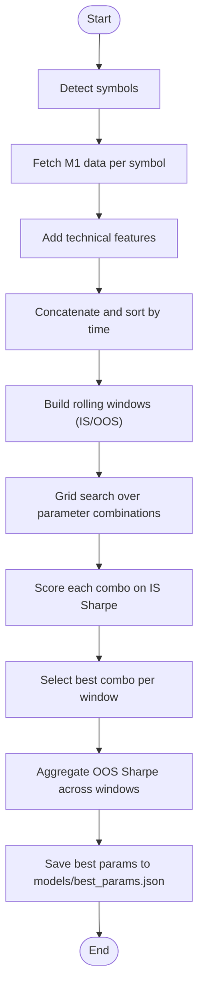
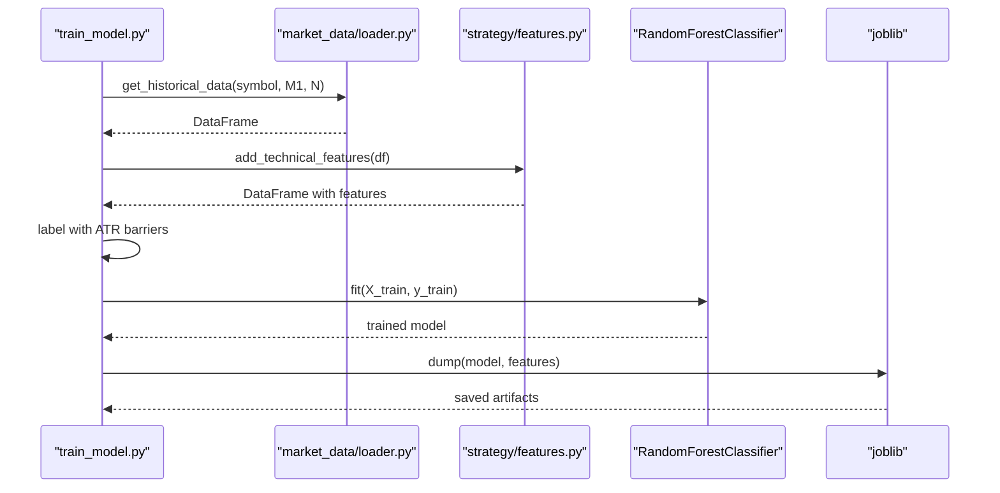
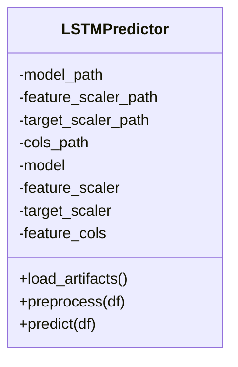
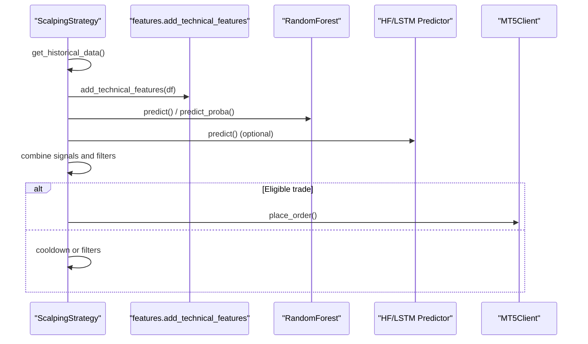
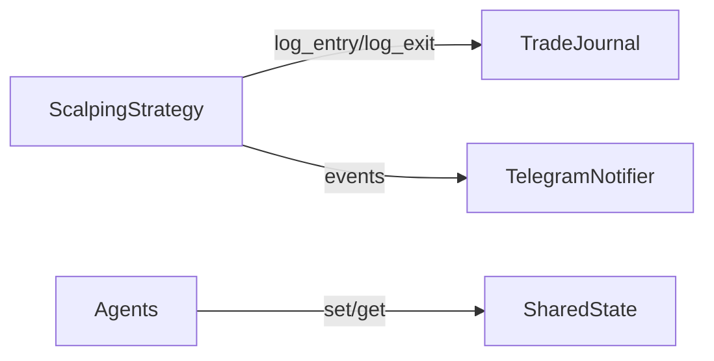
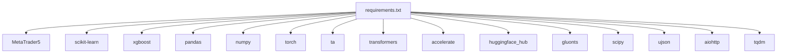

# Self-Learning System

<cite>
**Referenced Files in This Document**
- [utils/auto_trainer.py](file://utils/auto_trainer.py)
- [optimize_walkforward.py](file://optimize_walkforward.py)
- [train_model.py](file://train_model.py)
- [strategy/lstm_predictor.py](file://strategy/lstm_predictor.py)
- [strategy/scalping_strategy.py](file://strategy/scalping_strategy.py)
- [config/settings.py](file://config/settings.py)
- [strategy/features.py](file://strategy/features.py)
- [market_data/loader.py](file://market_data/loader.py)
- [utils/shared_state.py](file://utils/shared_state.py)
- [main.py](file://main.py)
- [utils/trade_journal.py](file://utils/trade_journal.py)
- [execution/mt5_client.py](file://execution/mt5_client.py)
- [utils/telegram_notifier.py](file://utils/telegram_notifier.py)
- [README.md](file://README.md)
- [requirements.txt](file://requirements.txt)
</cite>

## Table of Contents
1. [Introduction](#introduction)
2. [Project Structure](#project-structure)
3. [Core Components](#core-components)
4. [Architecture Overview](#architecture-overview)
5. [Detailed Component Analysis](#detailed-component-analysis)
6. [Dependency Analysis](#dependency-analysis)
7. [Performance Considerations](#performance-considerations)
8. [Troubleshooting Guide](#troubleshooting-guide)
9. [Conclusion](#conclusion)
10. [Appendices](#appendices)

## Introduction
This document describes the self-learning system that powers continuous model improvement, parameter optimization, and adaptive trading performance monitoring. It covers:
- AutoTrainer: background self-learning with scheduled retraining and emergency triggers
- Walk-Forward Optimization: rolling in-sample/out-of-sample parameter tuning
- Automated training pipeline: RF/XGBoost/LSTM trainers and feature engineering
- Monitoring and evaluation: trade journal, performance metrics, and health checks
- Deployment and A/B-like validation: hot-swapping trained models and optional LSTM predictors
- Computational requirements, scheduling, and model versioning

## Project Structure
The system is organized around a modular architecture:
- Configuration and environment settings
- Data ingestion and feature engineering
- Machine learning trainers and predictors
- Strategy orchestration and execution
- Monitoring, logging, and notifications
- Optional LSTM inference and multi-agent coordination

**Diagram sources**
- [config/settings.py](file://config/settings.py#L1-L201)
- [market_data/loader.py](file://market_data/loader.py#L1-L83)
- [strategy/features.py](file://strategy/features.py#L1-L242)
- [train_model.py](file://train_model.py#L1-L236)
- [optimize_walkforward.py](file://optimize_walkforward.py#L1-L241)
- [execution/mt5_client.py](file://execution/mt5_client.py#L1-L385)
- [strategy/scalping_strategy.py](file://strategy/scalping_strategy.py#L1-L291)
- [utils/trade_journal.py](file://utils/trade_journal.py#L1-L274)
- [utils/telegram_notifier.py](file://utils/telegram_notifier.py#L1-L174)
- [utils/auto_trainer.py](file://utils/auto_trainer.py#L1-L518)

**Section sources**
- [README.md](file://README.md#L187-L235)

## Core Components
- AutoTrainer: background thread that periodically retrains RF/XGBoost models and LSTM predictors, validates performance, and hot-swaps models atomically.
- Walk-Forward Optimizer: grid search across rolling in-sample/out-of-sample windows to select robust parameter sets.
- Trainers: standalone scripts to train RF, XGBoost, and LSTM models on aggregated multi-symbol datasets.
- Strategy: orchestrates feature engineering, model predictions, risk controls, and order execution.
- Monitoring: trade journal for performance tracking, shared state for inter-agent collaboration, and Telegram notifications.

**Section sources**
- [utils/auto_trainer.py](file://utils/auto_trainer.py#L80-L518)
- [optimize_walkforward.py](file://optimize_walkforward.py#L1-L241)
- [train_model.py](file://train_model.py#L1-L236)
- [strategy/scalping_strategy.py](file://strategy/scalping_strategy.py#L1-L291)
- [utils/trade_journal.py](file://utils/trade_journal.py#L1-L274)
- [utils/shared_state.py](file://utils/shared_state.py#L1-L110)
- [utils/telegram_notifier.py](file://utils/telegram_notifier.py#L1-L174)

## Architecture Overview
The self-learning system integrates training, optimization, and live trading:

**Diagram sources**
- [main.py](file://main.py#L19-L122)
- [utils/auto_trainer.py](file://utils/auto_trainer.py#L137-L172)
- [strategy/scalping_strategy.py](file://strategy/scalping_strategy.py#L151-L291)
- [execution/mt5_client.py](file://execution/mt5_client.py#L216-L292)
- [utils/trade_journal.py](file://utils/trade_journal.py#L103-L164)

## Detailed Component Analysis

### AutoTrainer: Continuous Self-Learning
AutoTrainer runs a background thread that:
- Periodically evaluates recent performance via the trade journal
- Retrains RF and XGBoost classifiers on recent M15 data with time-based splits
- Retrains LSTM predictors per symbol with early stopping and hot-swapping
- Validates model quality thresholds before swapping
- Tracks retrain counts and schedules

Key behaviors:
- Performance check every configured interval; triggers emergency retrain if win rate falls below threshold
- RF/XGBoost retraining uses balanced class weights and accuracy threshold
- LSTM retraining uses patience-based early stopping and saves checkpoints for hot-swapping
- Thread-safe hot-swapping protects against race conditions

**Diagram sources**
- [utils/auto_trainer.py](file://utils/auto_trainer.py#L80-L518)

**Section sources**
- [utils/auto_trainer.py](file://utils/auto_trainer.py#L118-L172)
- [utils/auto_trainer.py](file://utils/auto_trainer.py#L175-L194)
- [utils/auto_trainer.py](file://utils/auto_trainer.py#L196-L275)
- [utils/auto_trainer.py](file://utils/auto_trainer.py#L278-L347)
- [utils/auto_trainer.py](file://utils/auto_trainer.py#L351-L494)
- [utils/auto_trainer.py](file://utils/auto_trainer.py#L498-L518)

### Walk-Forward Optimization: Parameter Tuning
The walk-forward optimizer:
- Aggregates M1 data across all detected symbols
- Builds rolling in-sample/out-of-sample windows
- Grid-searches parameter combinations (e.g., confluence score, RF threshold, ATR multipliers)
- Scores each combo on Sharpe proxy derived from ATR barriers
- Selects the combination with the highest average OOS Sharpe

**Diagram sources**
- [optimize_walkforward.py](file://optimize_walkforward.py#L100-L241)

**Section sources**
- [optimize_walkforward.py](file://optimize_walkforward.py#L33-L74)
- [optimize_walkforward.py](file://optimize_walkforward.py#L77-L97)
- [optimize_walkforward.py](file://optimize_walkforward.py#L100-L241)

### Automated Training Pipeline
- RF Trainer: collects M1 data per symbol, computes ATR-based labels, builds features, splits data, trains Random Forest, evaluates, and persists model and feature columns.
- XGBoost Trainer: similar pipeline with class balancing and XGBoost-specific parameters.
- LSTM Trainer: prepares sequences, scales features/targets, trains with early stopping, and persists artifacts.

**Diagram sources**
- [train_model.py](file://train_model.py#L108-L236)
- [market_data/loader.py](file://market_data/loader.py#L40-L59)
- [strategy/features.py](file://strategy/features.py#L6-L98)

**Section sources**
- [train_model.py](file://train_model.py#L108-L236)
- [market_data/loader.py](file://market_data/loader.py#L40-L59)
- [strategy/features.py](file://strategy/features.py#L6-L98)

### LSTM Predictions and Hot-Swap
LSTMPredictor loads saved artifacts and performs inference:
- Loads model state dict and scalers
- Preprocesses input to the correct sequence length
- Predicts next close and optionally inverse transforms target

AutoTrainer hot-swaps LSTM predictors atomically:
- Saves checkpoints during training
- Instantiates new predictor and replaces in strategy dictionary

**Diagram sources**
- [strategy/lstm_predictor.py](file://strategy/lstm_predictor.py#L9-L142)
- [utils/auto_trainer.py](file://utils/auto_trainer.py#L476-L494)

**Section sources**
- [strategy/lstm_predictor.py](file://strategy/lstm_predictor.py#L37-L142)
- [utils/auto_trainer.py](file://utils/auto_trainer.py#L361-L494)

### Strategy: Feature Engineering, Predictions, and Execution
The strategy:
- Loads models and optional AI predictors (Lag-Llama, LSTM)
- Computes technical features and applies multi-timeframe trend filters
- Generates combined signals and executes orders respecting risk controls
- Logs trades and manages trailing stops

**Diagram sources**
- [strategy/scalping_strategy.py](file://strategy/scalping_strategy.py#L151-L291)
- [strategy/features.py](file://strategy/features.py#L6-L98)

**Section sources**
- [strategy/scalping_strategy.py](file://strategy/scalping_strategy.py#L49-L94)
- [strategy/scalping_strategy.py](file://strategy/scalping_strategy.py#L151-L291)
- [strategy/features.py](file://strategy/features.py#L6-L98)

### Monitoring and Evaluation
- TradeJournal: persists trades, computes daily stats, and supports confluence analysis
- SharedState: lightweight KV store for inter-agent state sharing
- TelegramNotifier: non-blocking alerts for trades, summaries, and system events

**Diagram sources**
- [utils/trade_journal.py](file://utils/trade_journal.py#L23-L274)
- [utils/shared_state.py](file://utils/shared_state.py#L23-L110)
- [utils/telegram_notifier.py](file://utils/telegram_notifier.py#L30-L174)

**Section sources**
- [utils/trade_journal.py](file://utils/trade_journal.py#L166-L196)
- [utils/shared_state.py](file://utils/shared_state.py#L42-L93)
- [utils/telegram_notifier.py](file://utils/telegram_notifier.py#L66-L136)

## Dependency Analysis
External libraries and their roles:
- MetaTrader5: live market data and order execution
- pandas/numpy/scikit-learn/xgboost: data processing and ML modeling
- torch: LSTM training/inference
- ta: technical indicator library
- transformers/accelerate/huggingface_hub/gluonts: optional AI forecasting
- aiohttp/ujson/tqdm: async networking and progress

**Diagram sources**
- [requirements.txt](file://requirements.txt#L1-L17)

**Section sources**
- [requirements.txt](file://requirements.txt#L1-L17)

## Performance Considerations
- Data freshness: AutoTrainer uses recent bars for retraining; ensure sufficient bar count to avoid underfitting.
- Validation thresholds: RF/XGBoost require minimum accuracy; LSTM uses validation loss with patience-based early stopping.
- Feature stability: Consistent feature columns enable reliable hot-swapping.
- GPU acceleration: LSTM training benefits from CUDA if available; otherwise CPU fallback is supported.
- Concurrency: Asynchronous scanning and non-blocking notifications minimize overhead.

[No sources needed since this section provides general guidance]

## Troubleshooting Guide
Common issues and resolutions:
- Not enough data for retraining: AutoTrainer skips if insufficient bars; increase history bars or reduce retrain intervals.
- Low model accuracy: Adjust thresholds or re-run walk-forward optimization; verify feature engineering and labeling logic.
- LSTM hot-swap failures: Ensure model artifacts exist and are readable; confirm device compatibility.
- Telegram notifications disabled: Verify token and chat ID in environment; use helper script to retrieve chat ID.
- MT5 connection errors: Confirm credentials, server, and terminal path; ensure symbol visibility.

**Section sources**
- [utils/auto_trainer.py](file://utils/auto_trainer.py#L196-L210)
- [utils/auto_trainer.py](file://utils/auto_trainer.py#L278-L291)
- [utils/auto_trainer.py](file://utils/auto_trainer.py#L361-L379)
- [utils/telegram_notifier.py](file://utils/telegram_notifier.py#L33-L39)
- [execution/mt5_client.py](file://execution/mt5_client.py#L18-L27)

## Conclusion
The self-learning system combines scheduled retraining, walk-forward optimization, and performance monitoring to continuously adapt models to evolving market conditions. AutoTrainer ensures reliability via validation thresholds and hot-swapping, while walk-forward optimization identifies robust parameter sets. Together with comprehensive monitoring and notifications, the system enables autonomous, adaptive trading with transparent performance tracking.

[No sources needed since this section summarizes without analyzing specific files]

## Appendices

### Automated Training Pipeline and Model Artifacts
- RF/XGBoost: saved as pickled models with feature columns
- LSTM: saved as state dicts plus scalers and feature columns
- Best parameters: written to JSON for immediate application

**Section sources**
- [train_model.py](file://train_model.py#L224-L230)
- [utils/auto_trainer.py](file://utils/auto_trainer.py#L462-L470)
- [optimize_walkforward.py](file://optimize_walkforward.py#L229-L236)

### Configuration and Scheduling
- Timeframes, risk parameters, and model paths are centralized in settings
- AutoTrainer intervals and performance thresholds are configurable
- Walk-forward parameters define window fractions and step sizes

**Section sources**
- [config/settings.py](file://config/settings.py#L63-L108)
- [config/settings.py](file://config/settings.py#L173-L196)
- [utils/auto_trainer.py](file://utils/auto_trainer.py#L93-L108)
- [optimize_walkforward.py](file://optimize_walkforward.py#L34-L48)