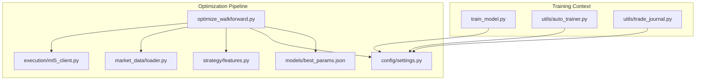
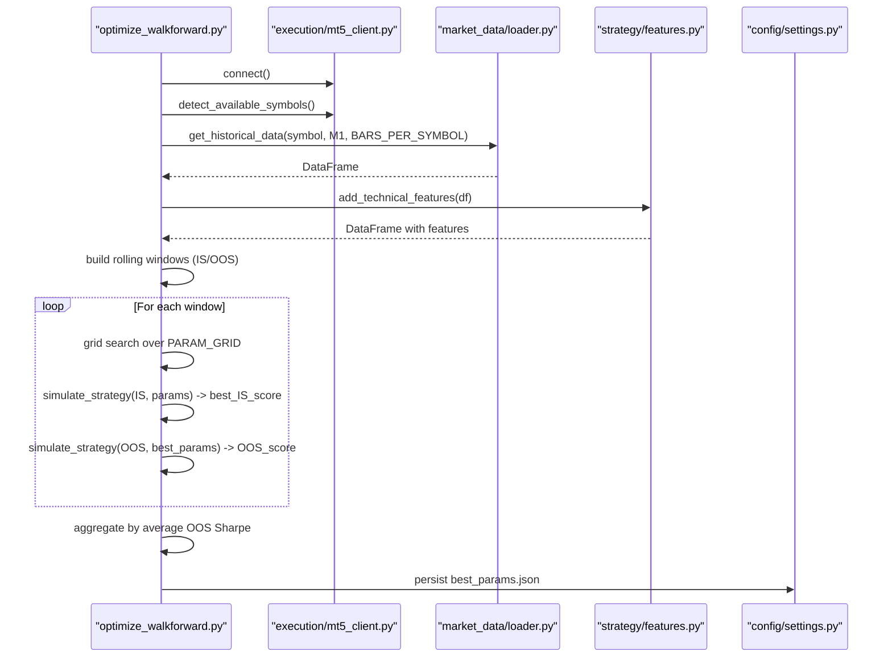
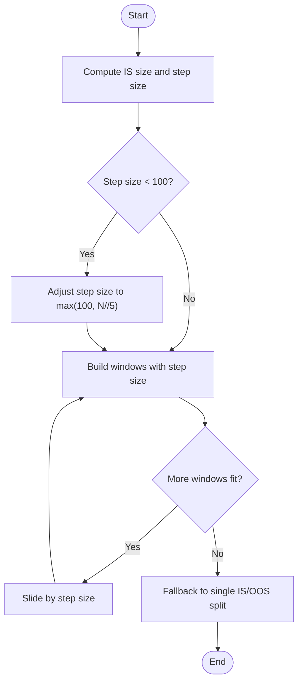
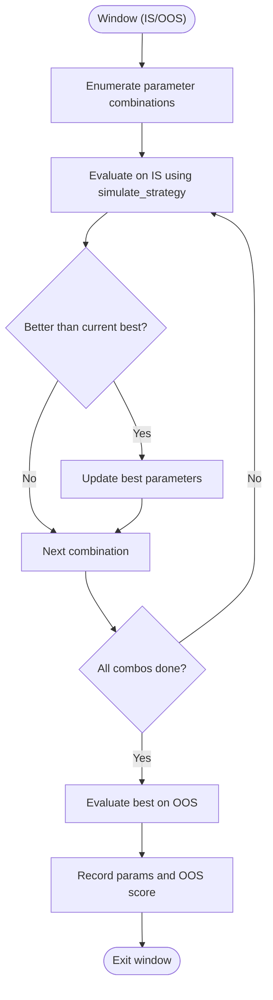
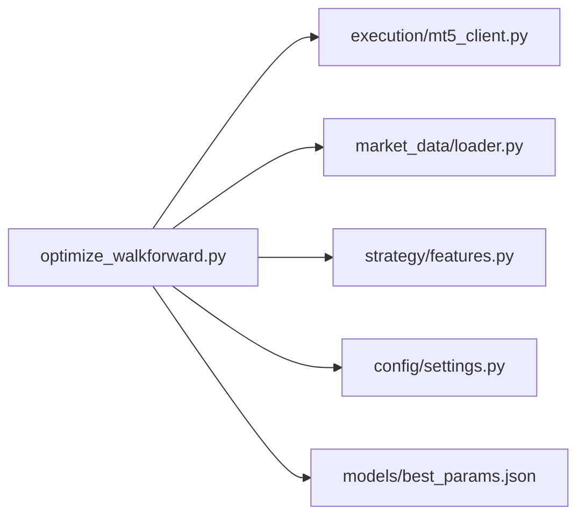

# Walk-Forward Optimization

<cite>
**Referenced Files in This Document**
- [optimize_walkforward.py](file://optimize_walkforward.py)
- [README.md](file://README.md)
- [config/settings.py](file://config/settings.py)
- [strategy/features.py](file://strategy/features.py)
- [execution/mt5_client.py](file://execution/mt5_client.py)
- [market_data/loader.py](file://market_data/loader.py)
- [models/best_params.json](file://models/best_params.json)
- [train_model.py](file://train_model.py)
- [utils/auto_trainer.py](file://utils/auto_trainer.py)
- [utils/trade_journal.py](file://utils/trade_journal.py)
</cite>

## Table of Contents
1. [Introduction](#introduction)
2. [Project Structure](#project-structure)
3. [Core Components](#core-components)
4. [Architecture Overview](#architecture-overview)
5. [Detailed Component Analysis](#detailed-component-analysis)
6. [Dependency Analysis](#dependency-analysis)
7. [Performance Considerations](#performance-considerations)
8. [Troubleshooting Guide](#troubleshooting-guide)
9. [Conclusion](#conclusion)
10. [Appendices](#appendices)

## Introduction
This document explains the walk-forward optimization system used to tune parameters and optimize the M1 scalping strategy. It covers the rolling window validation approach, in-sample/out-of-sample testing methodology, and performance benchmarking procedures. It documents the optimization algorithm implementation, parameter search space definition, and convergence criteria. It also details the automated optimization workflow, including cross-validation strategies, hyperparameter tuning processes, and statistical significance testing. Practical examples show how to configure optimization runs, interpret results, and select optimal parameter sets. Finally, it addresses computational efficiency, memory management, edge-case handling, and guidance for customizing optimization objectives, constraints, and performance metrics interpretation.

## Project Structure
The walk-forward optimization pipeline integrates several modules:
- Data ingestion and feature engineering
- Parameter grid search within rolling windows
- In-sample selection and out-of-sample evaluation
- Aggregation across windows to select the best parameter set
- Persistence of best parameters for production use

**Diagram sources**
- [optimize_walkforward.py](file://optimize_walkforward.py#L1-L241)
- [strategy/features.py](file://strategy/features.py#L1-L242)
- [execution/mt5_client.py](file://execution/mt5_client.py#L1-L385)
- [market_data/loader.py](file://market_data/loader.py#L1-L83)
- [config/settings.py](file://config/settings.py#L1-L201)
- [models/best_params.json](file://models/best_params.json#L1-L6)
- [train_model.py](file://train_model.py#L1-L236)
- [utils/auto_trainer.py](file://utils/auto_trainer.py#L1-L262)
- [utils/trade_journal.py](file://utils/trade_journal.py#L1-L200)

**Section sources**
- [README.md](file://README.md#L154-L158)
- [optimize_walkforward.py](file://optimize_walkforward.py#L1-L241)

## Core Components
- Rolling window builder: constructs in-sample (IS) and out-of-sample (OOS) segments with sliding step size.
- Parameter grid: defines discrete values for each tunable parameter.
- In-sample selector: selects the best parameter combination per window based on a Sharpe-like proxy metric.
- Out-of-sample evaluator: scores the selected parameters on OOS data.
- Aggregator: computes average OOS Sharpe across windows and persists the best parameter set.

Key implementation references:
- Rolling windows and window sizes: [optimize_walkforward.py](file://optimize_walkforward.py#L34-L48)
- Parameter grid: [optimize_walkforward.py](file://optimize_walkforward.py#L43-L48)
- In-sample selection and OOS evaluation: [optimize_walkforward.py](file://optimize_walkforward.py#L76-L97)
- Aggregation and persistence: [optimize_walkforward.py](file://optimize_walkforward.py#L207-L236)

**Section sources**
- [optimize_walkforward.py](file://optimize_walkforward.py#L34-L97)
- [optimize_walkforward.py](file://optimize_walkforward.py#L175-L236)

## Architecture Overview
The walk-forward optimization orchestrates data collection, feature engineering, rolling window construction, parameter search, and evaluation.

**Diagram sources**
- [optimize_walkforward.py](file://optimize_walkforward.py#L100-L236)
- [execution/mt5_client.py](file://execution/mt5_client.py#L29-L101)
- [market_data/loader.py](file://market_data/loader.py#L40-L59)
- [strategy/features.py](file://strategy/features.py#L6-L98)
- [config/settings.py](file://config/settings.py#L1-L201)

## Detailed Component Analysis

### Rolling Window Validation
- Window sizes: IS fraction and step fraction define the proportion of data used for training and the slide for subsequent windows.
- Step size safeguards: ensures a minimum step size and falls back to a single IS/OOS split if data is insufficient.
- Chronological sorting: ensures rolling windows are time-ordered.

Implementation references:
- Window sizing and step: [optimize_walkforward.py](file://optimize_walkforward.py#L38-L42)
- Sliding window construction: [optimize_walkforward.py](file://optimize_walkforward.py#L152-L173)

**Diagram sources**
- [optimize_walkforward.py](file://optimize_walkforward.py#L152-L173)

**Section sources**
- [optimize_walkforward.py](file://optimize_walkforward.py#L38-L42)
- [optimize_walkforward.py](file://optimize_walkforward.py#L152-L173)

### Parameter Search Space Definition
- Discrete parameter grid includes:
  - MIN_CONFLUENCE_SCORE: [2, 3, 4]
  - RF_PROB_THRESHOLD: [0.45, 0.50, 0.55, 0.60]
  - ATR_SL_MULTIPLIER: [1.0, 1.5, 2.0]
  - ATR_TP_MULTIPLIER: [2.5, 3.0, 3.5, 4.0]
- Grid enumeration: Cartesian product of all parameter values.

Implementation references:
- Parameter grid: [optimize_walkforward.py](file://optimize_walkforward.py#L43-L48)
- Grid enumeration: [optimize_walkforward.py](file://optimize_walkforward.py#L175-L177)

**Section sources**
- [optimize_walkforward.py](file://optimize_walkforward.py#L43-L48)
- [optimize_walkforward.py](file://optimize_walkforward.py#L175-L177)

### In-Sample Selection and Out-of-Sample Evaluation
- In-sample selection: For each window, the optimizer evaluates all parameter combinations on the IS segment and retains the best combination according to a Sharpe-like proxy.
- Out-of-sample evaluation: The selected parameters are evaluated on the OOS segment using the same proxy.
- Sharpe proxy: Mean outcome divided by standard deviation, scaled by square root of the number of outcomes.

Implementation references:
- Sharpe proxy computation: [optimize_walkforward.py](file://optimize_walkforward.py#L76-L97)
- In-sample selection loop: [optimize_walkforward.py](file://optimize_walkforward.py#L181-L205)

**Diagram sources**
- [optimize_walkforward.py](file://optimize_walkforward.py#L181-L205)
- [optimize_walkforward.py](file://optimize_walkforward.py#L76-L97)

**Section sources**
- [optimize_walkforward.py](file://optimize_walkforward.py#L76-L97)
- [optimize_walkforward.py](file://optimize_walkforward.py#L181-L205)

### Aggregation and Convergence Criteria
- Aggregation: Group OOS scores by parameter combination and compute the average OOS Sharpe across windows.
- Convergence: The best parameter set is the one with the highest average OOS Sharpe.

Implementation references:
- Aggregation and selection: [optimize_walkforward.py](file://optimize_walkforward.py#L207-L221)
- Persistence: [optimize_walkforward.py](file://optimize_walkforward.py#L229-L236)

**Section sources**
- [optimize_walkforward.py](file://optimize_walkforward.py#L207-L236)

### Automated Optimization Workflow
- Data acquisition: Connects to MT5, auto-detects symbols, fetches M1 data, and adds technical features.
- Feature engineering: Adds institutional-grade technical indicators and derived features.
- Cross-validation strategy: Rolling windows emulate time-series cross-validation by sliding the training window and evaluating on subsequent data.
- Hyperparameter tuning: Grid search over predefined parameter ranges.
- Statistical significance testing: Average OOS Sharpe across windows provides a robust estimate of out-of-sample performance.

Implementation references:
- Data acquisition and feature engineering: [optimize_walkforward.py](file://optimize_walkforward.py#L105-L150)
- Cross-validation and tuning: [optimize_walkforward.py](file://optimize_walkforward.py#L152-L205)
- Persistence: [optimize_walkforward.py](file://optimize_walkforward.py#L229-L236)

**Section sources**
- [optimize_walkforward.py](file://optimize_walkforward.py#L105-L150)
- [optimize_walkforward.py](file://optimize_walkforward.py#L152-L205)
- [optimize_walkforward.py](file://optimize_walkforward.py#L229-L236)

### Practical Examples

#### Configuring an Optimization Run
- Run the optimization script to collect data, build rolling windows, and compute best parameters.
- The script writes the best parameters to a JSON file and prints the selected values.

References:
- Run command and output: [README.md](file://README.md#L154-L158)
- Best parameters persistence: [optimize_walkforward.py](file://optimize_walkforward.py#L229-L236)

#### Interpreting Optimization Results
- The optimizer prints per-window IS and OOS scores and the final best parameters with their average OOS Sharpe.
- Use the persisted JSON to update configuration for live trading.

References:
- Output printing: [optimize_walkforward.py](file://optimize_walkforward.py#L197-L204)
- Final summary: [optimize_walkforward.py](file://optimize_walkforward.py#L223-L227)

#### Selecting Optimal Parameter Sets
- Choose the parameter combination with the highest average OOS Sharpe across windows.
- Apply the parameters to production by updating configuration or loading from the JSON file.

References:
- Aggregation and selection: [optimize_walkforward.py](file://optimize_walkforward.py#L207-L221)
- Best parameters file: [models/best_params.json](file://models/best_params.json#L1-L6)

**Section sources**
- [README.md](file://README.md#L154-L158)
- [optimize_walkforward.py](file://optimize_walkforward.py#L197-L227)
- [models/best_params.json](file://models/best_params.json#L1-L6)

### Customizing Optimization Objectives, Constraints, and Metrics
- Objective customization: Replace the Sharpe proxy with alternative metrics (e.g., risk-adjusted return, maximum drawdown, or classification-based metrics) by modifying the evaluation function.
- Constraint definitions: Add bounds or penalties for parameter combinations (e.g., require a minimum R:R ratio) within the grid search loop.
- Performance metrics interpretation: Use the average OOS Sharpe across windows as a robust estimator of generalization performance.

References:
- Sharpe proxy: [optimize_walkforward.py](file://optimize_walkforward.py#L76-L97)
- Grid search loop: [optimize_walkforward.py](file://optimize_walkforward.py#L181-L205)

**Section sources**
- [optimize_walkforward.py](file://optimize_walkforward.py#L76-L97)
- [optimize_walkforward.py](file://optimize_walkforward.py#L181-L205)

## Dependency Analysis
The optimization script depends on:
- MT5 client for symbol detection and data fetching
- Loader for historical data retrieval
- Feature engineering module for technical indicators
- Configuration module for runtime settings and defaults

**Diagram sources**
- [optimize_walkforward.py](file://optimize_walkforward.py#L28-L31)
- [execution/mt5_client.py](file://execution/mt5_client.py#L12-L27)
- [market_data/loader.py](file://market_data/loader.py#L40-L59)
- [strategy/features.py](file://strategy/features.py#L6-L98)
- [config/settings.py](file://config/settings.py#L1-L201)
- [models/best_params.json](file://models/best_params.json#L1-L6)

**Section sources**
- [optimize_walkforward.py](file://optimize_walkforward.py#L28-L31)
- [execution/mt5_client.py](file://execution/mt5_client.py#L12-L27)
- [market_data/loader.py](file://market_data/loader.py#L40-L59)
- [strategy/features.py](file://strategy/features.py#L6-L98)
- [config/settings.py](file://config/settings.py#L1-L201)
- [models/best_params.json](file://models/best_params.json#L1-L6)

## Performance Considerations
- Computational efficiency:
  - Grid search scales factorially with the number of parameters and levels; reduce the search space or use adaptive strategies (e.g., Bayesian optimization) for larger spaces.
  - Feature engineering adds overhead; ensure only necessary features are computed and cached where applicable.
- Memory management:
  - Concatenating multi-symbol datasets can increase memory usage; consider chunking or streaming data to reduce peak memory.
  - Rolling windows should be processed iteratively to avoid storing all segments simultaneously.
- Edge cases:
  - Empty or insufficient data per symbol leads to skipping; ensure sufficient bars and quality checks.
  - Zero or near-zero variance outcomes yield invalid Sharpe; the optimizer assigns a penalty score to avoid misleading selections.

References:
- Data collection and filtering: [optimize_walkforward.py](file://optimize_walkforward.py#L119-L142)
- Sharpe edge-case handling: [optimize_walkforward.py](file://optimize_walkforward.py#L88-L96)

**Section sources**
- [optimize_walkforward.py](file://optimize_walkforward.py#L119-L142)
- [optimize_walkforward.py](file://optimize_walkforward.py#L88-L96)

## Troubleshooting Guide
- MT5 connection failures:
  - Verify credentials and terminal path in configuration; ensure the terminal is running and authorized.
- No symbols detected:
  - Confirm broker account has available instruments and that symbol detection succeeds.
- Insufficient data:
  - Increase bar counts or adjust timeframes; ensure features are generated and sufficient rows remain after cleaning.
- Poor optimization results:
  - Review parameter ranges and consider expanding or constraining the search space.
  - Validate that the Sharpe proxy aligns with intended risk-return preferences.

References:
- MT5 connection and symbol detection: [execution/mt5_client.py](file://execution/mt5_client.py#L18-L101)
- Data fetching and feature engineering: [market_data/loader.py](file://market_data/loader.py#L40-L59), [strategy/features.py](file://strategy/features.py#L6-L98)
- Optimization failure handling: [optimize_walkforward.py](file://optimize_walkforward.py#L105-L142)

**Section sources**
- [execution/mt5_client.py](file://execution/mt5_client.py#L18-L101)
- [market_data/loader.py](file://market_data/loader.py#L40-L59)
- [strategy/features.py](file://strategy/features.py#L6-L98)
- [optimize_walkforward.py](file://optimize_walkforward.py#L105-L142)

## Conclusion
The walk-forward optimization system provides a robust framework for parameter tuning under realistic time-series constraints. By using rolling windows, in-sample selection, and out-of-sample evaluation, it mitigates lookahead bias and overfitting risks. The Sharpe proxy offers a practical performance benchmark across windows, enabling informed selection of parameter sets. With careful configuration, memory management, and customization of objectives and constraints, the system can be adapted to diverse trading strategies and environments.

## Appendices

### Appendix A: Parameter Search Space and Defaults
- Parameter grid and defaults are defined in the optimization script and can be adjusted to explore broader or narrower ranges.
- Production defaults are stored in the best parameters JSON and can be loaded into configuration.

References:
- Parameter grid: [optimize_walkforward.py](file://optimize_walkforward.py#L43-L48)
- Best parameters: [models/best_params.json](file://models/best_params.json#L1-L6)

**Section sources**
- [optimize_walkforward.py](file://optimize_walkforward.py#L43-L48)
- [models/best_params.json](file://models/best_params.json#L1-L6)

### Appendix B: Relationship to Training and Live Systems
- Training scripts demonstrate ATR-based labeling and time-series splits for supervised learning.
- Auto-trainer and trade journal modules support ongoing model maintenance and performance tracking.

References:
- ATR-based labeling and time-series split: [train_model.py](file://train_model.py#L28-L103)
- Auto-training and persistence: [utils/auto_trainer.py](file://utils/auto_trainer.py#L227-L262)
- Trade journal schema and analytics: [utils/trade_journal.py](file://utils/trade_journal.py#L45-L80)

**Section sources**
- [train_model.py](file://train_model.py#L28-L103)
- [utils/auto_trainer.py](file://utils/auto_trainer.py#L227-L262)
- [utils/trade_journal.py](file://utils/trade_journal.py#L45-L80)