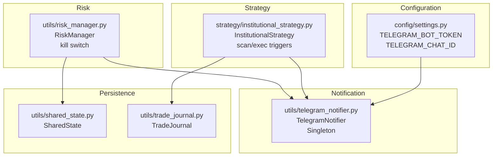
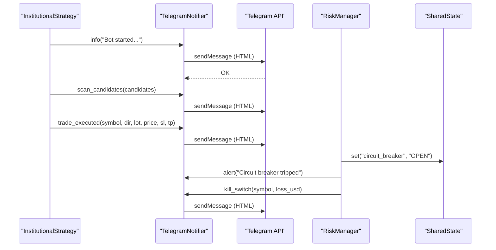
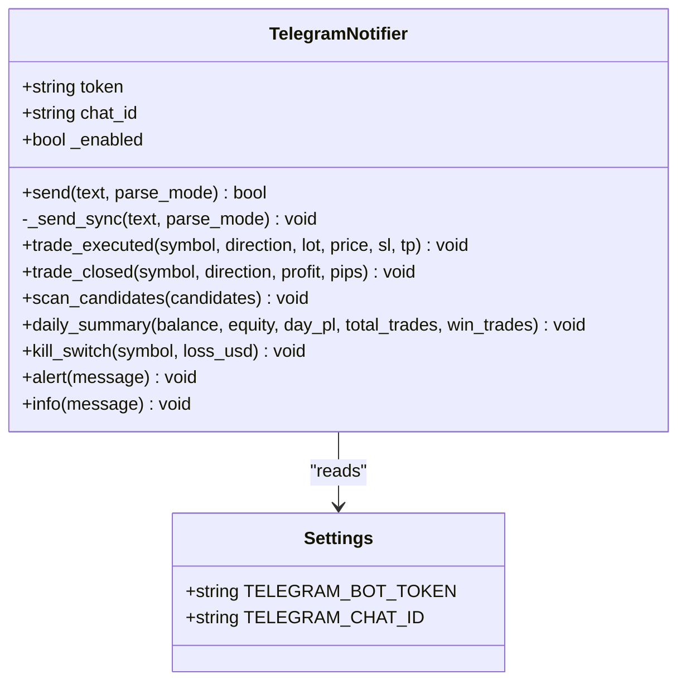
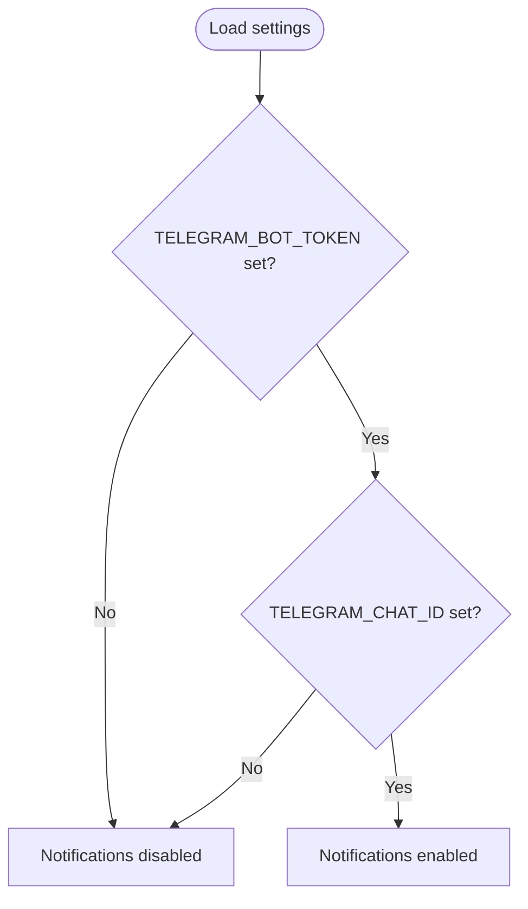
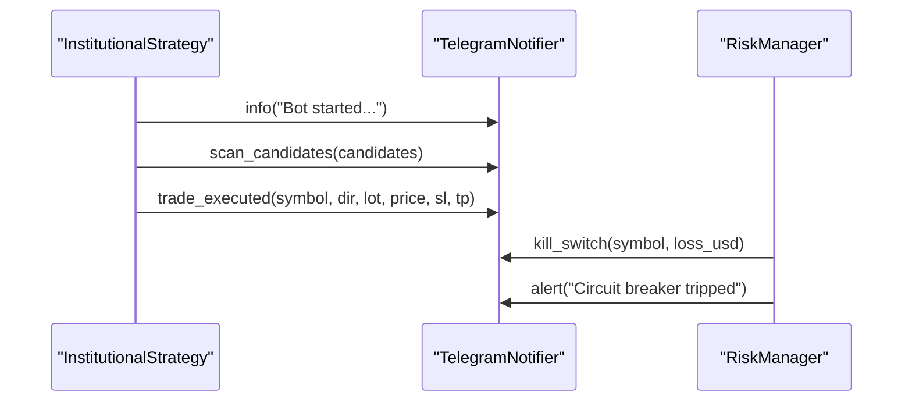
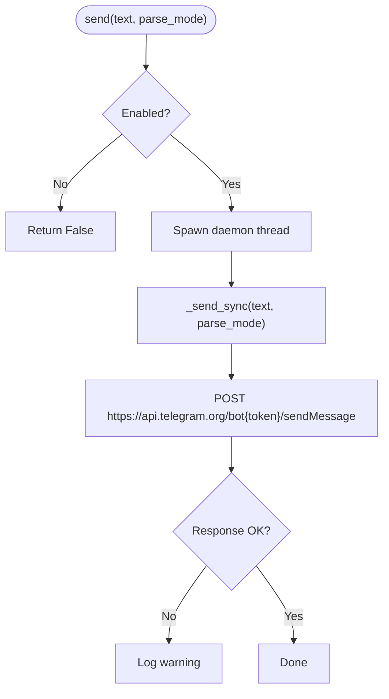
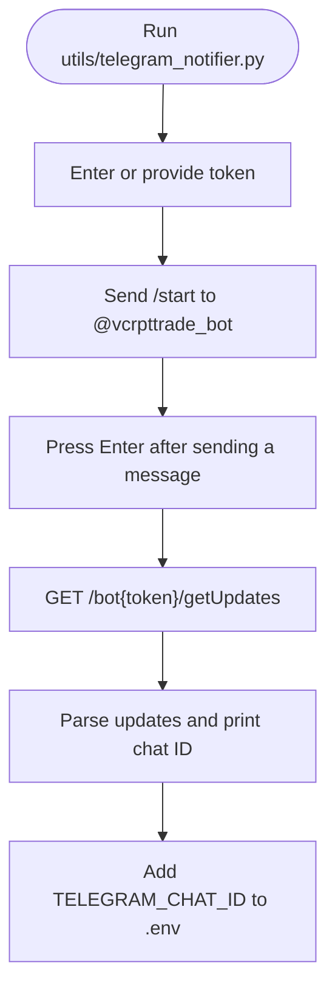
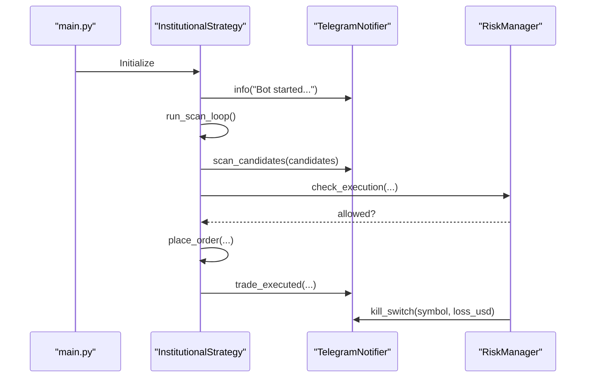
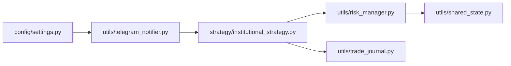

# Telegram Integration

<cite>
**Referenced Files in This Document**
- [telegram_notifier.py](file://utils/telegram_notifier.py)
- [settings.py](file://config/settings.py)
- [institutional_strategy.py](file://strategy/institutional_strategy.py)
- [risk_manager.py](file://utils/risk_manager.py)
- [shared_state.py](file://utils/shared_state.py)
- [trade_journal.py](file://utils/trade_journal.py)
- [main.py](file://main.py)
</cite>

## Table of Contents
1. [Introduction](#introduction)
2. [Project Structure](#project-structure)
3. [Core Components](#core-components)
4. [Architecture Overview](#architecture-overview)
5. [Detailed Component Analysis](#detailed-component-analysis)
6. [Dependency Analysis](#dependency-analysis)
7. [Performance Considerations](#performance-considerations)
8. [Troubleshooting Guide](#troubleshooting-guide)
9. [Conclusion](#conclusion)

## Introduction
This document explains the Telegram integration for the MT5 trading bot, focusing on the TelegramNotifier implementation, configuration, and how notifications are triggered by trading events. It covers bot token and chat ID setup, message formatting, non-blocking delivery, and the relationship between trading events and notification triggers. It also documents the @vcrpttrade_bot setup process, chat ID discovery, and customization options.

## Project Structure
The Telegram integration spans several modules:
- Configuration: Telegram credentials are loaded from environment variables.
- Notification service: A singleton notifier encapsulates Telegram API calls and formatting helpers.
- Strategy orchestration: The InstitutionalStrategy coordinates scanning and execution, triggering notifications at key moments.
- Risk management: Risk controls can activate kill switches that trigger notifications.
- Shared state: Used by risk management for persistence across restarts.

**Diagram sources**
- [settings.py](file://config/settings.py#L198-L201)
- [telegram_notifier.py](file://utils/telegram_notifier.py#L30-L137)
- [institutional_strategy.py](file://strategy/institutional_strategy.py#L35-L93)
- [risk_manager.py](file://utils/risk_manager.py#L14-L40)
- [shared_state.py](file://utils/shared_state.py#L23-L76)
- [trade_journal.py](file://utils/trade_journal.py#L23-L101)

**Section sources**
- [settings.py](file://config/settings.py#L198-L201)
- [telegram_notifier.py](file://utils/telegram_notifier.py#L1-L174)
- [institutional_strategy.py](file://strategy/institutional_strategy.py#L1-L500)
- [risk_manager.py](file://utils/risk_manager.py#L1-L549)
- [shared_state.py](file://utils/shared_state.py#L1-L110)
- [trade_journal.py](file://utils/trade_journal.py#L1-L274)

## Core Components
- TelegramNotifier: Encapsulates Telegram API integration, non-blocking delivery, and formatted message helpers.
- Configuration: Loads TELEGRAM_BOT_TOKEN and TELEGRAM_CHAT_ID from environment variables.
- Strategy triggers: Startup greeting, scan signals, trade executions, and generic alerts.
- Risk-driven notifications: Kill switch activation.
- Singleton pattern: Ensures a single notifier instance across the application.

Key responsibilities:
- Non-blocking sends via background threads.
- HTML-formatted messages with emojis and structured sections.
- Convenience functions for common notification types.
- Setup helper to discover chat ID.

**Section sources**
- [telegram_notifier.py](file://utils/telegram_notifier.py#L30-L137)
- [settings.py](file://config/settings.py#L198-L201)

## Architecture Overview
The Telegram integration is event-driven. Trading events originate in the InstitutionalStrategy and RiskManager, which call the TelegramNotifier to dispatch messages asynchronously. Configuration is centralized in settings.

**Diagram sources**
- [institutional_strategy.py](file://strategy/institutional_strategy.py#L88-L93)
- [institutional_strategy.py](file://strategy/institutional_strategy.py#L264-L265)
- [institutional_strategy.py](file://strategy/institutional_strategy.py#L399-L400)
- [risk_manager.py](file://utils/risk_manager.py#L56-L59)
- [risk_manager.py](file://utils/risk_manager.py#L207-L216)
- [telegram_notifier.py](file://utils/telegram_notifier.py#L41-L63)

## Detailed Component Analysis

### TelegramNotifier Implementation
- Initialization: Reads TELEGRAM_BOT_TOKEN and TELEGRAM_CHAT_ID from settings. Disables notifications if either is missing.
- Non-blocking send: Spawns a daemon thread to perform the actual HTTP request.
- Telegram API integration: Uses sendMessage with JSON payload and HTML parse mode.
- Formatted helpers:
  - trade_executed: Emits a structured trade execution message with symbol, direction, lot, price, SL/TP, and timestamp.
  - trade_closed: Emits a trade closure message with symbol, direction, and profit.
  - scan_candidates: Emits a compact list of scan candidates with direction, score, and ML probability.
  - daily_summary: Emits a daily performance summary with balance, equity, day P/L, and win rate.
  - kill_switch: Emits a kill switch activation message for a symbol.
  - alert/info: Generic helpers for alerts and informational messages.
- Singleton: get_notifier ensures a single notifier instance is reused.

**Diagram sources**
- [telegram_notifier.py](file://utils/telegram_notifier.py#L30-L137)
- [settings.py](file://config/settings.py#L198-L201)

**Section sources**
- [telegram_notifier.py](file://utils/telegram_notifier.py#L30-L137)
- [settings.py](file://config/settings.py#L198-L201)

### Configuration: Bot Token and Chat ID
- TELEGRAM_BOT_TOKEN and TELEGRAM_CHAT_ID are loaded from environment variables via settings.
- The notifier disables itself if either is empty.
- The setup helper prints instructions and can discover the chat ID by fetching recent updates.

**Diagram sources**
- [settings.py](file://config/settings.py#L198-L201)
- [telegram_notifier.py](file://utils/telegram_notifier.py#L33-L38)

**Section sources**
- [settings.py](file://config/settings.py#L198-L201)
- [telegram_notifier.py](file://utils/telegram_notifier.py#L33-L38)

### Notification Types and Triggers
- Bot startup alert: Sent by InstitutionalStrategy on initialization.
- Scan signals: Sent when candidates are found during the scan loop.
- Trade executions: Sent upon successful order placement.
- Kill switches: Sent when risk controls activate a kill switch for a symbol.
- Generic alerts/info: Sent for circuit breaker and other operational events.

**Diagram sources**
- [institutional_strategy.py](file://strategy/institutional_strategy.py#L88-L93)
- [institutional_strategy.py](file://strategy/institutional_strategy.py#L264-L265)
- [institutional_strategy.py](file://strategy/institutional_strategy.py#L399-L400)
- [risk_manager.py](file://utils/risk_manager.py#L56-L59)
- [risk_manager.py](file://utils/risk_manager.py#L207-L216)

**Section sources**
- [institutional_strategy.py](file://strategy/institutional_strategy.py#L88-L93)
- [institutional_strategy.py](file://strategy/institutional_strategy.py#L264-L265)
- [institutional_strategy.py](file://strategy/institutional_strategy.py#L399-L400)
- [risk_manager.py](file://utils/risk_manager.py#L56-L59)
- [risk_manager.py](file://utils/risk_manager.py#L207-L216)

### Non-blocking Notification Mechanism
- The notifier’s send method spawns a daemon thread to call _send_sync.
- _send_sync performs the HTTP request to Telegram’s API with a short timeout.
- Errors are logged; the main loop is unaffected.

**Diagram sources**
- [telegram_notifier.py](file://utils/telegram_notifier.py#L41-L63)

**Section sources**
- [telegram_notifier.py](file://utils/telegram_notifier.py#L41-L63)

### Message Formatting and Templates
- HTML parse mode is used for rich formatting.
- Emojis and separators enhance readability.
- Structured sections for trades, scans, summaries, and alerts.
- Timestamps are included for traceability.

Examples of formatted messages:
- Trade executed: includes symbol, direction, lot, price, SL/TP, and UTC timestamp.
- Trade closed: includes symbol, direction, and profit with optional pips.
- Scan candidates: lists top candidates with direction, score, and ML probability.
- Daily summary: includes balance, equity, day P/L, total trades, and win rate.
- Kill switch: includes symbol and recent loss amount.

**Section sources**
- [telegram_notifier.py](file://utils/telegram_notifier.py#L66-L128)

### @vcrpttrade_bot Setup and Chat ID Discovery
- Add TELEGRAM_BOT_TOKEN and TELEGRAM_CHAT_ID to the environment.
- Run the notifier module directly to discover the chat ID:
  - Send /start to @vcrpttrade_bot.
  - Run the setup helper and press Enter after sending a message.
  - The helper prints the latest chat ID and suggests adding it to the environment.

**Diagram sources**
- [telegram_notifier.py](file://utils/telegram_notifier.py#L154-L173)

**Section sources**
- [telegram_notifier.py](file://utils/telegram_notifier.py#L6-L14)
- [telegram_notifier.py](file://utils/telegram_notifier.py#L154-L173)

### Relationship Between Trading Events and Notification Triggers
- Startup: InstitutionalStrategy sends an info message on initialization.
- Signals: When candidates are found, InstitutionalStrategy sends scan_candidates.
- Executions: After placing orders, InstitutionalStrategy sends trade_executed.
- Risk events: RiskManager can trigger kill_switch and alert messages for circuit breaker or kill switch events.

**Diagram sources**
- [main.py](file://main.py#L19-L122)
- [institutional_strategy.py](file://strategy/institutional_strategy.py#L88-L93)
- [institutional_strategy.py](file://strategy/institutional_strategy.py#L264-L265)
- [institutional_strategy.py](file://strategy/institutional_strategy.py#L399-L400)
- [risk_manager.py](file://utils/risk_manager.py#L207-L216)

**Section sources**
- [main.py](file://main.py#L19-L122)
- [institutional_strategy.py](file://strategy/institutional_strategy.py#L88-L93)
- [institutional_strategy.py](file://strategy/institutional_strategy.py#L264-L265)
- [institutional_strategy.py](file://strategy/institutional_strategy.py#L399-L400)
- [risk_manager.py](file://utils/risk_manager.py#L207-L216)

## Dependency Analysis
- TelegramNotifier depends on settings for credentials and uses requests for HTTP calls.
- InstitutionalStrategy depends on TelegramNotifier for notifications and on RiskManager for risk checks.
- RiskManager depends on SharedState for persistence and on TelegramNotifier for alerts.
- TradeJournal persists trade events and is used by InstitutionalStrategy for logging.

**Diagram sources**
- [settings.py](file://config/settings.py#L198-L201)
- [telegram_notifier.py](file://utils/telegram_notifier.py#L30-L137)
- [institutional_strategy.py](file://strategy/institutional_strategy.py#L35-L93)
- [risk_manager.py](file://utils/risk_manager.py#L14-L40)
- [shared_state.py](file://utils/shared_state.py#L23-L76)
- [trade_journal.py](file://utils/trade_journal.py#L23-L101)

**Section sources**
- [settings.py](file://config/settings.py#L198-L201)
- [telegram_notifier.py](file://utils/telegram_notifier.py#L30-L137)
- [institutional_strategy.py](file://strategy/institutional_strategy.py#L35-L93)
- [risk_manager.py](file://utils/risk_manager.py#L14-L40)
- [shared_state.py](file://utils/shared_state.py#L23-L76)
- [trade_journal.py](file://utils/trade_journal.py#L23-L101)

## Performance Considerations
- Non-blocking delivery: Background threads prevent blocking the trading loop.
- Short timeouts: Requests are made with a short timeout to avoid delays.
- Minimal overhead: Formatting helpers construct messages efficiently; HTML parse mode is used for rich formatting without extra libraries.
- Logging: Errors are logged rather than raising exceptions, keeping the system resilient.

[No sources needed since this section provides general guidance]

## Troubleshooting Guide
Common issues and resolutions:
- Notifications disabled: Ensure TELEGRAM_BOT_TOKEN and TELEGRAM_CHAT_ID are set in the environment.
- No chat ID found: Run the setup helper after sending /start to @vcrpttrade_bot.
- Network errors: The notifier logs warnings on send failures; verify network connectivity and Telegram API availability.
- Missing startup greeting: Confirm InstitutionalStrategy initializes and calls info on startup.
- Kill switch not triggering: Verify RiskManager’s kill switch logic and that SharedState is accessible.

**Section sources**
- [telegram_notifier.py](file://utils/telegram_notifier.py#L33-L38)
- [telegram_notifier.py](file://utils/telegram_notifier.py#L60-L63)
- [telegram_notifier.py](file://utils/telegram_notifier.py#L154-L173)
- [institutional_strategy.py](file://strategy/institutional_strategy.py#L88-L93)
- [risk_manager.py](file://utils/risk_manager.py#L207-L216)

## Conclusion
The Telegram integration provides timely, non-blocking notifications for key trading events. Configuration is straightforward via environment variables, and the notifier offers richly formatted messages with a simple API. The integration is event-driven, triggered by the InstitutionalStrategy and RiskManager, ensuring operators stay informed without impacting trading performance.