# Testing and Validation

<cite>
**Referenced Files in This Document**
- [debug_scan.py](file://debug_scan.py)
- [debug_async.py](file://debug_async.py)
- [debug_execution.py](file://debug_execution.py)
- [debug_gemini.py](file://debug_gemini.py)
- [reproduce_issue.py](file://reproduce_issue.py)
- [verify_trade.py](file://verify_trade.py)
- [verify_management.py](file://verify_management.py)
- [tests/verify_keyerror.py](file://tests/verify_keyerror.py)
- [tests/verify_news.py](file://tests/verify_news.py)
- [tests/verify_retail_filters.py](file://tests/verify_retail_filters.py)
- [config/settings.py](file://config/settings.py)
- [execution/mt5_client.py](file://execution/mt5_client.py)
- [strategy/institutional_strategy.py](file://strategy/institutional_strategy.py)
- [utils/risk_manager.py](file://utils/risk_manager.py)
- [analysis/mistral_advisor.py](file://analysis/mistral_advisor.py)
</cite>

## Table of Contents
1. [Introduction](#introduction)
2. [Project Structure](#project-structure)
3. [Core Components](#core-components)
4. [Architecture Overview](#architecture-overview)
5. [Detailed Component Analysis](#detailed-component-analysis)
6. [Dependency Analysis](#dependency-analysis)
7. [Performance Considerations](#performance-considerations)
8. [Troubleshooting Guide](#troubleshooting-guide)
9. [Conclusion](#conclusion)
10. [Appendices](#appendices)

## Introduction
This document provides comprehensive testing and validation guidance for the Institutional SureShot Scanner. It covers the test suite structure, debugging tools, and validation procedures. It explains the purpose and mechanics of key debug scripts (single-pass scanning, async loop testing, order placement verification, and AI connectivity testing), and documents verification scripts for trade execution, management operations, and issue reproduction. It also details technical implementation aspects for test automation, performance benchmarking, and error handling validation, along with testing workflows, debugging methodologies, troubleshooting procedures, and production validation techniques.

## Project Structure
The testing and validation assets are organized across dedicated scripts and unit tests:
- Debug scripts under the repository root for quick diagnostics and end-to-end validation
- Unit tests under the tests/ directory for focused regression coverage
- Core system components under execution/, strategy/, utils/, analysis/, and config/ that are exercised by the tests and debug scripts

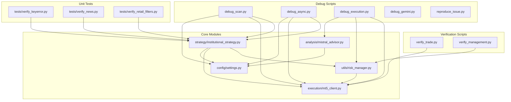

**Diagram sources**
- [debug_scan.py](file://debug_scan.py#L1-L77)
- [debug_async.py](file://debug_async.py#L1-L47)
- [debug_execution.py](file://debug_execution.py#L1-L86)
- [debug_gemini.py](file://debug_gemini.py#L1-L34)
- [reproduce_issue.py](file://reproduce_issue.py#L1-L64)
- [verify_trade.py](file://verify_trade.py#L1-L91)
- [verify_management.py](file://verify_management.py#L1-L148)
- [tests/verify_keyerror.py](file://tests/verify_keyerror.py#L1-L69)
- [tests/verify_news.py](file://tests/verify_news.py#L1-L56)
- [tests/verify_retail_filters.py](file://tests/verify_retail_filters.py#L1-L64)
- [config/settings.py](file://config/settings.py#L1-L201)
- [execution/mt5_client.py](file://execution/mt5_client.py#L1-L385)
- [strategy/institutional_strategy.py](file://strategy/institutional_strategy.py#L1-L500)
- [utils/risk_manager.py](file://utils/risk_manager.py#L1-L549)
- [analysis/mistral_advisor.py](file://analysis/mistral_advisor.py#L1-L115)

**Section sources**
- [debug_scan.py](file://debug_scan.py#L1-L77)
- [debug_async.py](file://debug_async.py#L1-L47)
- [debug_execution.py](file://debug_execution.py#L1-L86)
- [debug_gemini.py](file://debug_gemini.py#L1-L34)
- [reproduce_issue.py](file://reproduce_issue.py#L1-L64)
- [verify_trade.py](file://verify_trade.py#L1-L91)
- [verify_management.py](file://verify_management.py#L1-L148)
- [tests/verify_keyerror.py](file://tests/verify_keyerror.py#L1-L69)
- [tests/verify_news.py](file://tests/verify_news.py#L1-L56)
- [tests/verify_retail_filters.py](file://tests/verify_retail_filters.py#L1-L64)
- [config/settings.py](file://config/settings.py#L1-L201)
- [execution/mt5_client.py](file://execution/mt5_client.py#L1-L385)
- [strategy/institutional_strategy.py](file://strategy/institutional_strategy.py#L1-L500)
- [utils/risk_manager.py](file://utils/risk_manager.py#L1-L549)
- [analysis/mistral_advisor.py](file://analysis/mistral_advisor.py#L1-L115)

## Core Components
- Configuration and Settings: Centralized configuration for trading parameters, risk controls, session filters, and AI integrations.
- MT5 Client: Handles connection, symbol detection, account info retrieval, order placement, position modification, partial close, and full close.
- Institutional Strategy: Orchestrates scanning across pair agents, manages global checks, executes trades, and coordinates AI agents.
- Risk Manager: Performs pre-scan checks, daily limits, kill switch, payoff mandate, correlation conflicts, profitability checks, position sizing, and position monitoring.
- AI Advisors: Provides external AI connectivity checks and asynchronous market analysis.

**Section sources**
- [config/settings.py](file://config/settings.py#L1-L201)
- [execution/mt5_client.py](file://execution/mt5_client.py#L1-L385)
- [strategy/institutional_strategy.py](file://strategy/institutional_strategy.py#L1-L500)
- [utils/risk_manager.py](file://utils/risk_manager.py#L1-L549)
- [analysis/mistral_advisor.py](file://analysis/mistral_advisor.py#L1-L115)

## Architecture Overview
The testing and validation architecture integrates debug scripts, verification scripts, and unit tests against the core system components. Debug scripts exercise end-to-end flows; verification scripts focus on isolated capabilities; unit tests assert correctness of critical logic.

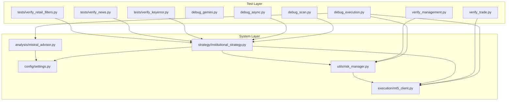

**Diagram sources**
- [debug_scan.py](file://debug_scan.py#L1-L77)
- [debug_async.py](file://debug_async.py#L1-L47)
- [debug_execution.py](file://debug_execution.py#L1-L86)
- [debug_gemini.py](file://debug_gemini.py#L1-L34)
- [verify_trade.py](file://verify_trade.py#L1-L91)
- [verify_management.py](file://verify_management.py#L1-L148)
- [tests/verify_keyerror.py](file://tests/verify_keyerror.py#L1-L69)
- [tests/verify_news.py](file://tests/verify_news.py#L1-L56)
- [tests/verify_retail_filters.py](file://tests/verify_retail_filters.py#L1-L64)
- [config/settings.py](file://config/settings.py#L1-L201)
- [execution/mt5_client.py](file://execution/mt5_client.py#L1-L385)
- [strategy/institutional_strategy.py](file://strategy/institutional_strategy.py#L1-L500)
- [utils/risk_manager.py](file://utils/risk_manager.py#L1-L549)
- [analysis/mistral_advisor.py](file://analysis/mistral_advisor.py#L1-L115)

## Detailed Component Analysis

### Debug Scripts

#### Single-Pass Scan Debug (debug_scan.py)
Purpose:
- Validates end-to-end scanning pipeline for all configured symbols with verbose logging and error capture.

Key behaviors:
- Enables debug mode and sets log level.
- Establishes MT5 connection and detects available symbols.
- Overrides symbol lists to include all base symbols and categories.
- Initializes InstitutionalStrategy and runs the scan loop.
- Captures exceptions and shuts down MT5 cleanly.

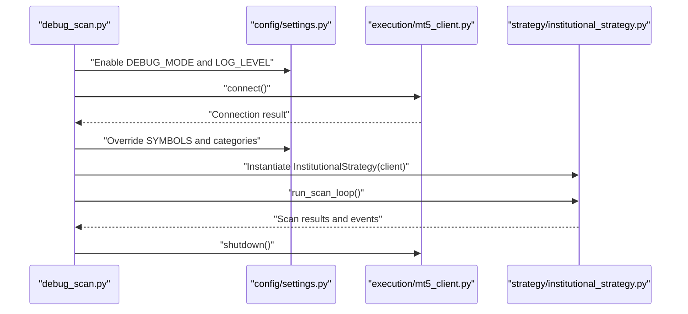

**Diagram sources**
- [debug_scan.py](file://debug_scan.py#L1-L77)
- [config/settings.py](file://config/settings.py#L1-L201)
- [execution/mt5_client.py](file://execution/mt5_client.py#L1-L385)
- [strategy/institutional_strategy.py](file://strategy/institutional_strategy.py#L1-L500)

**Section sources**
- [debug_scan.py](file://debug_scan.py#L1-L77)

#### Async Loop Debug (debug_async.py)
Purpose:
- Exercises the async orchestration of scanning loops with periodic iterations and dashboard event streaming.

Key behaviors:
- Forces debug logging level.
- Connects to MT5 and detects symbols.
- Starts the stream server and pushes updates.
- Runs multiple iterations of the scan loop with pauses between iterations.
- Shuts down MT5 after completion.

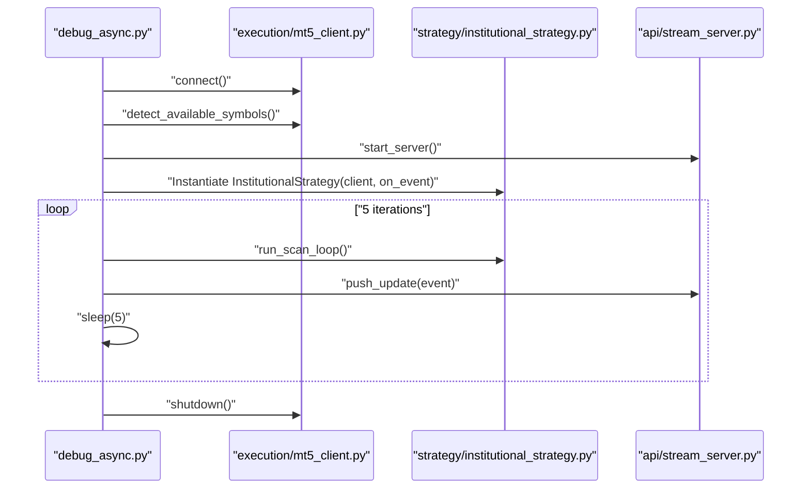

**Diagram sources**
- [debug_async.py](file://debug_async.py#L1-L47)
- [execution/mt5_client.py](file://execution/mt5_client.py#L1-L385)
- [strategy/institutional_strategy.py](file://strategy/institutional_strategy.py#L1-L500)

**Section sources**
- [debug_async.py](file://debug_async.py#L1-L47)

#### Order Placement Verification (debug_execution.py)
Purpose:
- Validates MT5 connectivity, account info, symbol spread, risk manager checks, and AI advisor health.

Key behaviors:
- Connects to MT5 and retrieves account info.
- Checks symbol spread against configured thresholds.
- Instantiates RiskManager and evaluates trade viability.
- Tests Mistral AI advisor connectivity and latency.

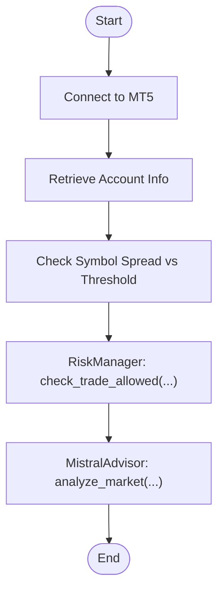

**Diagram sources**
- [debug_execution.py](file://debug_execution.py#L1-L86)
- [execution/mt5_client.py](file://execution/mt5_client.py#L1-L385)
- [utils/risk_manager.py](file://utils/risk_manager.py#L1-L549)
- [analysis/mistral_advisor.py](file://analysis/mistral_advisor.py#L1-L115)

**Section sources**
- [debug_execution.py](file://debug_execution.py#L1-L86)

#### AI Connectivity Test (debug_gemini.py)
Purpose:
- Confirms Gemini API availability and validates basic generation responses.

Key behaviors:
- Loads API key from environment.
- Lists available models supporting content generation.
- Tests generation with two model variants and prints outcomes.

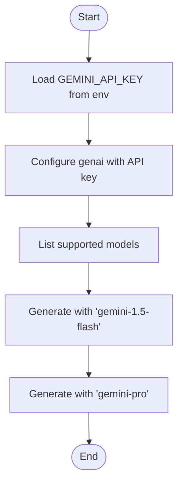

**Diagram sources**
- [debug_gemini.py](file://debug_gemini.py#L1-L34)

**Section sources**
- [debug_gemini.py](file://debug_gemini.py#L1-L34)

### Verification Scripts

#### Trade Execution Verification (verify_trade.py)
Purpose:
- Automates a real-world trade lifecycle: place a pending order, verify execution, and cancel immediately.

Key behaviors:
- Connects to MT5 and validates account info.
- Places a Buy Limit pending order at a predefined distance.
- Cancels the order and reports results.

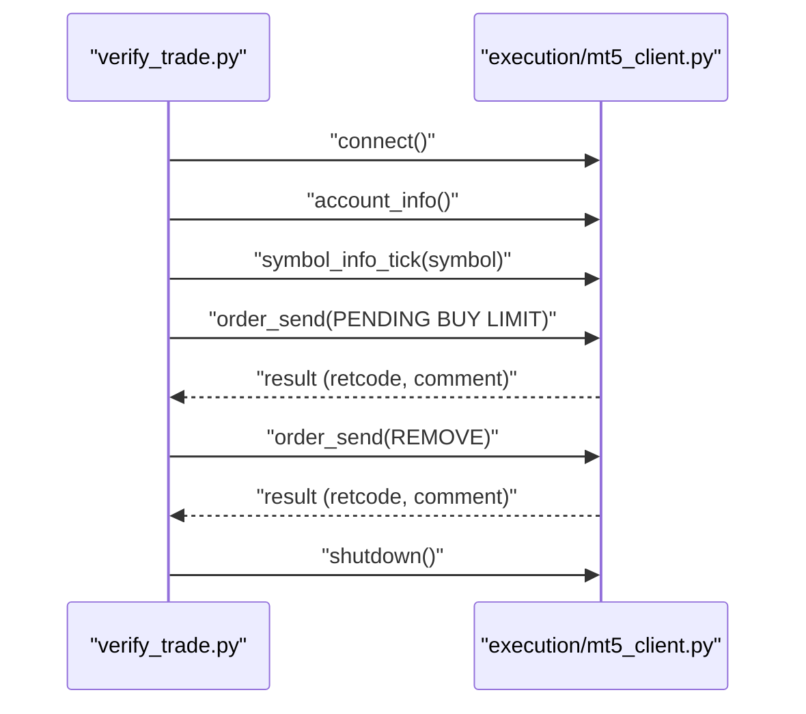

**Diagram sources**
- [verify_trade.py](file://verify_trade.py#L1-L91)
- [execution/mt5_client.py](file://execution/mt5_client.py#L1-L385)

**Section sources**
- [verify_trade.py](file://verify_trade.py#L1-L91)

#### Active Trade Management Verification (verify_management.py)
Purpose:
- Validates regime exits, ATR caching behavior, modification thresholds, and profitability checks using mocked dependencies.

Key behaviors:
- Uses mock MT5 ticks and positions to simulate scenarios.
- Exercises regime exit logic and ATR cache hit/miss.
- Tests trailing stop thresholds and profitability logic with commission awareness.

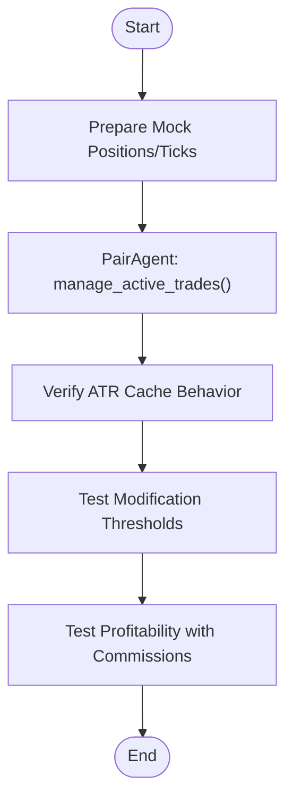

**Diagram sources**
- [verify_management.py](file://verify_management.py#L1-L148)

**Section sources**
- [verify_management.py](file://verify_management.py#L1-L148)

### Issue Reproduction Script
Purpose:
- Reproduces non-ASCII character encoding issues in QuantAgent output and identifies problematic characters.

Key behaviors:
- Creates synthetic OHLCV dataframes across multiple timeframes.
- Calls QuantAgent analysis and inspects the resulting details string for non-ASCII characters.
- Reports encoding safety and character details.

**Section sources**
- [reproduce_issue.py](file://reproduce_issue.py#L1-L64)

### Unit Tests

#### KeyError Fix Regression (tests/verify_keyerror.py)
Purpose:
- Ensures resilient handling when AI/ML signals are missing expected keys.

Key behaviors:
- Mocks quant agent response to simulate missing keys.
- Asserts that analysis completes without raising KeyError and returns neutral direction.

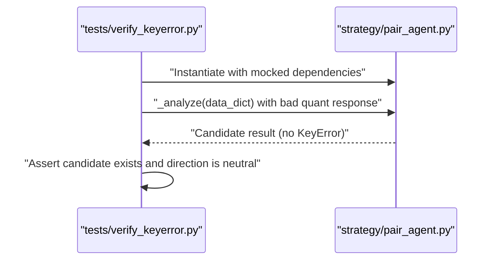

**Diagram sources**
- [tests/verify_keyerror.py](file://tests/verify_keyerror.py#L1-L69)

**Section sources**
- [tests/verify_keyerror.py](file://tests/verify_keyerror.py#L1-L69)

#### News Filter Validation (tests/verify_news.py)
Purpose:
- Validates blackout periods around high-impact events and agent-level blocking logic.

Key behaviors:
- Patches datetime to specific blackout time.
- Asserts that news blackout detection returns blocked status.
- Asserts that agent scan returns None with appropriate status during blackout.

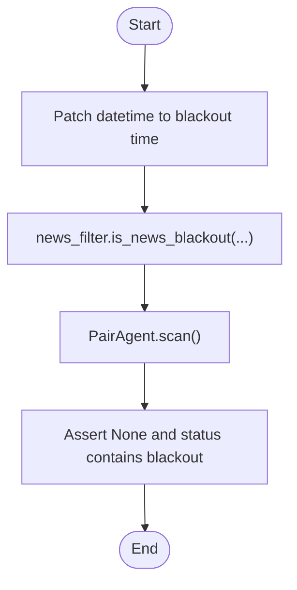

**Diagram sources**
- [tests/verify_news.py](file://tests/verify_news.py#L1-L56)

**Section sources**
- [tests/verify_news.py](file://tests/verify_news.py#L1-L56)

#### Retail Filters Validation (tests/verify_retail_filters.py)
Purpose:
- Validates spread ratio filtering and session-based hunting hours logic.

Key behaviors:
- Patches datetime and tick data to simulate various spread and timing scenarios.
- Asserts pass/fail conditions for retail viability checks.

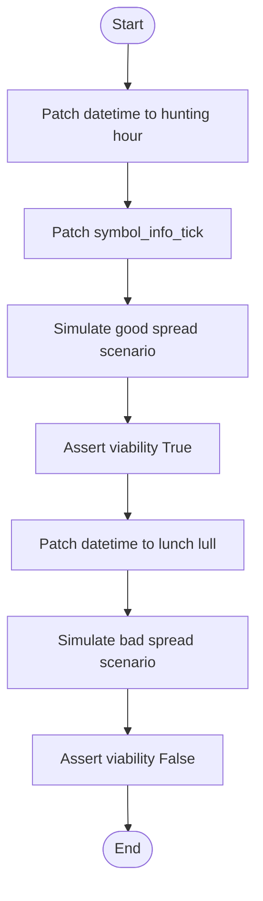

**Diagram sources**
- [tests/verify_retail_filters.py](file://tests/verify_retail_filters.py#L1-L64)

**Section sources**
- [tests/verify_retail_filters.py](file://tests/verify_retail_filters.py#L1-L64)

## Dependency Analysis
The debug and verification scripts depend on core modules. The following diagram highlights key dependencies and their roles in testing.

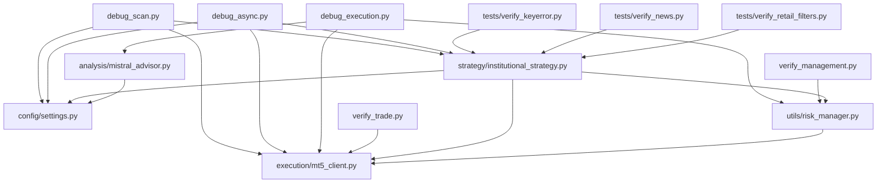

**Diagram sources**
- [debug_scan.py](file://debug_scan.py#L1-L77)
- [debug_async.py](file://debug_async.py#L1-L47)
- [debug_execution.py](file://debug_execution.py#L1-L86)
- [verify_trade.py](file://verify_trade.py#L1-L91)
- [verify_management.py](file://verify_management.py#L1-L148)
- [tests/verify_keyerror.py](file://tests/verify_keyerror.py#L1-L69)
- [tests/verify_news.py](file://tests/verify_news.py#L1-L56)
- [tests/verify_retail_filters.py](file://tests/verify_retail_filters.py#L1-L64)
- [strategy/institutional_strategy.py](file://strategy/institutional_strategy.py#L1-L500)
- [execution/mt5_client.py](file://execution/mt5_client.py#L1-L385)
- [utils/risk_manager.py](file://utils/risk_manager.py#L1-L549)
- [analysis/mistral_advisor.py](file://analysis/mistral_advisor.py#L1-L115)
- [config/settings.py](file://config/settings.py#L1-L201)

**Section sources**
- [strategy/institutional_strategy.py](file://strategy/institutional_strategy.py#L1-L500)
- [execution/mt5_client.py](file://execution/mt5_client.py#L1-L385)
- [utils/risk_manager.py](file://utils/risk_manager.py#L1-L549)
- [analysis/mistral_advisor.py](file://analysis/mistral_advisor.py#L1-L115)
- [config/settings.py](file://config/settings.py#L1-L201)

## Performance Considerations
- Asynchronous orchestration: The scanning loop leverages asyncio.gather to parallelize agent scans, reducing end-to-end latency.
- Data caching: InstitutionalStrategy uses DataCache to minimize redundant data fetches; verify_management demonstrates cache hit validation.
- Risk-aware sizing: RiskManager’s position sizing considers Kelly criterion and confluence tiers, balancing growth with safety.
- Network I/O: AI advisor calls are asynchronous; debug_execution measures latency to inform tuning.
- Logging overhead: Debug scripts enable verbose logging; in production, tune log levels to reduce overhead.

[No sources needed since this section provides general guidance]

## Troubleshooting Guide
Common issues and remedies:
- MT5 connectivity failures: Verify credentials and server path in configuration; confirm terminal is reachable.
- High spread blocking entries: Adjust MAX_SPREAD thresholds per asset class; ensure symbols are visible and tradable.
- News blackouts: Confirm blackout detection logic and agent-level blocking behavior.
- Non-ASCII output: Use safe ASCII encoding for console printing; reproduce_issue.py demonstrates detection and remediation.
- KeyError in analysis: Ensure AI/ML responses include required keys; tests/verify_keyerror.py guards against regressions.
- Async loop stalls: Validate event loop and server startup; debug_async.py demonstrates structured iteration and pause intervals.
- AI API errors: Check API keys and network connectivity; debug_gemini.py and debug_execution.py provide targeted checks.

**Section sources**
- [debug_scan.py](file://debug_scan.py#L1-L77)
- [debug_async.py](file://debug_async.py#L1-L47)
- [debug_execution.py](file://debug_execution.py#L1-L86)
- [debug_gemini.py](file://debug_gemini.py#L1-L34)
- [reproduce_issue.py](file://reproduce_issue.py#L1-L64)
- [tests/verify_keyerror.py](file://tests/verify_keyerror.py#L1-L69)
- [tests/verify_news.py](file://tests/verify_news.py#L1-L56)
- [tests/verify_retail_filters.py](file://tests/verify_retail_filters.py#L1-L64)

## Conclusion
The Institutional SureShot Scanner includes a comprehensive suite of debug, verification, and unit tests that collectively validate end-to-end flows, isolated capabilities, and critical logic. Debug scripts provide rapid feedback for scanning, async orchestration, execution, and AI connectivity. Verification scripts ensure realistic trade lifecycle behavior and management operations. Unit tests guard against regressions in key areas such as error handling, news filters, and retail viability. Together, these assets support reliable operation, facilitate troubleshooting, and enable continuous improvement.

[No sources needed since this section summarizes without analyzing specific files]

## Appendices

### Testing Workflow and Methodologies
- Unit testing: Use unittest with mocking to isolate components and assert deterministic outcomes.
- Integration testing: Execute debug scripts to validate cross-component interactions under realistic conditions.
- Production validation: Combine verification scripts with manual checks and logging review to ensure readiness.

[No sources needed since this section provides general guidance]

### Test Data Management
- Environment variables: Store API keys and credentials in .env; scripts load from environment.
- Mock data: Use synthetic datasets for deterministic tests (as demonstrated in verification scripts).
- Historical data: Utilize MT5 client helpers to retrieve recent deals and compute statistics for risk checks.

**Section sources**
- [config/settings.py](file://config/settings.py#L1-L201)
- [execution/mt5_client.py](file://execution/mt5_client.py#L1-L385)

### Continuous Integration Practices
- Pre-commit checks: Run unit tests locally before committing.
- CI pipeline: Integrate unit tests and selected debug scripts to validate core logic and environment readiness.
- Artifact retention: Archive logs from debug and verification runs for post-mortem analysis.

[No sources needed since this section provides general guidance]