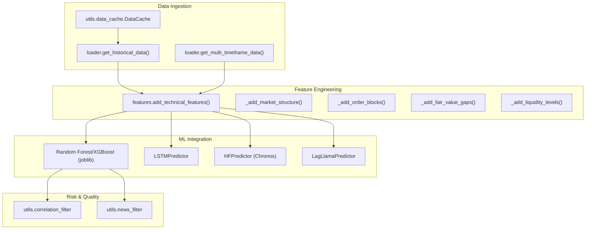
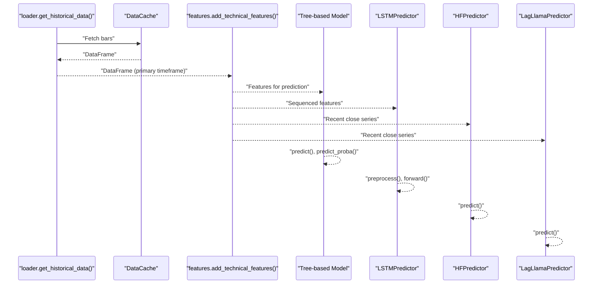
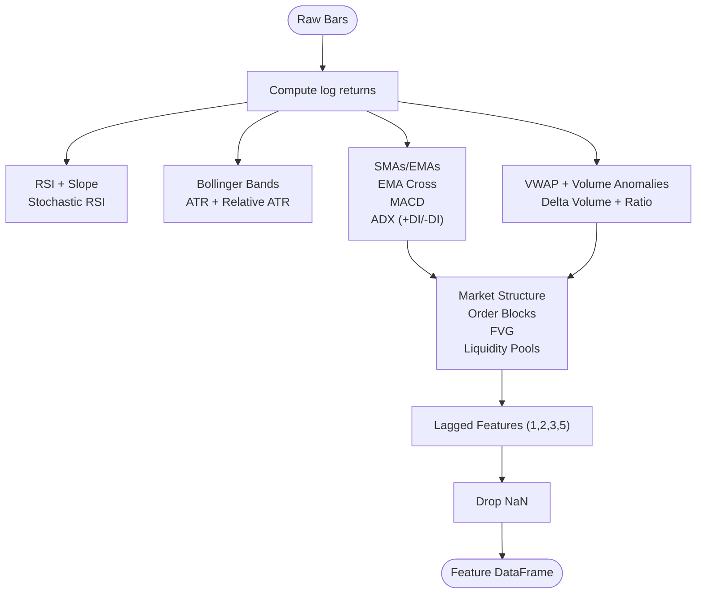
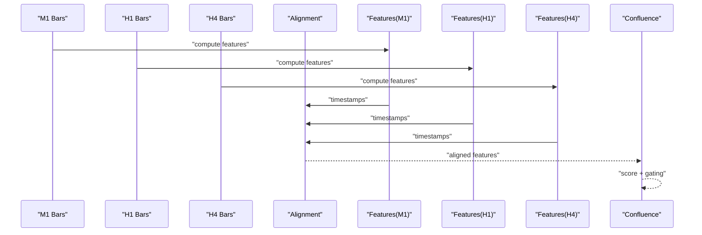
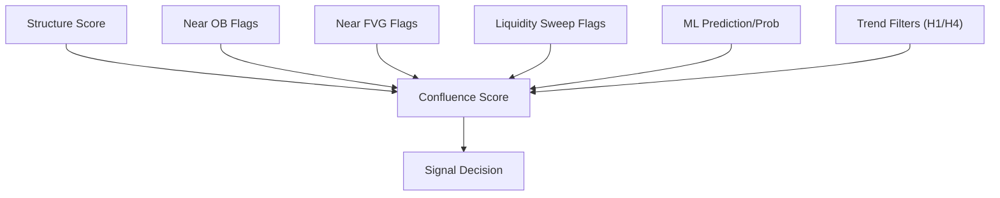
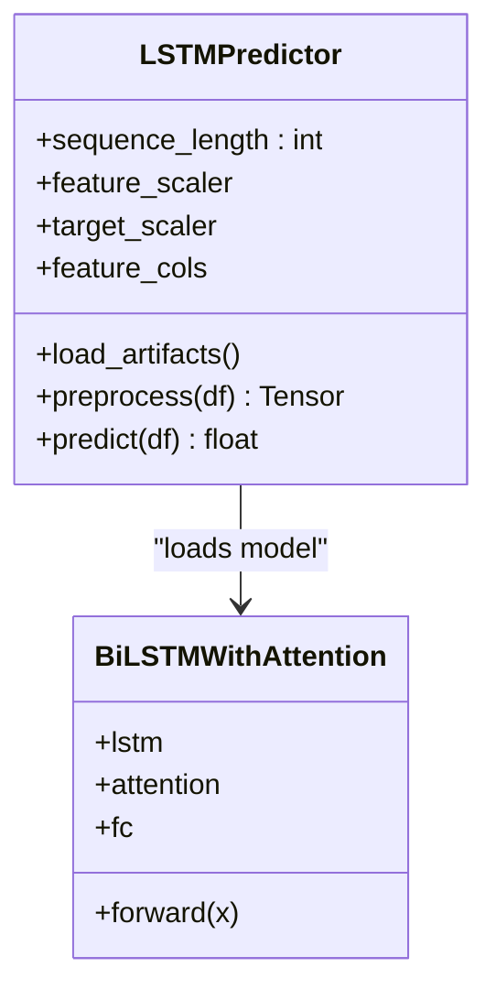
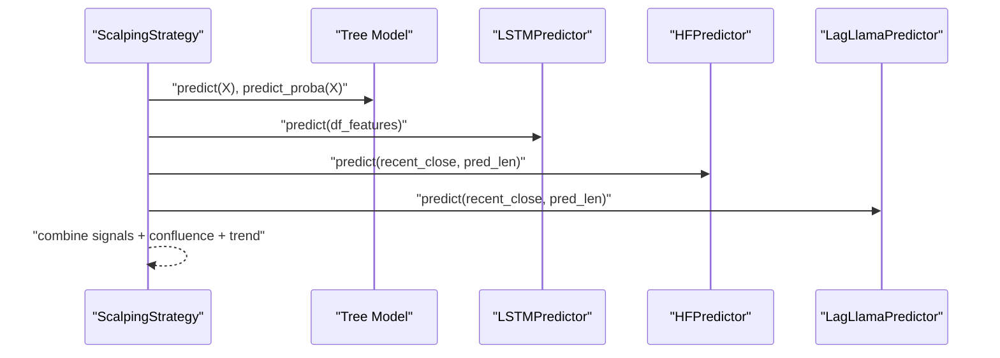
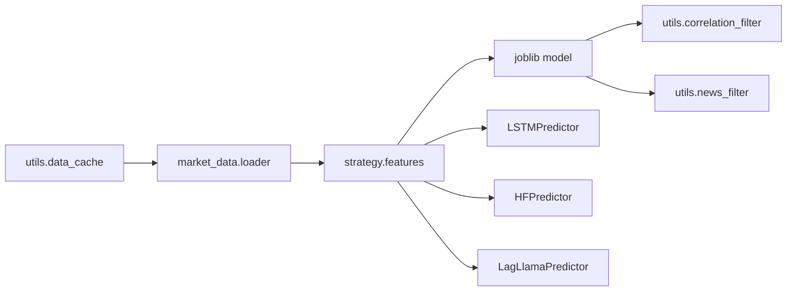

# Feature Engineering Pipeline

<cite>
**Referenced Files in This Document**
- [features.py](file://strategy/features.py)
- [loader.py](file://market_data/loader.py)
- [scalping_strategy.py](file://strategy/scalping_strategy.py)
- [lstm_predictor.py](file://strategy/lstm_predictor.py)
- [lstm_model.py](file://strategy/lstm_model.py)
- [hf_predictor.py](file://strategy/hf_predictor.py)
- [lag_llama_predictor.py](file://strategy/lag_llama_predictor.py)
- [data_cache.py](file://utils/data_cache.py)
- [settings.py](file://config/settings.py)
- [correlation_filter.py](file://utils/correlation_filter.py)
- [news_filter.py](file://utils/news_filter.py)
- [main.py](file://main.py)
</cite>

## Table of Contents
1. [Introduction](#introduction)
2. [Project Structure](#project-structure)
3. [Core Components](#core-components)
4. [Architecture Overview](#architecture-overview)
5. [Detailed Component Analysis](#detailed-component-analysis)
6. [Dependency Analysis](#dependency-analysis)
7. [Performance Considerations](#performance-considerations)
8. [Troubleshooting Guide](#troubleshooting-guide)
9. [Conclusion](#conclusion)
10. [Appendices](#appendices)

## Introduction
This document explains the feature engineering pipeline that transforms raw market data into meaningful trading signals. It covers the technical indicator library (moving averages, RSI, MACD, Bollinger Bands, and custom institutional constructs), multi-timeframe feature construction, data alignment strategies, confluence scoring mechanisms, feature selection, normalization, and integration with machine learning models. It also documents how features are engineered across M1, M5, H1, and H4 timeframes and combined for comprehensive market analysis, along with validation and quality checks.

## Project Structure
The feature engineering pipeline spans several modules:
- Market data ingestion and caching
- Feature computation and custom institutional indicators
- Multi-timeframe alignment and confluence scoring
- Machine learning integration (tree-based, LSTM, and forecasting models)
- Risk and quality controls (correlation filtering, news blackout windows)

**Diagram sources**
- [loader.py](file://market_data/loader.py#L40-L82)
- [data_cache.py](file://utils/data_cache.py#L16-L77)
- [features.py](file://strategy/features.py#L6-L98)
- [lstm_predictor.py](file://strategy/lstm_predictor.py#L9-L142)
- [hf_predictor.py](file://strategy/hf_predictor.py#L15-L53)
- [lag_llama_predictor.py](file://strategy/lag_llama_predictor.py#L31-L235)
- [correlation_filter.py](file://utils/correlation_filter.py#L1-L117)
- [news_filter.py](file://utils/news_filter.py#L1-L239)

**Section sources**
- [loader.py](file://market_data/loader.py#L1-L83)
- [features.py](file://strategy/features.py#L1-L242)
- [data_cache.py](file://utils/data_cache.py#L1-L77)
- [scalping_strategy.py](file://strategy/scalping_strategy.py#L1-L291)
- [lstm_predictor.py](file://strategy/lstm_predictor.py#L1-L142)
- [lstm_model.py](file://strategy/lstm_model.py#L1-L70)
- [hf_predictor.py](file://strategy/hf_predictor.py#L1-L53)
- [lag_llama_predictor.py](file://strategy/lag_llama_predictor.py#L1-L235)
- [correlation_filter.py](file://utils/correlation_filter.py#L1-L117)
- [news_filter.py](file://utils/news_filter.py#L1-L239)
- [settings.py](file://config/settings.py#L1-L201)

## Core Components
- Technical indicator library: momentum (RSI, Stochastic RSI), trend (SMAs, EMAs, MACD, ADX), volatility (Bollinger Bands, ATR), and volume (VWAP, delta volume).
- Institutional constructs: market structure (HH/HL/LH/LL, BOS), order blocks (OB), fair value gaps (FVG), liquidity pools, and OB/FVG proximity flags.
- Multi-timeframe alignment: fetch M1/M5/H1/H4 bars and align timestamps; compute features per timeframe; combine signals with confluence scoring.
- Feature selection and normalization: ML-ready subset of computed features; scaling via saved scalers; sequence preparation for LSTM.
- ML integration: tree-based model (Random Forest/XGBoost), LSTM with attention, and forecasting models (Chronos and Lag-Llama).
- Validation and quality: cache TTLs, session-awareness, correlation filtering, news blackout windows, and trend filters.

**Section sources**
- [features.py](file://strategy/features.py#L6-L98)
- [features.py](file://strategy/features.py#L101-L224)
- [settings.py](file://config/settings.py#L150-L153)
- [data_cache.py](file://utils/data_cache.py#L16-L77)
- [lstm_predictor.py](file://strategy/lstm_predictor.py#L79-L142)
- [scalping_strategy.py](file://strategy/scalping_strategy.py#L95-L291)

## Architecture Overview
The pipeline ingests raw OHLCV bars, computes rich technical features, aligns across multiple timeframes, applies confluence scoring, and feeds ML models to produce trading signals.

**Diagram sources**
- [loader.py](file://market_data/loader.py#L40-L82)
- [data_cache.py](file://utils/data_cache.py#L30-L48)
- [features.py](file://strategy/features.py#L6-L98)
- [lstm_predictor.py](file://strategy/lstm_predictor.py#L79-L142)
- [hf_predictor.py](file://strategy/hf_predictor.py#L34-L52)
- [lag_llama_predictor.py](file://strategy/lag_llama_predictor.py#L181-L228)

## Detailed Component Analysis

### Technical Indicator Library
- Momentum: RSI and slope; Stochastic RSI for precise overbought/oversold thresholds.
- Volatility: Bollinger Bands (width and position), ATR and relative ATR.
- Trend: SMAs (20, 50), EMAs (9, 21), EMA cross signal, ADX (+DI, -DI).
- Volume: VWAP approximation, volume anomalies via rolling mean, signed delta volume and normalized flow.
- Institutional constructs: market structure (HH/HL/LH/LL, BOS), order blocks (Bullish/Bearish zones and near-zone flags), fair value gaps (fill proximity flags), liquidity pools (sweeps and distances), plus lagged returns, RSI, and MACD differences.

**Diagram sources**
- [features.py](file://strategy/features.py#L6-L98)
- [features.py](file://strategy/features.py#L101-L224)

**Section sources**
- [features.py](file://strategy/features.py#L6-L98)
- [features.py](file://strategy/features.py#L101-L224)

### Multi-Timeframe Feature Construction and Alignment
- Data fetching: primary timeframe M1 and secondary timeframes H1/H4 via loader; cache TTLs reduce API calls.
- Feature computation: compute features per timeframe independently.
- Alignment: align timestamps across timeframes (common timestamps or nearest-neighbor alignment); combine signals with confluence scoring.
- Trend filters: optional M5/H1/H4 trend confirmations gate entries.

**Diagram sources**
- [loader.py](file://market_data/loader.py#L62-L82)
- [data_cache.py](file://utils/data_cache.py#L30-L48)
- [features.py](file://strategy/features.py#L6-L98)
- [settings.py](file://config/settings.py#L150-L153)

**Section sources**
- [loader.py](file://market_data/loader.py#L62-L82)
- [data_cache.py](file://utils/data_cache.py#L16-L77)
- [settings.py](file://config/settings.py#L150-L153)

### Confluence Scoring Mechanisms
- Structure score: derived from HH/HL/LH/LL and BOS to reflect short-term bias.
- Order block proximity: flags for near-ob zones.
- FVG proximity: flags for gap-fill expectations.
- Liquidity sweeps: detect price pierce beyond pools followed by reversal.
- Combine with ML predictions (probability and class) and trend filters to form a composite signal.

**Diagram sources**
- [features.py](file://strategy/features.py#L101-L224)
- [scalping_strategy.py](file://strategy/scalping_strategy.py#L216-L231)

**Section sources**
- [features.py](file://strategy/features.py#L101-L224)
- [scalping_strategy.py](file://strategy/scalping_strategy.py#L216-L231)

### Feature Selection, Normalization, and Preprocessing
- Feature selection: use saved feature columns if available; otherwise drop non-feature columns and rely on ML model’s expected features.
- Normalization: scale features using saved scalers; LSTM requires sequences of fixed length from the most recent rows.
- Preprocessing for LSTM: filter to selected features, transform, slice last N timesteps, convert to tensor.

**Diagram sources**
- [lstm_predictor.py](file://strategy/lstm_predictor.py#L9-L142)
- [lstm_model.py](file://strategy/lstm_model.py#L27-L70)

**Section sources**
- [lstm_predictor.py](file://strategy/lstm_predictor.py#L79-L142)
- [lstm_model.py](file://strategy/lstm_model.py#L1-L70)

### Machine Learning Integration
- Tree-based model: Random Forest/XGBoost loaded via joblib; predictions and probabilities used for gating.
- LSTM: BiLSTM with attention; predicts next price; supports inverse target scaling.
- Forecasting: Chronos (Hugging Face) and Lag-Llama; produce median forecasts to inform directional bias.

**Diagram sources**
- [scalping_strategy.py](file://strategy/scalping_strategy.py#L95-L291)
- [lstm_predictor.py](file://strategy/lstm_predictor.py#L115-L142)
- [hf_predictor.py](file://strategy/hf_predictor.py#L34-L52)
- [lag_llama_predictor.py](file://strategy/lag_llama_predictor.py#L181-L228)

**Section sources**
- [scalping_strategy.py](file://strategy/scalping_strategy.py#L95-L291)
- [lstm_predictor.py](file://strategy/lstm_predictor.py#L1-L142)
- [hf_predictor.py](file://strategy/hf_predictor.py#L1-L53)
- [lag_llama_predictor.py](file://strategy/lag_llama_predictor.py#L1-L235)

### Data Preprocessing Steps
- Log returns: natural logarithmic returns for stability.
- Lagged features: log returns, RSI, and MACD differences at lags 1, 2, 3, and 5.
- NaN handling: drop rows with missing values after feature generation.

**Section sources**
- [features.py](file://strategy/features.py#L6-L98)

### Relationship Between Raw Data and Trading Signals
- Raw bars (OHLCV) are transformed into technical features capturing momentum, trend, volatility, and institutional structure.
- Multi-timeframe features are aligned and combined with confluence scoring.
- ML models consume engineered features to produce predictions and probabilities.
- Final signal considers ML confirmation, confluence, trend filters, and risk controls.

**Section sources**
- [features.py](file://strategy/features.py#L6-L98)
- [scalping_strategy.py](file://strategy/scalping_strategy.py#L170-L291)

## Dependency Analysis
The feature engineering pipeline exhibits clear module boundaries and minimal coupling:
- Market data ingestion depends on MT5 and caching utilities.
- Feature computation is self-contained and composable.
- ML integration is modular with separate predictors.
- Risk controls operate independently but influence signal gating.

**Diagram sources**
- [loader.py](file://market_data/loader.py#L1-L83)
- [data_cache.py](file://utils/data_cache.py#L1-L77)
- [features.py](file://strategy/features.py#L1-L242)
- [lstm_predictor.py](file://strategy/lstm_predictor.py#L1-L142)
- [hf_predictor.py](file://strategy/hf_predictor.py#L1-L53)
- [lag_llama_predictor.py](file://strategy/lag_llama_predictor.py#L1-L235)
- [correlation_filter.py](file://utils/correlation_filter.py#L1-L117)
- [news_filter.py](file://utils/news_filter.py#L1-L239)

**Section sources**
- [loader.py](file://market_data/loader.py#L1-L83)
- [data_cache.py](file://utils/data_cache.py#L1-L77)
- [features.py](file://strategy/features.py#L1-L242)
- [lstm_predictor.py](file://strategy/lstm_predictor.py#L1-L142)
- [hf_predictor.py](file://strategy/hf_predictor.py#L1-L53)
- [lag_llama_predictor.py](file://strategy/lag_llama_predictor.py#L1-L235)
- [correlation_filter.py](file://utils/correlation_filter.py#L1-L117)
- [news_filter.py](file://utils/news_filter.py#L1-L239)

## Performance Considerations
- Caching reduces redundant MT5 API calls; tune TTLs per timeframe.
- Vectorized computations in pandas/numpy minimize overhead.
- LSTM preprocessing enforces sequence length and uses saved scalers to avoid repeated fit operations.
- Forecasting models (Chronos, Lag-Llama) leverage GPU acceleration when available.

[No sources needed since this section provides general guidance]

## Troubleshooting Guide
- Missing feature columns: ensure feature columns match model expectations; fallback logic drops non-feature columns.
- Insufficient data for LSTM: sequence length requirement must be met; pad or fetch more bars.
- No MT5 connection: initialize and authorize; reconnect logic in loader.
- Cache misses: verify TTL and symbol/timeframe keys; invalidate selectively.
- News blackout: avoid trading during high-impact event windows.
- Correlation conflicts: prevent opening correlated positions in the same direction.

**Section sources**
- [lstm_predictor.py](file://strategy/lstm_predictor.py#L79-L114)
- [data_cache.py](file://utils/data_cache.py#L30-L48)
- [loader.py](file://market_data/loader.py#L24-L37)
- [news_filter.py](file://utils/news_filter.py#L159-L205)
- [correlation_filter.py](file://utils/correlation_filter.py#L77-L117)

## Conclusion
The feature engineering pipeline integrates robust technical indicators, institutional constructs, and multi-timeframe alignment to produce reliable trading signals. It combines classical ML with modern forecasting models, enforces quality and risk controls, and scales efficiently through caching and vectorized operations.

[No sources needed since this section summarizes without analyzing specific files]

## Appendices

### Appendix A: Feature Calculation Examples
- Compute log returns from close prices.
- Add RSI, stochastic RSI, and RSI slope.
- Add Bollinger Bands and ATR; derive width and position metrics.
- Add SMAs/EMAs and EMA cross signal; compute ADX and directional indicators.
- Add VWAP, delta volume, and normalized flow.
- Detect market structure, order blocks, FVGs, and liquidity pools.
- Create lagged features for returns, RSI, and MACD differences.
- Drop NaN rows to finalize the feature set.

**Section sources**
- [features.py](file://strategy/features.py#L6-L98)

### Appendix B: Multi-Timeframe Strategy
- Fetch M1, H1, and H4 bars; align timestamps; compute features per timeframe.
- Combine signals with confluence scoring and apply trend filters (optional).
- Gate entries using ML confirmation and risk controls.

**Section sources**
- [loader.py](file://market_data/loader.py#L62-L82)
- [settings.py](file://config/settings.py#L150-L153)
- [scalping_strategy.py](file://strategy/scalping_strategy.py#L167-L231)

### Appendix C: ML Integration Notes
- Tree-based model: load via joblib; use predict and predict_proba.
- LSTM: load model and scalers; preprocess to sequence; predict next price.
- Forecasting: prepare recent close series; median forecast informs direction.

**Section sources**
- [scalping_strategy.py](file://strategy/scalping_strategy.py#L95-L291)
- [lstm_predictor.py](file://strategy/lstm_predictor.py#L1-L142)
- [hf_predictor.py](file://strategy/hf_predictor.py#L1-L53)
- [lag_llama_predictor.py](file://strategy/lag_llama_predictor.py#L1-L235)