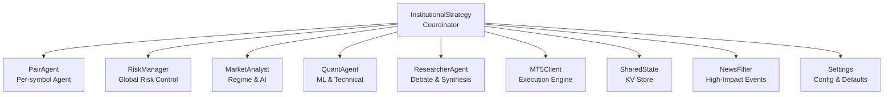
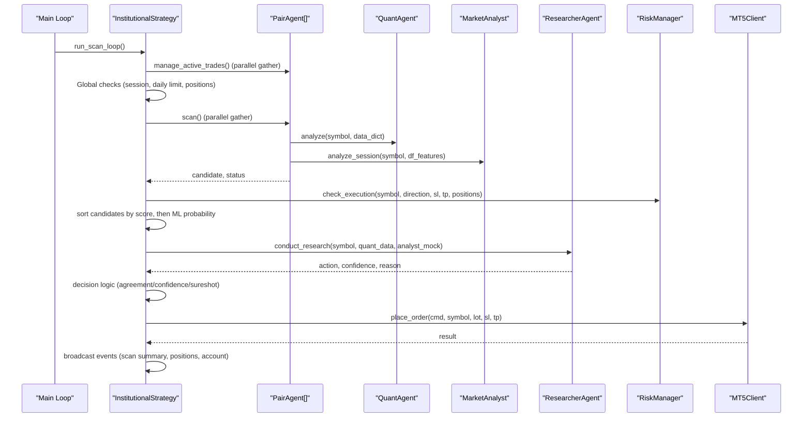
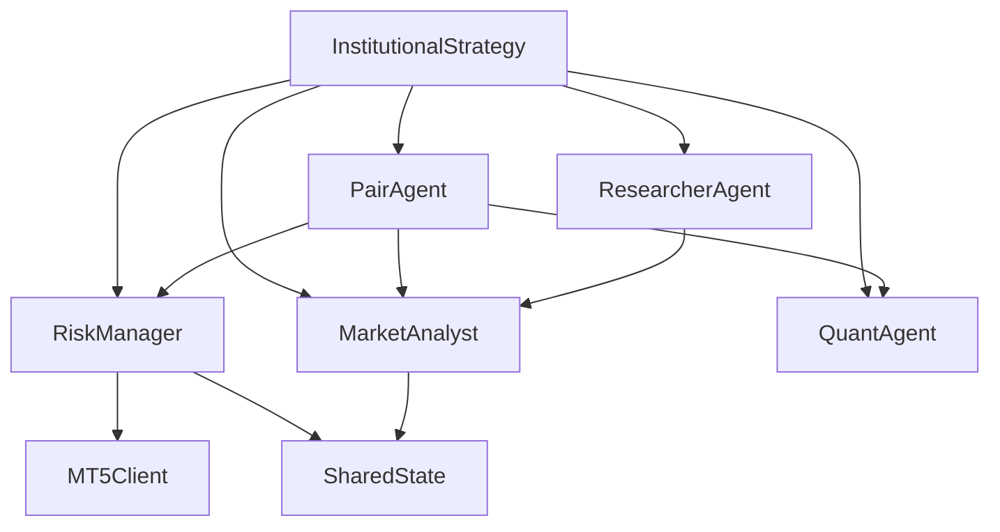

# Institutional Strategy Core

<cite>
**Referenced Files in This Document**
- [institutional_strategy.py](file://strategy/institutional_strategy.py)
- [pair_agent.py](file://strategy/pair_agent.py)
- [market_analyst.py](file://analysis/market_analyst.py)
- [quant_agent.py](file://analysis/quant_agent.py)
- [researcher_agent.py](file://analysis/researcher_agent.py)
- [risk_manager.py](file://utils/risk_manager.py)
- [settings.py](file://config/settings.py)
- [shared_state.py](file://utils/shared_state.py)
- [news_filter.py](file://utils/news_filter.py)
- [mt5_client.py](file://execution/mt5_client.py)
- [main.py](file://main.py)
</cite>

## Table of Contents
1. [Introduction](#introduction)
2. [Project Structure](#project-structure)
3. [Core Components](#core-components)
4. [Architecture Overview](#architecture-overview)
5. [Detailed Component Analysis](#detailed-component-analysis)
6. [Dependency Analysis](#dependency-analysis)
7. [Performance Considerations](#performance-considerations)
8. [Troubleshooting Guide](#troubleshooting-guide)
9. [Conclusion](#conclusion)

## Introduction
This document explains the Institutional Strategy core component, focusing on the InstitutionalStrategy class as the central orchestrator coordinating all trading activities. It documents the multi-agent architecture pattern with per-symbol agents, shared resources (RiskManager, MarketAnalyst, QuantAgent), and the asynchronous scanning loop. It details the run_scan_loop method's three-phase process, candidate evaluation logic, execution blocking mechanisms, and trade execution workflow. It also covers configuration parameters, session filtering, daily trade limits, and the event broadcasting system for real-time monitoring.

## Project Structure
The Institutional Strategy integrates several modules:
- Strategy orchestration: InstitutionalStrategy coordinates scanning and execution
- Per-symbol agents: PairAgent manages individual symbol intelligence
- Shared agents: MarketAnalyst, QuantAgent, ResearcherAgent provide specialized analysis
- Risk management: RiskManager enforces global and per-symbol risk controls
- Infrastructure: MT5Client, SharedState, NewsFilter, Settings

**Diagram sources**
- [institutional_strategy.py](file://strategy/institutional_strategy.py#L49-L94)
- [pair_agent.py](file://strategy/pair_agent.py#L22-L54)
- [risk_manager.py](file://utils/risk_manager.py#L14-L36)
- [market_analyst.py](file://analysis/market_analyst.py#L7-L20)
- [quant_agent.py](file://analysis/quant_agent.py#L34-L51)
- [researcher_agent.py](file://analysis/researcher_agent.py#L5-L16)
- [mt5_client.py](file://execution/mt5_client.py#L12-L28)
- [shared_state.py](file://utils/shared_state.py#L23-L41)
- [news_filter.py](file://utils/news_filter.py#L1-L17)
- [settings.py](file://config/settings.py#L1-L201)

**Section sources**
- [institutional_strategy.py](file://strategy/institutional_strategy.py#L1-L50)
- [main.py](file://main.py#L19-L122)

## Core Components
- InstitutionalStrategy: Central coordinator managing scanning loop, candidate evaluation, execution gating, and event broadcasting
- PairAgent: Per-symbol agent performing data fetching, quant analysis, regime analysis, and candidate construction
- MarketAnalyst: Shared agent providing regime detection and AI opinion
- QuantAgent: Shared agent performing ML inference and technical scoring
- ResearcherAgent: Shared agent conducting debate synthesis and final conviction
- RiskManager: Shared risk controller enforcing daily limits, correlation conflicts, and profitability checks
- MT5Client: Execution engine for orders, position management, and account access
- SharedState: Persistent key-value store for cross-agent communication
- NewsFilter: High-impact event avoidance logic
- Settings: Configuration hub for trading parameters

**Section sources**
- [institutional_strategy.py](file://strategy/institutional_strategy.py#L49-L94)
- [pair_agent.py](file://strategy/pair_agent.py#L22-L54)
- [risk_manager.py](file://utils/risk_manager.py#L14-L36)
- [market_analyst.py](file://analysis/market_analyst.py#L7-L20)
- [quant_agent.py](file://analysis/quant_agent.py#L34-L51)
- [researcher_agent.py](file://analysis/researcher_agent.py#L5-L16)
- [mt5_client.py](file://execution/mt5_client.py#L12-L28)
- [shared_state.py](file://utils/shared_state.py#L23-L41)
- [news_filter.py](file://utils/news_filter.py#L159-L206)
- [settings.py](file://config/settings.py#L63-L201)

## Architecture Overview
The Institutional Strategy employs a multi-agent architecture:
- InstitutionalStrategy initializes shared agents and per-symbol PairAgents
- run_scan_loop orchestrates three phases: position management, global checks, and parallel agent scanning
- Each PairAgent independently evaluates candidates using QuantAgent and MarketAnalyst
- ResearcherAgent performs a debate synthesis for the best candidate
- RiskManager gates execution based on global and per-symbol constraints
- MT5Client executes orders and manages positions

**Diagram sources**
- [institutional_strategy.py](file://strategy/institutional_strategy.py#L99-L330)
- [pair_agent.py](file://strategy/pair_agent.py#L71-L106)
- [quant_agent.py](file://analysis/quant_agent.py#L109-L159)
- [market_analyst.py](file://analysis/market_analyst.py#L25-L71)
- [researcher_agent.py](file://analysis/researcher_agent.py#L17-L83)
- [risk_manager.py](file://utils/risk_manager.py#L237-L295)
- [mt5_client.py](file://execution/mt5_client.py#L216-L292)

## Detailed Component Analysis

### InstitutionalStrategy Class
Responsibilities:
- Initialize shared agents and per-symbol PairAgents
- Orchestrate the asynchronous scanning loop
- Evaluate candidates, apply execution gating, and execute trades
- Broadcast events for real-time monitoring
- Enforce session filters, daily trade limits, and global position caps

Key methods:
- run_scan_loop(): Three-phase scanning and execution pipeline
- _execute_trade(): Final order placement with risk checks and position sizing
- Helper methods for session filtering, daily limits, and printing summaries

Candidate evaluation and execution:
- Candidates are collected from per-symbol scans and filtered by execution gating
- Sorting prioritizes higher confluence score, then ML probability
- ResearcherAgent debate determines final action with confidence thresholds
- Decision logic allows execution on agreement/confidence or sureshot thresholds

Daily and global limits:
- Daily trade count resets at UTC midnight
- Maximum open positions and concurrent trades enforced globally
- Session filtering restricts trading to configured windows

Event broadcasting:
- SCAN_START, SCAN_SUMMARY, POSITION_UPDATE, ACCOUNT_UPDATE, RESEARCH_START, RESEARCH_RESULT, TRADE_EXECUTION events emitted

**Section sources**
- [institutional_strategy.py](file://strategy/institutional_strategy.py#L49-L94)
- [institutional_strategy.py](file://strategy/institutional_strategy.py#L99-L330)
- [institutional_strategy.py](file://strategy/institutional_strategy.py#L331-L436)
- [institutional_strategy.py](file://strategy/institutional_strategy.py#L439-L497)

### PairAgent
Responsibilities:
- Fetch historical data across multiple timeframes
- Perform quant analysis using QuantAgent
- Apply MarketAnalyst regime analysis
- Construct candidates with volatility-adjusted SL/TP distances
- Enforce retail viability and regime conflict checks
- Manage active trades with trailing stops and partial closes

Candidate construction:
- Uses ATR-based SL/TP with spread adjustment
- Enforces minimum TP and R:R constraints
- Applies confluence scoring and ML probability gating
- Supports BOS (Break of Swing) fusion for enhanced setups

Active trade management:
- Uses RiskManager.monitor_positions for trailing/BE/partial actions
- Regime-aware exits when market regime shifts against current positions

**Section sources**
- [pair_agent.py](file://strategy/pair_agent.py#L22-L54)
- [pair_agent.py](file://strategy/pair_agent.py#L71-L106)
- [pair_agent.py](file://strategy/pair_agent.py#L145-L296)
- [pair_agent.py](file://strategy/pair_agent.py#L297-L376)

### MarketAnalyst
Responsibilities:
- News blackout detection for high-impact events
- Regime detection across timeframes
- AI opinion synthesis for market sentiment
- Shared state persistence for regime data

Integration:
- Provides regime and sentiment to PairAgent and InstitutionalStrategy
- Persists regime metadata to SharedState for cross-agent visibility

**Section sources**
- [market_analyst.py](file://analysis/market_analyst.py#L7-L20)
- [market_analyst.py](file://analysis/market_analyst.py#L25-L71)

### QuantAgent
Responsibilities:
- Load and use ML models (Random Forest, XGBoost, LSTM, Lag-Llama)
- Compute technical features and trends across multiple timeframes
- Generate confluence scores and ensemble probabilities
- Produce AI signal combinations

Signal generation:
- Computes trend signals across M5, H1, H4
- Aggregates ML predictions and AI signals into a composite score
- Produces ensemble score combining ML, AI, and technical confluence

**Section sources**
- [quant_agent.py](file://analysis/quant_agent.py#L34-L51)
- [quant_agent.py](file://analysis/quant_agent.py#L109-L159)
- [quant_agent.py](file://analysis/quant_agent.py#L228-L294)

### ResearcherAgent
Responsibilities:
- Conduct debate synthesis for the best candidate
- Parse structured output to extract action, confidence, and reason
- Fallback behavior when LLM is unavailable

Decision logic:
- Extracts final action and confidence from debate output
- Maps neutral outcomes to hold decisions
- Provides structured reasoning for transparency

**Section sources**
- [researcher_agent.py](file://analysis/researcher_agent.py#L5-L16)
- [researcher_agent.py](file://analysis/researcher_agent.py#L17-L83)
- [researcher_agent.py](file://analysis/researcher_agent.py#L84-L132)

### RiskManager
Responsibilities:
- Pre-scan checks: daily limits, kill switches, payoff mandates, spread, news, session filters
- Execution checks: concurrent positions, correlation conflicts, profitability thresholds
- Position sizing: Kelly criterion fallback and confluence-tier sizing
- Position management: trailing stops, break-even, partial closes

Daily and session controls:
- Tracks daily trades with UTC date reset
- Enforces session windows for scalp trading
- Applies kill switch and payoff mandate based on rolling statistics

Execution gating:
- Validates spread, correlation, and profitability before placing orders
- Enforces maximum concurrent trades and open positions

**Section sources**
- [risk_manager.py](file://utils/risk_manager.py#L14-L36)
- [risk_manager.py](file://utils/risk_manager.py#L51-L163)
- [risk_manager.py](file://utils/risk_manager.py#L237-L295)
- [risk_manager.py](file://utils/risk_manager.py#L341-L396)
- [risk_manager.py](file://utils/risk_manager.py#L399-L549)

### MT5Client
Responsibilities:
- Connect to MetaTrader 5 terminal and login
- Auto-detect available symbols on Exness accounts
- Place orders with ATR-based or pip-based SL/TP
- Modify SL/TP, partial close, and full position closure
- Calculate lot sizes based on account risk and SL distance

**Section sources**
- [mt5_client.py](file://execution/mt5_client.py#L12-L28)
- [mt5_client.py](file://execution/mt5_client.py#L29-L101)
- [mt5_client.py](file://execution/mt5_client.py#L216-L292)
- [mt5_client.py](file://execution/mt5_client.py#L296-L385)

### SharedState
Responsibilities:
- Persistent key-value store using SQLite
- Enables cross-agent sharing of market regime and risk status
- Provides set/get/delete operations with JSON serialization

**Section sources**
- [shared_state.py](file://utils/shared_state.py#L23-L41)
- [shared_state.py](file://utils/shared_state.py#L42-L76)
- [shared_state.py](file://utils/shared_state.py#L77-L110)

### NewsFilter
Responsibilities:
- Detect high-impact economic events and avoid trading during blackout windows
- Combine live calendar feed with hardcoded recurring events
- Provide active event lists for scanning loop awareness

**Section sources**
- [news_filter.py](file://utils/news_filter.py#L159-L206)
- [news_filter.py](file://utils/news_filter.py#L208-L239)

### Settings
Responsibilities:
- Central configuration for trading parameters, risk controls, and operational modes
- Defines symbol universes, timeframes, and thresholds for confluence, R:R, and volatility
- Controls session filters, daily limits, and advanced risk features

**Section sources**
- [settings.py](file://config/settings.py#L63-L201)

## Dependency Analysis
The Institutional Strategy exhibits strong separation of concerns:
- InstitutionalStrategy depends on shared agents and per-symbol agents
- PairAgent depends on QuantAgent, MarketAnalyst, and RiskManager
- RiskManager depends on MT5Client, SharedState, and Settings
- MarketAnalyst depends on SharedState and news utilities
- ResearcherAgent depends on MistralAdvisor for debate synthesis
- MT5Client encapsulates all execution logic

**Diagram sources**
- [institutional_strategy.py](file://strategy/institutional_strategy.py#L59-L86)
- [pair_agent.py](file://strategy/pair_agent.py#L27-L32)
- [risk_manager.py](file://utils/risk_manager.py#L15-L17)
- [market_analyst.py](file://analysis/market_analyst.py#L15-L19)
- [researcher_agent.py](file://analysis/researcher_agent.py#L13-L15)

**Section sources**
- [institutional_strategy.py](file://strategy/institutional_strategy.py#L59-L86)
- [pair_agent.py](file://strategy/pair_agent.py#L27-L32)
- [risk_manager.py](file://utils/risk_manager.py#L15-L17)

## Performance Considerations
- Asynchronous scanning: Parallel execution of PairAgent scans reduces cycle time
- Data caching: Shared DataCache and per-agent state reduce redundant computations
- ATR-based sizing: Dynamic SL/TP improves risk-adjusted performance
- Session filtering: Restricts trading to high-liquidity windows to minimize slippage
- Daily and concurrent caps: Prevent over-concentration and reduce drawdown risk
- Partial profit taking: Locks in gains while allowing winners to run

## Troubleshooting Guide
Common issues and resolutions:
- No candidates found: Verify confluence thresholds, ML probability gating, and volatility filters
- Execution blocked: Check daily limits, correlation conflicts, spread, and session filters
- High spread symbols: Adjust MAX_SPREAD_PIPS or exclude problematic instruments
- Session mismatch: Confirm SESSION_FILTER and SCALP_SESSION_FILTER settings align with intended trading windows
- LLM unavailability: ResearcherAgent falls back to technical confidence; ensure API keys are configured
- Position management failures: Validate MT5 connectivity and symbol visibility

**Section sources**
- [institutional_strategy.py](file://strategy/institutional_strategy.py#L105-L121)
- [institutional_strategy.py](file://strategy/institutional_strategy.py#L155-L181)
- [risk_manager.py](file://utils/risk_manager.py#L51-L163)
- [risk_manager.py](file://utils/risk_manager.py#L237-L295)
- [researcher_agent.py](file://analysis/researcher_agent.py#L34-L42)

## Conclusion
The Institutional Strategy implements a robust, multi-agent architecture that coordinates per-symbol intelligence with shared risk controls and analysis. Its asynchronous scanning loop efficiently evaluates candidates, applies rigorous execution gating, and integrates debate-based synthesis for final decisions. With comprehensive configuration options, session-awareness, and real-time event broadcasting, it provides a scalable foundation for institutional-grade trading automation.