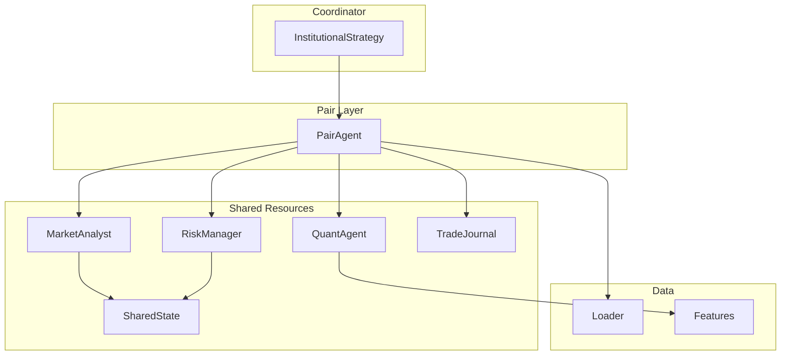
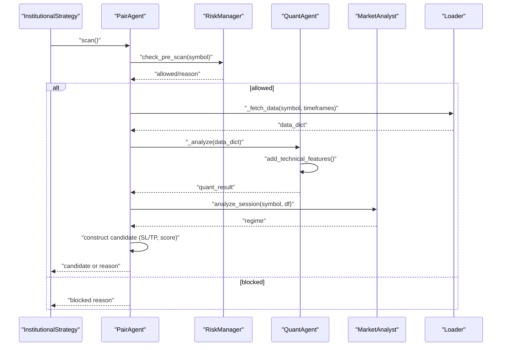
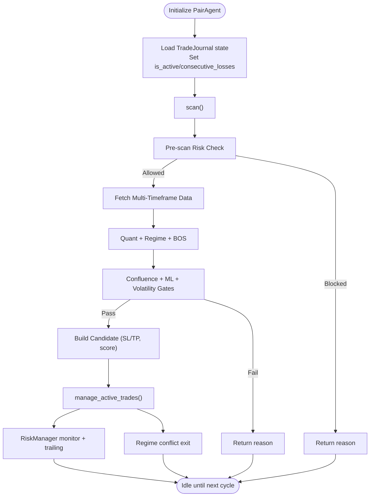
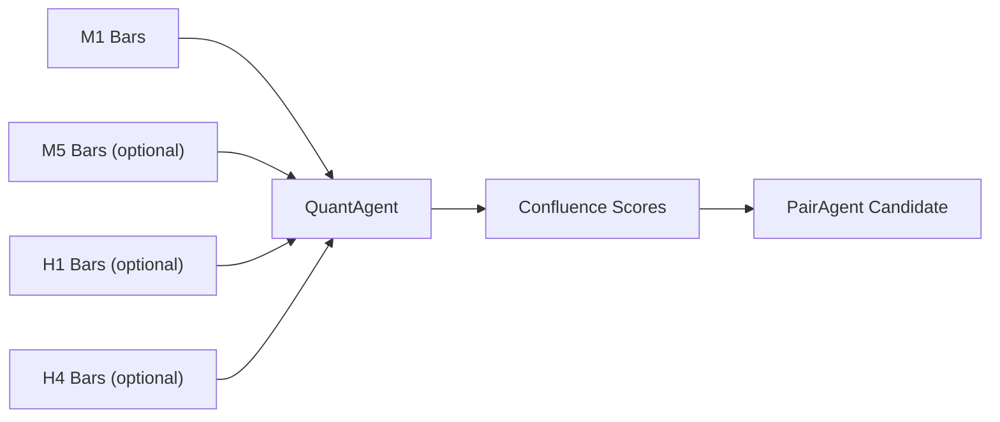
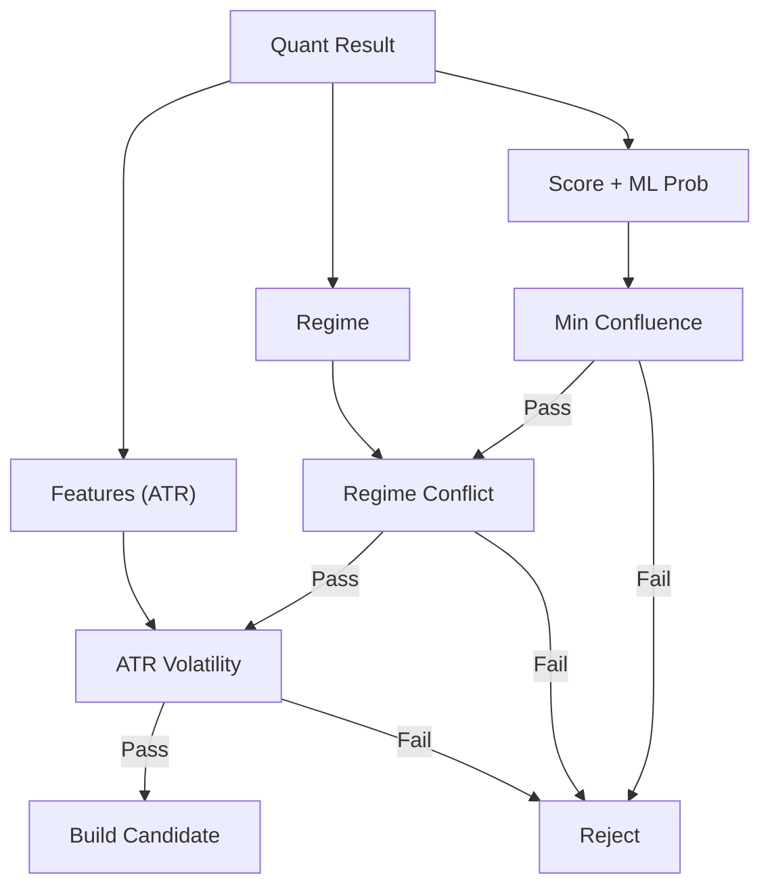
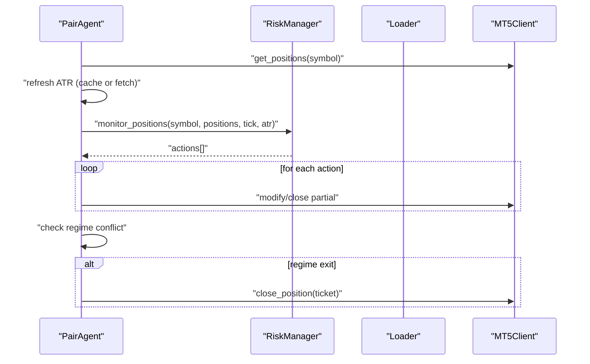
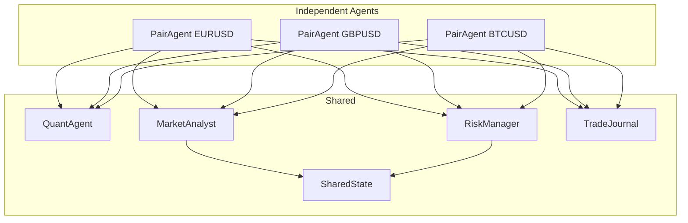
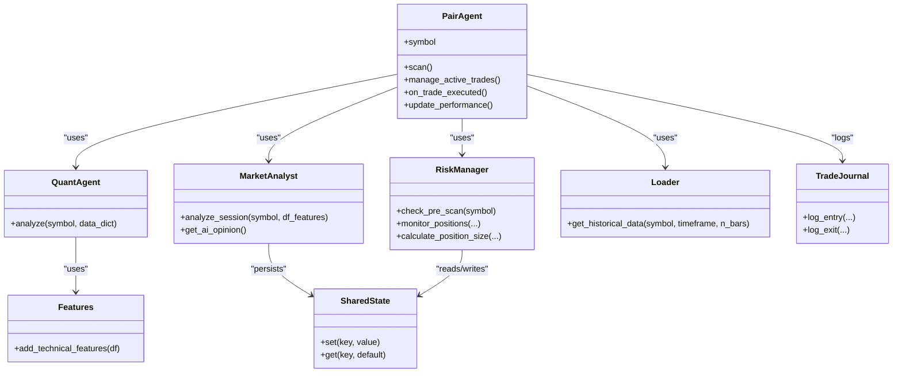
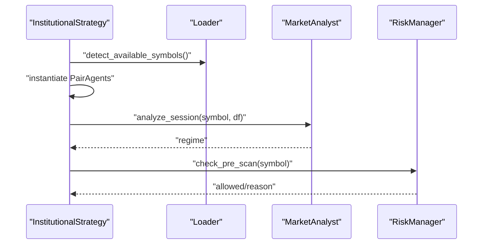
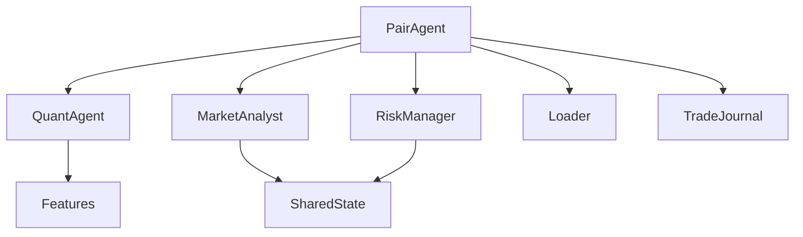

# Pair Agent System

<cite>
**Referenced Files in This Document**
- [pair_agent.py](file://strategy/pair_agent.py)
- [institutional_strategy.py](file://strategy/institutional_strategy.py)
- [quant_agent.py](file://analysis/quant_agent.py)
- [market_analyst.py](file://analysis/market_analyst.py)
- [risk_manager.py](file://utils/risk_manager.py)
- [loader.py](file://market_data/loader.py)
- [features.py](file://strategy/features.py)
- [settings.py](file://config/settings.py)
- [shared_state.py](file://utils/shared_state.py)
- [trade_journal.py](file://utils/trade_journal.py)
- [bos_strategy.py](file://strategy/bos_strategy.py)
- [main.py](file://main.py)
</cite>

## Table of Contents
1. [Introduction](#introduction)
2. [Project Structure](#project-structure)
3. [Core Components](#core-components)
4. [Architecture Overview](#architecture-overview)
5. [Detailed Component Analysis](#detailed-component-analysis)
6. [Dependency Analysis](#dependency-analysis)
7. [Performance Considerations](#performance-considerations)
8. [Troubleshooting Guide](#troubleshooting-guide)
9. [Conclusion](#conclusion)

## Introduction
The Pair Agent system is a per-symbol trading intelligence layer designed for M1 scalping. Each PairAgent encapsulates:
- Independent lifecycle and state management
- Multi-timeframe analysis (M1, M5, H1, H4) with trend filters
- Confluence scoring and volatility-adaptive entry sizing
- Specialized market analysis via shared resources
- Active trade management with trailing stops, break-even, partial exits, and regime-aware exits
- Self-correction circuit breakers and retail viability checks

The system emphasizes isolation between symbols for resilience, while leveraging shared analysis and risk resources for scalable, adaptive performance.

## Project Structure
The Pair Agent resides within the agentic architecture coordinated by InstitutionalStrategy. It integrates with shared components for quant analysis, market regime detection, risk management, and data loading.

**Diagram sources**
- [institutional_strategy.py](file://strategy/institutional_strategy.py#L77-L87)
- [pair_agent.py](file://strategy/pair_agent.py#L22-L54)
- [quant_agent.py](file://analysis/quant_agent.py#L34-L50)
- [market_analyst.py](file://analysis/market_analyst.py#L7-L20)
- [risk_manager.py](file://utils/risk_manager.py#L14-L18)
- [loader.py](file://market_data/loader.py#L40-L59)
- [features.py](file://strategy/features.py#L6-L98)
- [shared_state.py](file://utils/shared_state.py#L23-L60)
- [trade_journal.py](file://utils/trade_journal.py#L23-L31)

**Section sources**
- [main.py](file://main.py#L75-L86)
- [institutional_strategy.py](file://strategy/institutional_strategy.py#L77-L87)

## Core Components
- PairAgent: per-symbol orchestrator for scanning, analysis, candidate construction, and active trade management.
- QuantAgent: shared ML and technical analysis engine producing confluence scores and probabilities.
- MarketAnalyst: shared regime detector and news filter.
- RiskManager: global and per-symbol risk controls, position sizing, trailing stops, and correlation checks.
- Loader: MT5 historical data fetch with timeframe mapping.
- Features: institutional-grade TA pipeline for confluence and structure signals.
- SharedState: persistent key-value store for cross-agent coordination.
- TradeJournal: per-trade logging and performance analytics.

**Section sources**
- [pair_agent.py](file://strategy/pair_agent.py#L22-L54)
- [quant_agent.py](file://analysis/quant_agent.py#L34-L50)
- [market_analyst.py](file://analysis/market_analyst.py#L7-L20)
- [risk_manager.py](file://utils/risk_manager.py#L14-L18)
- [loader.py](file://market_data/loader.py#L40-L59)
- [features.py](file://strategy/features.py#L6-L98)
- [shared_state.py](file://utils/shared_state.py#L23-L60)
- [trade_journal.py](file://utils/trade_journal.py#L23-L31)

## Architecture Overview
The Pair Agent operates as a per-symbol microservice within InstitutionalStrategy. It performs:
- Pre-scan risk checks via RiskManager
- Multi-timeframe data fetching via Loader
- Quantitative analysis via QuantAgent and technical features
- Market regime assessment via MarketAnalyst
- Candidate construction with volatility-adjusted SL/TP and confluence gating
- Active trade management with trailing stops, break-even, partial exits, and regime exits

**Diagram sources**
- [institutional_strategy.py](file://strategy/institutional_strategy.py#L99-L181)
- [pair_agent.py](file://strategy/pair_agent.py#L71-L105)
- [pair_agent.py](file://strategy/pair_agent.py#L107-L144)
- [pair_agent.py](file://strategy/pair_agent.py#L145-L295)
- [quant_agent.py](file://analysis/quant_agent.py#L109-L159)
- [market_analyst.py](file://analysis/market_analyst.py#L25-L71)
- [loader.py](file://market_data/loader.py#L40-L59)

## Detailed Component Analysis

### PairAgent Lifecycle and Responsibilities
- Initialization: loads state from TradeJournal, constructs BOSStrategy, and prepares shared dependencies.
- Scanning: runs pre-scan risk checks, fetches multi-timeframe data, performs quant and regime analysis, and builds a candidate with volatility-adjusted SL/TP and confluence gating.
- Active Trade Management: monitors positions via RiskManager, applies trailing stops and break-even logic, and enforces regime exits.
- Self-correction: tracks consecutive losses and pauses the agent when thresholds are exceeded.

**Diagram sources**
- [pair_agent.py](file://strategy/pair_agent.py#L27-L54)
- [pair_agent.py](file://strategy/pair_agent.py#L71-L105)
- [pair_agent.py](file://strategy/pair_agent.py#L107-L144)
- [pair_agent.py](file://strategy/pair_agent.py#L145-L295)
- [pair_agent.py](file://strategy/pair_agent.py#L297-L376)

**Section sources**
- [pair_agent.py](file://strategy/pair_agent.py#L27-L54)
- [pair_agent.py](file://strategy/pair_agent.py#L71-L105)
- [pair_agent.py](file://strategy/pair_agent.py#L107-L144)
- [pair_agent.py](file://strategy/pair_agent.py#L145-L295)
- [pair_agent.py](file://strategy/pair_agent.py#L297-L376)

### Multi-Timeframe Analysis and Trend Filters
- Primary timeframe is M1 (scalping).
- Optional M5/H1/H4 trend filters are gated by settings and appended to the data dictionary when enabled.
- QuantAgent computes trend signals per timeframe and contributes to confluence scoring.
- PairAgent enforces trend alignment and rejects counter-trend setups unless sufficiently supported by confluence or BOS.

**Diagram sources**
- [pair_agent.py](file://strategy/pair_agent.py#L123-L137)
- [quant_agent.py](file://analysis/quant_agent.py#L125-L129)
- [quant_agent.py](file://analysis/quant_agent.py#L231-L293)

**Section sources**
- [pair_agent.py](file://strategy/pair_agent.py#L123-L137)
- [quant_agent.py](file://analysis/quant_agent.py#L125-L129)
- [quant_agent.py](file://analysis/quant_agent.py#L231-L293)
- [settings.py](file://config/settings.py#L150-L153)

### Candidate Construction and Risk Gates
- Quantitative probability and ensemble score drive candidate selection.
- Regime conflict filtering ensures trend alignment.
- Volatility-adaptive SL/TP using ATR with spread adjustment and minimum TP enforcement.
- R:R gating prevents low-reward setups.
- Optional BOS fusion boosts candidate quality and entry type.

**Diagram sources**
- [pair_agent.py](file://strategy/pair_agent.py#L145-L295)
- [quant_agent.py](file://analysis/quant_agent.py#L139-L159)

**Section sources**
- [pair_agent.py](file://strategy/pair_agent.py#L145-L295)
- [quant_agent.py](file://analysis/quant_agent.py#L139-L159)

### Active Trade Management and Trailing Stops
- PairAgent delegates standard risk actions (modify SL/TP, partial close) to RiskManager.
- Implements regime-aware exits when current positions conflict with detected regime.
- Uses cached ATR for dynamic trailing; refreshes from Loader when stale.

**Diagram sources**
- [pair_agent.py](file://strategy/pair_agent.py#L297-L376)
- [risk_manager.py](file://utils/risk_manager.py#L399-L548)
- [loader.py](file://market_data/loader.py#L40-L59)

**Section sources**
- [pair_agent.py](file://strategy/pair_agent.py#L297-L376)
- [risk_manager.py](file://utils/risk_manager.py#L399-L548)

### Role in System Resilience and Independence
- Per-symbol isolation: PairAgents operate independently, pausing on consecutive losses to prevent contagion.
- Shared resources: QuantAgent, MarketAnalyst, and RiskManager are reused across agents to reduce overhead.
- Centralized state: SharedState coordinates regime and circuit breaker flags without tight coupling.
- TradeJournal: per-symbol performance tracking supports self-correction and post-hoc analysis.

**Diagram sources**
- [institutional_strategy.py](file://strategy/institutional_strategy.py#L77-L87)
- [pair_agent.py](file://strategy/pair_agent.py#L27-L54)
- [market_analyst.py](file://analysis/market_analyst.py#L15-L20)
- [risk_manager.py](file://utils/risk_manager.py#L14-L18)
- [shared_state.py](file://utils/shared_state.py#L23-L60)
- [trade_journal.py](file://utils/trade_journal.py#L23-L31)

**Section sources**
- [institutional_strategy.py](file://strategy/institutional_strategy.py#L77-L87)
- [pair_agent.py](file://strategy/pair_agent.py#L36-L70)
- [shared_state.py](file://utils/shared_state.py#L23-L60)
- [trade_journal.py](file://utils/trade_journal.py#L23-L31)

### Integration with Shared Analysis Resources
- QuantAgent: computes technical features, ML predictions, and confluence scores; provides trend signals per timeframe.
- MarketAnalyst: detects market regimes and persists state via SharedState; provides AI opinion asynchronously.
- RiskManager: centralizes pre-scan and execution risk checks, correlation filtering, and position sizing.
- Loader: provides historical data for all requested timeframes.
- Features: adds institutional-grade TA including order blocks, fair value gaps, liquidity sweeps, and volatility/ADXR indicators.

**Diagram sources**
- [pair_agent.py](file://strategy/pair_agent.py#L27-L54)
- [quant_agent.py](file://analysis/quant_agent.py#L34-L50)
- [market_analyst.py](file://analysis/market_analyst.py#L7-L20)
- [risk_manager.py](file://utils/risk_manager.py#L14-L18)
- [loader.py](file://market_data/loader.py#L40-L59)
- [features.py](file://strategy/features.py#L6-L98)
- [shared_state.py](file://utils/shared_state.py#L23-L60)
- [trade_journal.py](file://utils/trade_journal.py#L23-L31)

**Section sources**
- [quant_agent.py](file://analysis/quant_agent.py#L109-L159)
- [market_analyst.py](file://analysis/market_analyst.py#L25-L71)
- [risk_manager.py](file://utils/risk_manager.py#L51-L163)
- [loader.py](file://market_data/loader.py#L40-L59)
- [features.py](file://strategy/features.py#L6-L98)

### Configuration Examples and Settings
- Timeframes and trend filters: enable/disable M5/H1/H4 filters and minimum confluence thresholds.
- Volatility gates: set minimum ATR thresholds per asset class to avoid dead markets.
- Risk parameters: define ATR-based SL/TP multipliers, minimum R:R, and trailing stop parameters.
- Session and news filters: restrict scans to London/NY sessions and avoid high-impact news windows.
- BOS settings: enable BOS fusion, liquidity sweep requirements, and retail viability filters.

Examples of relevant settings:
- Multi-timeframe filters: [M5_TREND_FILTER, H1_TREND_FILTER, H4_TREND_FILTER](file://config/settings.py#L150-L153)
- Confluence and probability thresholds: [MIN_CONFLUENCE_SCORE, RF_PROB_THRESHOLD](file://config/settings.py#L77-L81)
- Volatility gates: [VOLATILITY_ATR_MIN, VOLATILITY_ATR_MIN_CRYPTO, VOLATILITY_ATR_MIN_COMMODITY](file://config/settings.py#L104-L108)
- Risk parameters: [ATR_SL_MULTIPLIER, ATR_TP_MULTIPLIER, MIN_RISK_REWARD_RATIO](file://config/settings.py#L73-L82)
- Session and news: [SCALP_SESSION_FILTER, SCALP_SESSIONS, NEWS_FILTER_ENABLE](file://config/settings.py#L110-L116, file://config/settings.py#L155-L160)
- BOS parameters: [BOS_ENABLE, BOS_MOMENTUM_MULTIPLIER, BOS_SWEEP_LOOKBACK, BOS_MAX_SPREAD_RATIO, BOS_HUNTING_HOURS](file://config/settings.py#L178-L185)

**Section sources**
- [settings.py](file://config/settings.py#L73-L82)
- [settings.py](file://config/settings.py#L104-L108)
- [settings.py](file://config/settings.py#L110-L116)
- [settings.py](file://config/settings.py#L150-L153)
- [settings.py](file://config/settings.py#L178-L185)

### Symbol Detection and Market Condition Assessment
- InstitutionalStrategy initializes PairAgents for each detected symbol and coordinates scanning.
- MarketAnalyst assesses regime and persists state for downstream agents.
- RiskManager validates spreads, session windows, and daily limits before scanning.

**Diagram sources**
- [institutional_strategy.py](file://strategy/institutional_strategy.py#L31-L36)
- [institutional_strategy.py](file://strategy/institutional_strategy.py#L80-L86)
- [market_analyst.py](file://analysis/market_analyst.py#L25-L71)
- [risk_manager.py](file://utils/risk_manager.py#L51-L163)

**Section sources**
- [institutional_strategy.py](file://strategy/institutional_strategy.py#L31-L36)
- [institutional_strategy.py](file://strategy/institutional_strategy.py#L80-L86)
- [market_analyst.py](file://analysis/market_analyst.py#L25-L71)
- [risk_manager.py](file://utils/risk_manager.py#L51-L163)

## Dependency Analysis
- Coupling: PairAgent depends on shared QuantAgent, MarketAnalyst, RiskManager, Loader, and TradeJournal. Coupling is loose via function calls and configuration-driven feature toggles.
- Cohesion: Each component has a focused responsibility—PairAgent for per-symbol orchestration, QuantAgent for ML/TA, MarketAnalyst for regime, RiskManager for risk, Loader for data, SharedState for persistence.
- External dependencies: MetaTrader5, pandas, numpy, ta, joblib, torch, xgboost, sqlite3.

**Diagram sources**
- [pair_agent.py](file://strategy/pair_agent.py#L27-L54)
- [quant_agent.py](file://analysis/quant_agent.py#L34-L50)
- [market_analyst.py](file://analysis/market_analyst.py#L7-L20)
- [risk_manager.py](file://utils/risk_manager.py#L14-L18)
- [loader.py](file://market_data/loader.py#L40-L59)
- [features.py](file://strategy/features.py#L6-L98)
- [shared_state.py](file://utils/shared_state.py#L23-L60)
- [trade_journal.py](file://utils/trade_journal.py#L23-L31)

**Section sources**
- [pair_agent.py](file://strategy/pair_agent.py#L27-L54)
- [quant_agent.py](file://analysis/quant_agent.py#L34-L50)
- [market_analyst.py](file://analysis/market_analyst.py#L7-L20)
- [risk_manager.py](file://utils/risk_manager.py#L14-L18)
- [loader.py](file://market_data/loader.py#L40-L59)
- [features.py](file://strategy/features.py#L6-L98)
- [shared_state.py](file://utils/shared_state.py#L23-L60)
- [trade_journal.py](file://utils/trade_journal.py#L23-L31)

## Performance Considerations
- Parallel scanning: InstitutionalStrategy runs all PairAgents concurrently to maximize throughput.
- ATR caching: PairAgent caches ATR to avoid repeated indicator computations; refreshes when stale.
- Executor-based IO: Historical data fetching uses executor threads to prevent blocking the event loop.
- Feature engineering: QuantAgent adds TA features once per scan; ensure minimal recomputation by passing derived data.
- Risk checks: Pre-scan validations (spread, session, daily limits) short-circuit expensive analysis.

[No sources needed since this section provides general guidance]

## Troubleshooting Guide
- No candidates found:
  - Verify multi-timeframe availability and data length thresholds.
  - Check confluence score and ML probability thresholds.
  - Confirm trend filters and regime alignment.
- Execution blocked:
  - Review pre-scan risk checks (spread, session, daily limits).
  - Validate correlation conflicts and profitability checks.
- Active trade management issues:
  - Ensure MT5 tick data is available for position monitoring.
  - Confirm ATR caching is functioning and not stale.
- Circuit breaker activation:
  - Inspect consecutive losses and TradeJournal recent outcomes.
  - Reset manually if appropriate after review.

**Section sources**
- [pair_agent.py](file://strategy/pair_agent.py#L71-L105)
- [pair_agent.py](file://strategy/pair_agent.py#L145-L295)
- [risk_manager.py](file://utils/risk_manager.py#L51-L163)
- [risk_manager.py](file://utils/risk_manager.py#L237-L295)
- [pair_agent.py](file://strategy/pair_agent.py#L297-L376)
- [trade_journal.py](file://utils/trade_journal.py#L248-L264)

## Conclusion
The Pair Agent system delivers robust, per-symbol trading intelligence with independent lifecycle management, multi-timeframe confluence scoring, and volatility-adaptive risk controls. By isolating agents and leveraging shared analysis and risk resources, the system achieves scalability, resilience, and consistent performance across diverse market conditions.