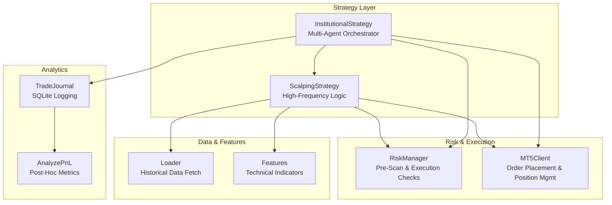
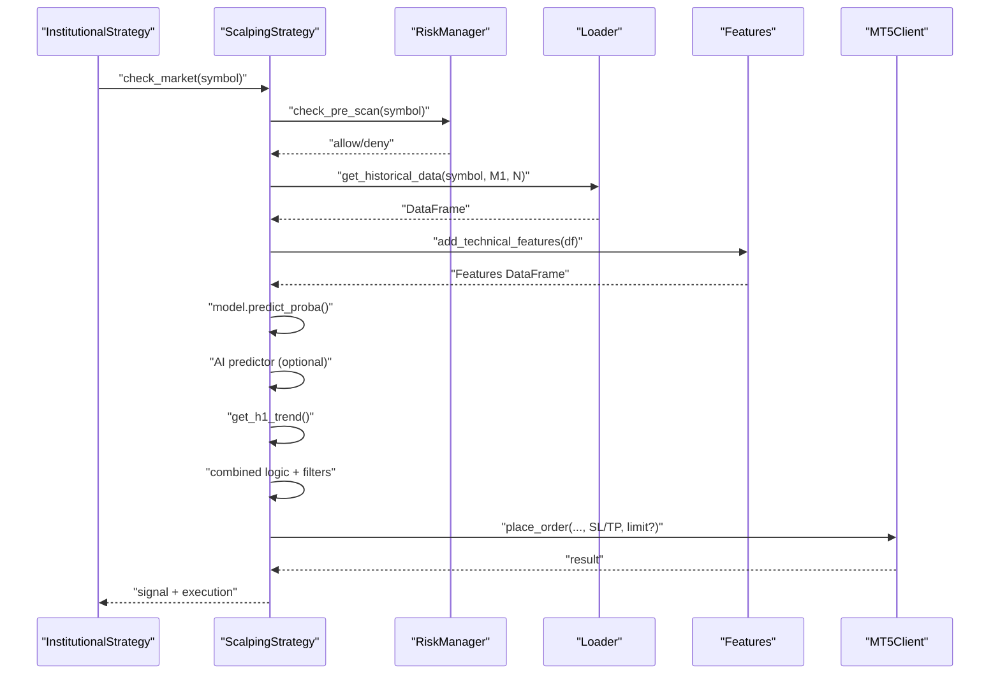
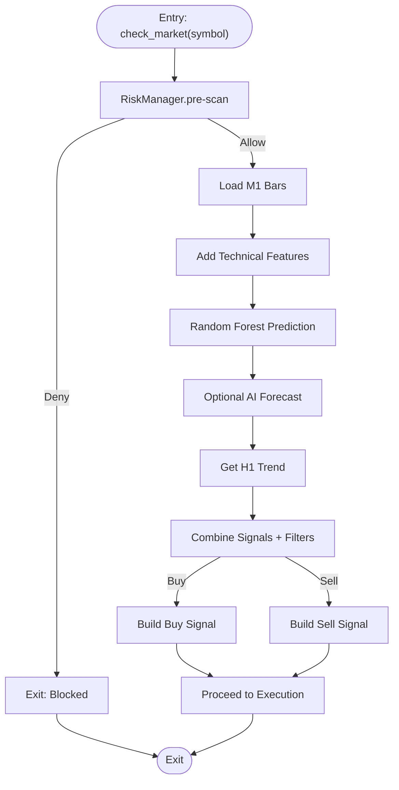
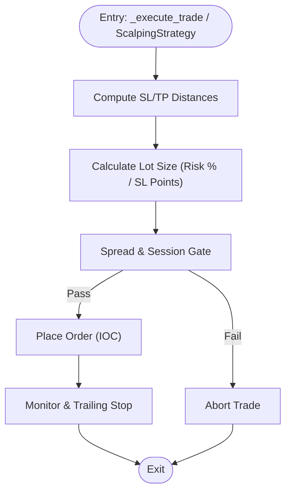
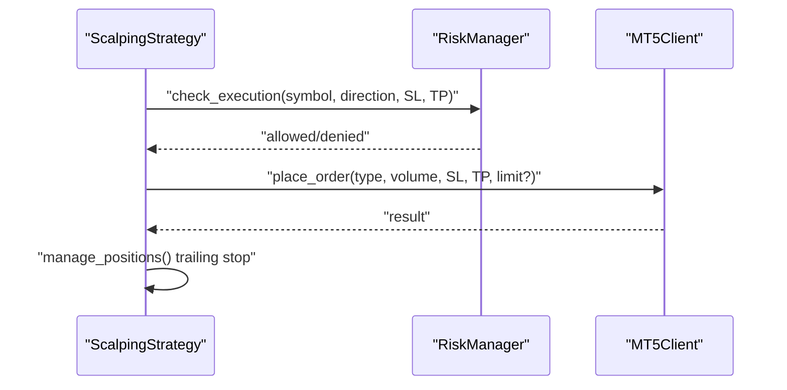
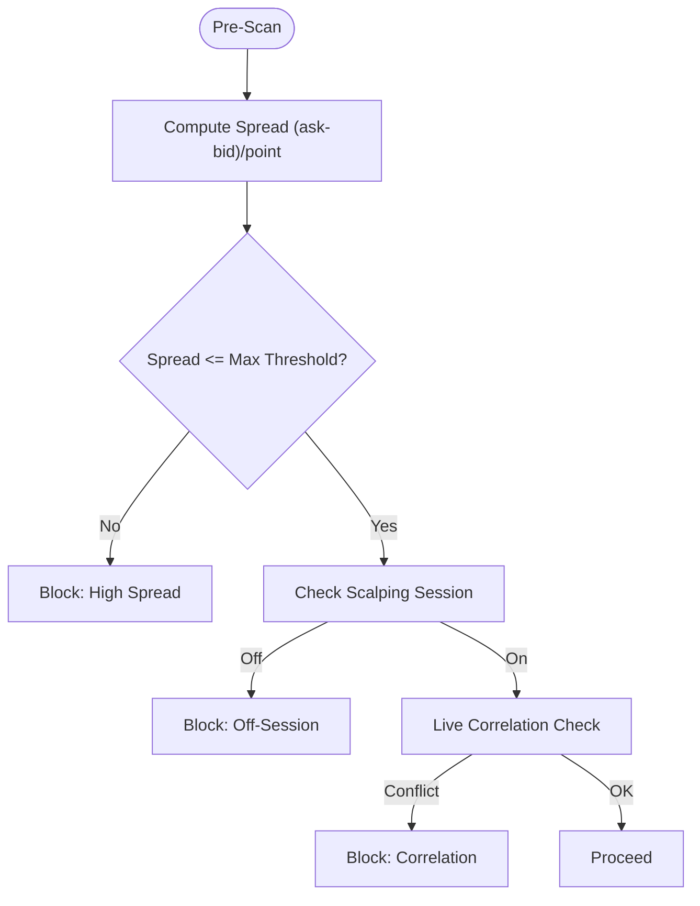
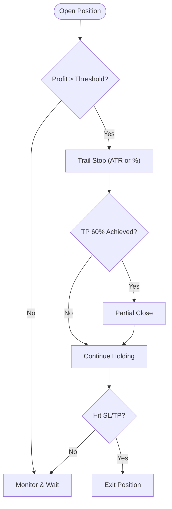
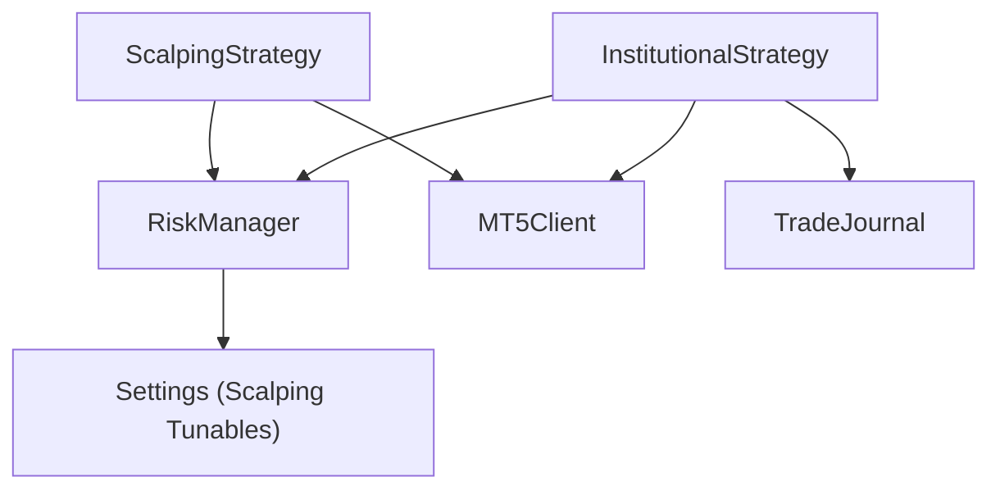
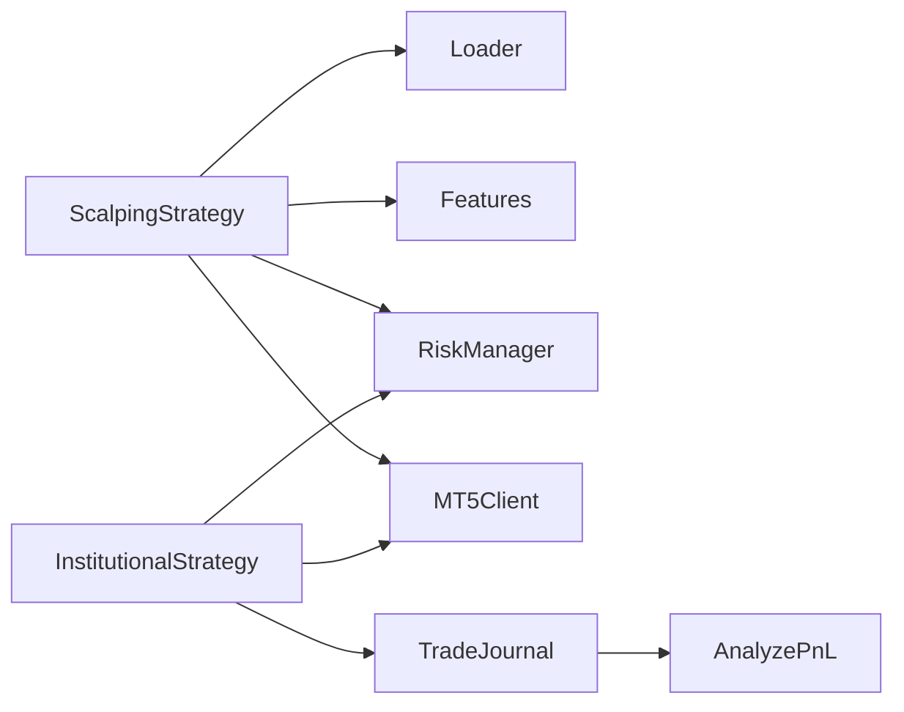

# Scalping Strategy Logic

<cite>
**Referenced Files in This Document**
- [scalping_strategy.py](file://strategy/scalping_strategy.py)
- [institutional_strategy.py](file://strategy/institutional_strategy.py)
- [features.py](file://strategy/features.py)
- [settings.py](file://config/settings.py)
- [mt5_client.py](file://execution/mt5_client.py)
- [loader.py](file://market_data/loader.py)
- [risk_manager.py](file://utils/risk_manager.py)
- [trade_journal.py](file://utils/trade_journal.py)
- [analyze_pnl.py](file://utils/analyze_pnl.py)
</cite>

## Table of Contents
1. [Introduction](#introduction)
2. [Project Structure](#project-structure)
3. [Core Components](#core-components)
4. [Architecture Overview](#architecture-overview)
5. [Detailed Component Analysis](#detailed-component-analysis)
6. [Dependency Analysis](#dependency-analysis)
7. [Performance Considerations](#performance-considerations)
8. [Troubleshooting Guide](#troubleshooting-guide)
9. [Conclusion](#conclusion)
10. [Appendices](#appendices)

## Introduction
This document explains the high-frequency scalping strategy implementation designed for short-term trading within tight timeframes. It covers signal generation, position sizing, execution timing, stop-loss and take-profit distance calculations, spread and liquidity requirements, entry/exit criteria, and profit target management. It also describes how the scalping logic integrates with the broader institutional framework, including risk management adaptations for high-frequency trading, multi-timeframe analysis, and decision-making between scalping and longer-term setups.

## Project Structure
The scalping strategy is implemented as a focused component within a larger institutional trading system. Key modules include:
- Strategy orchestration and scanning (institutional framework)
- Scalping-specific logic and execution
- Feature engineering for technical signals
- Risk management tailored for high-frequency operations
- Market data loaders for multi-timeframe analysis
- Execution client for MT5 orders and position management
- Trade journaling and P&L analytics

**Diagram sources**
- [institutional_strategy.py](file://strategy/institutional_strategy.py#L49-L120)
- [scalping_strategy.py](file://strategy/scalping_strategy.py#L49-L106)
- [features.py](file://strategy/features.py#L6-L98)
- [loader.py](file://market_data/loader.py#L40-L83)
- [risk_manager.py](file://utils/risk_manager.py#L14-L50)
- [mt5_client.py](file://execution/mt5_client.py#L12-L385)
- [trade_journal.py](file://utils/trade_journal.py#L23-L102)
- [analyze_pnl.py](file://utils/analyze_pnl.py#L12-L81)

**Section sources**
- [institutional_strategy.py](file://strategy/institutional_strategy.py#L49-L120)
- [scalping_strategy.py](file://strategy/scalping_strategy.py#L49-L106)
- [features.py](file://strategy/features.py#L6-L98)
- [loader.py](file://market_data/loader.py#L40-L83)
- [risk_manager.py](file://utils/risk_manager.py#L14-L50)
- [mt5_client.py](file://execution/mt5_client.py#L12-L385)
- [trade_journal.py](file://utils/trade_journal.py#L23-L102)
- [analyze_pnl.py](file://utils/analyze_pnl.py#L12-L81)

## Core Components
- ScalpingStrategy: Implements high-frequency entry/exit logic, multi-timeframe trend filters, AI-enhanced predictions, and trailing stops.
- InstitutionalStrategy: Coordinates multi-agent scanning, global risk checks, and execution decisions across symbols.
- RiskManager: Enforces pre-scan and execution gates, including spread thresholds, session filters, correlation conflicts, and profitability checks.
- MT5Client: Provides order placement, position modification, partial closes, and account data access.
- Loader and Features: Supply historical data and technical indicators for signal generation.
- TradeJournal and AnalyzePnL: Persist and analyze trade outcomes for performance metrics.

**Section sources**
- [scalping_strategy.py](file://strategy/scalping_strategy.py#L49-L291)
- [institutional_strategy.py](file://strategy/institutional_strategy.py#L49-L120)
- [risk_manager.py](file://utils/risk_manager.py#L14-L549)
- [mt5_client.py](file://execution/mt5_client.py#L12-L385)
- [loader.py](file://market_data/loader.py#L40-L83)
- [features.py](file://strategy/features.py#L6-L242)
- [trade_journal.py](file://utils/trade_journal.py#L23-L274)
- [analyze_pnl.py](file://utils/analyze_pnl.py#L12-L81)

## Architecture Overview
The scalping strategy operates within a multi-agent institutional framework. InstitutionalStrategy orchestrates scanning across symbols, applies global risk controls, and executes trades. ScalpingStrategy augments this with high-frequency logic, including:
- Multi-timeframe trend filtering (e.g., hourly trend)
- Machine learning predictions (random forest, optional AI predictors)
- Tight stop-loss and take-profit distances derived from volatility and technical signals
- Spread and liquidity gating aligned with scalping sessions
- Dynamic position sizing and trailing stops

**Diagram sources**
- [institutional_strategy.py](file://strategy/institutional_strategy.py#L99-L325)
- [scalping_strategy.py](file://strategy/scalping_strategy.py#L151-L291)
- [risk_manager.py](file://utils/risk_manager.py#L51-L163)
- [loader.py](file://market_data/loader.py#L40-L83)
- [features.py](file://strategy/features.py#L6-L98)
- [mt5_client.py](file://execution/mt5_client.py#L216-L293)

## Detailed Component Analysis

### ScalpingSignal Generation
- Data ingestion: Historical M1 bars fetched for feature engineering.
- Feature engineering: Technical indicators (momentum, volatility, trend, volume, order blocks, fair value gaps, liquidity).
- Predictions: Random forest model outputs class and probability; optional AI predictors (e.g., high-frequency forecasting) refine signals.
- Multi-timeframe filter: Hourly trend filter ensures alignment with higher timeframe bias.
- Combined logic: Requires strong probability threshold and AI confirmation alongside trend filters.

**Diagram sources**
- [scalping_strategy.py](file://strategy/scalping_strategy.py#L151-L231)
- [features.py](file://strategy/features.py#L6-L98)
- [loader.py](file://market_data/loader.py#L40-L83)
- [risk_manager.py](file://utils/risk_manager.py#L51-L163)

**Section sources**
- [scalping_strategy.py](file://strategy/scalping_strategy.py#L151-L231)
- [features.py](file://strategy/features.py#L6-L98)
- [loader.py](file://market_data/loader.py#L40-L83)
- [risk_manager.py](file://utils/risk_manager.py#L51-L163)

### Position Sizing and Tight SL/TP Distance Calculations
- Position sizing: Uses institutional dynamic sizing based on account risk percent and SL distance; supports Kelly Criterion fallback and confluence tiers.
- Tight SL/TP distances: Derived from volatility (ATR) multipliers and technical signals; configured via settings for ATR-based SL/TP multipliers.
- Spread and liquidity: Enforced via pre-scan spread thresholds and scalping session windows to minimize slippage and maximize fill probability.

**Diagram sources**
- [institutional_strategy.py](file://strategy/institutional_strategy.py#L331-L436)
- [scalping_strategy.py](file://strategy/scalping_strategy.py#L236-L288)
- [risk_manager.py](file://utils/risk_manager.py#L341-L396)
- [mt5_client.py](file://execution/mt5_client.py#L146-L195)

**Section sources**
- [institutional_strategy.py](file://strategy/institutional_strategy.py#L331-L436)
- [scalping_strategy.py](file://strategy/scalping_strategy.py#L236-L288)
- [risk_manager.py](file://utils/risk_manager.py#L341-L396)
- [mt5_client.py](file://execution/mt5_client.py#L146-L195)

### Execution Timing and Quick Trade Execution
- Execution timing: Scalping operates on M1 with aggressive cooldowns and session filters to align with tight spreads and liquidity.
- Order types: Supports IOC fills and limit orders for precise entry timing; trailing stops adjust dynamically to lock in profits.
- Cooldown and concurrency: Enforced via last trade timestamps and maximum concurrent trades to prevent over-trading.

**Diagram sources**
- [scalping_strategy.py](file://strategy/scalping_strategy.py#L124-L150)
- [risk_manager.py](file://utils/risk_manager.py#L237-L295)
- [mt5_client.py](file://execution/mt5_client.py#L216-L293)

**Section sources**
- [scalping_strategy.py](file://strategy/scalping_strategy.py#L124-L150)
- [risk_manager.py](file://utils/risk_manager.py#L237-L295)
- [mt5_client.py](file://execution/mt5_client.py#L216-L293)

### Spread Considerations and Liquidity Requirements
- Spread thresholds: Dynamically computed from tick data and standardized to pips; thresholds vary by asset class (forex, crypto, commodities).
- Scalping session windows: Restrict trading to London and NY opens to maximize liquidity and minimize slippage.
- Correlation conflict checks: Live correlation among positions prevents overlapping exposures.

**Diagram sources**
- [risk_manager.py](file://utils/risk_manager.py#L112-L163)
- [settings.py](file://config/settings.py#L110-L117)

**Section sources**
- [risk_manager.py](file://utils/risk_manager.py#L112-L163)
- [settings.py](file://config/settings.py#L110-L117)

### Scalping Entry Criteria and Exit Conditions
- Entry criteria:
  - Random forest probability threshold and AI confirmation (if available).
  - Multi-timeframe trend filter aligned with the direction.
  - Spread and session gates passed.
- Exit conditions:
  - Trailing stops activated when profits exceed configured thresholds (ATR-based or fixed percentage).
  - Partial profit taking to lock in gains while letting winners run.
  - Stop-outs at SL or take-profit levels.

**Diagram sources**
- [risk_manager.py](file://utils/risk_manager.py#L399-L548)
- [scalping_strategy.py](file://strategy/scalping_strategy.py#L124-L150)

**Section sources**
- [risk_manager.py](file://utils/risk_manager.py#L399-L548)
- [scalping_strategy.py](file://strategy/scalping_strategy.py#L124-L150)

### Profit Target Management
- Profit targets: Configurable via ATR multipliers or fixed pip distances; dynamic sizing adjusts risk exposure.
- Partial profit taking: Early exits lock in gains; remaining portion continues with trailing stops.
- Monitoring: Continuous evaluation of trailing stops and partial close triggers.

**Section sources**
- [risk_manager.py](file://utils/risk_manager.py#L441-L548)
- [settings.py](file://config/settings.py#L73-L76)

### Relationship to Institutional Framework and Risk Management Adaptations
- InstitutionalStrategy coordinates scanning and execution across symbols, applying global risk controls and research-backed decisions.
- ScalpingStrategy adapts institutional risk controls for high-frequency operations:
  - Reduced cooldowns and session filters.
  - Hard caps on concurrent scalp trades.
  - Tail risk isolation for volatile symbols.
  - Kill switch and payoff mandates to protect against poor-performing symbols.

**Diagram sources**
- [institutional_strategy.py](file://strategy/institutional_strategy.py#L49-L120)
- [risk_manager.py](file://utils/risk_manager.py#L14-L50)
- [settings.py](file://config/settings.py#L94-L149)

**Section sources**
- [institutional_strategy.py](file://strategy/institutional_strategy.py#L49-L120)
- [risk_manager.py](file://utils/risk_manager.py#L14-L50)
- [settings.py](file://config/settings.py#L94-L149)

### Multi-Timeframe Analysis and Decision-Making
- Multi-timeframe filters: Hourly trend filter used to confirm directionality before entering scalps.
- Institutional multi-agent scanning: Provides broader context for longer-term setups; scalping focuses on M1 opportunities aligned with higher timeframe trends.

**Section sources**
- [scalping_strategy.py](file://strategy/scalping_strategy.py#L107-L123)
- [institutional_strategy.py](file://strategy/institutional_strategy.py#L132-L184)

### Examples of Scalping Setup Identification and Quick Execution
- Setup identification:
  - Strong random forest probability with AI confirmation and upward hourly trend.
  - Tight spread and in-scalping-session window.
- Quick execution:
  - Place IOC limit order at bid/ask for immediate fill.
  - Apply trailing stop immediately upon entry to lock in profits.

**Section sources**
- [scalping_strategy.py](file://strategy/scalping_strategy.py#L236-L288)
- [mt5_client.py](file://execution/mt5_client.py#L216-L293)

### Performance Metrics Specific to Scalping Operations
- Trade journaling captures confluence scores, AI signals, R:R achieved, durations, and outcomes.
- Post-hoc analysis computes overall P&L, win rate, average win/loss, and symbol-level performance.

**Section sources**
- [trade_journal.py](file://utils/trade_journal.py#L103-L165)
- [analyze_pnl.py](file://utils/analyze_pnl.py#L12-L81)

## Dependency Analysis
Key dependencies and interactions:
- ScalpingStrategy depends on Loader for data, Features for indicators, RiskManager for pre-scan and execution checks, and MT5Client for order placement.
- InstitutionalStrategy coordinates multiple agents and applies global risk controls; it also integrates with RiskManager and MT5Client for execution.
- RiskManager centralizes spread, session, correlation, and profitability checks, adapting them for high-frequency operations.

**Diagram sources**
- [scalping_strategy.py](file://strategy/scalping_strategy.py#L151-L291)
- [institutional_strategy.py](file://strategy/institutional_strategy.py#L99-L325)
- [risk_manager.py](file://utils/risk_manager.py#L51-L295)
- [mt5_client.py](file://execution/mt5_client.py#L12-L385)
- [trade_journal.py](file://utils/trade_journal.py#L23-L102)
- [analyze_pnl.py](file://utils/analyze_pnl.py#L12-L81)

**Section sources**
- [scalping_strategy.py](file://strategy/scalping_strategy.py#L151-L291)
- [institutional_strategy.py](file://strategy/institutional_strategy.py#L99-L325)
- [risk_manager.py](file://utils/risk_manager.py#L51-L295)
- [mt5_client.py](file://execution/mt5_client.py#L12-L385)
- [trade_journal.py](file://utils/trade_journal.py#L23-L102)
- [analyze_pnl.py](file://utils/analyze_pnl.py#L12-L81)

## Performance Considerations
- High-frequency execution requires minimal latency; ensure IOC fills and tight spreads.
- Use ATR-based SL/TP to adapt to volatility; avoid fixed pip distances in ranging markets.
- Monitor correlation among positions to prevent unintended exposure clustering.
- Employ partial profit taking to preserve gains while allowing winners to extend.

[No sources needed since this section provides general guidance]

## Troubleshooting Guide
Common issues and resolutions:
- Orders failing due to spread or session gates: Verify spread thresholds and scalping session configuration.
- Excessive correlation conflicts: Reduce concurrent trades or diversify symbols.
- Trailing stop not updating: Confirm activation thresholds and point size thresholds for modifications.
- Trade journal not recording: Ensure database path exists and permissions are granted.

**Section sources**
- [risk_manager.py](file://utils/risk_manager.py#L112-L163)
- [risk_manager.py](file://utils/risk_manager.py#L303-L340)
- [risk_manager.py](file://utils/risk_manager.py#L453-L487)
- [trade_journal.py](file://utils/trade_journal.py#L23-L102)

## Conclusion
The scalping strategy integrates tightly with the institutional framework to deliver high-frequency, disciplined trading. By combining robust pre-scan risk controls, multi-timeframe trend filters, AI-enhanced signals, and dynamic position sizing, it achieves consistent execution within narrow spreads and liquidity windows. Proper monitoring of trailing stops, partial profit taking, and correlation risks ensures sustainable performance across diverse market regimes.

[No sources needed since this section summarizes without analyzing specific files]

## Appendices

### Configuration Highlights Relevant to Scalping
- Timeframe: M1 for scalping.
- Risk percent and max risk percent for sizing.
- ATR-based SL/TP multipliers.
- Session filters for London and NY opens.
- Spread thresholds by asset class.
- Max concurrent scalp trades and daily trade caps.

**Section sources**
- [settings.py](file://config/settings.py#L63-L149)