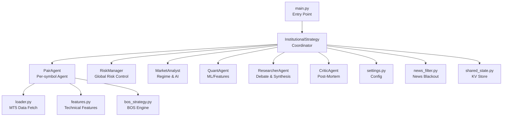
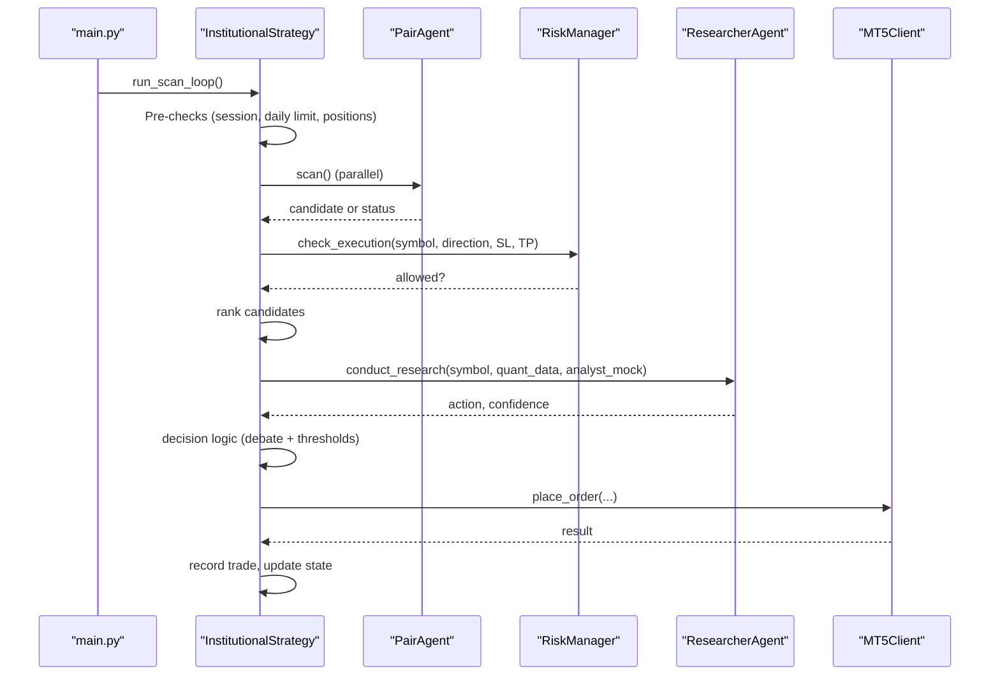
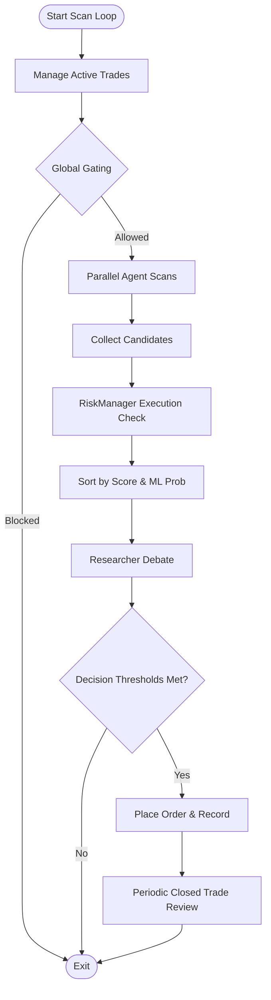
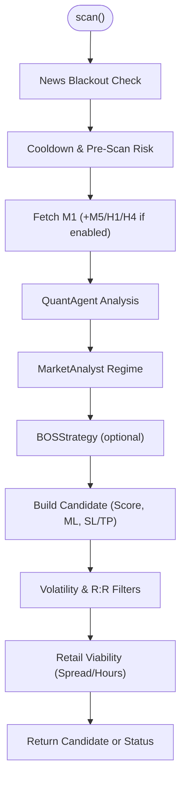
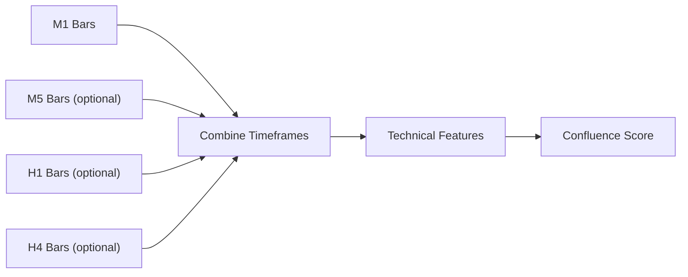
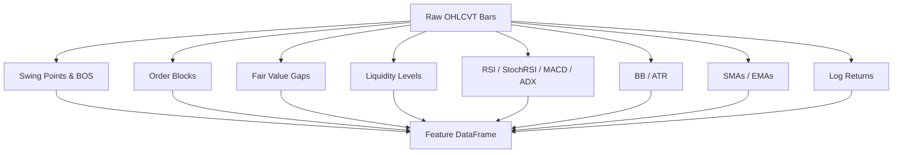
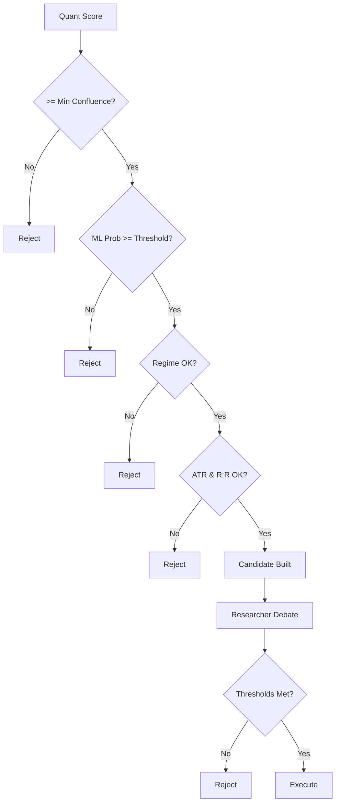
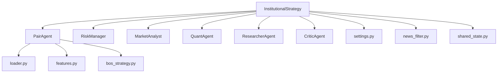

# Trading Strategy Implementation

<cite>
**Referenced Files in This Document**
- [main.py](file://main.py)
- [institutional_strategy.py](file://strategy/institutional_strategy.py)
- [pair_agent.py](file://strategy/pair_agent.py)
- [features.py](file://strategy/features.py)
- [bos_strategy.py](file://strategy/bos_strategy.py)
- [settings.py](file://config/settings.py)
- [loader.py](file://market_data/loader.py)
- [market_analyst.py](file://analysis/market_analyst.py)
- [researcher_agent.py](file://analysis/researcher_agent.py)
- [critic_agent.py](file://analysis/critic_agent.py)
- [risk_manager.py](file://utils/risk_manager.py)
- [news_filter.py](file://utils/news_filter.py)
- [shared_state.py](file://utils/shared_state.py)
</cite>

## Table of Contents
1. [Introduction](#introduction)
2. [Project Structure](#project-structure)
3. [Core Components](#core-components)
4. [Architecture Overview](#architecture-overview)
5. [Detailed Component Analysis](#detailed-component-analysis)
6. [Dependency Analysis](#dependency-analysis)
7. [Performance Considerations](#performance-considerations)
8. [Troubleshooting Guide](#troubleshooting-guide)
9. [Conclusion](#conclusion)
10. [Appendices](#appendices)

## Introduction
This document explains the institutional trading strategy implementation, focusing on the orchestrator, per-symbol agents, and signal generation pipeline. It covers multi-timeframe analysis across M1, M5, H1, and H4, technical feature engineering, confluence scoring, and decision-making logic. It also documents the relationship between strategy components, configuration parameters, and market condition adaptation, along with practical examples and optimization guidance.

## Project Structure
The strategy is implemented as an agentic system:
- InstitutionalStrategy coordinates scanning and execution across all symbols.
- PairAgent encapsulates per-symbol intelligence, including data fetching, feature engineering, regime analysis, and candidate construction.
- Shared agents (MarketAnalyst, QuantAgent, ResearcherAgent, CriticAgent) provide domain-specific capabilities.
- RiskManager centralizes risk controls and position sizing.
- Configuration is driven by settings.py; market data is fetched via loader.py; news filtering is handled by news_filter.py; shared state is persisted via shared_state.py.

**Diagram sources**
- [main.py](file://main.py#L19-L122)
- [institutional_strategy.py](file://strategy/institutional_strategy.py#L49-L330)
- [pair_agent.py](file://strategy/pair_agent.py#L22-L432)
- [features.py](file://strategy/features.py#L6-L242)
- [bos_strategy.py](file://strategy/bos_strategy.py#L20-L178)
- [settings.py](file://config/settings.py#L1-L201)
- [loader.py](file://market_data/loader.py#L40-L83)
- [market_analyst.py](file://analysis/market_analyst.py#L7-L81)
- [researcher_agent.py](file://analysis/researcher_agent.py#L5-L132)
- [critic_agent.py](file://analysis/critic_agent.py#L10-L141)
- [risk_manager.py](file://utils/risk_manager.py#L14-L549)
- [news_filter.py](file://utils/news_filter.py#L159-L239)
- [shared_state.py](file://utils/shared_state.py#L23-L110)

**Section sources**
- [main.py](file://main.py#L19-L122)
- [institutional_strategy.py](file://strategy/institutional_strategy.py#L49-L330)
- [pair_agent.py](file://strategy/pair_agent.py#L22-L432)
- [settings.py](file://config/settings.py#L1-L201)

## Core Components
- InstitutionalStrategy: Orchestrates scanning, candidate evaluation, and execution decisions across all symbols. Implements global gating (session, daily limits, news), parallel scanning, and post-debate refinement.
- PairAgent: Performs per-symbol scan, multi-timeframe data ingestion, technical feature engineering, regime filtering, volatility-aware SL/TP computation, and candidate construction with confluence and ML probability.
- MarketAnalyst: Provides regime classification and AI opinion synthesis for market context.
- ResearcherAgent: Conducts a structured debate to produce a final action with confidence, synthesizing quant and analyst inputs.
- RiskManager: Centralizes pre-scan checks, execution gating, correlation filtering, profitability checks, and position sizing.
- Technical Features: Institutional-grade TA pipeline including structure, order blocks, fair value gaps, liquidity, and standard indicators.
- BOS Strategy: Break-of-structure engine with momentum and liquidity sweep filters.

**Section sources**
- [institutional_strategy.py](file://strategy/institutional_strategy.py#L49-L330)
- [pair_agent.py](file://strategy/pair_agent.py#L22-L432)
- [market_analyst.py](file://analysis/market_analyst.py#L25-L71)
- [researcher_agent.py](file://analysis/researcher_agent.py#L17-L83)
- [risk_manager.py](file://utils/risk_manager.py#L51-L396)
- [features.py](file://strategy/features.py#L6-L242)
- [bos_strategy.py](file://strategy/bos_strategy.py#L26-L161)

## Architecture Overview
The InstitutionalStrategy runs a continuous scan loop:
- Pre-scan housekeeping: session gating, daily trade limit, and position cap.
- Parallel PairAgent scans: each agent independently fetches M1 plus optional M5/H1/H4 data, computes features, applies regime and volatility filters, and builds a candidate with confluence score and ML probability.
- Global execution gating: risk manager evaluates SL/TP feasibility and profitability.
- Best candidate selection and Researcher debate: candidates are ranked and a final decision is made.
- Execution: position sizing, SL/TP placement, and logging.

**Diagram sources**
- [main.py](file://main.py#L75-L105)
- [institutional_strategy.py](file://strategy/institutional_strategy.py#L99-L330)
- [pair_agent.py](file://strategy/pair_agent.py#L71-L105)
- [risk_manager.py](file://utils/risk_manager.py#L237-L295)
- [researcher_agent.py](file://analysis/researcher_agent.py#L17-L83)

## Detailed Component Analysis

### InstitutionalStrategy Orchestration Logic
- Initialization: Creates shared agents (MarketAnalyst, QuantAgent, ResearcherAgent, CriticAgent), RiskManager, DataCache, TradeJournal, and PairAgent instances for each symbol.
- Scan Loop:
  - Pre-manage active trades via agents’ active trade management.
  - Global gating: session filter, daily trade limit, max open positions, active news events.
  - Parallel scanning: collects candidates from all agents.
  - Execution gating: approximates SL/TP from last close and validates via RiskManager.
  - Reporting: prints scan summary and emits dashboard events.
  - Selection: sorts by confluence score and ML probability, then consults ResearcherAgent.
  - Decision: executes if researcher agrees or if score exceeds sureshot threshold; supports aggressive mode HOLD when minimal confluence is met.
  - Post-run: periodic CriticAgent analysis of closed trades.

**Diagram sources**
- [institutional_strategy.py](file://strategy/institutional_strategy.py#L99-L330)

**Section sources**
- [institutional_strategy.py](file://strategy/institutional_strategy.py#L99-L330)

### PairAgent Functionality for Individual Symbol Processing
- Lifecycle:
  - Pre-scan checks: news blackout, cooldown, and RiskManager pre-scan gating.
  - Data ingestion: M1 base data; optionally M5/H1/H4 based on settings flags.
  - Quantitative analysis: calls QuantAgent to compute score, ML probability, and features.
  - Market regime: MarketAnalyst determines regime for session-aware filtering.
  - BOS fusion: optional Break-of-Structure signal with momentum and liquidity sweep filters.
  - Candidate construction: computes volatility-adaptive SL/TP, enforces R:R and spread-adjusted TP, applies confluence scaling, and attaches attributes and details.
  - Active trade management: monitors positions, trailing stops, partial closes, and regime exits.

**Diagram sources**
- [pair_agent.py](file://strategy/pair_agent.py#L71-L295)
- [bos_strategy.py](file://strategy/bos_strategy.py#L26-L161)

**Section sources**
- [pair_agent.py](file://strategy/pair_agent.py#L71-L295)
- [bos_strategy.py](file://strategy/bos_strategy.py#L26-L161)

### Multi-Timeframe Analysis and Trend Filters
- Primary timeframe: M1 for intraday scanning.
- Optional trend filters:
  - M5 trend filter: enables fetching M5 data for trend confirmation.
  - H1 trend filter: enables fetching H1 data for trend confirmation.
  - H4 trend filter: enables fetching H4 data to prevent counter-trend entries.
- Data loader maps timeframe strings to MT5 constants and retrieves historical bars.

**Diagram sources**
- [pair_agent.py](file://strategy/pair_agent.py#L123-L137)
- [loader.py](file://market_data/loader.py#L40-L83)

**Section sources**
- [pair_agent.py](file://strategy/pair_agent.py#L123-L137)
- [loader.py](file://market_data/loader.py#L40-L83)

### Technical Feature Engineering Pipeline
- Institutional-grade indicators:
  - Price returns, RSI, stochastic RSI, ATR, BB, SMAs/EMAs, MACD, ADX.
  - Market structure: swing highs/lows, higher/higher, lower/lower, BOS detection.
  - Order blocks: bullish/bearish OB zones and near-ob flags.
  - Fair value gaps: bullish/bearish FVG detection and near-gap flags.
  - Liquidity pools: high/low clusters and sweep detection.
  - Lag features: log returns, RSI, MACD differences at multiple lags.
- Feature engineering is applied to each timeframe’s dataframe to support multi-timeframe analysis.

**Diagram sources**
- [features.py](file://strategy/features.py#L6-L242)

**Section sources**
- [features.py](file://strategy/features.py#L6-L242)

### Confluence Scoring and Decision Criteria
- Confluence scoring:
  - Quantitative score from QuantAgent.
  - Ensemble score and ML probability included in candidate metadata.
  - Details dictionary records contributing factors.
- Decision thresholds:
  - Minimum confluence score gating.
  - ML probability threshold for low-score setups.
  - Regime conflict filtering (e.g., avoid BUY in strong bearish regime unless score is high).
  - Volatility-adaptive SL/TP with minimum R:R requirement.
- Execution gating:
  - RiskManager pre-execution checks (correlation, profitability).
  - Position sizing via Kelly Criterion fallback to confluence tiers.
- Post-selection refinement:
  - ResearcherAgent debate with confidence threshold to override or confirm direction.
  - Aggressive mode allows HOLD when minimal confluence is met and researcher recommends HOLD.

**Diagram sources**
- [pair_agent.py](file://strategy/pair_agent.py#L170-L295)
- [institutional_strategy.py](file://strategy/institutional_strategy.py#L298-L324)

**Section sources**
- [pair_agent.py](file://strategy/pair_agent.py#L170-L295)
- [institutional_strategy.py](file://strategy/institutional_strategy.py#L298-L324)

### Signal Generation Mechanisms
- Quantitative signal:
  - Direction (BUY/SELL), score, ensemble score, ML probability, features, and details.
- BOS fusion:
  - If BOS validates and aligns with ML direction, candidate receives high score and optional limit entry with liquidity sweep SL/TP.
  - If BOS alone is strong, a retail-friendly candidate is constructed with explicit SL/TP and viability checks.
- Attributes and context:
  - Raw dataframes per timeframe attached for downstream analysis and logging.

**Section sources**
- [pair_agent.py](file://strategy/pair_agent.py#L235-L295)
- [bos_strategy.py](file://strategy/bos_strategy.py#L153-L161)

### Relationship Between Strategy Components and Configuration
- Settings drive:
  - Timeframe, multi-timeframe filters, minimum confluence, sureshot thresholds, ML probability threshold, R:R targets, volatility ATR minima, session filters, daily limits, spread caps, and risk parameters.
- Data and market context:
  - loader.py fetches historical bars; MarketAnalyst provides regime; news_filter.py enforces blackout windows.
- Shared state:
  - shared_state.py persists regime and other cross-agent context.

**Section sources**
- [settings.py](file://config/settings.py#L63-L201)
- [loader.py](file://market_data/loader.py#L40-L83)
- [market_analyst.py](file://analysis/market_analyst.py#L25-L71)
- [news_filter.py](file://utils/news_filter.py#L159-L239)
- [shared_state.py](file://utils/shared_state.py#L23-L110)

### Concrete Examples from the Codebase
- Scan cycle:
  - InstitutionalStrategy.run_scan_loop() performs parallel scans, collects candidates, applies global execution gating, ranks, and executes the best candidate after Researcher debate.
  - See [institutional_strategy.py](file://strategy/institutional_strategy.py#L99-L330).
- Signal evaluation:
  - PairAgent constructs candidates with volatility-adjusted SL/TP and enforces regime and R:R filters.
  - See [pair_agent.py](file://strategy/pair_agent.py#L145-L295).
- Execution logic:
  - InstitutionalStrategy._execute_trade() verifies direction, symbol tradeability, R:R mandate, and RiskManager execution check, then calculates position size and places order.
  - See [institutional_strategy.py](file://strategy/institutional_strategy.py#L331-L436).

**Section sources**
- [institutional_strategy.py](file://strategy/institutional_strategy.py#L99-L330)
- [pair_agent.py](file://strategy/pair_agent.py#L145-L295)

## Dependency Analysis
- Coupling:
  - InstitutionalStrategy depends on PairAgent, MarketAnalyst, QuantAgent, ResearcherAgent, CriticAgent, RiskManager, DataCache, TradeJournal, and shared state.
  - PairAgent depends on loader, MarketAnalyst, QuantAgent, BOSStrategy, and RiskManager.
- Cohesion:
  - Each component has a focused responsibility: orchestration, per-symbol analysis, regime detection, debate, risk control, and feature engineering.
- External dependencies:
  - MetaTrader5 for market data and order execution.
  - Third-party libraries for TA indicators and optional AI models.

**Diagram sources**
- [institutional_strategy.py](file://strategy/institutional_strategy.py#L49-L120)
- [pair_agent.py](file://strategy/pair_agent.py#L27-L54)

**Section sources**
- [institutional_strategy.py](file://strategy/institutional_strategy.py#L49-L120)
- [pair_agent.py](file://strategy/pair_agent.py#L27-L54)

## Performance Considerations
- Parallelism: InstitutionalStrategy scans all PairAgents concurrently to minimize latency.
- Lightweight caching: PairAgent caches recent ATR estimates to reduce indicator recomputation.
- Adaptive sleep: The main loop adapts sleep based on cycle duration and session overlap.
- Data efficiency: Multi-timeframe data is fetched only when enabled by settings to reduce overhead.

[No sources needed since this section provides general guidance]

## Troubleshooting Guide
- No candidates found:
  - Check minimum confluence score, ML probability threshold, regime conflicts, and volatility filters.
  - Verify news blackout and session filters.
- Execution blocked:
  - Review daily trade limit, max open positions, spread thresholds, correlation conflicts, and payoff mandate.
  - Confirm R:R requirement and minimum net profit threshold.
- Position management:
  - Monitor trailing stop activation and step parameters; ensure ATR availability for dynamic trailing.
- Market regime mismatches:
  - Validate MarketAnalyst regime persistence and session-awareness.

**Section sources**
- [institutional_strategy.py](file://strategy/institutional_strategy.py#L105-L121)
- [risk_manager.py](file://utils/risk_manager.py#L51-L396)
- [pair_agent.py](file://strategy/pair_agent.py#L297-L376)

## Conclusion
The InstitutionalStrategy employs a modular, agentic architecture to deliver robust, multi-timeframe scanning with institutional-grade technical features, volatility-aware risk controls, and adaptive decision-making. PairAgent encapsulates per-symbol intelligence, while shared agents provide market context and governance. Configuration-driven parameters enable market condition adaptation, and the system integrates research synthesis and post-mortem learning for continuous improvement.

[No sources needed since this section summarizes without analyzing specific files]

## Appendices
- Configuration highlights:
  - Timeframe, multi-timeframe filters, confluence thresholds, R:R targets, volatility ATR minima, session filters, daily limits, spread caps, and risk parameters.
- Data and market context:
  - loader.py maps timeframes to MT5 constants; MarketAnalyst provides regime; news_filter.py enforces blackout windows; shared_state.py persists cross-agent context.

**Section sources**
- [settings.py](file://config/settings.py#L63-L201)
- [loader.py](file://market_data/loader.py#L40-L83)
- [market_analyst.py](file://analysis/market_analyst.py#L25-L71)
- [news_filter.py](file://utils/news_filter.py#L159-L239)
- [shared_state.py](file://utils/shared_state.py#L23-L110)